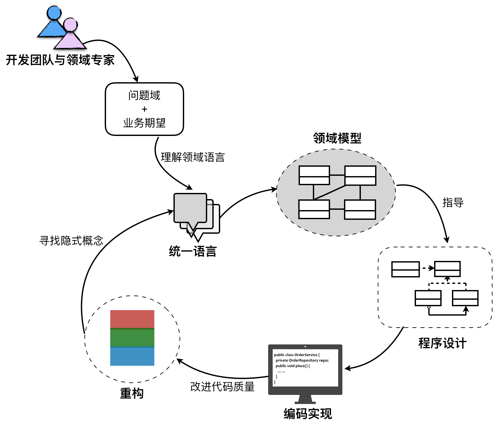
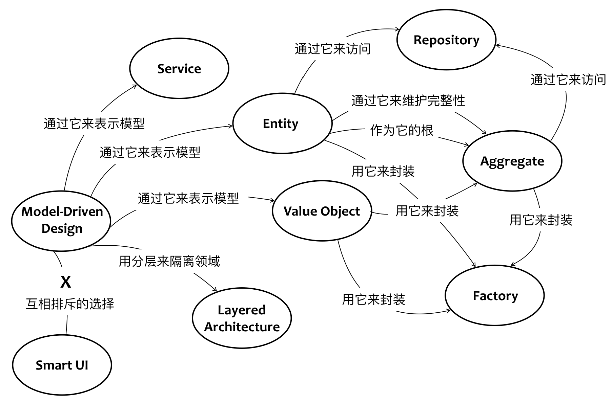
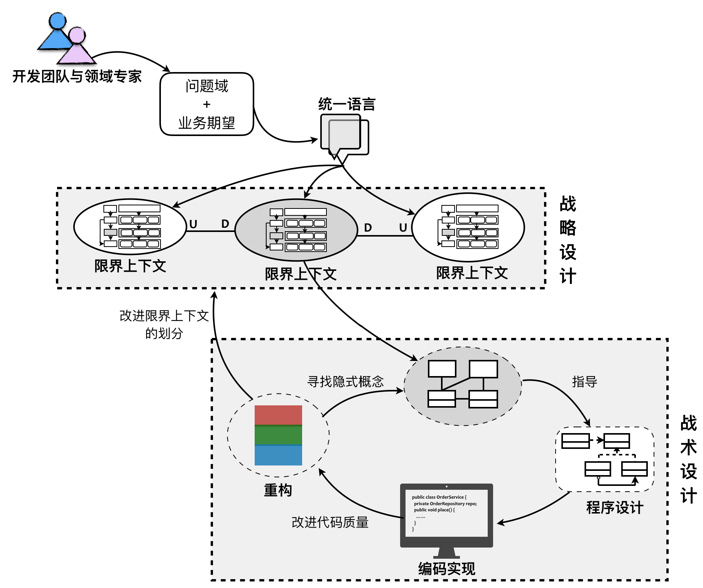

# 003 领域驱动设计概览

领域驱动设计（Domain Driven Design，DDD）是由 Eric Evans 最早提出的综合软件系统分析和设计的面向对象建模方法，如今已经发展成为了一种针对大型复杂系统的领域建模与分析方法。它完全改变了传统软件开发工程师针对数据库进行的建模方法，从而**将要解决的业务概念和业务规则转换为软件系统中的类型以及类型的属性与行为，通过合理运用面向对象的封装、继承和多态等设计要素**，降低或隐藏整个系统的业务复杂性，并使得系统具有更好的扩展性，应对纷繁多变的现实业务问题。

### 领域驱动设计的开放性

领域驱动设计是一种方法论（Methodology），根据维基百科的定义，方法论是一套运用到某个研究领域的系统与理论分析方法。领域驱动设计就是针对软件开发领域提出的一套系统与理论分析方法。Eric Evans 在创造性地提出领域驱动设计时，实则是针对当时项目中聚焦在以数据以及数据样式为核心的系统建模方法的批判。面向数据的建模方法是关系数据库理论的延续，关注的是数据表以及数据表之间关系的设计。这是典型的面向技术实现的建模方法，面对日渐复杂的业务逻辑，这种设计方法欠缺灵活性与可扩展性，也无法更好地利用面向对象设计思想及设计模式，建立可重用的、可扩展的代码单元。领域驱动设计的提出，是**设计观念的转变，蕴含了全新的设计思想、设计原则与设计过程**。

由于领域驱动设计是一套方法论，它建立了**以领域为核心驱动力**的设计体系，因而具有一定的开放性。在这个体系中，你可以使用不限于领域驱动设计提出的任何一种方法来解决这些问题。例如，可以使用用例（Use Case）、测试驱动开发（TDD）、用户故事（User Story）来帮助我们对领域建立模型；可以引入整洁架构思想及六边形架构，以帮助我们建立一个层次分明、结构清晰的系统架构；还可以引入函数式编程思想，利用纯函数与抽象代数结构的不变性以及函数的组合性来表达领域模型。这些实践方法与模型已经超越了 Eric Evans 最初提出的领域驱动设计范畴，但在体系上却是一脉相承的。这也是为什么在领域驱动设计社区，能够不断诞生新的概念诸如 CQRS 模式、事件溯源（Event Sourcing）模式与事件风暴（Event Storming）；领域驱动设计也以开放的心态拥抱微服务（Micro Service），甚至能够将它的设计思想与原则运用到微服务架构设计中。

### 领域驱动设计过程

领域驱动设计当然不是架构方法，也并非设计模式。准确地说，它其实是“一种思维方式，也是一组优先任务，它旨在加速那些必须处理复杂领域的软件项目的开发”。领域驱动设计贯穿了整个软件开发的生命周期，包括对需求的分析、建模、架构、设计，甚至最终的编码实现，乃至对编码的测试与重构。

领域驱动设计强调领域模型的重要性，并通过模型驱动设计来保障领域模型与程序设计的一致。从业务需求中提炼出统一语言（Ubiquitous Language），再基于统一语言建立领域模型；这个领域模型会指导着程序设计以及编码实现；最后，又通过重构来发现隐式概念，并运用设计模式改进设计与开发质量。这个过程如下图所示：

这个过程是一个覆盖软件全生命周期的设计闭环，每个环节的输出都可以作为下一个环节的输入，而在其中扮演重要指导作用的则是“领域模型”。这个设计闭环是一个螺旋式的迭代设计过程，领域模型会在这个迭代过程中逐渐演进，在保证模型完整性与正确性的同时，具有新鲜的活力，使得领域模型能够始终如一的贯穿领域驱动设计过程、阐释着领域逻辑、指导着程序设计、验证着编码质量。

如果仔细审视这个设计闭环，会发现在针对问题域和业务期望提炼统一语言，并通过统一语言进行领域建模时，可能会面临高复杂度的挑战。这是因为对于一个复杂的软件系统而言，我们要处理的问题域实在太庞大了。在为问题域寻求解决方案时，需要从宏观层次划分不同业务关注点的子领域，然后再深入到子领域中从微观层次对领域进行建模。宏观层次是战略的层面，微观层次是战术的层面，只有将战略设计与战术设计结合起来，才是完整的领域驱动设计。

#### 战略设计阶段

领域驱动设计的战略设计阶段是从下面两个方面来考量的：

- 问题域方面：针对问题域，引入**限界上下文（Bounded Context）\**和\**上下文映射（Context Map）\**对问题域进行合理的分解，识别出\**核心领域（Core Domain）\**与\**子领域（SubDomain）**，并确定领域的边界以及它们之间的关系，维持模型的完整性。
- 架构方面：通过**分层架构**来隔离关注点，尤其是将领域实现独立出来，能够更利于领域模型的单一性与稳定性；引入**六边形架构**可以清晰地表达领域与技术基础设施的边界；CQRS 模式则分离了查询场景和命令场景，针对不同场景选择使用同步或异步操作，来提高架构的低延迟性与高并发能力。

Eric Evans 提出战略设计的初衷是要**保持模型的完整性**。限界上下文的边界可以保护上下文内部和其他上下文之间的领域概念互不冲突。然而，如果我们将领域驱动设计的战略设计模式引入到架构过程中，就会发现限界上下文不仅限于对领域模型的控制，而在于分离关注点之后，使得整个上下文可以成为独立部署的设计单元，这就是“微服务”的概念，上下文映射的诸多模式则对应了微服务之间的协作。因此在战略设计阶段，微服务扩展了领域驱动设计的内容，反过来领域驱动设计又能够保证良好的微服务设计。

一旦确立了限界上下文的边界，尤其是作为物理边界，则分层架构就不再针对整个软件系统，而仅仅针对粒度更小的限界上下文。此时，限界上下文定义了技术实现的边界，对当前上下文的领域与技术实现进行了封装，我们只需要关心对外暴露的接口与集成方式，形成了在服务层次的设计单元重用。

边界给了实现限界上下文内部的最大自由度，这也是战略设计在**分治**上起到的效用，我们可以在不同的限界上下文选择不同的架构模式。例如，针对订单的查询与处理，选择 CQRS 模式来分别处理同步与异步场景；还可以针对核心领域与子领域重要性的不同，分别选择领域模型（Domain Model）和事务脚本（Transaction Script）模式，灵活地平衡开发成本与开发质量。在宏观层面，面对整个软件系统，我们可以采用前后端分离与基于 REST 的微服务架构，保证系统具有一致的架构风格。

#### 战术设计阶段

整个软件系统被分解为多个限界上下文（或领域）后，就可以分而治之，对每个限界上下文进行战术设计。领域驱动设计并不牵涉到技术层面的实现细节，在战术层面，它主要应对的是领域的复杂性。领域驱动设计用以表示模型的主要要素包括：

- 值对象（Value Object）
- 实体（Entity）
- 领域服务（Domain Service）
- 领域事件（Domain Event）
- 资源库（Repository）
- 工厂（Factory）
- 聚合（Aggregate）
- 应用服务（Application Service）

Eric Evans 通过下图勾勒出了战术设计诸要素之间的关系：

领域驱动设计围绕着领域模型进行设计，通过**分层架构（Layered Architecture）\**将领域独立出来。表示领域模型的对象包括：\*\*实体\*\*、\*\*值对象\*\*和\**领域服务**，**领域逻辑都应该封装在这些对象中**。这一严格的设计原则可以避免业务逻辑渗透到领域层之外，导致技术实现与业务逻辑的混淆。在领域驱动设计的演进中，又引入了**领域事件**来丰富领域模型。

**聚合**是一种边界，它可以封装一到多个**实体**与**值对象**，并维持该边界范围之内的业务完整性。在聚合中，至少包含一个实体，且只有实体才能作为**聚合根（Aggregate Root）**。注意，在领域驱动设计中，没有任何一个类是单独的聚合，因为聚合代表的是边界概念，而非领域概念。在极端情况下，一个聚合可能有且只有一个实体。

**工厂**和**资源库**都是对领域对象生命周期的管理。前者负责领域对象的创建，往往用于封装复杂或者可能变化的创建逻辑；后者则负责从存放资源的位置（数据库、内存或者其他 Web 资源）获取、添加、删除或者修改领域对象。领域模型中的资源库不应该暴露访问领域对象的技术实现细节。

#### 演进的领域驱动设计过程

战略设计会控制和分解战术设计的边界与粒度，战术设计则以实证角度验证领域模型的有效性、完整性与一致性，进而以演进的方式对之前的战略设计阶段进行迭代，从而形成一种螺旋式上升的迭代设计过程，如下图所示：

面对客户的业务需求，由领域专家与开发团队展开充分的交流，经过需求分析与知识提炼，以获得清晰的问题域。通过对问题域进行分析和建模，识别限界上下文，利用它划分相对独立的领域，再通过上下文映射建立它们之间的关系，辅以分层架构与六边形架构划分系统的逻辑边界与物理边界，界定领域与技术之间的界限。之后，进入战术设计阶段，深入到限界上下文内对领域进行建模，并以领域模型指导程序设计与编码实现。若在实现过程中，发现领域模型存在重复、错位或缺失时，再进而对已有模型进行重构，甚至重新划分限界上下文。

两个不同阶段的设计目标是保持一致的，它们是一个连贯的过程，彼此之间又相互指导与规范，并最终保证**一个有效的领域模型和一个富有表达力的实现同时演进**。