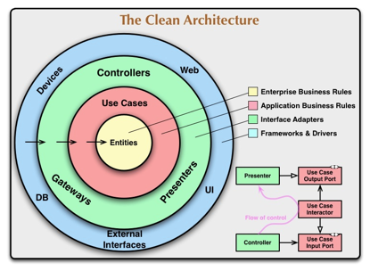

# 005 控制软件复杂度的原则

虽然说认识到软件系统的复杂本性，并不足以让我们应对其复杂，并寻找到简化系统的解决之道；然而，如果我们连导致软件复杂度的本源都茫然不知，又怎么谈得上控制复杂呢？既然我们认为导致软件系统变得复杂的成因是**规模**、**结构**与**变化**三要素，则控制复杂度的原则就需要对它们进行各个击破。

### 分而治之、控制规模

针对规模带来的复杂度，我们应注意克制做大、做全的贪婪野心，尽力保证系统的小规模。简单说来，就是**分而治之**的思想，遵循**小即是美**的设计美学。

丹尼斯·里奇（Dennis MacAlistair Ritchie）从大型项目 Multics 的失败中总结出 KISS（Keep it Simple Stupid）原则，基于此原则，他将 Unix 设计为由许多小程序组成的整体系统，每个小程序只能完成一个功能，任何复杂的操作都必须分解成一些基本步骤，由这些小程序逐一完成，再组合起来得到最终结果。从表面上看，运行一连串小程序很低效，但是事实证明，由于小程序之间可以像积木一样自由组合，所以非常灵活，能够轻易完成大量意想不到的任务。而且，计算机硬件的升级速度非常快，所以性能也不是一个问题；另一方面，当把大程序分解成单一目的的小程序，开发会变得很容易。

Unix 的这种设计哲学被 Doug McIlroy、Elliot Pinson 和 Berk Tague 总结为以下两条：

- Make each program do one thing well. To do a new job, build a fresh rather than complicate old programs by adding new “features.”
- Expect the output of every program to become the input to another, as yet unknown, program.

这两条原则是相辅相成的。第一条原则要求一个程序只做一件事情，符合“单一职责原则”，在应对新需求时，不会直接去修改一个复杂的旧系统，而是通过添加新特性，然后对这些特性进行组合。要满足小程序之间的自由组合，就需要满足第二条原则，即每个程序的输入和输出都是统一的，因而形成一个统一接口（Uniform Interface），以支持程序之间的自由组合（Composability）。利用统一接口，既能够解耦每个程序，又能够组合这些程序，还提高了这些小程序的重用性，这种“统一接口”，其实就是架构一致性的体现。

### 保持结构的清晰与一致

所有设计质量高的软件系统都有相同的特征，就是拥有**清晰直观且易于理解**的结构。

Robert Martin 分析了这么多年诸多设计大师提出的各种系统架构风格与模式，包括 Alistair Cockburn 提出的六边形架构（Hexagonal Architecture），Jeffrey Palermo 提出的洋葱架构（Onion Architecture)，James Coplien 与 Trygve Reenskaug 提出的 DCI 架构，Ivar Jacobson 提出的 BCE 设计方法。结果，他认为这些方法的共同特征都遵循了“关注点分离”架构原则，由此提出了整洁架构的思想。

整洁架构提出了一个可测试的模型，无需依赖于任何基础设施就可以对它进行测试，只需通过边界对象发送和接收对应的数据结构即可。它们都遵循**稳定依赖原则**，不对变化或易于变化的事物形成依赖。整洁架构模型让外部易变的部分依赖于更加稳定的领域模型，从而保证了核心的领域模型不会受到外部的影响。典型的整洁架构如下图所示：

整洁架构的目的在于识别整个架构不同视角以及不同抽象层次的关注点，并为这些关注点划分不同层次的边界，从而使得整个架构变得更为清晰，以减少不必要的耦合。要做到这一点，则需要合理地进行职责分配，良好的封装与抽象，并在约束的指导下为架构建立**一致**的风格，这是许多良好系统的设计特征。

### 拥抱变化

变化对软件系统带来的影响可以说是无解，然而我们不能因此而消极颓废，套用 Kent Beck 的话来说，我们必须“拥抱变化”。除了在开发过程中，我们应尽可能做到敏捷与快速迭代，以此来抵消变化带来的影响；在架构设计层面，我们还可以分析哪些架构质量属性与变化有关，这些质量属性包括：

- 可进化性（Evolvability）
- 可扩展性（Extensibility）
- 可定制性（Customizability）

要保证系统的**可进化性**，可以划分设计单元的边界，以确定每个设计单元应该履行的职责以及需要与其他设计单元协作的接口。这些设计单元具有不同的设计粒度，包括函数、对象、模块、组件及服务。由于每个设计单元都有自己的边界，边界内的实现细节不会影响到外部的其他设计单元，我们就可以非常容易地替换单元内部的实现细节，保证了它们的可进化性。

要满足系统的**可扩展性**，首先要学会识别软件系统中的变化点（热点），常见的变化点包括业务规则、算法策略、外部服务、硬件支持、命令请求、协议标准、数据格式、业务流程、系统配置、界面表现等。处理这些变化点的核心就是“**封装**”，通过隐藏细节、引入间接等方式来隔离变化、降低耦合。一些常见的架构风格，如基于事件的集成、管道—过滤器等的引入，都可以在一定程度上提高系统可扩展性。

**可定制性**意味着可以提供特别的功能与服务。Fielding 在《架构风格与基于网络的软件架构设计》提到：“支持可定制性的风格也可能会提高简单性和可扩展性”。在 SaaS 风格的系统架构中，我们常常通过引入元数据（Metadata）来支持系统的可定制。插件模式也是满足可定制性的常见做法，它通过提供统一的插件接口，使得用户可以在系统之外按照指定接口编写插件来扩展定制化的功能。