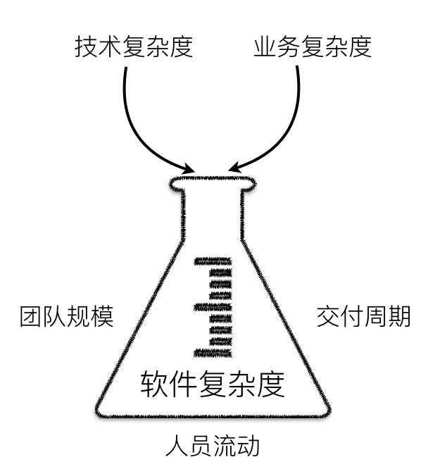
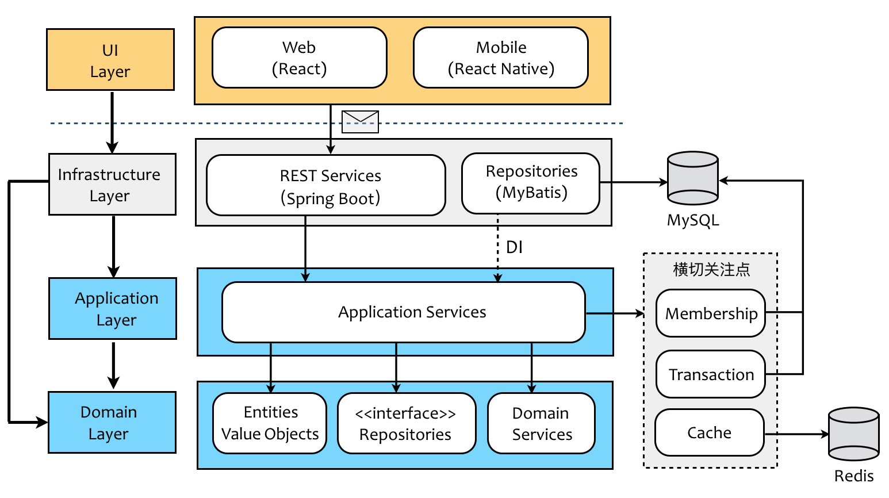

# 006 领域驱动设计对软件复杂度的应对（上）

不管是因为规模与结构制造的理解力障碍，还是因为变化带来的预测能力问题，最终的决定因素还是因为**需求**。Eric Evans 认为“很多应用程序最主要的复杂性并不在技术上，而是来自领域本身、用户的活动或业务”。因而，领域驱动设计关注的焦点在于**领域和领域逻辑**，因为软件系统的本质其实是给客户（用户）提供具有业务价值的领域功能。

### 需求引起的软件复杂度

需求分为业务需求与质量属性需求，因而需求引起的复杂度可以分为两个方面：**技术复杂度**与**业务复杂度**。

**技术复杂度来自需求的质量属性**，诸如安全、高性能、高并发、高可用性等需求，为软件设计带来了极大的挑战，让人痛苦的是这些因素彼此之间可能又互相矛盾、互相影响。例如，系统安全性要求对访问进行控制，无论是增加防火墙，还是对传递的消息进行加密，又或者对访问请求进行认证和授权等，都需要为整个系统架构添加额外的间接层，这不可避免会对访问的低延迟产生影响，拖慢了系统的整体性能。又例如，为了满足系统的高并发访问，我们需要对应用服务进行物理分解，通过横向增加更多的机器来分散访问负载；同时，还可以将一个同步的访问请求拆分为多级步骤的异步请求，再通过引入消息中间件对这些请求进行整合和分散处理。这种分离一方面增加了系统架构的复杂性，另一方面也因为引入了更多的资源，使得系统的高可用面临挑战，并增加了维护数据一致性的难度。

**业务复杂度对应了客户的业务需求**，因而这种复杂度往往会随着需求规模的增大而增加。由于需求不可能做到完全独立，一旦规模扩大到一定程度，不仅产生了功能数量的增加，还会因为功能互相之间的依赖与影响使得这种复杂度产生叠加，进而影响到整个系统的质量属性，比如系统的可维护性与可扩展性。在考虑系统的业务需求时，还会因为沟通不畅、客户需求不清晰等多种局外因素而带来的需求变更和修改。如果不能很好地控制这种变更，则可能会因为多次修改而导致业务逻辑纠缠不清，系统可能开始慢慢腐烂而变得不可维护，最终形成一种如 Brian Foote 和 Joseph Yoder 所说的“大泥球”系统。

以电商系统的促销规则为例。针对不同类型的顾客与产品，商家会提供不同的促销力度；促销的形式多种多样，包括赠送积分、红包、优惠券、礼品；促销的周期需要支持定制，既可以是特定的日期，如双十一促销，也可以是节假日的固定促销模式。如果我们在设计时没有充分考虑促销规则的复杂度，并处理好促销规则与商品、顾客、卖家与支付乃至于物流、仓储之间的关系，开发过程则会变得踉踉跄跄、举步维艰。

**技术复杂度与业务复杂度并非完全独立，二者混合在一起产生的化合作用更让系统的复杂度变得不可预期，难以掌控**。同时，技术的变化维度与业务的变化维度并不相同，产生变化的原因也不一致，倘若未能很好地界定二者之间的关系，系统架构缺乏清晰边界，会变得难以梳理。复杂度一旦增加，团队规模也将随之扩大，再揉以严峻的交付周期、人员流动等诸多因素，就好似将各种不稳定的易燃易爆气体混合在一个不可逃逸的密闭容器中一般，随时都可能爆炸：



随着业务需求的增加与变化，以及对质量属性的高标准要求，自然也引起了软件系统规模的增大与结构的繁杂，至于变化，则是软件开发绕不开的话题。因此，当我们面对一个相对复杂的软件系统时，通常面临的问题在于：

- 问题域过于庞大而复杂，使得从问题域中寻求解决方案的挑战增加，该问题与软件系统的**规模**有关。
- 开发人员将业务逻辑的复杂度与技术实现的复杂度混淆在一起，该问题与软件系统的**结构**有关。
- 随着需求的增长和变化，无法控制业务复杂度和技术复杂度，该问题与软件系统的**变化**有关。

针对这三个问题，领域驱动设计都给出了自己的应对措施。

### 领域驱动设计的应对措施

#### 隔离业务复杂度与技术复杂度

要避免业务逻辑的复杂度与技术实现的复杂度混淆在一起，**首要任务就是确定业务逻辑与技术实现的边界，从而隔离各自的复杂度**。这种隔离也是题中应有之义，毕竟技术与业务的关注点完全不同。例如，在电商的领域逻辑中，订单业务关注的业务规则包括验证订单有效性、计算订单总额、提交和审核订单的流程等；技术关注点则从实现层面保障这些业务能够正确地完成，包括确保分布式系统之间的数据一致性，确保服务之间通信的正确性等。

业务逻辑并不关心技术是如何实现的，无论采用何种技术，只要业务需求不变，业务规则就不会发生变化。换言之，**在理想状态下，我们应该保证业务规则与技术实现是正交的**。

领域驱动设计通过**分层架构**与**六边形架构**来确保业务逻辑与技术实现的隔离。

##### **分层架构的关注点分离**

分层架构遵循了“关注点分离”原则，将属于业务逻辑的关注点放到领域层（Domain Layer）中，而将支撑业务逻辑的技术实现放到基础设施层（Infrastructure Layer）中。同时，领域驱动设计又颇具创见的引入了应用层（Application Layer），应用层扮演了双重角色。一方面它作为业务逻辑的外观（Facade），暴露了能够体现业务用例的应用服务接口；另一方面它又是业务逻辑与技术实现的粘合剂，实现二者之间的协作。

下图展现的就是一个典型的领域驱动设计分层架构，蓝色区域的内容与业务逻辑有关，灰色区域的内容与技术实现有关，二者泾渭分明，然后汇合在应用层。应用层确定了业务逻辑与技术实现的边界，通过直接依赖或者依赖注入（DI，Dependency Injection）的方式将二者结合起来：



##### **六边形架构的内外分离**

由 Cockburn 提出的六边形架构则以“内外分离”的方式，更加清晰地勾勒出了业务逻辑与技术实现的边界，且将业务逻辑放在了架构的核心位置。这种架构模式改变了我们观察系统架构的视角：


体现业务逻辑的应用层与领域层处于六边形架构的内核，并通过内部的六边形边界与基础设施的模块隔离开。当我们在进行软件开发时，只要恪守架构上的六边形边界，则不会让技术实现的复杂度污染到业务逻辑，保证了领域的整洁。边界还隔离了变化产生的影响。如果我们在领域层或应用层抽象了技术实现的接口，再通过依赖注入将控制的方向倒转，业务内核就会变得更加的稳定，不会因为技术选型或其他决策的变化而导致领域代码的修改。

#### 案例：隔离数据库与缓存的访问

领域驱动设计建议我们在领域层建立资源库（Repository）的抽象，它的实现则被放在基础设施层，然后采用依赖注入在运行时为业务逻辑注入具体的资源库实现。那么，对于处于内核之外的 Repositories 模块而言，即使选择从 MyBatis 迁移到 Sprint Data，领域代码都不会受到牵连：

```java
package practiceddd.ecommerce.ordercontext.application;

@Transaction
public class OrderAppService {
    @Service
    private PlaceOrderService placeOrder;

    public void placeOrder(Identity buyerId, List<OrderItem> items, ShippingAddress shipping, BillingAddress billing) {
        try {
            palceOrder.execute(buyerId, items, shipping, billing);
        } catch (OrderRepositoryException | InvalidOrderException | Exception ex) {
            ex.printStackTrace();
            logger.error(ex.getMessage());
        }
    }
}

package practiceddd.ecommerce.ordercontext.domain;

public interface OrderRepository {
    List<Order> forBuyerId(Identity buyerId);
    void add(Order order);
} 

public class PlaceOrderService {
    @Repository
    private OrderRepository orderRepository;

    @Service
    private OrderValidator orderValidator;    

    public void execute(Identity buyerId, List<OrderItem> items, ShippingAddress shipping, BillingAddress billing) {
        Order order = Order.create(buyerId, items, shipping, billing);
        if (orderValidator.isValid(order)) {
            orderRepository.add(order);
        } else {
            throw new InvalidOrderException(String.format("the order which placed by buyer with %s is invalid.", buyerId));
        }
    }
}

package practiceddd.ecommerce.ordercontext.infrastructure.db;

public class OrderMybatisRepository implements OrderRepository {}
public class OrderSprintDataRepository implements OrderRepository {}
```

对缓存的处理可以如法炮制，但它与资源库稍有不同之处。资源库作为访问领域模型对象的入口，其本身提供的增删改查功能，在抽象层面上是对领域资源的访问。因此在领域驱动设计中，我们通常将资源库的抽象归属到领域层。对缓存的访问则不相同，它的逻辑就是对 key 和 value 的操作，与具体的领域无关。倘若要为缓存的访问方法定义抽象接口，在分层的归属上应该属于应用层，至于实现则属于技术范畴，应该放在基础设施层：

```java
package practiceddd.ecommerce.ordercontext.application;

@Transaction
public class OrderAppService {
    @Repository
    private OrderRepository orderRepository;

    @Service
    private CacheClient<List<Order>> cacheClient;

    public List<Order> findBy(Identity buyerId) {
        Optional<List<Order>> cachedOrders = cacheClient.get(buyerId.value());
        if (cachedOrders.isPresent()) {
            return orders.get();
        } 
        List<Order> orders = orderRepository.forBuyerId(buyerId);
        if (!orders.isEmpty()) {
            cacheClient.put(buyerId.value(), orders);
        }
        return orders;
    }
}

package practiceddd.ecommerce.ordercontext.application.cache;

public interface CacheClient<T> {
    Optional<T> get(String key);
    void put(String key, T value);
}

package practiceddd.ecommerce.ordercontext.infrastructure.cache;

public class RedisCacheClient<T> implements CacheClient<T> {}
```

本例中对应的代码结构在分层架构中的体现将会在后续章节中深入介绍，敬请期待~