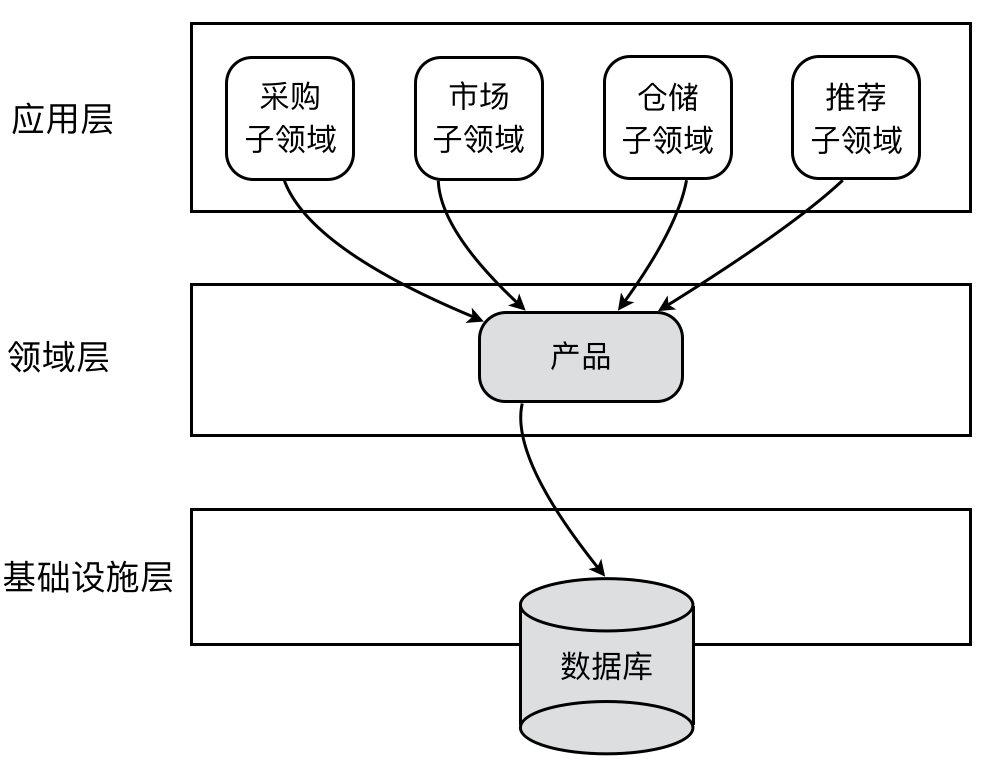
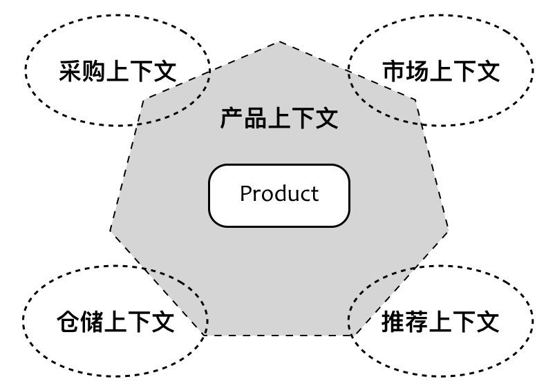
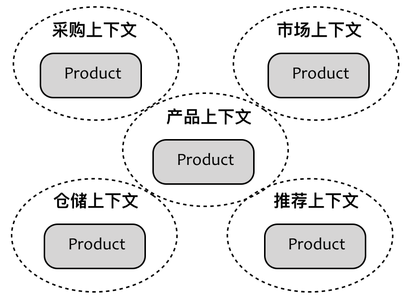
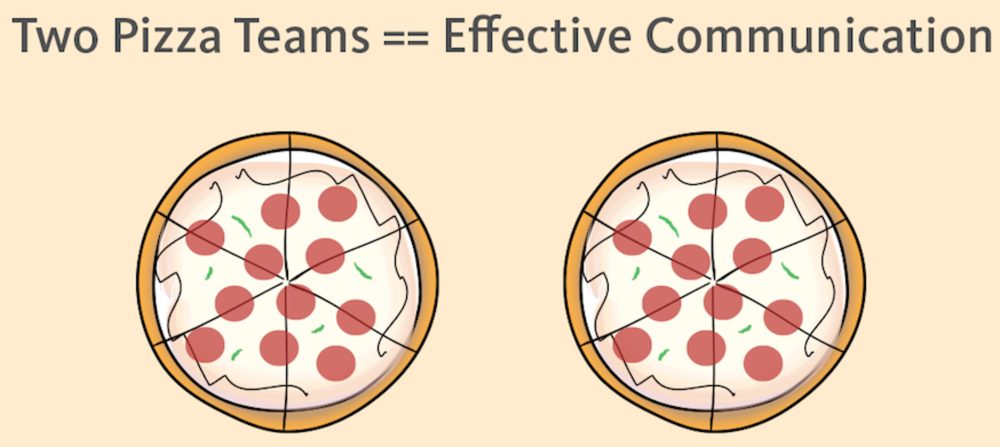
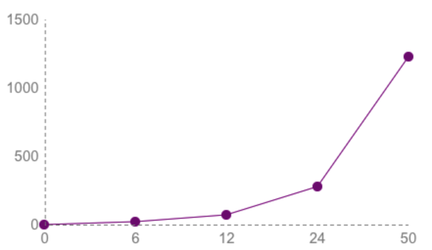
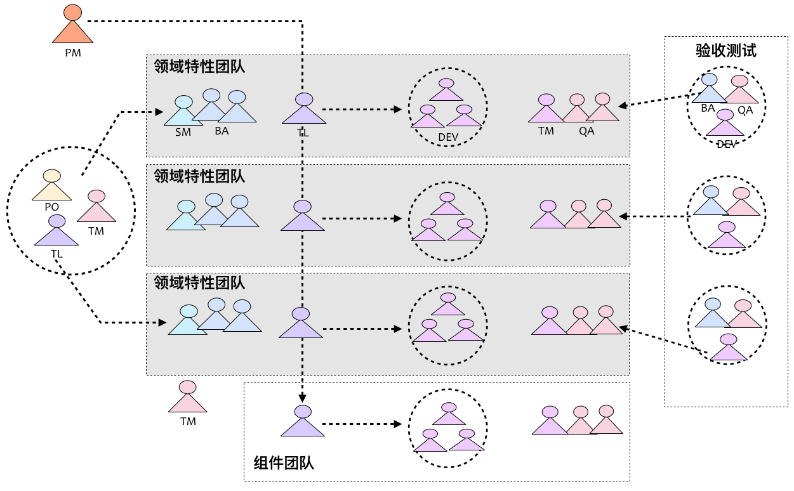
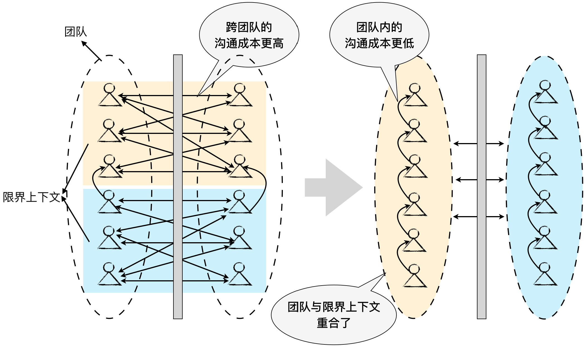

# 013 限界上下文的控制力（上）

既然我们认为：引入限界上下文的目的，不在于如何划分，而在于如何控制边界。因此，我们就需要将对限界上下文的关注转移到对控制边界的理解。显然，对应于统一语言，限界上下文是语言的边界，对于领域模型，限界上下文是模型的边界，二者可以帮助我们界定问题域（Problem Space）。对于系统的架构，限界上下文确定了应用边界和技术边界，进而帮助我们确定整个系统及各个限界上下文的解决方案。可以说，**限界上下文是连接问题域与解决方案域的重要桥梁**。

下面将分别针对业务边界、工作边界与应用边界来深入探讨限界上下文的这种控制力。

#### 限界上下文分离了业务边界

限界上下文首先分离了业务边界，用以约束不同上下文的领域模型。这种对领域模型的划分符合架构设计的基本原则，即从更加宏观和抽象的层次去分析问题域，如此既可以避免分析者迷失在纷繁复杂的业务细节知识中，又可以保证领域概念在自己的上下文中的一致性与完整性。

例如，在电商系统中，主要的产品实体 Product 在不同的限界上下文具有不同的含义，关注的属性与行为也不尽相同。在采购上下文，需要关注产品的进价、最小起订量与供货周期；在市场上下文中，则关心产品的品质、售价，以及用于促销的精美图片和销售类型；在仓储上下文中，仓库工作人员更关心产品放在仓库的哪个位置，产品的重量与体积，是否易碎品以及订购产品的数量；在推荐上下文中，系统关注的是产品的类别、销量、收藏数、正面评价数、负面评价数。

对于这种情况，我们不应该将这一概念建模为单个类，否则就可能导致不同限界上下文对应的领域模型为了代码重用，而共享这个共同的 Product 类，导致限界上下文之间产生代码的耦合，随之而来的，与领域模型相对应的数据模型也要产生耦合，如下图所示：



产品（Product）实体的设计也违背了“单一职责原则（SRP）”，它包含了太多本应分离的职责，适用于不同的上下文，从而变成了一个臃肿的上帝类：

```java
public class Product {
    private Identity id;
    private String name;
    private Category category;
    private Preriod leadTime;
    private int minimumOrderQuant;
    private Weight weight;
    private Volumn volumn;
    private int quantity;
    private long annualSales;
    private long favoritePoints;
    private long positiveComments;
    private long negetiveComments;

    public Price priceFor(CustomerType customerType) {}
    public PurchaseOrder buyFrom(Supplier supplier) {}
    public Location allocate() {}
    public boolean isFragile() {}
    public Image[] loadImagesFrom(String filePath) {}
    public Recommendations similar() {}
}
```

如果我们将产品看做是参与业务场景的角色，进而在不同场景中考虑对象之间的协作；那么，是否可以遵循**接口隔离原则（ISP）\**对 Product 实体类进行抽象呢？例如，在不同的限界上下文（作为 Product 的调用者）中，确定 Product 类扮演的不同角色，然后基于面向接口设计的原则为其定义多个细粒度的接口，如 Allocation 接口、Recommendation 接口、ImageLoader 接口等。这样的接口即 Martin Fowler 提出的\**角色接口（Role Interface）**，然后，再让定义的 Product 类去实现这多个接口，体现了“大对象小角色”的设计思路。

如果只考虑设计层面，这样基于**接口隔离原则**进行设计的方案是合理的。例如，我们可以在各自的限界上下文中定义这些接口，然而，实现了这些接口的 Product 类又应该放在哪里？譬如说，我们可以引入一个产品上下文，然后在其内部定义 Product 类去实现这些接口。这样的设计是不合理的，它导致了产品上下文同时依赖其余四个限界上下文，形成了**架构层面上限界上下文之间不必要的耦合**，如下所示：



引入的限界上下文对设计产生了影响。在考虑设计方案时，我们需要时刻警醒限界上下文边界的控制力。限界上下文内部的协作成本要远远低于限界上下文之间的协作成本。在面向对象设计中，行之有效的“接口隔离原则”如果跨越了多个限界上下文，就变得不合理了。为了避免重复，我们引入了耦合，这种设计上的顾此失彼是不可取的。要降低耦合同时又能避免重复，更好的解决方案是**让每一个限界上下文拥有自己的领域模型**，该领域模型仅仅满足符合当前上下文需要的产品唯一表示。这其实是领域驱动设计引入限界上下文的主要目的：



虽然不同的限界上下文都存在相同的 Product 领域模型，但由于有了限界上下文作为边界，使得我们在理解领域模型时，是基于当前所在的上下文作为概念语境的。这样的设计既保证了限界上下文之间的松散耦合，又能够维持限界上下文各自领域模型的一致性，此时的限界上下文成为了保障领域模型不受污染的边界屏障。

#### 限界上下文明确了工作边界

一个理想的开发团队规模最好能符合亚马逊公司提出的“Two-Pizza Teams”，即 2PTs 规则，该规则认为“让团队保持在两个披萨能让成员吃饱的小规模”，大体而言，就是将团队成员人数控制在 7~10 人左右。为何要保证这样的规模呢？因为小团队能够更有效保证有效的沟通，如下图所示：



2PTs 规则自有其科学依据。如果我们将人与人之间的沟通视为一个“联结（link）”，则联结的数量遵守如下公式，其中 n 为团队的人数：

*[Math Processing Error]N(link)=n(n−1)2*

联结的数量直接决定了沟通的成本，以 6 人团队来计算，联结的数量为 15。如果在原有六人团队的规模上翻倍，则联结数陡增至 66。对于传统项目管理而言，一个 50 人的团队其实是一个小型团队，根据该公式计算得出的联结数竟然达到了惊人的 1225。如下图所示，我们可以看到随着团队规模的扩大，联结数的增长以远超线性增长的速度发展，因而沟通的成本也将随之发生颠覆性的改变：



随着沟通成本的增加，团队的适应性也会下降。Jim Highsmith 在 Adaptive Software Development 一书中写道：

> 最佳的单节点（你可以想象成是通信网络中可以唯一定位的人或群体）联结数是一个比较小的值，它不太容易受网络规模的影响。即使网络变大，节点数量增加，每个节点所拥有的联结数量也一定保持着相对稳定的状态。

要做到人数增加不影响到联结数，就是要找到这个节点网络中的最佳沟通数量，也即前面提到的 2PTs 原则。然而团队规模并非解决问题的唯一办法，如果在划分团队权责时出现问题，则团队成员的数量不过是一种组织行为的表象罢了。如果结合领域驱动设计的需求，则我们应该考虑在保持团队规模足够小的前提下，按照软件的特性（Feature）而非组件（Component）来组织软件开发团队，这就是所谓“特性团队”与“组件团队”之分。

传统的“组件团队”强调的是专业技能与功能重用，例如，熟练掌握数据库开发技能的成员组建一个数据库团队，深谙前端框架的成员组建一个前端开发团队。这种遵循“专业的事情交给专业的人去做”原则的团队组建模式，可以更好地发挥每个人的技能特长，然而牺牲的却是团队成员业务知识的缺失，客户价值的漠视。这种团队组建模式也加大了团队之间的沟通成本，导致系统的整体功能无法持续和频繁的集成。例如，由于业务变更需要针对该业务特性修改用户描述的一个字段，就需要从数据存储开始考虑到业务模块、服务功能，最后到前端设计。一个小小的修改就需要横跨多个组件团队，这种交流的浪费是多么不必要啊。在交流过程中，倘若还出现了知识流失，或者沟通不到位导致修改没有实现同步，就会带来潜在的缺陷。这种缺陷非常难以发现，即使在高覆盖率的集成测试下暴露了，缺陷定位、问题修复又是一大堆破事儿，需要协调多个团队。邮件沟通、电话沟通、你来我往、扯皮推诿，几天的时光如白驹过隙、转眼就过，问题还未必得到最终的解决。倘若这样的组件团队还是不同供应商的外包团队，分处于不同城市，可以想象这样的场景是多么“美好”！很“幸运”，我在参与某汽车制造商的零售商管理系统时，作为 CRM 模块的负责人，就摊上了这样的破事儿，如今思之，仍然不寒而栗啊！

为了规避这些问题，组建特性团队更有必要。所谓“特性团队”，就是一个**端对端的开发垂直细分领域的跨职能团队**，它将需求分析、架构设计、开发测试等多个角色糅合在一起，专注于领域逻辑，实现该领域特性的完整的端对端开发。一个典型的由多个特性团队组成的大型开发团队如下图所示：



如上图所示，我们按照领域特性来组建团队，使得团队成员之间的沟通更加顺畅，至少针对一个领域而言，知识在整个特性团队都是共享的。当然，我们在上图中也看到了组件团队的存在。这是因为在许多复杂软件系统中，毕竟存在一些具有相当门槛的专有功能，需要具有有专门知识或能够应对技术复杂度的团队成员去解决那些公共型的基础型的问题。二者的结合可以取长补短，但应以组建特性团队为主。

特性团队专注的领域特性，是与领域驱动设计中限界上下文对应的领域是相对应的。当我们确定了限界上下文时，其实也就等同于确定了特性团队的工作边界，确定了限界上下文之间的关系，也就意味着确定了特性团队之间的合作模式；反之亦然。之所以如此，则是因为**康威定律（Conway's Law）**为我们提供了理论支持。

康威定律认为：“任何组织在设计一套系统（广义概念上的系统）时，所交付的设计方案在结构上都与该组织的沟通结构保持一致。” **在康威定律中起到关键杠杆作用的是沟通成本**。如果同一个限界上下文的工作交给了两个不同的团队分工完成，为了合力解决问题，就必然需要这两个团队进行密切的沟通。然而，团队间的沟通成本显然要高于团队内的沟通成本，为了降低日趋增高的成本，就需要重新划分团队。反过来，如果让同一个团队分头做两个限界上下文的工作，则会因为工作的弱相关性带来自然而然的团队隔离。



如上图所示，我们可以设想这样一种场景，如果有两个限界上下文的工作，分配给两个不同的团队。分配工作时，却没有按照限界上下文的边界去组建团队，即每个团队会同时承担两个限界上下文的工作。试想，这会造成多少不必要的沟通成本浪费？借用 ORM（Object Relational Mapping，对象关系映射）的概念，我将这种职责分配的错位称之为“**限界上下文与团队的阻抗不匹配**”。如果能够将团队与限界上下文重合，就能够降低沟通成本，打造高效的**领域特性团队**，专注于属于自己的限界上下文开发。