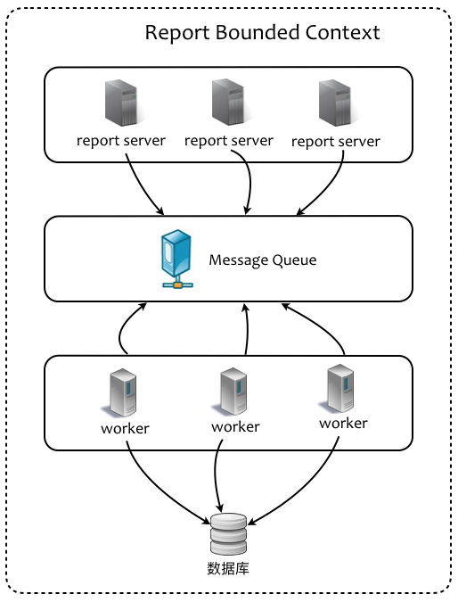

# 014 限界上下文的控制力（下）

### 限界上下文封装了应用边界

架构师在划分限界上下文时，不能只满足于业务边界的确立，还得从控制技术复杂度的角度来考虑技术实现，从而做出对系统质量属性的响应与承诺，这种技术因素影响限界上下文划分的例子可谓是不胜枚举。

#### 高并发

一个外卖系统的订单业务与门店、支付等领域存在业务相关性，然而考虑外卖业务的特殊性，它往往会在某个特定的时间段比如中午 11 点到 13 点会达到订单量的高峰值。系统面临高并发压力，同时还需要快速地处理每一笔外卖订单，与电商系统的订单业务不同，外卖订单具有周期短的时效性，必须在规定较短的时间内走完从下订单、支付、门店接单到配送等整个流程。如果我们将订单业务从整个系统中剥离出来，作为一个单独的限界上下文对其进行设计，就可以从物理架构上保证它的独立性，在资源分配上做到高优先级地扩展，在针对领域进行设计时，尽可能地引入异步化与并行化，来提高服务的响应能力。

#### 功能重用

对于一个面向企业雇员的国际报税系统，报税业务、旅游业务与 Visa 业务都需要账户功能的支撑。系统对用户的注册与登录有较为复杂的业务处理流程。对于一个新用户而言，系统会向客户企业的雇员发送邀请信，收到邀请信的用户只有通过了问题验证才能成为合法的注册用户，否则该用户的账户就会被锁定，称之为 Registration Locked。在用户使用期间，若违背了系统要求的验证条件，也可能会根据不同的条件锁定账户，分别称之为 Soft Locked 和 Hard Locked。只有用户提供了可以证明其合法身份的材料，其账户才能被解锁。

账户管理并非系统的核心领域，但与账户相关的业务逻辑却相对复杂。从功能重用的角度考虑，我们应该将账户管理作为一个单独的限界上下文，以满足不同核心领域对这一功能的重用，避免了重复开发和重复代码。

#### 实时性

在电商系统中，商品自然是核心，而价格（Price）则是商品概念的一个重要属性。倘若仅仅从业务的角度考虑，在进行领域建模时，价格仅仅是一个普通的领域值对象，可倘若该电商系统的商品数量达到数十亿种，每天获取商品信息的调用量在峰值达到数亿乃至数百亿次时，价格就不再是业务问题，而变成了技术问题。对价格的每一次变更都需要及时同步，真实地反馈给电商客户。

为了保证这种在高并发情况下的实时性，我们就需要专门针对价格领域提供特定的技术方案，例如，通过读写分离、引入 Redis 缓存、异步数据同步等设计方法。此时，价格领域将作为一个独立的限界上下文，形成自己与众不同的架构方案，同时，为价格限界上下文提供专门的资源，并在服务设计上保证无状态，从而满足快速扩容的架构约束。

#### 第三方服务集成

一个电商系统需要支持多种常见的支付渠道，如微信支付、支付宝、中国银联以及各大主要银行的支付。买家在购买商品以及进行退货业务时，可以选择适合自己的支付渠道完成支付。电商系统需要与这些第三方支付系统进行集成。不同的支付系统公开的 API 并不相同，安全、加密以及支付流程对支付的要求也不相同。

在技术实现上，一方面我们希望为支付服务的客户端提供完全统一的支付接口，以保证调用上的便利性与一致性，另一方面我们希望能解除第三方支付服务与电商系统内部模块之间的耦合，避免引起“供应商锁定（Vender Lock）”，也能更好地应对第三方支付服务的变化。因此，我们需要将这种集成划分为一个单独的限界上下文。

#### 遗留系统

当我们在运用领域驱动设计对北美医疗内容管理系统提出的新需求进行设计与开发时，这个系统的已有功能已经运行了数年时间。我们的任务是在现有系统中增加一个全新的 Find & Replace 模块，其目的是为系统中的医疗内容提供针对医疗术语、药品以及药品成分的查询与替换。这个系统已经定义了自己的领域模型。这些领域模型与新增模块的领域有相似之处。但是，为了避免已有模型对新开发模块的影响，我们应该将这些已有功能视为具有技术债的遗留系统，并将该遗留系统整体视为一个限界上下文。

通过这个遗留系统限界上下文的边界保护，就可以避免我们在开发过程中陷入遗留系统庞大代码库的泥沼。由于新增需求与原有系统在业务上存在交叉功能，因而可能失去了部分代码的重用机会，却能让我们甩开遗留系统的束缚，放开双手运用领域驱动设计的思想建立自己的领域模型与架构。只有在需要调用遗留系统的时候，作为调用者站在遗留系统限界上下文之外，去思考我们需要的服务，然后酌情地考虑模型对象之间的转换以及服务接口的提取。

如上的诸多案例都是从技术层面而非业务层面为系统划分了应用边界，这种边界是由限界上下文完成的，通过它形成了对技术实现的隔离，避免不同的技术方案选择互相干扰导致架构的混乱。

### 案例：生成税务报告的技术风险

国际税务系统需要在政府指定的周期提交税务报告，凡是满足条件的 Assignee 都需要在规定时间内生成税务报告。在生成税务报告时，需要对 Assignee 提交的 Questionnaire 数据进行合并，并基于税收策略与 Assignee 个人情况执行计算。生成税务报告的时序图如下所示：


代码如下所示：

```java
public class TaxReportGenerator {
    @Service
    private HtmlReportProvider provider;
    @Service
    private PdfConverter converter;
    @Repository
    private ReportRepository repository;

    public void generateReports(String calendarReportName) {
        Byte[]  bytes = provider.getHtmlBytes(calendarReportName);
        Byte[] pdfBytes = converter.getPdfBytes(bytes, provider.getTitle());
        repository.save(new TaxReport(pdfBytes));
    }
}
```

由于每个 Assignee 的报告内容多，生成的 PDF 文件较大，使得生成税务报告的单位时间也较长。在最初用户量较少的情况下，所有税务报告的生成时间在客户预期范围内，因而并未针对报告生成功能做特别的架构设计。后来，随着系统的 Assignee 用户数增多，在提交税务报告的高峰期时，报告生成的时间越来越长。以高峰期需要提交 2000 个税务报告为例，如果每个税务报告的提交时间为 1 分钟，在只有一个 worker 的情况下，我们需要`2000*1/60=33`小时。

由于单个税务报告的生成性能已经达到瓶颈，没有优化的空间，因而需要在架构层面对方案进行优化，包括如下两方面：

- 引入消息队列，将整个税务报告生成过程拆分为消息队列的生产者和消费者。处于应用服务器一端的生产者仅负责收集税务报告需要的数据，而将生成报告的职责交给消息队列的消费者，从而减轻应用服务器的压力。
- 将报告生成识别为限界上下文，定义为可以单独部署的微服务，以便于灵活地实现水平扩展。

如下图是我们基于技术实现识别出来的 report 限界上下文。在上下文边界内，引入了消息队列。server 作为生成者，在收集了税务数据后组装消息，然后将消息入队；作为消费者的 worker 订阅该消息，一旦消息传递到达，则负责生成报告：



无论是 server 还是 worker，皆为并行执行，且在理论上可以无限制地水平扩展。倘若在性能上无法满足要求，我们可以增加 server 或 worker 节点。例如，我们希望所有税务报告能够在 4 小时内处理完毕，通过公式`2000*1/60/4`计算，预估需要 7 个 worker 并行执行即可满足目标。