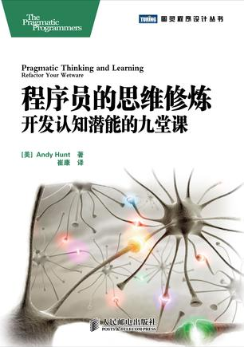
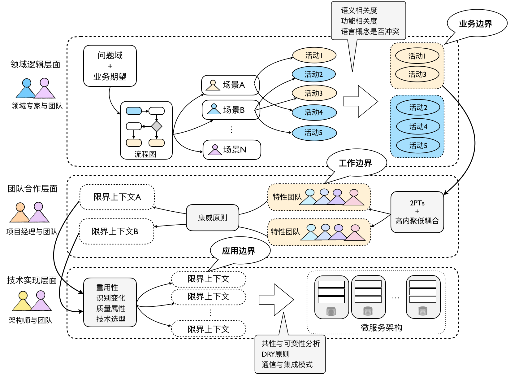

# 015 识别限界上下文（上）

不少领域驱动设计的专家都非常重视限界上下文。Mike 在文章《DDD: The Bounded Context Explained》中写道：“限界上下文是领域驱动设计中最难解释的原则，但或许也是最重要的原则，可以说，没有限界上下文，就不能做领域驱动设计。在了解聚合根（Aggregate Root）、聚合（Aggregate）、实体（Entity）等概念之前，需要先了解限界上下文。”，然而，现实却是很少有文章或著作专题讲解该如何识别限界上下文。

我曾经向《实现领域驱动设计》的作者 Vaughn Vernon 请教如何在领域驱动设计中识别出正确的限界上下文？他思索了一会儿，回答我：“By experience.（凭经验）”，这是一个机智的回答，答案没有错，可是也没有任何借鉴意义，等于说了一句正确的废话。

在软件开发和设计领域，任何技能都是需要凭借经验积累而逐步提升的。然而作为一种设计方法，领域驱动设计强调了限界上下文的重要性，却没有提出一个值得参考并作为指引的过程方法，这是不负责任的。

Andy Hunt 在《程序员的思维修炼》这本书中分析了德雷福斯模型的 5 个阶段：新手、高级新手、胜任者、精通者和专家。对于最高阶段的“专家”，Andy Hunt 得到一个有趣的结论：“专家根据直觉工作（Experts work from intuition），而不需要理由。”，这似乎充满了神秘主义，然而这种专家的直觉实际上是通过不断的项目实践千锤百炼出来的，也可以认为是经验的累积。经验的累积过程需要方法，否则所谓数年经验不过是相同的经验重复多次罢了，没有价值。Andy Hunt 认为需要给新手提供某种形式的规则去参照，之后，高级新手会逐渐形成一些总体原则，然后通过系统思考和自我纠正，建立或者遵循一套体系方法，就能从高级新手慢慢成长为胜任者、精通者。因此，从新手到专家是一个量变引起质变的过程，在没有能够养成直觉的经验之前，我们需要有一套方法。

我在一些项目中尝试着结合了诸多需求分析方法与设计原则，慢慢摸索出了属于自己的一套体系。归根结底，限界上下文就是“**边界**”，这与面向对象设计中的**职责分配**其实是同一道理。限界上下文的识别并不是一蹴而就的，需要演化和迭代，结合着我对限界上下文的理解，我认为**通过从业务边界到工作边界再到应用边界这三个层次抽丝剥茧，分别以不同的视角、不同的角色协作来运用对应的设计原则，会是一个可行的识别限界上下文的过程方法**。当然，这个过程相对过重，如果仅以此作为输出限界上下文的方法，未免有些得不偿失。需要说明的是，这个过程除了能够帮助我们更加准确地识别限界上下文之外，还可以帮助我们分析需求、识别风险、确定架构方案。整体过程如下图所示：

### 从业务边界识别限界上下文

领域驱动设计围绕着“**领域**”来开展软件设计。在明确了系统的问题域和业务期望后，开发团队与领域专家经过充分地沟通与交流，可以梳理出主要的业务流程，这些业务流程体现了各种参与者在这个过程中通过业务活动共同协作，最终完成具有业务价值的领域功能。显然，业务流程结合了参与角色（Who）、业务活动（What）和业务价值（Why）。在业务流程的基础上，我们就可以抽象出不同的业务场景，这些业务场景又由多个业务活动组成，我们可以利用前面提到的领域场景分析方法剖析场景，以帮助我们识别业务活动，例如采用用例对场景进行分析，此时，一个业务活动实则就是一个用例。

例如，在针对一款文学阅读产品进行需求分析时，我们得到的业务流程为：

- **登录读者**根据作品名或者作者名查询自己感兴趣的作品。在找到自己希望阅读的作品后，开始**阅读**。若阅读的作品为长篇，可以按照章节阅读，倘若作品为收费作品，则**读者需要支付相应的费用**，支付成功后可以阅读购买后的作品。在阅读时，倘若读者看到自己喜欢的句子或段落，可以作**标记**，也可以**撰写读书笔记**，还可以将自己喜欢的内容分享给别的朋友。读者可以对该作品和作者发表评论，关注自己喜欢的作品和作者。
- 注册用户可以申请成为驻站作者。审核通过的作者可以**在创作平台上发布自己的作品**，发布作品时，可以根据需要**设置作品的章节**。作者可以在发布作品之前预览作品，无论作品是否已经发布，都可以对作品的内容进行修改。作者可以设置自己的作品为收费或免费作品，并自行确定阅读作品所需的费用。如果是新作品发布，**系统会发送消息通知该作者的关注者**；若连载作品有新章节发布，系统会发送消息通知该作品的关注者。
- 驻站作者可以为自己的作品建立作品**读者群**，读者可以申请加入该群，加入群的读者与作者可以在线实时聊天，也可以发送离线信息，或者将自己希望分享的内容发布到读者群中。注册用户之间可以发起一对一的**私聊**，也可以直接给注册用户发送私信。

通过对以上业务流程进行分析，结合在各个流程环节中需要的知识以及参与角色的不同，可以划分如下业务场景：

- 阅读作品
- 创作作品
- 支付
- 社交
- 消息通知
- 注册与登录

可以看到，**业务流程是一个由多个用户角色参与的动态过程，而业务场景则是这些用户角色执行业务活动的静态上下文**。从业务流程中抽象出来的业务场景可能是交叉重叠的，例如在读者阅读作品流程与作者创作流程中，都牵涉到支付场景的相关业务。

接下来，我们利用领域场景分析的用例分析方法剖析这些场景。我们往往通过参与者（Actor）来驱动对用例的识别，这些参与者恰好就是参与到场景业务活动的角色。根据用例描述出来的业务活动应该与统一语言一致，最好直接从统一语言中撷取。业务活动的描述应该精准地表达领域概念，且通过尽可能简洁的方式进行描述，通常格式为动宾形式。以阅读作品场景为例，可以包括如下业务活动：

- 查询作品
- 收藏作品
- 关注作者
- 浏览作品目录
- 阅读作品
- 标记作品内容
- 撰写读书笔记
- 评价作品
- 评价作者
- 分享选中的作品内容
- 分享作品链接
- 购买作品

一旦准确地用统一语言描述出这些业务活动，我们就可以从如下两个方面识别业务边界，进而提炼出初步的限界上下文：

- 语义相关性
- 功能相关性

#### 语义相关性

**从语义角度去分析业务活动的描述，倘若是相同的语义，可以作为归类的特征**。语义相关性主要来自于描述业务活动的宾语。例如，前述业务活动中的查询作品、收藏作品、分享作品、阅读作品都具有“作品”的语义，基于这一特征，我们可以考虑将这些业务活动归为同一类。

识别语义相关性的前提是准确地使用统一语言描述业务活动。在描述时，应尽量避免使用“管理（manage）”或“维护（maintain）”等过于抽象的词语。抽象的词语容易让我们忽视隐藏的领域语言，缺少对领域的精确表达。例如，在文学阅读产品中，我们不能宽泛地写出“管理作品”、“管理作者”、“维护支付信息”等业务活动，而应该挖掘业务含义，只有如此才能得到诸如收藏作品、撰写作品、发布作品、设置作品收费模式、查询支付流水、对账等符合领域知识的描述。当然，这里也有一个业务活动层次的问题。在进行业务分析时，若我们发现只能使用“管理”或“维护”之类的抽象字眼来表述该用户活动时，则说明我们选定的用户活动层次过高，应该继续细化。细化后的业务活动既能更好地表达领域知识，又能让我们更好地按照语义相关性去寻找业务的边界，可谓一举两得。

在进行语义相关性判断时，还需要注意业务活动之间可能存在不同的语义相关性。例如，在文学阅读产品中，查询作品、阅读作品与撰写作品具有“作品”的语义相关，而评价作品与评价作者又具有“评价”的语义相关，究竟应该以哪个语义为准呢？没有标准！我们只能按照相关性的耦合程度进行判断。如果我们将评价视为一个相对独立的限界上下文，则评价作品与评价作者放入评价上下文会更好。

#### 功能相关性

**从功能角度去分析业务活动是否彼此关联和依赖，倘若存在关联和依赖，可以作为归类的特征**，这种关联性，代表了功能之间的相关性。倘若两个功能必须同时存在，又或者缺少一个功能，另一个功能是不完整的，则二者就是功能强相关的。通常，这种功能相关性极具有欺骗性，因为系统总是包含这样那样彼此依赖的功能。要判断这种依赖关系的强弱，并不比分析人与人之间的关系简单。倘若我们运用**用例分析方法**，就可以通过**用例之间的关系**来判别功能相关性，如用例的包含与扩展关系，其中包含关系展现了功能的强相关性。所谓“功能相关性”，指的就是职责的内聚性，强相关就等于高内聚。故而从这个角度看，功能相关性的判断标准恰好符合“高内聚、松耦合”的设计原则。

仍然以前面提到的文学阅读产品为例。发布作品与验证作品内容是功能相关的，且属于用例的包含关系，因为如果没有对发布的作品内容进行验证，就不允许发布作品。对于这种强相关的功能，我们通常都会考虑将其归入到同一个限界上下文。又例如发布作品与设置作品收费模式是功能相关的，但并非强相关，因为设置作品收费模式并非发布作品的前置约束条件，属于用例中的扩展关系。但由于二者还存在语义相关性，因而将其放入到同一个限界上下文中也是合理的。

**两个相关的功能未必一定属于同一个限界上下文**。例如，购买作品与支付购买费用是功能相关的，且前者依赖于后者，但后者从领域知识的角度判断，却应该分配给支付上下文，我们非但不能将其紧耦合在一起，还应该竭尽所能降低二者之间的耦合度。因此，我在识别限界上下文时，仅仅将“功能相关性”作为一种可行的参考，它并不可靠，却能给你一些提醒。事实上，**功能相关性往往会与上下文之间的协作关系有关**。由于这种功能相关性恰恰对应了用例之间的包含与扩展关系，它们往往又可成为识别限界上下文边界的关键点。我在后面讲解上下文映射时还会详细阐释。

#### 为业务边界命名

无论是语义相关性还是功能相关性，都是分类业务活动的一种判断标准。一旦我们将识别出来的业务活动进行归类，就自然而然地为它们划定了业务边界，接下来，我们需要对划定的业务边界进行命名，这个命名的过程其实就是识别所有业务活动共同特征，并以最准确地名词来表达该特征。倘若我们划分的业务活动欠妥当，对这个业务边界命名就会成为一种巨大的挑战。例如，我们从建立读者群、加入读者群，发布群内消息、实时聊天、发送离线消息、一对一私聊与发送私信等业务活动找到“社交”的共同特征，因而得到社交上下文。但如果我们将阅读作品、收藏作品与关注作者、查看作者信息放在一个业务边界内，命名就变得有些棘手了，我们总不可能称呼其为“作品与作者”上下文吧！因此，对业务边界的命名可以算作是对限界上下文识别的一种检验手段。

整体而言，从业务边界识别上下文的重点在于“领域”。若理解领域逻辑有误，就可能影响限界上下文的识别。因此，这个阶段需要开发团队与领域专家紧密合作，这个阶段也将是一个充分讨论和分析的过程。它是一个迭代的过程。很多时候，如果我们没有真正去实现这些限界上下文，我们有可能没有完全正确地理解它。当我们距离真正理解业务还有距离的时候，不妨先“草率”地规划它，待到一切都明朗起来，再寻机重构。