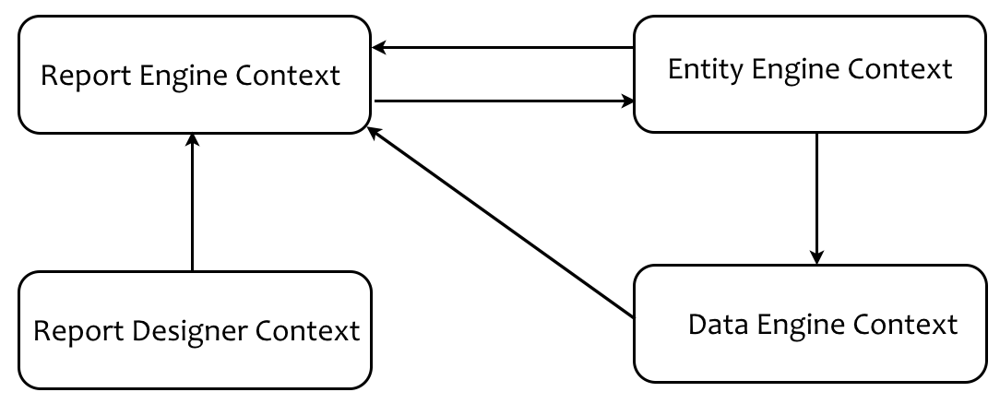
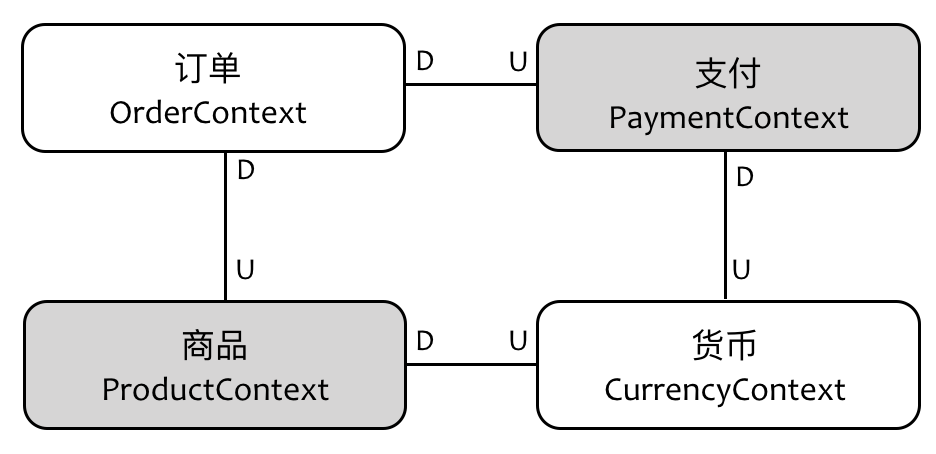

# 018 上下文映射的团队协作模式

如果我们将限界上下文理解为是对工作边界的控制，则上下文之间的协作实则就是团队之间的协作，高效的团队协作应遵循“各司其职、权责分明”的原则。从组织层面看，需要预防一个团队的“权力膨胀”，导致团队的“势力范围”扩大到整个组织；从团队层面，又需要避免自己的权力遭遇压缩，导致自己的话语权越来越小，这中间就存在一个平衡问题。映射到领域驱动设计的术语，就是要**在满足合理分配职责的前提下，谨慎地确保每个限界上下文的粒度**。

当然，一个高效的组织，其内部团队之间必然不是“老死不相往来”的陌生客。职责的合理分配，可以更好地满足团队的自组织或者说自治，但不可能做到“万事不求人”，全靠自己来做。如果什么事情都由这一个团队完成，这个团队也就成为无所不能的“上帝”团队了。Vaughn Vernon 就认为：“上下文映射展现了一种组织动态能力（Organizational Dynamic），它可以帮助我们识别出有碍项目进展的一些管理问题。”这也是我为何要在识别上下文的过程中引入项目经理这个角色的原因所在，因为在团队协作层面，限界上下文与项目管理息息相关。

领域驱动设计根据团队协作的方式与紧密程度，定义了五种团队协作模式。

### 合作关系（Partnership）

合作（Partnership）是一个美好的词语，但在软件设计中，却未必是一个正面的褒义词，因为合作得越多，就意味着依赖越多。Vaughn Vernon 在其著作《实现领域驱动设计》中如此定义这种关系：

> 如果两个限界上下文的团队要么一起成功，要么一起失败，此时他们需要建立起一种合作关系，他们需要一起协调开发计划和集成管理。两个团队应该在接口的演化上进行合作以同时满足两个系统的需求。应该为相互关联的软件功能制定好计划表，这样可以确保这些功能在同一个发布中完成。

这种一起成功或一起失败的“同生共死”关系代表的固然是良好的合作，却也说明二者可能存在强耦合关系，甚至是糟糕的**双向依赖**。对于限界上下文的边界而言，即使是逻辑边界，出现双向依赖也是不可饶恕的错误。倘若我们视限界上下文为微服务，则这种“确保这些功能在同一个发布中完成”的要求，无疑抵消了许多微服务带来的好处，负面影响不言而喻。

在我过去参与的一个面向教育行业的 SaaS 系统中，我们划分了 ReportEngine、EntityEngine 与 DataEngine 以及 ReportDesigner 等限界上下文。当绘制出上下文映射图时，我们发现这多个限界上下文之间出现了双向依赖与循环依赖，如下图所示：

**说明：** 虽然在领域驱动设计中，我们应该以标准的模式来表示限界上下文之间的关系，例如标注 U 和 D 代表上游和下游，标注 Partnership 说明二者为合作关系。但在上图我却采用了依赖方式来说明，目的是可以更清晰地体现双向依赖和循环依赖的特征。

ReportEngine 与 EntityEngine 之间存在双向依赖，二者又与 DataEngine 之间产生了循环依赖。这种依赖导致三个限界上下文“貌离神合”，边界控制不够彻底，使得它们并不能真正的分开。倘若这三个限界上下文被构建为三个 JAR 包，这种依赖会导致它们在编译时谁也离不开谁。如果是微服务，则任何一个服务出现故障，其他服务都不可用。

我个人认为限界上下文的“合作关系”其实是一种“反模式”，罪魁祸首是因为职责分配的不当，是一种设计层面的“特性依恋（Feature envy）”坏味道。解决的办法通常有三种：

- 既然限界上下文存在如此紧密的合作关系，就说明当初拆分的理由较为牵强，与其让它们因为分开而“难分难舍”，不如干脆让它们合在一起。
- 将产生特性依赖的职责分配到正确的位置，尽力减少一个方向的多余依赖。
- 识别产生双向依赖或循环依赖的原因，然后将它们从各个限界上下文中剥离出来，并为其建立单独的限界上下文，这就是所谓的“共享内核（Shared Kernel）”。

分析前面的例子，之所以 ReportEngine、EntityEngine 与 DataEngine 之间存在不正确的循环依赖，原因是我们错误地将**元数据功能**放到了 ReportEngine 限界上下文中。EntityEngine 与DataEngine 之所以依赖 ReportEngine，并不是需要调用属于 ReportEngine 本身职责的功能，而是需要访问元数据。事实上，我们还发现 ReportDesigner 也是因为需要访问元数据，才会依赖 ReportEngine。此时，拆分出单独的元数据限界上下文才是最佳选择：

新引入的 Metadata 成为了其余限界上下文的上游，却解除了 DataEngine 对 ReportEngine 的依赖，同样解除了 EntityEngine 以及 ReportDesigner 对 ReportEngine 的依赖。多余引入的 Metadata 上下文就是我们之前在识别上下文时未曾发现的，现在通过上下文映射，帮助我们甄别了这一错误，及时调整了系统的限界上下文。

### 共享内核（Shared Kernel）

前面提取“元数据限界上下文”的模式，就是“共享内核”的体现。从设计层面看，共享内核是解除不必要依赖实现重用的重要手段。当我们发现了属于共享内核的限界上下文后，需要确定它的团队归属。注意，共享内核仍然属于领域的一部分，它不是横切关注点，也不是公共的基础设施。分离出来的共享内核属于上游团队的职责，因而需要处理好它与下游团队的协作。

虽然名为“内核”，但这是一种技术层面的命名，并不一定意味着该限界上下文的逻辑属于核心领域（Core Domain）。相反，多数情况下，共享内核属于子领域（SubDomain）。

共享内核往往被用来解决合作关系引入的问题。

共享内核是通过上下文映射识别出来的，通过它可以改进设计质量，弥补之前识别限界上下文的不足。与其说它是上下文映射的一种模式，不如说它是帮助我们识别隐藏限界上下文的模式，主要的驱动力就是“避免重复”，即 DRY（Don't Repeat Yourself）原则的体现。在前面讲解通过应用边界识别限界上下文时，我提到了物流联运管理系统。运输、货站以及堆场都用到了作业与指令功能。显然，作业与指令功能放在运输、货站或堆场都不合理，这时就是运用“共享内核”的时机。为了避免重复，也为了避免不必要的依赖，可以提取出作业上下文。

当然，这种重用是需要付出代价的。Eric Evans 指出：“共享内核不能像其他设计部分那样自由更改，在做决定时需要与另一个团队协商。”至于修改产生的影响有多大，需要视该限界上下文与其他限界上下文之间的集成关系。尤其是大多数共享内核可能是多个限界上下文共同的上游，每次修改都可能牵一发而动全身。因此在对共享内核进行修改时，需要充分评估这种修改可能带来的影响。

### 客户方-供应方开发（Customer-Supplier Development）

正常情况下，这是团队合作中最为常见的合作模式，体现的是上游（供应方）与下游（客户方）的合作关系。这种合作需要两个团队共同协商：

- 下游团队对上游团队提出的领域需求
- 上游团队提供的服务采用什么样的协议与调用方式
- 下游团队针对上游服务的测试策略
- 上游团队给下游团队承诺的交付日期
- 当上游服务的协议或调用方式发生变更时，该如何控制变更

注意，在很多业务系统中，下游团队往往都不止一个。如何排定不同领域需求的优先级，如何针对不同的领域需求建立统一的抽象，都是上游团队需要考虑的问题。若上游服务还未提供，下游团队应采取模拟上游服务的方式来规避可能存在的集成风险，并且需要考虑上游团队不能按时履行交付承诺时的应对方案。上游团队需要及时就服务的任何变更与所有下游团队进行协商，而下游团队的领域需求一旦有变，也应及时告知上游团队。如果能够采用**持续集成（Continuous Integration）**为上、下游限界上下文建立集成测试、API 测试等自动化测试的构建与发布管道，可以更好地规避集成的风险，也能够更好地了解因为上游服务发生变更时对所有下游产生的影响。

例如，我们在设计通知（Notification）上下文时，作为上游服务的开发团队，需要考虑各种信息通知的领域需求。从通知类型看，可以是邮件、短信、微信推送和站内信息推送等多种方式。从通知格式看，可能是纯文本、HTML 或微信文章。从通知内容看，可以是固定内容，也可能需要提供通知模板，由调用者提供数据填充到模板中的正确位置。

设计该服务时，我们既要考虑这些通知服务实现的多样化，又要考虑服务调用的简单与一致性。至于发送的通知内容，则需要上游团队事先定义**通知上下文**的领域模型。该领域模型既要覆盖所有的业务场景，又要保证模型的稳定性，同时还必须**注意维持通知上下文的职责边界**。

譬如说，我们在通知上下文中定义了 Message 与 Template 领域对象，后者内部封装了一个`HashMap<String, String>`类型的属性。Map 的 key 对应模板中的变量，value 则为实际填充的值。建模时，我们明确了通知上下文的职责，**它仅负责模板内容正确地填充，并不负责对值的解析**。这就是上游定义的契约，它清晰地勾勒了上下文之间协作的边界。倘若下游团队在填充通知模板的值时，还需要根据自己的业务规则进行运算，就应该在调用通知服务之前，首先在自己的限界上下文中进行计算，然后再将计算后的值作为模板的 value 传入。

### 遵奉者（Conformist）

我们需要从两个角度来理解遵奉者模式，即需求的控制权与对领域模型的依赖。

一个正常的客户方-供应方开发模式，是上游团队满足下游团队提出的领域需求；但当需求的控制权发生了逆转，由上游团队来决定是响应还是拒绝下游团队提出的请求时，所谓的“遵奉者”模式就产生了。从这个角度来看，我们可以将遵奉者模式视为一种“反模式”。糟糕的是在现实的团队合作中，这种情形可谓频频发生，尤其是当两个团队分属于不同的管理者时，牵涉到的因素就不仅仅是与技术有关了。所以说**领域驱动设计提出的“限界上下文”实践，影响的不仅仅是设计决策与技术实现，还与企业文化、组织结构直接有关**。许多企业推行领域驱动设计之所以不够成功，除了团队成员不具备领域驱动设计的能力之外，还要归咎于企业文化和组织结构层面。例如，企业的组织结构人为地制造了领域专家与开发团队的壁垒，又比如两个限界上下文因为利益倾轧而导致协作障碍，而团队领导的求稳心态，也可能导致领域驱动设计“制造”的变化屡屡碰壁，无法将这种良性的“变化”顺利地传递下去。

遵奉者还有一层意思是下游限界上下文对上游限界上下文模型的追随。当我们选择对上游限界上下文的模型进行“追随”时，就意味着：

- 可以直接重用上游上下文的模型（好的）
- 减少了两个限界上下文之间模型的转换成本（好的）
- 使得下游限界上下文对上游产生了模型上的强依赖（坏的）

做出遵奉模型决策的前提是需要明确这两个上下文的统一语言是否存在一致性，因为限界上下文的边界本身就是为了维护这种一致性而存在的。理想状态下，即使是上下游关系的两个限界上下文都应该使用自己专属的领域模型，因为原则上不同限界上下文对统一语言的观察视角多少会出现分歧，但模型转换的成本确实会令你左右为难。设计总是如此，没有绝对好的解决方案，只能依据具体的业务场景权衡利弊得失，以求得到相对好（而不是最好）的方案。这是软件设计让人感觉棘手的原因，却也是它如此迷人的魅力所在。

### 分离方式（Separate Ways）

分离方式的合作模式就是指两个限界上下文之间没有哪怕一丁点儿的丝毫关系。这种“无关系”仍然是一种关系，而且是一种最好的关系。这意味着我们无需考虑它们之间的集成与依赖，它们可以独立变化而互相不产生影响，还有什么比这更美好的呢？

在典型的电商网站中，支付上下文与商品上下文之间就没有任何关系，二者是“分离方式”的体现。虽然从业务角度理解，客户购买商品，确乎是为商品进行支付，但在商品上下文中，我们关心的是商品的价格（另一种可能是将价格作为一个独立的上下文），在支付上下文，关注的却是每笔交易的金额。商品价格影响的是订单上下文，支付上下文会作为订单上下文的上游，被订单上下文调用，但这种调用传递的是每条订单的总金额，支付上下文并不关心每笔订单究竟包含了哪些商品。唯一让支付上下文与商品上下文之间可能存在关联的因素，是二者的领域模型中都需要 Money 值对象。我们可以在这两个限界上下文中重复定义 Money 值对象。如果 Money 值对象其实还牵涉到复杂的货币转换以及高精度的运算逻辑，我宁可将类似 Money 这样的对象剥离到单独的上下文中，例如单独拎出来一个货币上下文。此时的货币上下文其实是支付上下文与商品上下文的共享内核：

“分离方式”的映射模式看起来容易识别，然而一旦系统的领域知识变得越来越复杂，导致多个限界上下文之间存在错综复杂的关系时，要识别两个限界上下文之间压根没有一点关系，就需要敏锐的“视力”了。这种没有关系的关系似乎无足轻重，其实不然，它对改进设计质量以及团队组织都有较大帮助。两个毫无交流与协作关系的团队看似冷漠无情，然而，正是这种“无情”才能促进它们独立发展，彼此不受影响。