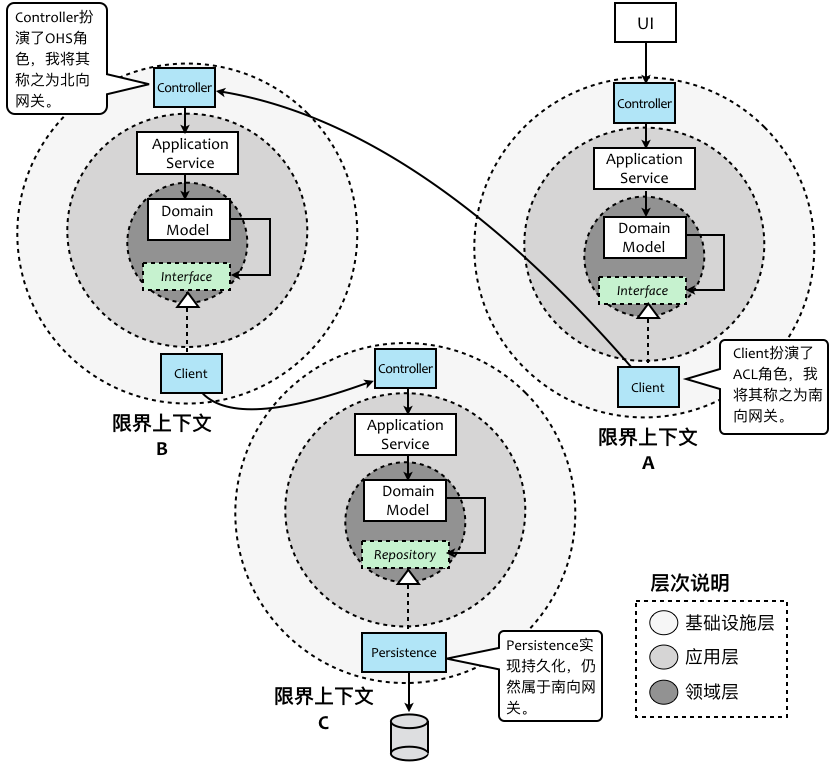
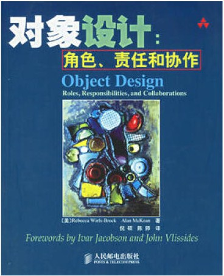
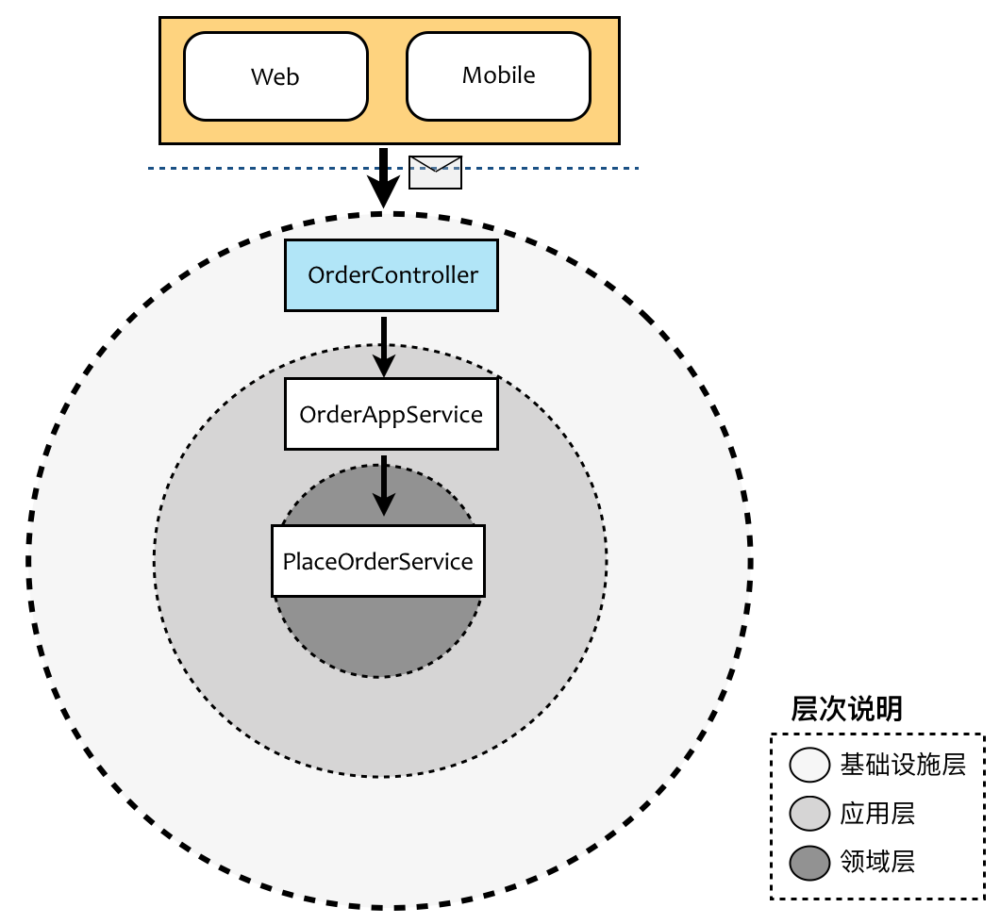

# 020 辨别限界上下文的协作关系（上）

在思考限界上下文之间的协作关系时，首先我们需要确定是否存在关系，然后再确定是何种关系，最后再基于变化导致的影响来确定是否需要引入防腐层、开放主机服务等模式。倘若发现协作关系有不合理之处，则需要反思之前我们识别出来的限界上下文是否合理。

### 限界上下文通信边界对协作的影响

确定限界上下文之间的关系不能想当然，需得全面考虑参与到两个限界上下文协作的业务场景，然后在场景中识别二者之间产生依赖的原因，确定依赖的方向，进而确定集成点，需要注意的是，**限界上下文的通信边界对于界定协作关系至为关键**。限界上下文的通信边界分为**进程内边界**与**进程间边界**，这种通信边界会直接影响到我们对上下文映射模式的选择。例如，采用进程间边界，就需得考虑跨进程访问的成本，如序列化与反序列化、网络开销等。由于跨进程调用的限制，彼此之间的访问协议也不尽相同，同时还需要控制上游限界上下文可能引入的变化，一个典型的协作方式是同时引入开放主机服务（OHS）与防腐层（ACL），如下图所示：



限界上下文 A 对外通过控制器（Controller）为用户界面层暴露 REST 服务，而在内部则调用应用层的应用服务（Application Service），然后再调用领域层的领域模型（Domain Model）。倘若限界上下文 A 需要访问限界上下文 B 的服务，则通过放置在领域层的接口（Interface）去访问，但真正的访问逻辑实现则由基础设施层的客户端（Client）完成，这个客户端就是上下文映射模式的防腐层。客户端访问的其实是限界上下文 B 的控制器，这个控制器处于基础设施层，相当于上下文映射模式的开放主机服务。限界上下文 B 访问限界上下文 C 的方式完全一致，在限界上下文 C 中，则通过资源库（Repository）接口经由持久化（Persistence）组件访问数据库。

从图中可以看到，当我们在界定限界上下文的协作关系时，需要考虑分层架构设计。通常，我们会将分层架构的应用层、领域层与基础设施层都视为在限界上下文的边界之内。如果限界上下文并未采用“零共享架构”，那么，在考虑协作关系时还需要考虑数据库层是否存在耦合。

唯独分层架构的用户界面层是一个例外，我们在领域建模时，通常不会考虑用户界面层，它并不属于限界上下文。究其原因，在于用户界面层与领域的观察视角完全不同。用户界面层重点考虑的是用户体验，而非业务的垂直划分，更不会考虑到业务之间的高内聚、松耦合。许多时候，为了用户操作的方便性，减少用户的操作次数，提高用户体验，可能会在一个 UI 页面中聚合许多属于不同限界上下文的业务。我们可以看看亚马逊或京东的页面，例如，在“我的京东”页面下，几乎将整个电商系统中各方面的业务都一网打尽了。这不符合我们对限界上下文的划分原则。事实上，在“前后端分离”的架构中，用户界面层往往会作为后端服务的调用者，当然应该被排除在限界上下文之外了。

这里存在一个设计决策，即引入开放主机服务与防腐层是否必要？这就需要设计者权衡变化、代码重用、架构简单性的优先级。没有标准答案，而需结合具体的应用场景帮助你做出判断。我自然无法穷尽所有的业务场景，这里给出的无非是其中一种选择罢了。譬如说，倘若限界上下文采用进程内通信，那么下游限界上下文是否还需要通过客户端与控制器去访问，就值得斟酌了。如果需要考虑未来从进程内通信演化为进程间通信，则保留客户端及其接口就是有必要的。

**说明**：以上提到的限界上下文通信边界、领域驱动设计分层架构、零共享架构、代码模型结构以及北向网关、南向网关的知识，都会在后面章节详细阐述。

### 协作即依赖

如果限界上下文之间存在协作关系，必然是某种原因导致这种协作关系。从依赖的角度看，这种协作关系是因为一方需要“**知道**”另一方的知识，这种知识包括：

- 领域行为：需要判断导致行为之间的耦合原因是什么？如果是上下游关系，要确定**下游是否就是上游服务的真正调用者**。
- 领域模型：需要重用别人的领域模型，还是自己重新定义一个模型。
- 数据：是否需要限界上下文对应的数据库提供支撑业务行为的操作数据。

#### 领域行为产生的依赖

所谓领域行为，落到设计层面，其实就是每个领域对象的职责，职责可以由实体（Entity）、值对象（Value Object）来承担，也可以是领域服务（Domain Service）或者资源库（Repository）乃至工厂（Factory）对象来承担。

对象履行职责的方式有三种，Rebecca Wirfs-Brock 在《对象设计：角色、职责与协作》一书中总结为：

- 亲自完成所有的工作。
- 请求其他对象帮忙完成部分工作（和其他对象协作）。
- 将整个服务请求委托给另外的帮助对象。



如果我们选择后两种履行职责的形式，就必然牵涉到对象之间的协作。**一个好的设计，职责一定是“分治”的，就是让每个高内聚的对象只承担自己擅长处理的部分，而将自己不擅长的职责转移到别的对象**。《建筑的永恒之道》作者 Christepher Alexander 就建议，**在遇到设计问题时尽量少用集权的机制**。还是在《对象设计：角色、职责与协作》这本书，作者认为：

> 软件对象通过相互作用和共享责任联系在一起。在对象之间建立简单、一致的通信机制，避免了解决方案的集权性，局部变化的影响不应扩散到整个系统，这是系统的强适应性所要求的。当职责得以划分，组织有序，同时协作遵循可预测性模式，那么复杂的软件系统就更便于管理。

领域驱动设计提出的限界上下文事实上是架构层次的“分权”，通过它的边界让“职责得以划分，组织有序”，限界上下文之间的协作也“遵循可预测性模式”，就可以有效地控制业务复杂度与技术复杂度。因此，在考虑限界上下文的协作关系时，关键要辨别这些分离的职责，弄清楚到底是限界上下文内的对象协作，还是限界上下文之间的对象协作，主要考虑有如下两个方面：

- 职责由谁来履行？——这牵涉到领域行为该放置在哪一个限界上下文。
- 谁发起对该职责的调用？——倘若发起调用者与职责履行者在不同限界上下文，则意味着二者存在协作关系，且能够帮助我们确定上下游关系。

以电商系统的订单功能为例。考虑一个业务场景，客户已经选择好要购买的商品，并通过购物车提交订单，这就牵涉到一个领域行为：提交订单。假设客户属于客户上下文，而订单属于订单上下文，现在需要考虑提交订单的职责由谁来履行。

从电商系统的现实模型看，该领域行为由客户发起，也就是说客户应该具有提交订单的行为，这是否意味着应该将该行为分配给 Customer 聚合根？其实不然，**我们需要注意现实模型与领域模型尤其是对象模型的区别**。在“下订单”这个业务场景中，Customer 是一个参与者，角色为买家。领域建模的一种观点认为：**领域模型是排除参与者在外的客观世界的模型**，作为参与者的 Customer 应该排除在这个模型之外。

当然，这一观点亦存在争议，例如，四色建模就不这样认为，四色建模建议在时标性对象与作为人的实体对象之间引入角色对象，也就是说，角色对象会作为领域模型的一份子。当然，我们不能直接给角色与模型的参与者划上等号。在 DCI（Data Context Interation）模式中，则需要在一个上下文（Context）中，通过识别角色来思考它们之间的协作关系。譬如在转账业务场景中，银行账户 Account 作为数据对象（Data）参与到转账上下文的协作，此时应抽象出 Source 与 Destination 两个角色对象。

**说明**：在战术设计内容中，我会再深入探讨领域建模、四色建模与 DCI 之间的关系与建模细节。

领域模型的确定总是会引起争论，毕竟每个人观察领域模型的角度不同，对设计的看法也不相同。领域模型最终要落实到代码实现，交给实践去检验设计的合理性，**不要在领域建模过程中过多纠缠建模的细节，选择一个恰好合理的模型即可**。从建模到设计，再从设计到编码开发，其实是一个迭代的过程，倘若在实现时确实发现模型存在瑕疵，再回过头来修改即可，孜孜以求领域模型的完美，纯属浪费时间，在建模过程中，最重要的是守住最根本的设计原则。在合理运用设计原则之前，要紧的是明确：**我们究竟要解决什么问题？**

这里的问题不是如何确定领域模型，而是要确定提交订单这个行为究竟应该分配给谁？首先，这牵涉到**对象的职责分配问题**。从语义相关性剖析，这个领域行为虽然由客户发起，但操作的信息（知识）主体其实是订单，这就意味着它们应该分配给订单上下文。这种分配实际上也符合面向对象设计原则的“信息专家模式”，即“信息的持有者即为操作该行为的专家”；其次，**从分层架构的角度**看，这里所谓的“由客户发起调用”，仅仅代表客户通过用户界面层发起对后端服务的请求，换言之，并不是由属于客户上下文的 Customer 领域对象发起调用。

后面我们会讲到，如果遵循整洁架构的思想，领域层应该处于限界上下文的核心。为了保证业务用例的完整性，并避免暴露太多领域协作的细节，领域驱动设计引入了应用层，它包裹了整个领域层；然而，应用层并不会直接与作为调用者的前端进行通信，通常的方式是引入 RESTful 服务，这个 RESTful 服务等同于上下文映射中的开放主机服务（OHS），又相当于是 MVC 模式中的控制器（Controller），属于基础设施层的组件。针对下订单这个场景，客户通过用户界面层的 OrderController 发起调用。OrderController 收到请求后，在处理了请求消息的验证与转换工作后，又将职责转交给了 OrderAppService，然后通过它访问领域层中的领域服务 PlaceOrderService，如下图所示：



下订单场景的实现代码如下所示：

```java
@RestController
@RequestMapping(value = "/orders/")
public class OrderController {
    @Autowired
    private OrderAppService service;

    @RequestMapping(method = RequestMethod.POST)
    public void create(@RequestParam(value = "request", required = true) CreateOrderRequest request) {
        if (request.isInvalid()) {
            throw new BadRequestException("the request of placing order is invalid.");
        }
        Order order = request.toOrder();
        service.placeOrder(order);
    }
}

@Service
public class OrderAppService {
    @Autowired
    private PlaceOrderService orderService;

    public void placeOrder(Order order) {    
        try {
            placeOrderService.execute(order);
        } catch (InvalidOrderException | Exception ex) {
            throw new ApplicationException(ex.getMessage());
        }
    } 
}
```

既然 PlaceOrderService、OrderAppService 与 OrderController 都属于订单上下文，而该行为调用的真正发起者又不是 Customer 领域对象，而是通过用户界面与系统进行交互操作的用户，因此在这个业务场景中，并不存在我们想象的因为客户下订单导致客户上下文对订单上下文在领域行为上的依赖。

在将调用职责分配给前端时，我们需要时刻保持谨慎，不能将对限界上下文调用的工作全都交给前端，以此来解除后端限界上下文之间的耦合。前端确乎是发起调用的最佳位置，但前提是：**我们不能让前端来承担后端应该封装的业务逻辑**。当一个领域行为成为另一个领域行为“内嵌”的一个执行步骤时，发起的调用者就不再是前端 UI，因为该执行步骤组成了业务逻辑的一部分。例如，在计算订单总价时，需要根据客户的类别确定不同的促销策略，然后根据促销策略计算订单的总价，这里牵涉到四个领域行为：

- 计算订单总价
- 获得客户类别
- 确定促销策略
- 计算促销折扣

后面三个领域行为都是为“计算订单总价”提供功能支撑的，这就是前面所谓的“内嵌”执行步骤。除了订单总价属于订单上下文的行为，获得客户类别属于客户上下文，而促销策略与折扣计算则属于促销上下文。因为产生了领域行为的依赖，它们会作为订单上下文的上游限界上下文。

这里其实存在设计上的变化，这取决于我们对职责的分层（在前面讲解的领域场景分析中介绍了职责的分层）：

- 计算订单总价——订单上下文
  - 获得客户类别——客户上下文
  - 根据客户类别获得促销策略——促销上下文
  - 通过促销策略计算促销折扣——促销上下文

当采用这种职责分层结构时，客户上下文与促销上下文就是订单上下文的上游。如果我们将获得客户类别视为促销上下文内含的业务逻辑，则职责的分层结构就变为：

- 计算订单总价——订单上下文
  - 获得促销策略——促销上下文
    - 获得客户类别——客户上下文
    - 根据客户类别获得促销策略——促销上下文
  - 通过促销策略计算促销折扣——促销上下文

这时候，订单上下文的上游为促销上下文，而在促销上下文内部，又需要去调用客户上下文的领域行为。

我们甚至可以对职责做进一步封装。因为对于计算订单总价而言，其实它并不关心促销折扣究竟是怎样得来的，也就是说，获得促销策略这个职责其实是计算促销折扣的细节，于是职责的分层结构再次变化：

- 计算订单总价——订单上下文
  - 计算促销折扣——促销上下文
    - 获得促销策略——促销上下文
      - 获得客户类别——客户上下文
      - 根据客户类别获得促销策略——促销上下文
    - 通过促销策略计算促销折扣——促销上下文

这样的设计既可以减少其他限界上下文与订单上下文的协作，又可以减少彼此协作时需要依赖的领域行为。例如，我们如果希望降低订单上下文与促销上下文之间的耦合，从而避免促销上下文可能发生的变化对订单上下文的影响，就可以引入上下文映射中的防腐层。由于订单上下文只需要知道“计算促销折扣”这一个领域行为职责，防腐层接口的设计就变得更加容易：

```java
package praticeddd.ecommerce.saleordercontext.domain;

import org.springframework.beans.factory.annotation.Autowired;
import org.springframework.stereotype.Service;

// DiscountCalculator 是定义在订单上下文的防腐层接口
import praticeddd.ecommerce.saleordercontext.interfaces.DiscountCalculator;

@Service
public class PriceCalculator {
    @Autowired
    private DiscountCalculator discountCalculator;

    public Price priceFor(Order order) {
        double discount =  discountCalculator.calculate(order);
        return order.totalPrice().multiply(discount);
    }
}

package praticeddd.ecommerce.saleordercontext.interfaces;

public interface DiscountCalculator {
    double calculate(Order order);
}
```

显然，不同的职责分层会直接影响到我们对限界上下文协作关系的判断。归根结底，还是彼此之间需要了解的“知识”起着决定作用。我们应尽可能遵循“**最小知识法则**”，在保证职责合理分配的前提下，产生协作的限界上下文越少越好。