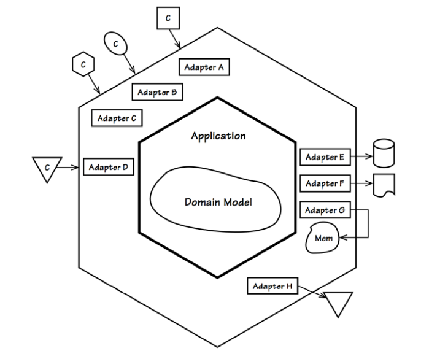
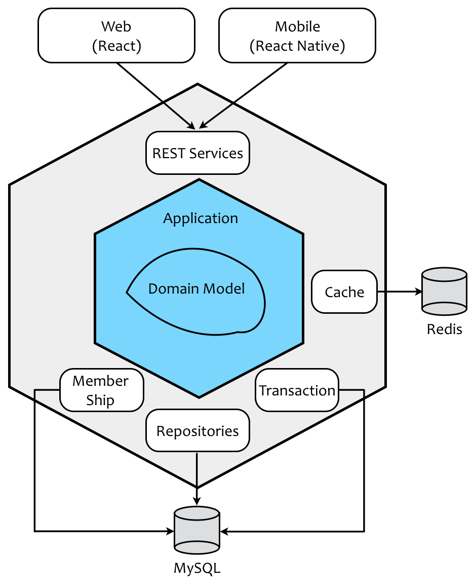
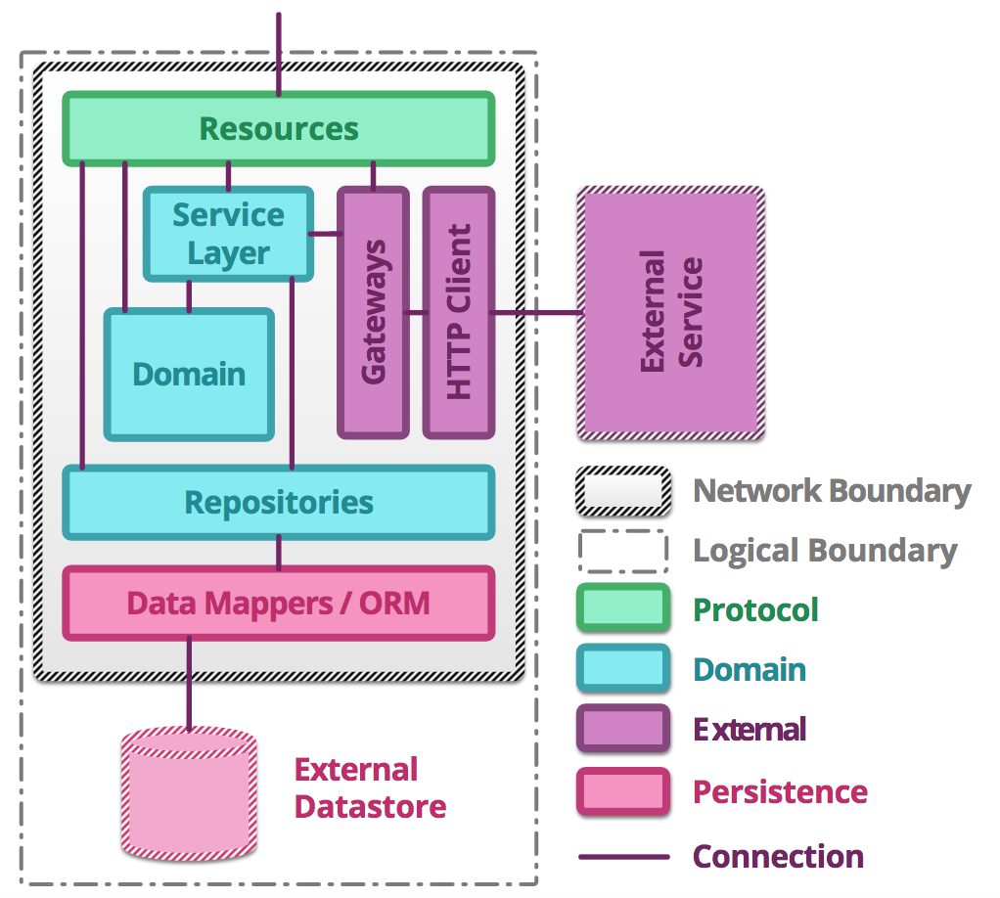

# 023 分层架构的演化

分层架构是一种架构模式，但终归它的目的是为了改进软件的架构质量，我们在运用分层架构时，必须要遵守架构设计的最高原则，即建立一个高内聚、松耦合的软件系统架构。于是，许多设计大师们纷纷提出了自己的洞见。

### 整洁架构

在架构设计时，我们应设计出干净的应用层和领域层，保持它们对业务逻辑的专注，而不掺杂任何具体的技术实现，从而完成领域与技术之间的完全隔离，这一思想被 Robert Martin 称之为**整洁架构（Clean Architecture）**。下图展现了 Robert Martin 的这一设计思想：

该架构思想提出的模型并非传统的分层架构，而是类似于一个内核模式的内外层架构，由内及外分为四层，包含的内容分别为：

- 企业业务规则（Enterprise Business Rules）
- 应用业务规则（Application Business Rules）
- 接口适配器（Interface Adapters）
- 框架与驱动器（Frameworks & Drivers）

注意“企业业务规则”与“应用业务规则”的区别，前者是纯粹领域逻辑的业务规则，后者则面向应用，需要串接支持领域逻辑正常流转的非业务功能，通常为一些横切关注点，如日志、安全、事务等，从而保证实现整个应用流程（对应一个完整的用例）。

仔细解读这一架构模型，我们会发现许多有用的特征：

- 层次越靠内的组件依赖的内容越少，处于核心的 Entities 没有任何依赖。
- 层次越靠内的组件与业务的关系越紧密，因而越不可能形成通用的框架。
- Entities 层封装了企业业务规则，准确地讲，它应该是一个面向业务的领域模型。
- Use Cases 层是打通内部业务与外部资源的一个通道，因而提供了输出端口（Output Port）与输入端口（Input Port），但它对外的接口展现的其实是应用逻辑，或者说是一个用例。
- Gateways、Controllers 与 Presenters 其本质都是适配器（Adapter），用于打通应用业务逻辑与外层的框架和驱动器，实现逻辑的适配以访问外部资源。
- 系统最外层包括框架和驱动器，负责对接外部资源，不属于系统（仅指限界上下文而言）开发的范畴，但选择这些框架和驱动器，是属于设计决策要考虑的内容。这一层的一些组件甚至与要设计的系统不处于同一个进程边界。

我们学到了什么？Robert Martin 的整洁架构将领域模型放在整个系统的核心，这一方面体现了领域模型的重要性，另外一方面也说明了领域模型应该与具体的技术实现无关。**领域模型就是业务逻辑的模型，它应该是完全纯粹的**，无论你选择什么框架，什么数据库，或者什么通信技术，按照整洁架构的思想都不应该去污染领域模型。如果以 Java 语言来实现，遵循整洁架构的设计思想，则所有领域模型对象都应该是 POJO（Plain Ordinary Java Object）。整洁架构的 Entities 层对应于领域驱动设计的领域层。

**说明**：注意 POJO 与 Java Bean 的区别。Java Bean 是指仅定义了为私有字段提供 get 与 set 方法的 Java 对象，这种 Java Bean 对象除了这些 get 和 set 方法之外，几乎没有任何业务逻辑，Martin Fowler 将这种对象称之为“贫血对象”，根据这种贫血对象建立的模型就是“贫血模型”。POJO 指的是一个普通的 Java 对象，意味着这个 Java 对象不依赖除 JDK 之外的其他框架，是一个纯粹 Java 对象，Java Bean 是一种特殊的 POJO 对象。在领域驱动设计中，如果我们遵循面向对象设计范式，就应避免设计出贫血的 Java Bean 对象；如果我们要遵循整洁架构设计思想，则应尽量将领域模型对象设计为具有领域逻辑的 POJO 对象。

属于适配器的 Controllers、Gateways 与 Presenters 对应于领域驱动设计的基础设施层。就我个人的理解来说，适配器这个词并不能准确表达这些组件的含义，反而更容易让我们理解为是对行为的适配，我更倾向于将这些组件都视为是**网关（Gateway）**。对下，例如，针对数据库、消息队列或硬件设备，可以认为是一个**南向网关**，对于当前限界上下文是一种输出的依赖；对上，例如，针对 Web 和 UI，可以认为是一个**北向网关**，对于当前限界上下文是一种输入的依赖。

这两种方向的网关与 Use Cases 层之间的关系是不尽相同的。北向网关会调用 Use Cases 层中表示应用逻辑的服务组件，即发起的是一个由外向内的调用，这种调用在整洁架构体系下是合乎道理的。Use Cases 层的服务组件并不需要关心北向网关的组件，例如，作为 RESTful 服务的 OrderController，就是北向网关中的一个类，它通过调用 Use Cases 层的 OrderAppService 服务来实现一个提交订单的业务用例。OrderAppService 并不需要知道作为调用者的 OrderController，如果存在将 Entities 层的领域模型对象转换为 RESTful 服务的 Resource 对象，也是 OrderController 或者说北向网关的职责。

南向网关作为底层资源的访问者，往往成为 Use Cases 层甚至 Entities 层的被调用者。由于整洁架构思想并不允许内层获知外层的存在，这就导致了我们必须在内层定义与外层交互的接口，然后通过依赖注入的方式将外层的实现注入到内层中，这也是“控制反转（Inversion of Control）”的含义，即将调用的控制权转移到了外层。由是我们可以得出一个结论，即南向网关封装了与外部资源（DB、Devices、MQ）交互的实现细节，但其公开暴露的接口却需要被定义在内层的 Use Cases 或 Entities 中，这实际上阐释了为什么领域驱动设计要求将 Repository 的接口定义在领域层的技术原因。当然，将 Repository 接口定义在领域层还有其业务原因，在后面我会详细介绍。

### 六边形架构

整洁架构的目的在于识别整个架构不同视角以及不同抽象层次的关注点，并为这些关注点划分不同层次的边界，从而使得整个架构变得更加清晰，减少不必要的耦合。它采用了内外层的架构模型弥补了分层架构无法体现领域核心位置的缺陷。由 Alistair Cockburn 提出的六边形架构（Hexagonal Architecture）在满足整洁架构思想的同时，更关注于内层与外层以及与外部资源之间通信的本质：

如上图所示，六边形架构通过内外两个六边形为系统建立了不同层次的边界。核心的内部六边形对应于领域驱动设计的应用层与领域层，外部六边形之外则为系统的外部资源，至于两个六边形之间的区域，均被 Cockburn 视为适配器（Adapter），并通过端口（Port）完成内外区域之间的通信与协作，故而六边形架构又被称为端口-适配器模式（port-adapter pattern）。在第04课中，我曾经给出了如下的设计图，该图更加清晰地表达了领域驱动设计分层架构与六边形架构的关系，同时也清晰地展现了业务复杂度与技术复杂度的边界：

我在前面分析整洁架构时，将 Gateways、Controllers 与 Presenters 统一看做是网关，而在六边形架构中，这些内容皆为适配器。事实上，它们代表的含义是一致的，不同的命名代表的是对其职责认识上的不同。如果认为是“网关”，则将该组件的实现视为一种门面，内部负责多个对象之间的协作以及职责的委派；如果认为是“适配器”，则是为了解决内外协议（数据协议与服务接口）之间的不一致而进行的适配。若依据领域驱动设计的分层架构，则无论网关还是适配器，都属于基础设施层的内容。

无论理解为网关还是适配器，通过这种架构思想都可以认识到在基础设施层的组件应该是轻量级的实现，甚至可以认为它不过是对第三方框架或平台有选择的调用罢了，归根结底，它虽然是技术实现，却是为业务场景提供服务的。例如，需要操作订单数据库，DB 适配器就是一个传递通道，将需要操作的领域模型传递给它，最后返回结果，真正的实现则通过 JDBC、Hibernate、MyBatis 或 Spring Data 等第三方框架来完成。同理，如果需要为前端提供订单服务能力，Web 适配器负责验证与转换前端消息，至于请求到资源的路由等功能皆由 Spring Boot、DropWizard 或 Airlift 等 REST 框架来完成。所以说这里所谓的“适配器”与“端口”其实就是领域与外部资源的一个转换通道。适配器向内的一端连接了 Application 的领域，向外的一端则通过端口连接了外部资源。

六边形架构通过内外六边形的两个不同边界清晰地展现了领域与技术的边界，同时，外部六边形还体现了系统的进程边界，有助于我们思考分布式架构的物理视图，并通过识别端口来引导我们专注于六边形之间的通信机制，这些通信机制可能包括：

- 与外部资源（数据库、文件、消息队列等）之间的通信
- 与 Web 和 UI 等用户界面之间的通信
- 与第三方服务之间的通信
- 与其他六边形边界之间的通信

### 微服务架构

Toby Clemson 在《[微服务架构的测试策略](https://martinfowler.com/articles/microservice-testing/)》一文中深入探讨了如何对微服务架构制定测试策略。要明确如何对这样的系统进行测试，就需要明确该系统架构的组成部分以及各组成部分承担的职责，同时还需要了解各组成部分之间的协作关系。为此，Toby 在这篇文章中给出了一个典型的微服务架构，如下图所示：

该架构图并未严格按照分层架构模式来约定各个组件的位置与职责，这是完全合理的设计！当我们需要将一个分层架构进行落地实践时，在任何一门语言中我们都找不到所谓 layer 的明确语法。在 Java 语言中，我们可以通过 package 与 module 去划分包与模块，在 Ruby 语言中我们也可以限定 module 的范畴，但我们并不能通过某种语法甚至语法糖去规定 layer 的边界。所以在编码实现中，layer 其实是一个松散且不够严谨的逻辑概念，即使我们规定了层的名称以及各层的职责，但各种“犯规行为”依然屡见不鲜。与其如此，不如将各个组件在逻辑架构中的位置与职责明确定义出来。对于系统的概念模型与设计模型，我们要明确分层架构的本质与设计原则；对于代码模型，分层架构则主要负责设计指导，并酌情弱化层在代码模型中的意义，强化对包与模块的划分。

上图的逻辑边界代表了一个微服务，这是基于微服务的设计原则——“**每个微服务的数据单独存储**”，因此需要将物理边界（图中定义为网络边界）外的数据库放在微服务的内部。

整幅图的架构其实蕴含了两个方向：**自顶向下**和**由内至外**。

外部请求通过代表协议（Protocol）的 Resources 组件调用 Service Layer、Domain 或 Repositories，如果需要执行持久化任务，则通过 Repositories 将请求委派给 ORM，进而访问网络边界外的数据库。所谓“外部请求”可以是前端 UI 或第三方服务，而 Resource 组件就是我们通常定义的 Controller，对应于上下文映射中的**开放主机服务**。之所以命名为 Resources，则是因为 REST 架构是一种面向资源的架构，它将服务操作的模型抽象为资源（Resource），这是自顶向下的方向。

若当前微服务需要调用外部服务（External Service），且外部服务籍由 HTTP 协议通信，就需要提供一个 HTTP Client 组件完成对外部服务的调用。为了避免当前微服务对外部服务的强依赖，又或者对客户端的强依赖，需要引入 Gateways 来隔离。事实上，这里的 Gateways 即为上下文映射中的**防腐层**，这是由内至外的方向。

**说明**：文中的微服务架构图虽然由 Toby Clemson 在《[微服务架构的测试策略](https://martinfowler.com/articles/microservice-testing/)》一文中给出，但肖然在《[分层架构的代码架构](https://zhuanlan.zhihu.com/p/30877742)》一文中又明确提出这一架构图来自 Martin Fowler。究竟是谁的创见，我就此咨询了肖然，肖然说他亲自问过老马（即 Martin Fowler），老马说这个架构是他认为的。Toby 的文章本身就发表在老马的官方 biliki 上，作者在文章的开篇对老马表示了致谢。