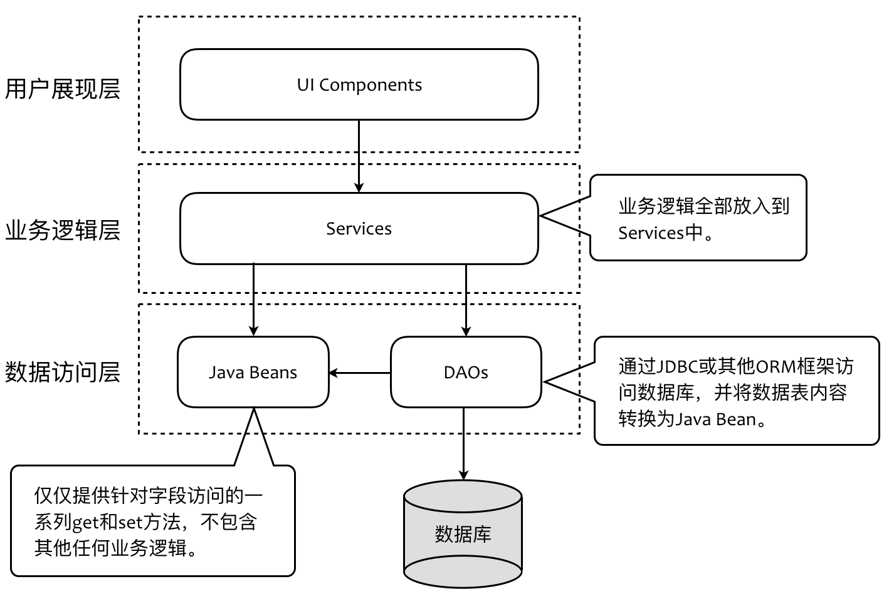
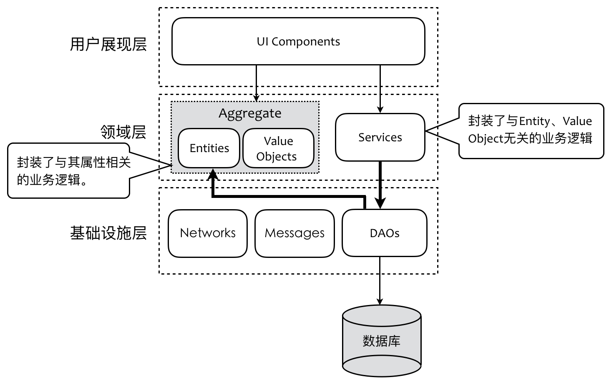
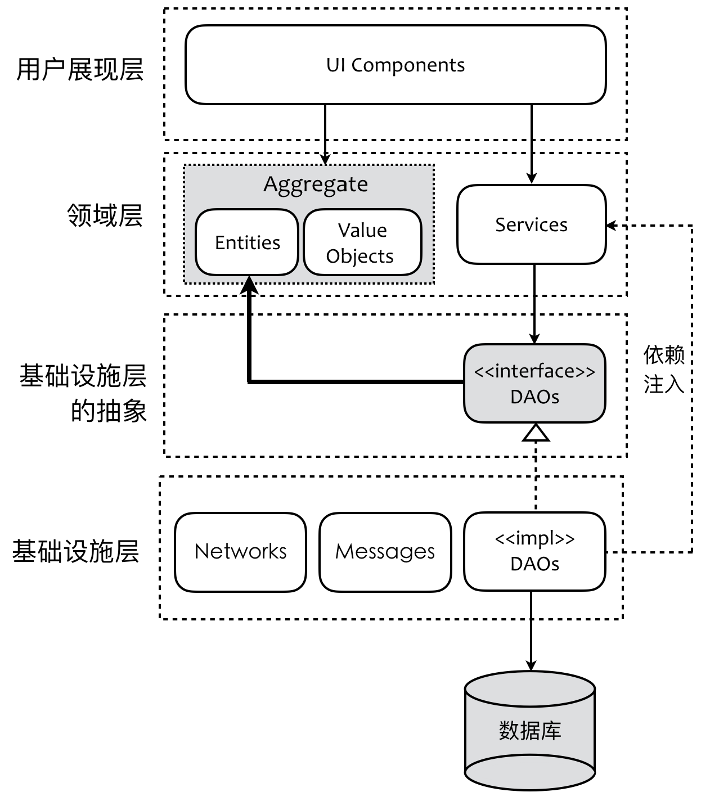
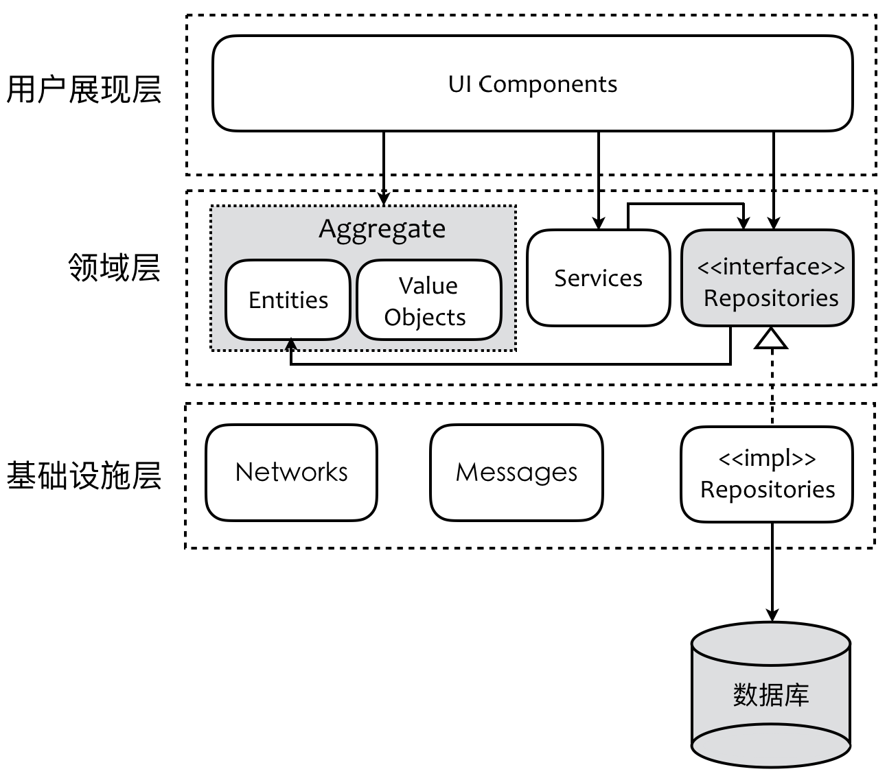
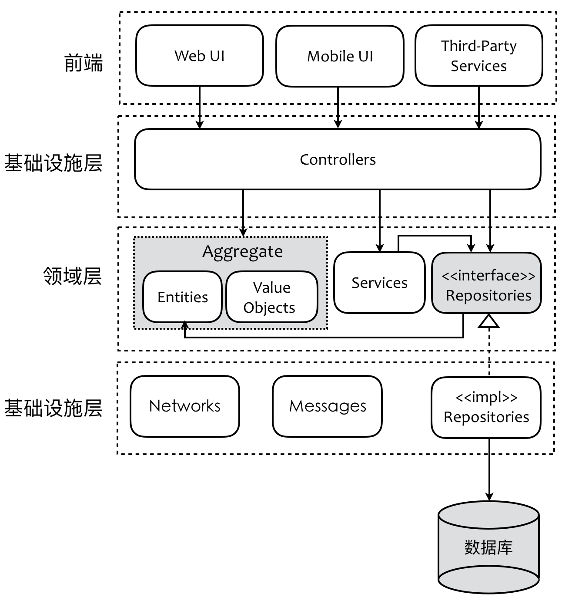
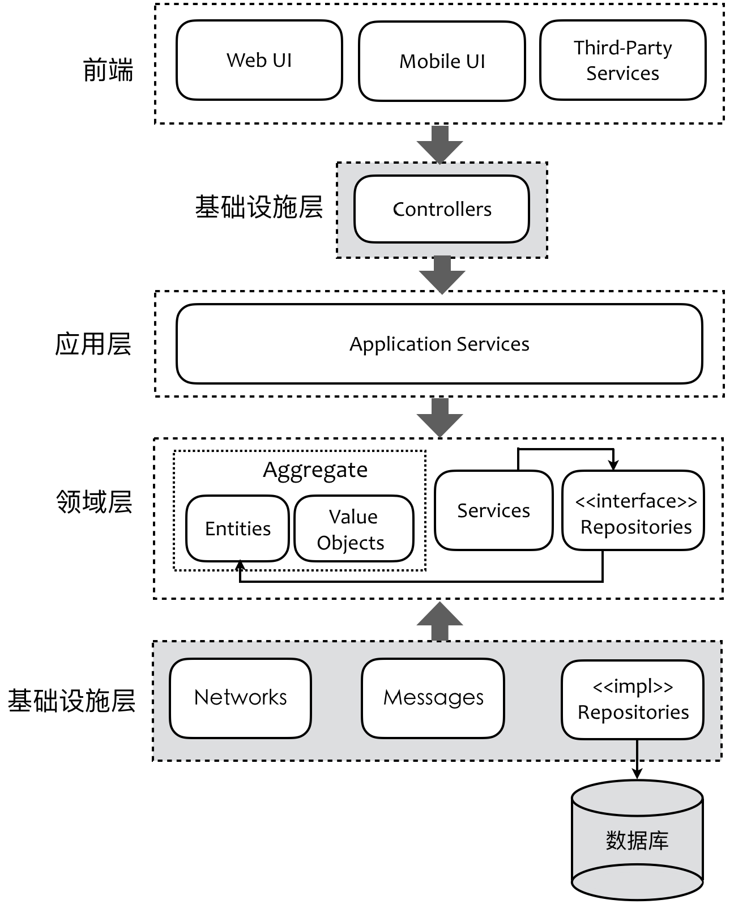

# 024 领域驱动架构的演进

我们回顾了经典三层架构与领域驱动设计四层架构，然后又对分层架构模式的产生与设计原则做了一次历史回顾。我们先后参考了 Robert Martin 的整洁架构、Cockburn 的六边形架构以及 Toby Clemson 给出的微服务架构模型。现在，是时候为领域驱动设计的架构模型做一次总结陈词了。然而事情并未结束，因为任何技术结论都并非句点，而仅仅代表了满足当时技术背景的一种判断，技术总是在演进，领域驱动架构亦是如此。与其关心结果，不如将眼睛投往这个演进的过程，或许风景会更加动人。

根据“依赖倒置原则”与 Robert Martin 提出的“整洁架构”思想，我们推翻了 Eric Evans 在《领域驱动设计》书中提出的分层架构。Vaughn Vernon 在《实现领域驱动设计》一书中给出了改良版的分层架构，他将基础设施层奇怪地放在了整个架构的最上面：


整个架构模型清晰地表达了领域层别无依赖的特质，但整个架构却容易给人以一种错乱感。单以这个分层模型来看，虽则没有让高层依赖低层，却又反过来让低层依赖了高层，这仍然是不合理的。当然你可以说此时的基础设施层已经变成了高层，然而从之前分析的南向网关与北向网关来说，基础设施层存在被“肢解”的可能。坦白讲，这个架构模型仍然没有解决人们对分层架构的认知错误，例如它并没有很好地表达依赖倒置原则与依赖注入。还需要注意的是，这个架构模型将基础设施层放在了整个分层架构的最顶端，导致它依赖了用户展现层，这似乎并不能自圆其说。我们需要重新梳理领域驱动架构，展示它的演进过程。

该怎么演进领域驱动架构？可以从两个方向着手：

- 避免领域模型出现贫血模型
- 保证领域模型的纯粹性

### 避免贫血的领域模型

我们需要回顾经典的 Java 三层架构对领域模型的设计。在这个三层架构中，领域逻辑被定义在业务逻辑层的 Service 对象中，至于反映了领域概念的领域对象则被定义为 Java Bean，这些 Java Bean 并没有包含任何领域逻辑，因此被放在了数据访问层。**注意，这是经典三层架构的关键，即代表领域概念的 Java Bean 被放在了数据访问层，而非业务逻辑层。** 经典三层架构采用了 J2EE 开发的 DAO 模式，即将访问数据库的逻辑封装到数据访问对象（Data Access Object）中。这些 DAO 对象仅负责与数据库的交互，并实现领域对象到数据表的 CRUD（增删改查）操作，因而也被放到了数据访问层中，如下图所示：



如果以面向对象设计范式进行领域建模，我们需要遵循面向对象的设计原则，其中最重要的设计原则就是“数据与行为应该封装在一起”，这也是 GRASP 模式中“信息专家模式”的体现。前面提及的 Java Bean 由于仅包含了访问私有字段的 get 和 set 方法，可以说是对面向对象设计原则的“背叛”，Martin Fowler 则将这种没有任何业务行为的对象称之为“贫血对象”。基于这样的贫血对象进行领域建模，得到的模型则被称之为“贫血模型”。这种贫血模型被认为是简单的，却不具备对象的丰富表达能力，当业务逻辑变得复杂时，在表达领域模型方面就会变得“力不从心”，无法有效应对重用与变化，且可能导致臃肿的“上帝类”。贫血模型的种种问题会在战术设计中再做深入探讨，这里我们姑且给出一个结论，即：**在面向对象设计背景下，当我们面对相对复杂的业务逻辑时，应避免设计出贫血模型。**

要避免贫血模型，就需要合理地将操作数据的行为分配给这些领域模型对象（Domain Model），即战术设计中的 Entity 与 Value Object，而不是前面提及的 Service 对象。由于领域模型对象包含了领域逻辑，就需要从数据访问层转移到业务逻辑层。至于那些不属于任何领域模型对象的领域逻辑，仍然放到 Service 对象中。由于 DAOs 对象需要操作这些领域模型对象，使得**处于数据访问层的 DAOs 对象必须依赖领域层的领域模型对象**，也就是说，要避免贫血的领域模型，就不可能避免底层的数据访问层对业务逻辑层的依赖。

从分层的职责和意义讲，一个系统的基础不仅仅限于对数据库的访问，还包括访问诸如网络、文件、消息队列或者其他硬件设施，因此 Eric Evans 将其更名为“基础设施层”是非常合理的。至于将业务逻辑层更名为领域层也是题中应有之义。遵循整洁架构思想，基础设施层属于架构的外层，它依赖于处于内部的领域层亦是正确的做法。在领域层，封装了领域逻辑的 Services 对象则可能需要持久化领域对象，甚至可能依赖基础设施层的其他组件。于是，之前的分层架构就演进为：



#### 保证领域模型的纯粹性

若将整个层次看做一个整体，在刚才给出的分层架构图中，加粗的两条依赖线可以清晰地看到领域层与基础设施层之间产生了“双向依赖”。在实际开发中，若这两层又被定义为两个模块，双向依赖就成为了设计坏味，它导致了两个层次的紧耦合。此时，领域模型变得不再纯粹，根由则是高层直接依赖了低层，而不是因为低层依赖了高层。故而我们需要去掉右侧 Services 指向 DAOs 的依赖。

DAOs 负责访问数据库，其实现逻辑是容易变化的。基于“稳定依赖原则”，我们需要让领域层建立在一个更加稳定的基础上。**抽象总是比具体更稳定**，因此，改进设计的方式是对 DAOs 进行抽象，然后利用依赖注入对数据访问的实现逻辑进行注入，如下图所示：



DAOs 的抽象到底该放在哪里？莫非需要为基础设施层建立一个单独的抽象层吗？这牵涉到我们对数据库访问的认知。任何一个软件系统的领域对象都存在其生命周期，代表领域逻辑的业务方法其实就是在创造它，发现它，更新它的状态，最后通常也会销毁它。倘若部署软件系统的计算机足够强劲与稳定，就不再需要任何外部资源了；这时，对领域对象的生命周期管理就变成了对普通对象的内存管理。因此，从业务角度看，管理对象的生命周期是必须的，访问外部资源却并非必须。只是因为计算机资源不足以满足这种稳定性，才不得已引入外部资源罢了。也就是说，访问这些领域对象属于业务要素，而如何访问这些领域对象（如通过外部资源），则属于具体实现的技术要素。

从编码角度看，领域对象实例的容身之处不过就是一种数据结构而已，区别仅在于存储的位置。领域驱动设计将管理这些对象的数据结构抽象为**资源库（Repository）**。通过这个抽象的资源库访问领域对象，自然就应该看作是一种领域行为。倘若资源库的实现为数据库，并通过数据库持久化的机制来实现领域对象的生命周期管理，则这个持久化行为就是技术因素。

结合前面对整洁架构的探讨，抽象的资源库接口代表了领域行为，应该放在领域层；实现资源库接口的数据库持久化，需要调用诸如 MyBatis 这样的第三方框架，属于技术实现，应该放在基础设施层。于是，分层架构就演进为：



由于抽象的 Repositories 被搬迁至领域层，图中的领域层就不再依赖任何其他层次的组件或类，成为一个纯粹的领域模型。我们的演进正逐步迈向整洁架构！

### 用户展现层的变迁

现代软件系统变得日趋复杂，对于一个偏向业务领域的分层架构，领域层的调用者决不仅限于用户展现层的 UI 组件，比如说可以是第三方服务发起对领域逻辑的调用。即使是用户展现层，也可能需要不同的用户交互方式与呈现界面，例如 Web、Windows 或者多种多样的移动客户端。因此在分层架构中，无法再用“用户展现层”来涵盖整个业务系统的客户端概念。通常，我们需要采用**前后端分离**的架构思想，将用户展现层彻底分离出去，形成一个完全松耦合的前端层。

不管前端的展现方式如何，它的设计思想是面向调用者，而非面向领域。因此，我们**在讨论领域驱动设计时，通常不会将前端设计纳入到领域驱动设计的范围**。有人尝试将领域驱动设计引入到前端设计中，那是将前端自身当做一种领域。在设计后端 API 时，我们确乎需要从调用者的角度考虑 API 的定义，并确定从 Domain Model（或者 Service Model，又或者是 Resource Model）到 View Model 的转换，又或者考虑引入所谓“DTO（Data Transfer Object，数据传输对象）”，但这些都只限于后端 API 协议的设计。

准确地讲，前端可以视为是与基础设施层组件进行交互的外部资源，如前面整洁架构中的 Web 组件与 UI 组件。为了简化前端与后端的通信集成，我们通常会为系统引入一个开放主机服务（OHS），为前端提供统一而标准的服务接口。该接口实际上就是之前整洁架构中提及的 Controllers 组件，也即我提出的基础设施层的北向网关。于是，分层架构就演变为：



这个分层架构展现了“离经叛道”的一面，因为基础设施层在这里出现了两次，但同时也充分说明了基础设施层的命名存在不足。当我们提及基础设施（Infrastructure）时，总还是会想当然地将其视为最基础的层。同时，这个架构也凸显了分层架构在表现力方面的缺陷。

### 引入应用层

即使我们分离了前后端，又引入了扮演北向网关角色的 Controllers，都不可规避一个问题，那就是领域层的设计粒度过细。由于有了 Controllers，我们可以将 Controllers 看成是领域层的客户端，这就使得它需要与封装了 Entity 与 Value Object 的 Aggregate、Services 以及抽象的 Repositories 接口协作。基于 KISS（Keep It Simple and Stupid）原则或最小知识原则，我们希望调用者了解的知识越少越好，调用变得越简单越好，这就需要引入一个间接的层来封装，这就是应用层存在的主要意义：



领域驱动分层架构中的应用层其实是一个外观（Facade）。GOF 的《设计模式》认为外观模式的意图是“为子系统中的一组接口提供一个一致的接口，外观模式定义了一个高层接口，这个接口使得这一子系统更加容易使用。”我们要理解“**高层接口**”的含义。一方面，它体现了一个概念层次的高低之分，以上图的分层架构来说，应用层是高层抽象的概念，但表达的是业务的含义，领域层是底层实现的概念，表达的是业务的细节。领域驱动设计要求应用层“不包含业务逻辑”，但对外它却提供了一个一致的体现业务用例的接口。注意，这里的接口概念并非指 Java 或 C# 等语言的 interface 语法。

### 基础设施层的本质

引入应用层后，整个分层架构的职责变得更加清晰了，唯一显得较为另类的是同为灰色部分的基础设施层。目前，该分层架构图的基础设施层被分成了两个，分别位于应用层上端和领域层下端。从依赖关系看，处于领域层下端的基础设施层是通过实现抽象 Repository 接口导致的。虽然我也可以将其置于领域层甚至应用层上端，以此来表达这种依赖关系；但我仍然选择保留原来的层次位置，我希望通过该图清晰地体现所谓“北向网关”与南向网关“的语义。正如我在前面分析整洁架构思想时，提到“属于适配器的 Controllers、Gateways 与 Presenters 对应于领域驱动设计的基础设施层。”我们将整洁架构、六边形架构与领域驱动设计的四层架构综合起来考虑，可以得到结论：

```
Controllers + Gateways + Presenters = Adapters = Infrastructure Layer
```

我个人认为，这些组件确乎有适配的语义，将它们视为适配器（Adapter）并无不对之处，但我觉得 Martin Fowler 在《企业应用架构模式》中提出的网关（Gateway）模式似乎更准确。Martin Fowler 对该模式的定义为：An object that encapsulates access to an external system or resource. （封装访问外部系统或资源行为的对象。）基础设施层要做的事情不正是封装对外部系统或资源的访问吗？至于“适配”的语义，仅仅是这种封装的实现模式罢了，更何况在这些组件中，不仅仅做了适配的工作。基于此，我才将这些组件统统视为“网关”，并根据其方向分别划分为北向网关与南向网关。理解网关的含义，可以帮助我们更好地理解基础设施层的本质。扮演网关角色的组件其实是一个出入口（某种情况下，网关更符合六边形架构中端口+适配器的组合概念），所以它们的行为特征是：**网关组件自身会参与到业务中，但真正做的事情只是对业务的支撑，提供了与业务逻辑无关的基础功能实现。**

经历了多次演进，我们的分层架构终于在避免贫血模型的同时保证了领域逻辑的纯粹性，有效地隔离了业务复杂度与技术复杂度。演进后的分层架构既遵循了整洁架构思想，又参考了六边形架构与微服务架构的特点。但我们不能说这样的分层架构就是尽善尽美的，更不能僵化地将演化得来的分层架构视为唯一的标准。分层架构是一种架构模式，遵循了“关注点分离”原则。因此，在针对不同限界上下文进行分层架构设计时，还需要结合当前限界上下文的特点进行设计，合理分层，保证结构的清晰和简单。