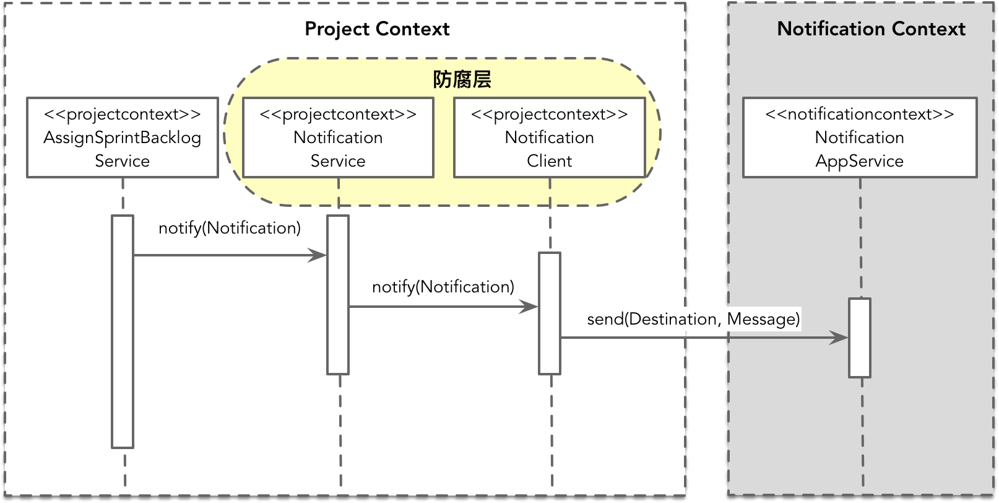
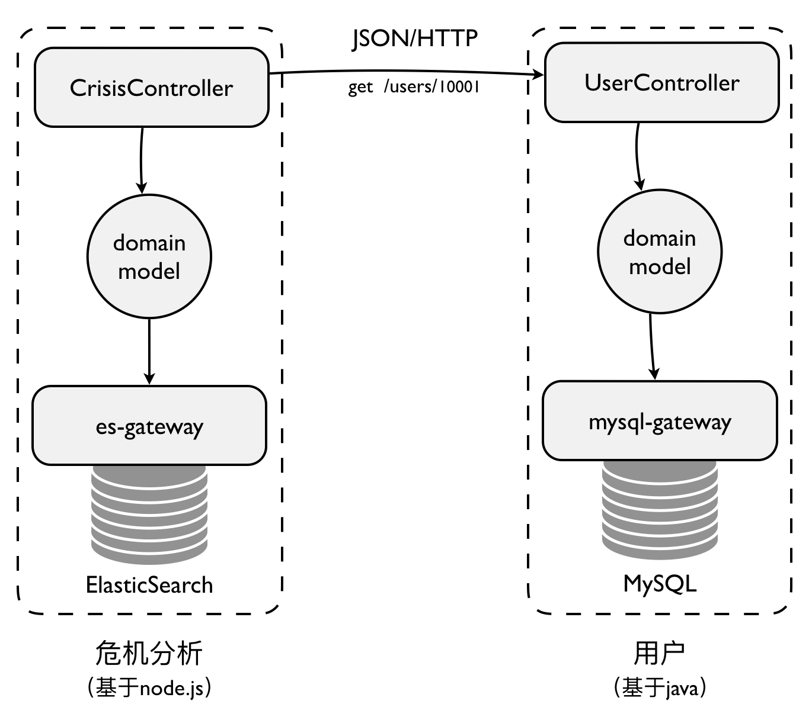

# 026 限界上下文与架构

作为领域驱动战略设计的重要元素，限界上下文对领域驱动架构有着直接的影响。在领域驱动的架构设计过程中，识别限界上下文与上下文映射都是一个重要的过程。限界上下文可以作为逻辑架构与物理架构的参考模型，而上下文映射则非常直观地体现了系统架构的通信模型。

### 限界上下文的架构范围

这里，我需要再一次澄清 Eric Evans 提出的“限界上下文”概念：**限界上下文究竟是仅仅针对领域模型的边界划分，还是对整个架构（包括基础设施层以及需要使用的外部资源）垂直方向的划分？** 正如前面对 Eric Evans 观点的引用，他在《领域驱动设计》一书中明确地指出：“根据团队的组织、软件系统的各个部分的用法以及物理表现（代码和数据库模式等）来设置模型的边界”，显然，限界上下文不仅仅作用于领域层和应用层，**它是架构设计而非仅仅是领域设计的关键因素。**

限界上下文体现的是一个垂直的架构边界，主要针对后端架构层次的垂直切分。例如，订单上下文的内部就包含了应用层、领域层和基础设施层，每一层的模块都是面向业务进行划分，甚至可能是一一对应的。

对于基础设施层需要访问的外部资源，以及为了访问它需要重用的框架或平台，与技术决策和选型息息相关，仍然属于架构设计的考量范围，但它们不属于限界上下文的代码模型。例如，订单上下文需要访问数据库和消息队列。在技术决策上，我们需要确定是选择 NoSQL 数据库还是关系数据库，消息队列是采用 Pull 模式还是 Push 模式。在技术选型上，我们需要确定具体是哪一种数据库和消息队列中间件，同时还需要确定访问它们的框架。对资源的规划与设计也属于限界上下文的设计范围，例如，如何设计数据表、如何规划消息队列的主题。在进行这一系列的技术选型和决策时，依据的其实是该限界上下文的业务场景与质量属性，这些架构活动自然就属于该限界上下文的范畴。我们还需要决定框架的版本，这些框架并不属于系统的代码库，但需要考虑它们与限界上下文代码模型的集成、构建与部署。

### 限界上下文的通信边界

我们对整个业务系统按照限界上下文进行了划分。划分时，**限界上下文之间是否为进程边界隔离**，直接影响架构设计。此为限界上下文的通信边界，以**进程**为单位分为进程内与进程间两种边界。之所以这么分类，是因为进程内与进程间在如下方面存在迥然不同的处理方式：

- 通信
- 消息的序列化
- 资源管理
- 事务与一致性处理
- 部署

除此之外，通信边界的不同还影响了系统对各个组件（服务）的重用方式与共享方式。

#### 进程内的通信边界

若限界上下文之间为进程内的通信方式，则意味着在运行时它们的代码模型都运行在同一个进程中，可以通过实例化的方式重用领域模型或其他层次的对象。即使都属于进程内通信，限界上下文的代码模型（Code Model）仍然存在两种级别的设计方式。以 Java 为例，归纳如下。

- 命名空间级别：通过命名空间进行界定，所有的限界上下文其实都处于同一个模块（Module）中，编译后生成一个 Jar 包。
- 模块级别：在命名空间上是逻辑分离的，不同限界上下文属于同一个项目的不同模块，编译后生成各自的 Jar 包。这里所谓的“模块”，在 Java 代码中也可以创建为 Jigsaw 的 module。

这两种级别的代码模型仅仅存在编译期的差异，后者的解耦会更加彻底，倘若限界上下文的划分足够合理，也能提高它们对变化的应对能力。例如，当限界上下文 A 的业务场景发生变更时，我们可以只修改和重编译限界上下文 A 对应的 Jar 包，其余 Jar 包并不会受到影响。由于它们都运行在同一个 Java 虚拟机中，意味着当变化发生时，整个系统需要重新启动和运行。

**即使处于同一个进程的边界，我们仍需重视代码模型的边界划分**，因为这种边界隔离有助于整个系统代码结构变得更加清晰。限界上下文之间若采用进程内通信，则彼此之间的协作会更加容易、更加高效。然而，正所谓**越容易重用，就越容易产生耦合**。编写代码时，我们需要谨守这条无形的逻辑边界，时刻注意不要逾界，并确定限界上下文各自对外公开的接口，避免它们之间产生过多的依赖。此时，防腐层（ACL）就成了抵御外部限界上下文变化的最佳场所。一旦系统架构需要将限界上下文调整为进程间的通信边界，这种“各自为政”的设计与实现能够更好地适应这种演进。

以第 10 课介绍的项目管理系统为例，假设项目上下文与通知上下文之间的通信为进程内通信，当项目负责人将 Sprint Backlog 成功分配给团队成员之后，系统将发送邮件通知该团队成员。这个职责由项目上下文的 AssignSprintBacklogService 领域服务承担，而发送通知的职责则由通知上下文的 NotificationAppService 应用服务承担。考虑到未来限界上下文通信边界的变化，我们就不能直接在 AssignSprintBacklogService 服务中实例化 NotificationAppService 对象，而是在项目上下文中定义通知服务的接口 NotificationService，并由 NotificationClient 去实现这个接口，它们扮演的就是防腐层的作用。AssignSprintBacklogService 服务依赖该防腐层的接口，并将具体实现通过依赖注入。这个协作过程如下面的时序图所示：

倘若在未来需要将通知上下文分离为进程间的通信边界，这种变动将只会影响到防腐层的实现，作为 NotificationService 服务的调用者，并不会受到这一变化的影响。

采用进程内通信的系统架构属于单体（Monolithic）架构，所有限界上下文部署在同一个进程中，因此不能针对某一个限界上下文进行水平伸缩。当我们需要对限界上下文的实现进行替换或升级时，也会影响到整个系统。即使我们守住了代码模型的边界，耦合仍然存在，导致各个限界上下文的开发互相影响，团队之间的协调成本也随之而增加。

#### 进程间的通信边界

倘若限界上下文之间的通信是跨进程的，则意味着限界上下文是以进程为边界。此时，一个限界上下文就不能直接调用另一个限界上下文的方法，而是要通过分布式的通信方式。

当我们将一个限界上下文限定在进程边界内时，并不足以决定领域驱动架构的设计质量。我们还需要将这个边界的外延扩大，考虑限界上下文需要访问的外部资源，这就产生了两种不同风格的架构：

- 数据库共享架构
- 零共享架构

##### **数据库共享架构**

**数据库共享架构**其实是一种折中的手段。在考虑限界上下文划分时，分开考虑代码模型与数据库模型，就可能出现代码的运行是进程分离的，数据库却共享彼此的数据，即多个限界上下文共享同一个数据库。由于没有分库，在数据库层面就可以更好地保证事务的 ACID。这或许是该方案最有说服力的证据，但也可以视为是对“一致性”约束的妥协。

数据库共享的问题在于数据库的变化方向与业务的变化方向并不一致，这种不一致性体现在两方面，具体如下。

- 耦合：虽然限界上下文的代码模型是解耦的，但在数据库层面依然存在强耦合关系。
- 水平伸缩：部署在应用服务器的应用服务可以根据限界上下文的边界单独进行水平伸缩，但在数据库层面却无法做到。

根据 Netflix 团队提出的微服务架构最佳实践，其中一个最重要特征就是“**每个微服务的数据单独存储**”，但是服务的分离并不绝对代表数据应该分离。数据库的样式（Schema）与领域模型未必存在一对一的映射关系。在对数据进行分库设计时，如果仅仅站在业务边界的角度去思考，可能会因为分库的粒度太小，导致不必要的跨库关联。因此，我们可以将“数据库共享”模式视为一种过渡方案。如果没有想清楚微服务的边界，就不要在一开始设计微服务时，就直接将数据彻底分开，而应采用演进式的设计。

为了便于在演进设计中将分表重构为分库，从一开始要**注意避免在分属两个限界上下文的表之间建立外键约束关系**。某些关系型数据库可能通过这种约束关系提供级联更新与删除的功能，这种功能反过来会影响代码的实现。一旦因为分库而去掉表之间的外键约束关系，需要修改的代码太多，会导致演进的成本太高，甚至可能因为某种疏漏带来隐藏的 Bug。

如果设计数据表时没有外键约束关系，可能在当前增加了开发成本，却为未来的演进打开了方便之门。例如，在针对某手机品牌开发的舆情分析系统中，危机查询服务提供对识别出来的危机进行查询。查询时，需要通过 userID 获得危机处理人、危机汇报人的详细信息。左图为演进前直接通过数据库查询的方式，右图则切断了这种数据库耦合，改为服务调用的方式：

数据库共享架构也可能是一种“反模式”。当两个分处不同限界上下文的服务需要操作同一张数据表（这张表被称之为“共享表”）时，就传递了一个信号，即我们的设计可能出现了错误。

- 遗漏了一个限界上下文，共享表对应的是一个被重用的服务：买家在查询商品时，商品服务会查询价格表中的当前价格，而在提交订单时，订单服务也会查询价格表中的价格，计算当前的订单总额；共享价格数据的原因是我们遗漏了价格上下文，通过引入价格服务就可以解除这种不必要的数据共享。
- 职责分配出现了问题，操作共享表的职责应该分配给已有的服务：舆情服务与危机服务都需要从邮件模板表中获取模板数据，然后再调用邮件服务组合模板的内容发送邮件；实际上从邮件模板表获取模板数据的职责应该分配给已有的邮件服务。
- 共享表对应两个限界上下文的不同概念：仓储上下文与订单上下文都需要访问共享的产品表，但实际上这两个上下文需要的产品信息并不相同，应该按照限界上下文的边界分开为各自关心的产品信息建表。

为什么会出现这三种错误的设计？**根本原因在于我们没有通过业务建模，而是在数据库层面隐式地进行建模**，因而在代码中没有体现正确的领域模型，从而导致了数据库的耦合或共享。遵循领域驱动设计的原则，我们应该根据领域逻辑去识别限界上下文。

##### **零共享架构**

当我们将两个限界上下文共享的外部资源彻底斩断后，就成为了**零共享架构**。例如，前面介绍的舆情分析系统，在去掉危机查询对用户表的依赖后，就演进为零共享架构。如下图所示，危机分析上下文与用户上下文完全零共享：

这是一种限界上下文彻底独立的架构风格，它保证了边界内的服务、基础设施乃至于存储资源、中间件等其他外部资源的完整性与独立性，最终形成自治的微服务。这种架构的表现形式为：每个限界上下文都有自己的代码库、数据存储以及开发团队，每个限界上下文选择的技术栈和语言平台也可以不同，限界上下文之间仅仅通过限定的通信协议和数据格式进行通信。

此时的限界上下文形成了一个相对自由的“独立王国”。从北向网关的 Controller 到应用层，从应用层到领域层的领域模型，再到南向网关对数据库的访问实现，进而到数据库的选型都可以由当前限界上下文独立做主。由于它们是“零共享”的，使得它们彼此之间可以独立演化，在技术选型上也可以结合自己上下文的业务场景做出“恰如其分”的选择。譬如说，危机分析需要存储大规模的非结构化数据，同时业务需要支持对危机数据的全文本搜索，我们选择了 ElasticSearch 作为持久化的数据库。考虑到开发的高效以及对 JSON 数据的支持，我们选择了 Node.js 为后端开发框架。至于用户上下文，数据量小，结构规范，采用传统的基于关系型数据库的架构会更简单更适合。二者之间唯一的耦合就是危机分析通过 HTTP 协议访问上游的用户服务，根据传入的 userID 获得用户的详细信息。

彻底分离的限界上下文变得小而专，使得我们可以很好地安排遵循 2PTs 规则的小团队去治理它。然而，这种架构的复杂度也不可低估。限界上下文之间的通信是跨进程的，我们需要考虑通信的健壮性。数据库是完全分离的，当需要关联之间的数据时，需得跨限界上下文去访问，无法享受数据库自身提供的关联福利。由于每个限界上下文都是分布式的，如何保证数据的一致性也是一件棘手的问题。当整个系统都被分解成一个个可以独立部署的限界上下文时，运维与监控的复杂度也随之而剧增。