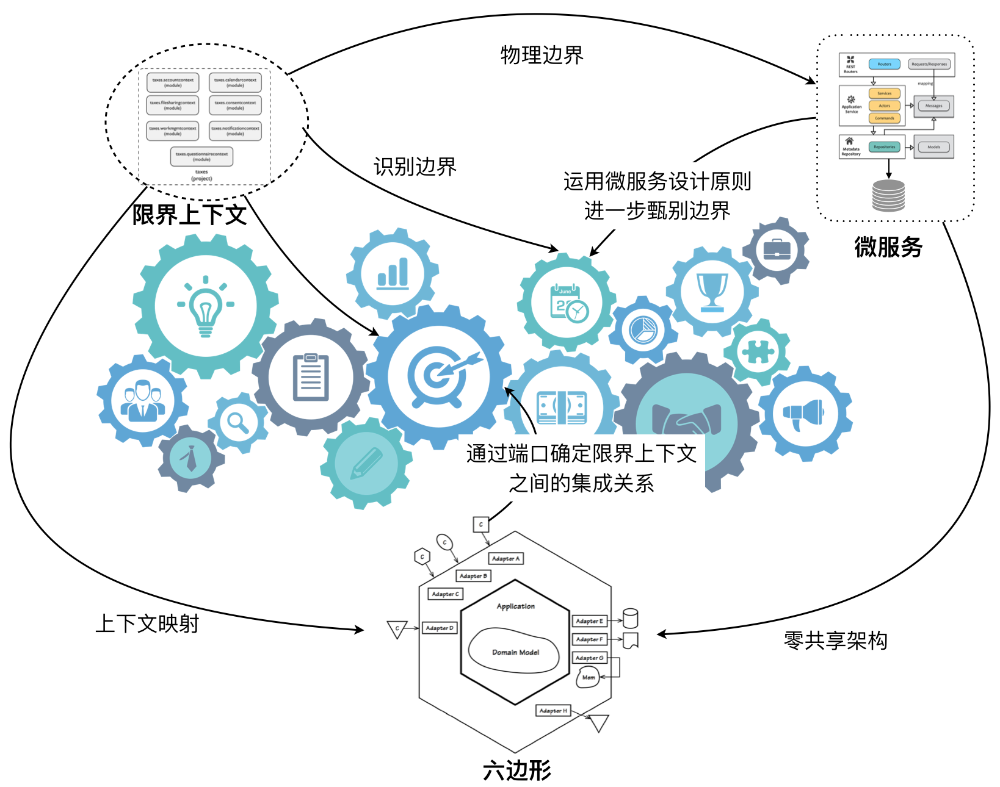
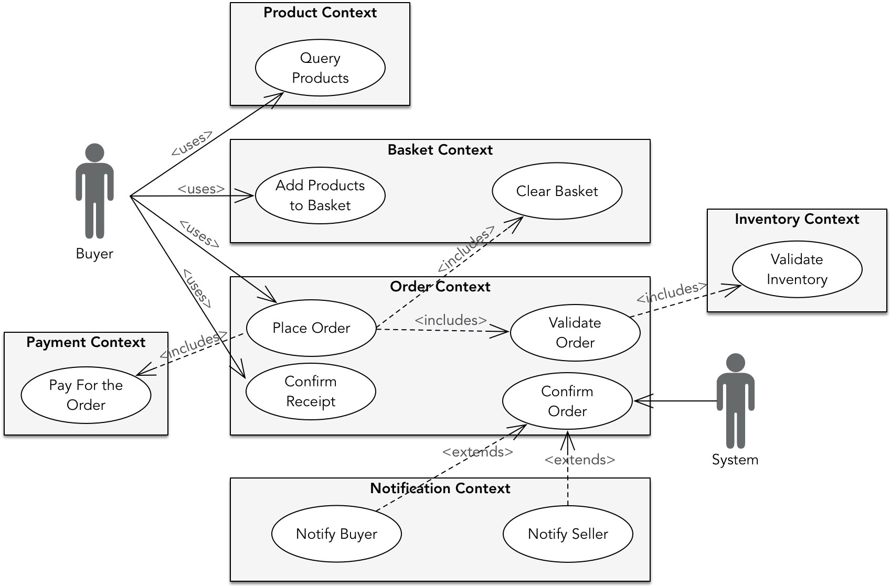
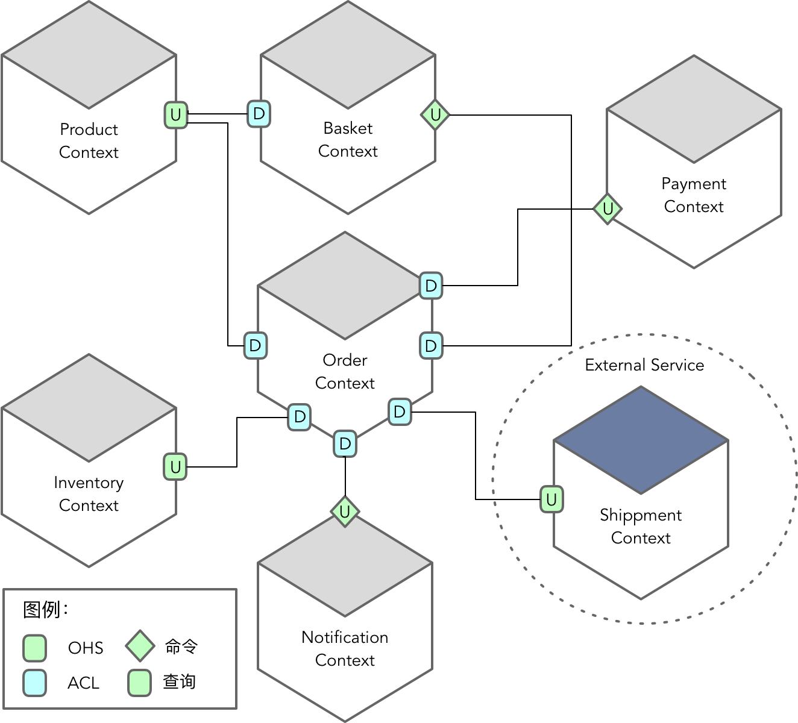
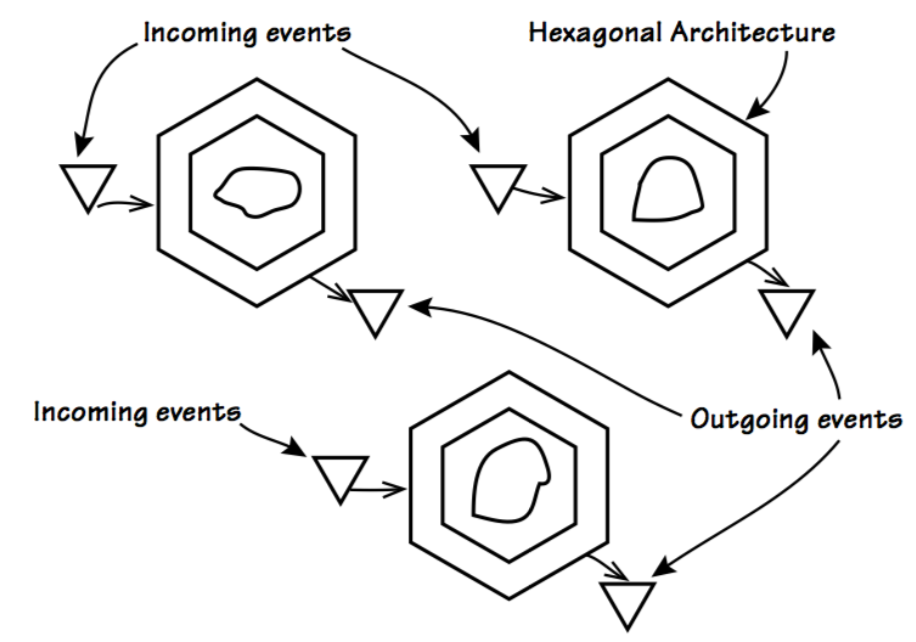
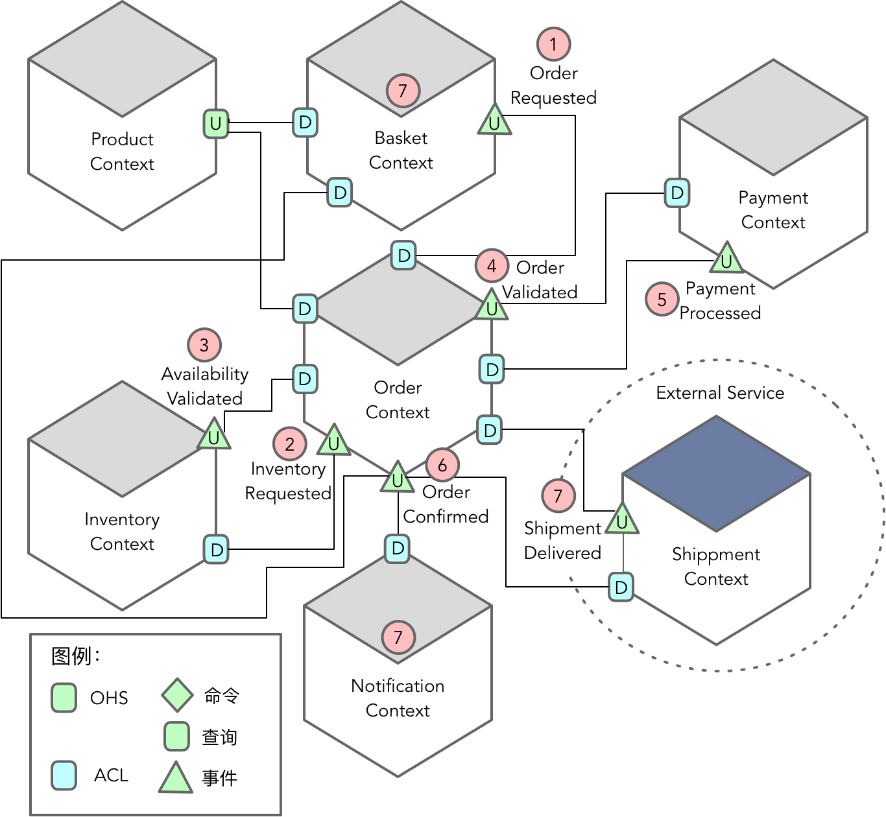

# 027 限界上下文对架构的影响

### 通信边界对架构的影响

限界上下文的通信边界会对系统的架构产生直接的影响，在此之前，我们需要理清几个和边界有关的概念。如前所述，我提出了限界上下文的**通信边界**的概念，并将其分为进程内通信与进程间通信两种方式。在 Toby Clemson 给出的微服务架构中，则将**逻辑边界**视为整个微服务的边界，而将微服务代码模型中的所有模块视为在同一个**网络边界**内。但我认为在引入了虚拟化以及容器技术后，仍将这种边界描述为网络边界似乎并不准确，因此我以**进程边界**来表示前面提到的**通信边界**。

显然，倘若限界上下文之间采用进程间通信，则**每个限界上下文就可以认为是一个微服务**——对于微服务，我更愿意用进程边界来界定代码模型的部署与运行。

无论是网络边界，还是进程边界，都可以视为**物理边界**；而代码模型中对于层以及模块的划分，则属于**逻辑边界**的范畴。逻辑边界有时候会和物理边界重合，但这仅仅是针对代码模型而言。一个系统多数情况下都会访问其物理边界之外的外部资源，如此看来，**一个系统的逻辑边界往往要大于物理边界**。

在进行架构设计时，我们往往会将整个系统的架构划分为多个不同的视图，其中最主要的视图就是**逻辑视图**和**物理视图**，这是我们看待系统的两种不同视角。前者关注代码结构、层次以及职责的分配，后者关注部署、运行以及资源的分配，这两种视图都需要考虑限界上下文以及它们之间的协作关系。在考虑逻辑视图时，我们会为限界上下文履行的职责所吸引，同时又需得关注它们之间的协作，此时，就该物理视图粉墨登场了。若两个限界上下文的代码模型属于同一个物理边界，就是部署和运行在同一个进程中的好哥俩儿，调用方式变得直接，协作关系较为简单，我们只需要在实现时尽可能维护好逻辑边界即可。如果限界上下文代码模型的逻辑边界与物理边界完全重叠，要考虑的架构要素就变得复杂了。

对于跨进程边界进行协作的限界上下文，我建议为其绘制上下文映射，并通过六边形架构来确定二者之间的通信端口与通信协议。上游限界上下文公开的接口可以是基于 HTTP 的 REST 服务，也可以通过 RPC 访问远程对象，又或者利用消息中间件传递消息。选择的通信协议不同，传递的消息格式以及序列化机制也不同，为下游限界上下文建立的客户端也不相同。由于这种协作关系其实是一种分布式调用，自然存在分布式系统与身俱来的缺陷，例如，网络总是不可靠，维护数据一致性要受到 CAP 原则的约束。这时，就需要考虑服务调用的熔断来及时应对故障，避免因单一故障点带来整个微服务架构的连锁反应。我们还需要权衡数据一致性问题，若不要求严格的数据一致性，则可以引入最终一致性（BASE），如采用可靠事件模式、补偿模式或者 TCC（Try-Confirm-Cancel）模式等。当然我们还需要考虑安全、部署和运维等诸多与分布式系统有关的问题，这些问题已经超出了本课程讨论的范围，这里就略过不提了。

### 限界上下文、六边形架构与微服务

如前所述，倘若我们将单个限界上下文代码模型的边界视为物理边界，则可以认为一个限界上下文就是一个微服务。而在前面介绍六边形架构时，我也提到该架构模式外部的六边形边界实则也是物理边界。基于这些前提，我们得出结论：

- 一个限界上下文就是一个六边形，限界上下文之间的通信通过六边形的端口进行；
- 一个微服务就是一个六边形，微服务之间的协作就是限界上下文之间的协作。

显然，在将限界上下文的代码模型边界视为物理边界时，限界上下文、六边形与微服务之间就成了“三位一体”的关系。我们可以将三者的设计原则与思想结合起来，如下图所示：

该图清晰地表达了这种“三位一体”的关系。

- 限界上下文即微服务：我们可以利用领域驱动设计对限界上下文的定义，以及根据前述识别限界上下文的方法来设计微服务。
- 微服务即限界上下文：运用微服务设计原则，可以进一步甄别限界上下文的边界是否合理，对限界上下文进行进一步的演化。
- 微服务即六边形：深刻体会微服务的“零共享架构”，并通过六边形架构来表达微服务。
- 限界上下文即六边形：运用上下文映射来进一步探索六边形架构的端口与适配器角色。
- 六边形即限界上下文：通过六边形架构的端口确定限界上下文之间的集成关系。

我们试以电商系统的购物流程来说明这种“三位一体”的关系。首先，我们通过领域场景分析的用例图来分析该购物流程：

通过对各个用例的语义相关性与功能相关性，结合这些用例的业务能力，可以确定用例的边界。当我们为这些边界进行命名时，就初步获得了如下六个限界上下文：

- Product Context
- Basket Context
- Order Context
- Inventory Context
- Payment Context
- Notification Context

结合购买流程，电商系统还需要用到第三方物流系统对商品进行配送，这个物流系统可以认为是电商系统的外部系统（External Service）。如果这六个限界上下文之间采用跨进程通信，实际上就是六个微服务，它们应该单独部署在不同节点之上。现在，我们需要站在微服务的角度对其进行思考。需要考虑的内容包括如下。

- 每个微服务是如何独立部署和运行的？如果我们从运维角度去思考微服务，就可以直观地理解所谓的“**零共享架构**”到底是什么含义。如果我们在规划系统的部署视图时，发现微服务之间在某些资源存在共用或纠缠不清的情况，就说明微服务的边界存在不合理之处，换言之，也就是之前识别限界上下文存在不妥。
- 微服务之间是如何协作的？这个问题牵涉到通信机制的决策、同步或异步协作的选择、上游与下游服务的确定。我们可以结合**上下文映射**与**六边形架构**来思考这些问题。**上下文映射**帮助我们确定这种协作模式，并在确定了上下游关系后，通过六边形架构来定义端口。

现在我们可以将六边形架构与限界上下文结合起来，即通过端口确定限界上下文之间的协作关系，绘制上下文映射。如果采用客户方—供应商开发模式，则各个限界上下文六边形的端口就是上游（Upstream，简称 U）或下游（Downstream，简称 D）。由于这些限界上下文都是独立部署的微服务，因此，它们的上游端口应实现为 OHS 模式（下图以绿色端口表示），下游端口应实现为 ACL 模式（下图以蓝色端口表示）：

每个微服务都是一个独立的应用，我们可以针对每个微服务规划自己的分层架构，进而确定微服务内的领域建模方式。微服务的协作也有三种机制，分别为命令、查询和事件。Ben Stopford 在文章 [Build Services on a Backbone of Events](https://www.confluent.io/blog/build-services-backbone-events/) 中总结了这三种机制，具体如下。

- **命令**：是一个动作，是一个要求其他服务完成某些操作的请求，它会改变系统的状态，命令会要求响应。
- **查询**：是一个请求，查看是否发生了什么事。重要的是，查询操作没有副作用，它们不会改变系统的状态。
- **事件**：既是事实又是触发器，用通知的方式向外部表明发生了某些事。

发出命令或查询请求的为下游服务，而服务的定义则处于上游。如上图所示，我以菱形端口代表“命令”，矩形端口代表“查询”，这样就能直观地通过上下文映射以及六边形的端口清晰地表达微服务的服务定义以及服务之间的协作方式。例如，Product Context 同时作为 Basket Context 与 Order Context 的上游限界上下文，其查询端口提供的是商品查询服务。Basket Context 作为 Order Context 的上游限界上下文，其命令端口提供了清除购物篮的命令服务。

如果微服务的协作采用事件机制，则上下文映射的模式为发布/订阅事件模式。这时，限界上下文之间的关系有所不同，我们需要识别在这个流程中发生的关键事件。传递关键事件的就是六边形的**端口**，具体实现为消息队列，**适配器**则负责发布事件。于是，系统的整体架构就演变为以**事件驱动架构（Event-Driven Architecture，EDA）风格**构建的微服务系统。Vaughn Vernon 在《实现领域驱动设计》一书中使用六边形架构形象地展现了这一架构风格。

六边形之间传递的三角形就是导致限界上下文切换的关键事件，在领域驱动设计中，作为领域事件（Domain Event）被定义在领域层。为了与限界上下文内部传递的领域事件区分开，我们可以名其为“关键领域事件”，又或者称为“应用事件”，它仍然属于领域模型中的一部分。在前面所示的上下文映射中，我们可以用三角形端口来代表“事件”，事件端口所在的限界上下文为发布者，该事件对应的下游端口则为订阅者。然而，当我们采用“事件”的协作机制时，上下文映射中的上下游语义却发生了变化，原来作为“命令”或“查询”提供者的上游，却成为了“事件”机制下处于下游的订阅者。以购物篮为例，“清除购物篮”命令服务被定义在 Basket Context 中。当提交订单成功后，Order Context 就会发起对该服务的调用。倘若将“提交订单”视为一个内部命令（Command），在订单被提交成功后，就会触发 OrderConfirmed 事件，此时，Order Context 反而成为了该事件的发布者，Basket Context 则会订阅该事件，一旦侦听到该事件触发，就会在 Basket Context 内部执行“清除购物篮”命令。显然，“清除购物篮”不再作为服务发布，而是在事件的 handler 中作为内部功能被调用。

采用“事件”协作机制会改变我们习惯的顺序式服务调用形式，整个调用链会随着事件的发布而产生跳转，尤其是暴露在六边形端口的“关键事件”，更是会产生跨六边形（即限界上下文）的协作。仍以电商系统的购买流程为例，我们只考虑正常流程。在 Basket Context 中，一旦购物篮中的商品准备就绪，买家就会请求下订单，此时开始了事件流。

1. Basket Context 发布 OrderRequested 事件，Order Context 订阅该事件，然后执行提交订单的流程。
2. Order Context 验证订单，并发布 InventoryRequested 事件，要求验证订单中购买商品的数量是否满足库存要求。
3. Inventory Context 订阅此事件并对商品库存进行检查，倘若检查通过，则发布 AvailabilityValidated 事件。
4. Order Context 侦听到 AvailabilityValidated 事件后，验证通过，发布 OrderValidated 事件从而发起支付流程。
5. Payment Context 响应 OrderValidated 事件，在支付成功后发布 PaymentProcessed 事件。
6. Order Context 订阅 PaymentProcessed 事件，确认支付完成进而发布 OrderConfirmed 事件。
7. Basket Context、Notification Context 与 Shipment Context 上下文都将订阅该事件。Basket Context 会清除购物篮，Notification Context 会发起对买家和卖家的通知，而 Shipment Context 会发起配送流程，在交付商品给买家后，发布 ShipmentDelivered 事件并被 Order Context 订阅。

整个协作过程如下图所示（图中的序号对应事件流的编号）：

与订单流程相关的事件包括：

- OrderRequested
- InventoryRequested
- AvailabilityValidated
- OrderValidated
- PaymentProcessed
- OrderConfirmed
- ShipmentDelivered

我们注意到这些事件皆以“过去时态”命名，这是因为**事件的本质是“事实（Fact）”**，意味着它是过去发生的且不可变更的数据，代表了某种动作的发生，并以事件的形式留下了足迹。

正如前面给出的事件驱动架构所示，事件的发布者负责触发输出事件（Outgoing Event），事件的订阅者负责处理输入事件（Incoming Event），它们作为六边形的事件适配器，也就是我所说的网关，被定义在基础设施层。事件适配器的抽象则被定义在应用层。假设电商系统选择 Kafka 作为事件传递的通道，我们就可以为不同的事件类别定义不同的主题（Topic）。此时，Kafka 相当于是连接微服务之间进行协作的事件总线（Event Bus）。Ben Stopford 将采用这种机制实现的微服务称为“事件驱动服务（Event Driven Services）”。

通过电商系统的这个案例，清晰地为我们勾勒出限界上下文、六边形与微服务“三位一体”的设计脉络，即它们的设计思想、设计原则与设计方法是互相促进互相融合的。在架构设计层面上，三者可谓浑然一体。