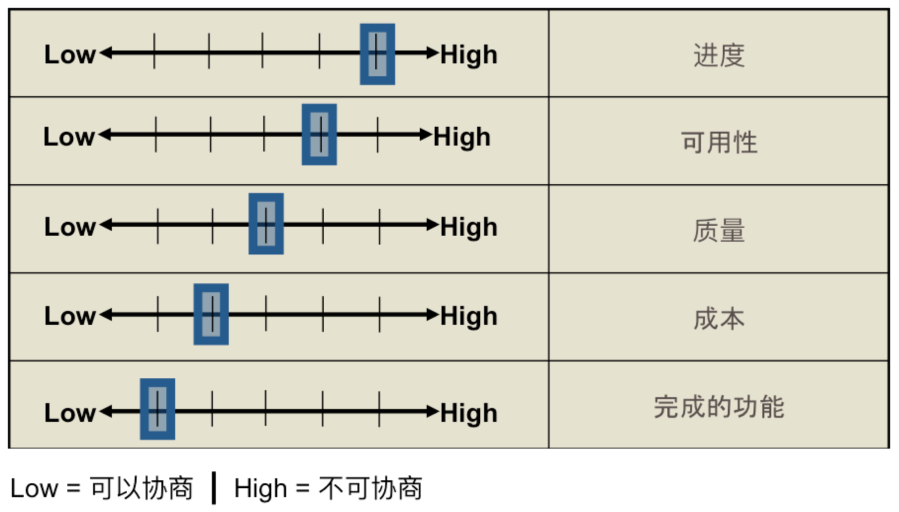
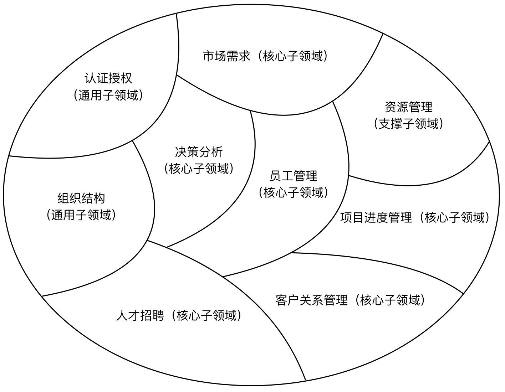
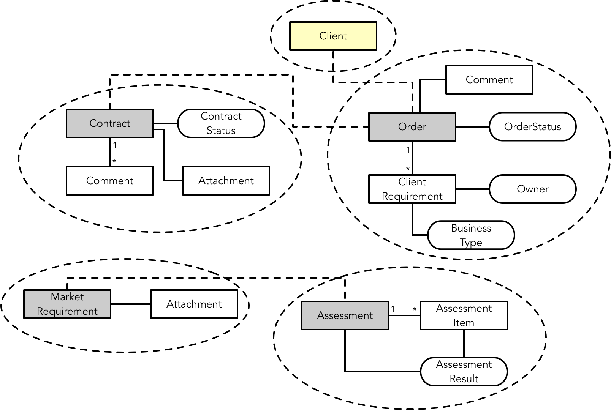
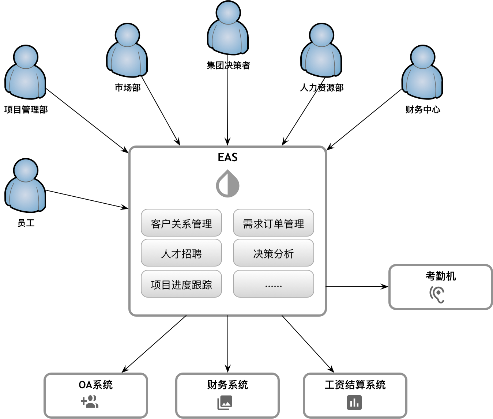
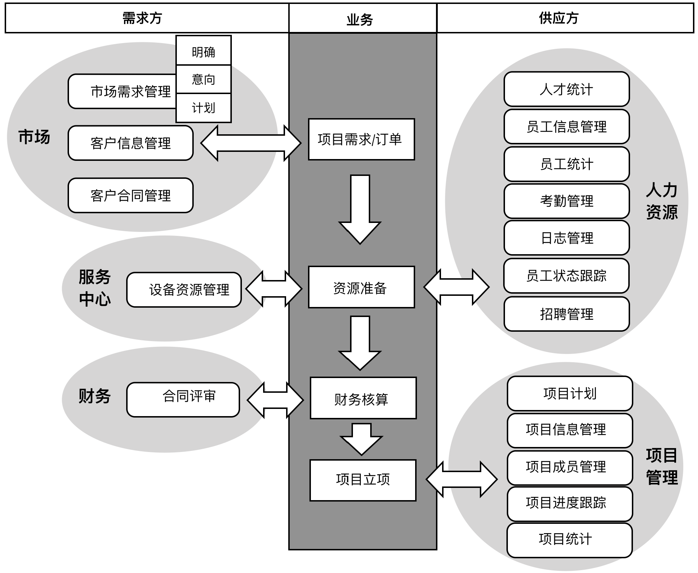
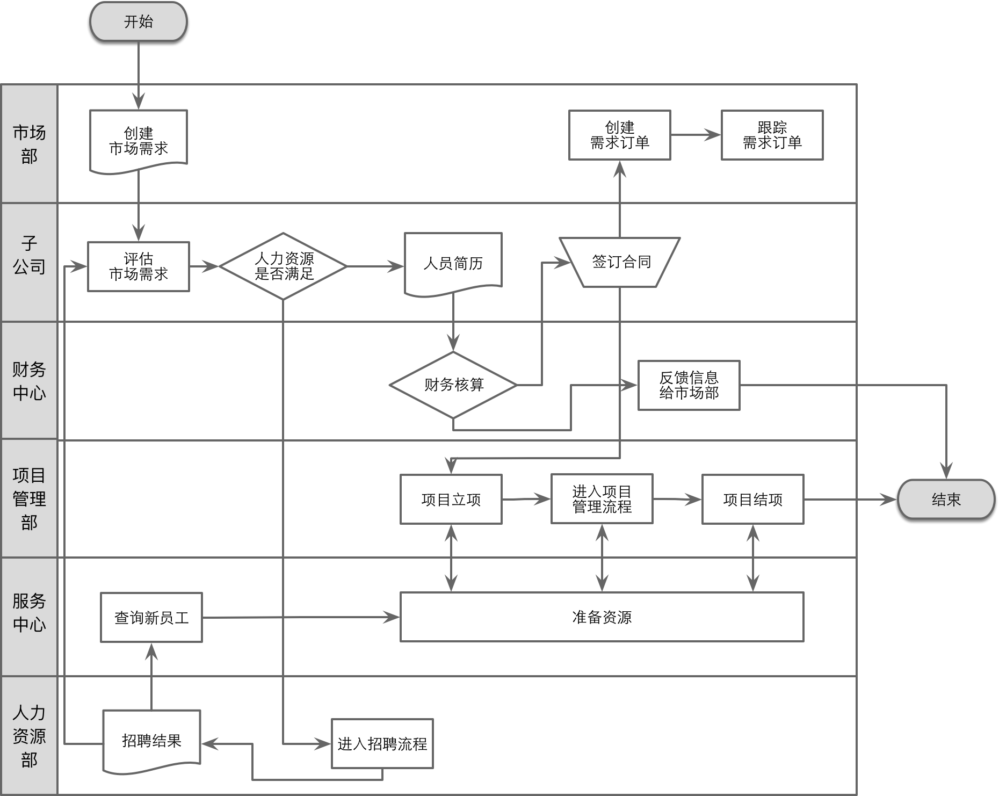

# 030 实践 先启阶段的需求分析

从本课开始，我将通过一个完整的真实案例 EAS 系统来展示领域驱动的战略设计过程。通过 EAS 项目，我会把前面讲解的各个知识点贯穿起来，作为实践领域驱动设计的参考设计过程呈现出来。在这个战略设计过程中，曾经因为未曾识别出项目的业务愿景而让需求分析走了一段较长的弯路；因为没有就领域概念形成统一语言，而导致领域建模出现偏差；限界上下文的识别也经历了反复迭代与修改，并经历了领域驱动架构的演进，直至获得相对稳定的领域模型与代码模型。限于篇幅，我无法呈现整个设计过程的完整全貌，但也尽可能将设计过程中遭遇的典型问题、做出的设计决策进行了阐述，并给出了部分设计结果作为参考。

> 通过访问 GitHub 上的 [eas-ddd 项目](https://github.com/agiledon/eas-ddd) 获得该项目的介绍与源代码，访问 [eas-ddd 项目的 Wiki](https://github.com/agiledon/eas-ddd/wiki) 可以获得 EAS 项目的需求与项目概况，限界上下文划分；访问[问题列表](https://github.com/agiledon/eas-ddd/issues)可以获得该项目的任务列表。

### 背景：企业应用套件

企业应用套件（Enterprise Application Suite，EAS）是一个根据软件集团公司应用信息化的要求而开发的企业级应用软件。EAS 系统提供了大量简单、快捷的操作接口，使得集团相关部门能够更快捷、更方便、更高效地处理日常事务工作，并为管理者提供决策参考、流程简化，建立集团与各部门、员工之间交流的通道，有效地提高工作效率，实现整个集团的信息化管理。

EAS 系统为企业搭建了一个数据共享与业务协同平台，实现了**人力资源**、**客户资源**与**项目资源**的整合，系统包括人力资源管理、客户关系管理和项目过程管理等主要模块。系统用户为集团的所有员工，但角色的不同，决定了他们关注点之间的区别。

### 实施先启阶段

先启阶段是软件开发生命周期的准备阶段，力求通过较短的周期让开发团队与客户就系统范围、愿景与目标、主要需求、风险与问题、技术架构和发布迭代计划达成共识。在领域驱动设计过程中，可以将先启阶段当做是需求捕获、场景分析与建立统一语言的一种敏捷实践。

#### 确定利益相关人

在制定先启计划时，我们需要先确定利益相关人，EAS 涉及到的组织部门包括人力资源部、市场部、项目管理部、服务中心、财务中心以及各子公司。因此，除了开发团队之外，利益相关人就包括整个集团的决策层，相关部门的负责人与具体操作 EAS 系统的集团员工。在先启阶段执行相关活动时，我们会根据这些活动的情况邀请对应的利益相关人。

#### 制订先启计划

先启阶段是一个重要的项目开发环节，也可以视为一个特殊的迭代。尤其是先启阶段需要协调利益相关人和开发团队之间的交流与协作，就需要积极地将利益相关人引入到整个先启阶段，参与具体的先启活动。为此，我们需要事先制订一个明确的先启计划，并与利益相关人确定活动（会议）时间，保证这些提供重要输入的利益相关人都能准时参加。

EAS 先启计划（仅列出与需求分析有关的活动）如下所示：

| 活动     | 活动项目               | 集团决策层 | 子公司负责人 | 人力资源部 | 市场部 | 项目管理部 | 服务中心 | 财务中心 | 项目经理 | 需求分析师 | 技术负责人 |
| :------- | :--------------------- | :--------- | :----------- | :--------- | :----- | :--------- | :------- | :------- | :------- | :--------- | :--------- |
| 启动会议 | 项目介绍               | X          | X            | X          | X      | X          | X        | X        | X        | X          | X          |
| 启动会议 | 确定业务期望和愿景     | X          | X            | X          | X      | X          | X        |          | X        | X          |            |
| 启动会议 | 优先级权衡             |            | X            | X          | X      | X          | X        |          | X        |            |            |
| 需求     | 对问题域的共同理解     |            | X            | X          | X      | X          | X        | X        | X        | X          | X          |
| 需求     | 确定项目的业务范围     |            | X            | X          | X      | X          | X        |          | X        | X          | X          |
| 需求     | 确定业务流程           |            | X            | X          | X      | X          | X        | X        | X        | X          | X          |
| 需求     | 确定史诗级故事与主故事 |            |              |            |        |            |          |          | X        | X          | X          |

#### 确定业务期望和愿景

在确定业务愿景时，我们一开始重点调研了人力资源部、市场部与项目管理部的相关人员，他们都是识别出来的利益相关人。每个部门的员工都向我们提出了切合他们实际需要的业务功能，这些功能包括：

- 市场部对客户和需求的管理，对合同的跟踪；
- 项目管理部对项目和项目人员的管理，对项目进度的跟踪；
- 人力资源部负责招聘人才，管理员工的日常工作包括工作日志、考勤等。

然而，随着需求的越来越多，我们反而越来越迷茫，仿佛迷失在一张巨细无靡的需求大网中。这张网没有放过任何可能溜走的需求，可需求的详尽非但没有呈现出清晰的业务目标，反而越发的不明朗。看起来，我们撒出了一张威能强大的网，可惜选错了捕捉鱼虾的水域。

我们需要**确定系统的业务期望与愿景**，而不是从一开始就沉入到如蛛丝一般细而密的需求细节中。**重要的利益相关人是集团管理层**，他们只关注整体需求与系统目标，至于各个细节的功能不过是为了完成这一目标才提供的功能支持罢了。这正是先启阶段需要开展的需求活动，正如在[第 1-6 课]中所说：“需要确定项目的利益相关人，并通过和这些利益相关人的沟通，确定系统的业务期望与愿景。在期望与愿景的核心目标指导下，**团队与客户才可能就问题域达成共同理解**。”

通过与集团决策层领导的沟通交流，我们最终确定了整个系统的业务期望与愿景：“**避免信息孤岛，实现人力资源的可控，从而达到人力资源的供需平衡。**” 例如，客户需要集团提供 20 名各个层次的 Java 开发人员，则市场部门在确定是否签订该合同之前，需要通过 EAS 查询集团的人力资源库，了解现有的人力资源是否匹配客户需求。如果匹配，还需要各个参与部门审核人力成本，决定合同标的；如果集团当前的人力资源无法满足客户需求，就需要人力资源部提早启动招聘流程，或从人才储备库中寻找到满足需求的候选人。通过 EAS，管理人员还能够及时了解开发人员的闲置率，跟踪项目的进展情况，明确开发人员在项目中承担的职责和任务完成质量。

当我们与客户就这个业务期望与愿景达成共识后，它就成为了整个需求分析与建模阶段最重要的指导原则。当我们需要判断某个需求是否有业务价值时，可以参考这一指导原则；当我们无法识别不同用户故事的优先级时，可以借鉴这一指导原则；当我们需要确定核心领域与子领域时，我们可以遵循这一指导原则，这一指导原则可以视为是**团队与客户就问题域达成的共同理解**。

#### 优先级权衡

在面对客户源源不断提出的需求时，最难做出决策的是确定这些需求的优先级。如果是业务需求，我们应该基于系统的业务期望与愿景，判断这些业务需求与实现该愿景的关联程度，并以此来作为优先级的衡量标准。如果是质量属性又或者是管理上的要求，就需要客户和我们一起给出高屋建瓴般的权衡标准。

一种比较好的实践是采用所谓的“价值滑条（Value Slider）”，即基于该需求协商谈判的可能性高低，列出所有的质量属性需求与管理要求，由客户来做出判断。若协商谈判的可能性高，则说明该需求是可以协商的，可以做出让步的，则滑条向左，意味着优先级低；若协商谈判的可能性低，就说明不可商量，没有妥协的余地，滑条向右，意味着优先级高。在由客户确定每条需求处于这个“价值滑条”的位置时，有一个约束是：任何两个或两个以上的需求对应的滑条都不能出现在同一列上，如下图所示：

如果需求对应的滑条可能出现在同一列，就需要客户做出权衡和决策，强迫他们移动滑条的位置，这就意味着调整了它们的优先级。上图作为 EAS 的“价值滑条”，意味着我们必须在规定的“最终期限”交付可用的产品，但是我们可以根据对功能的排期，优先实现高优先级的主要功能，同时也可以在人力不足或周期紧张的情况下，增加人手，并适度降低产品质量。

#### 对问题域的共同理解

在先启阶段，对问题域（Problem Solution）的识别其实就是对客户痛点的识别。之所以要开发这个软件，目的就是解决这些痛点，为应对这些问题提供具有业务价值的功能。在识别痛点的过程中，需要**始终从业务期望与愿景出发**，与不同的利益相关人进行交流，如此才能达成对问题域的共同理解。

对于集团决策层，要解决“供需平衡”这个痛点，就需要及时了解我们面临哪些客户需求，目前有哪些人力资源可用，这就需要打破市场部、人力资源部与项目管理部之间的信息壁垒，对市场需求、人力资源、项目的信息进行统计，提供直观的分析结果，进而根据这些分析结果为管理决策提供支持。

市场部员工面临的痛点是如何与客户建立良好的合作关系，快速地响应客户需求，敏锐地发现潜在客户，掌握客户动态，进而针对潜在客户开展针对性的市场活动。市场部员工希望能够建立快速通道，及时明确项目承担部门（即子公司）是否能够满足客户需求，降低市场成本。市场部门还需要准确把握需求的进展情况，跟踪合同签署流程，提高客户满意度。

人力资源部员工（招聘专员）的痛点是如何制订合理的招聘计划，使得招聘的人才满足日益增长的客户需求，又不至于产生大量的人力资源闲置，导致集团的人力成本浪费。站在精细领域的角度考虑，从潜在的市场需求开始，招聘专员就需要与市场部、子公司共同确定招聘计划，制定计划的依据在于潜在的人力资源需求，包括对技能水平的要求、语言能力的要求，同时也需要考虑目前子公司的员工利用率，并参考历史的供需关系来做出尽可能准确的预测。

由于集团的项目类型复杂，特别牵涉到外派项目，项目成员不在公司集团内部，对人员的管理成为项目管理部的核心问题。此外，跟踪和了解项目进度不仅仅是项目管理人员的诉求，市场部同样关心，因为这牵涉到他们与客户的合作关系，并影响到客户满意度。

针对前面对客户痛点的分析，围绕“供需平衡”这一业务期望与愿景，我们可以将 EAS 划分为如下核心子领域：

- 决策分析
- 市场需求管理
- 客户关系管理
- 员工管理
- 人才招聘
- 项目进度管理

除了这些核心子领域外，诸如组织结构、认证与授权都属于通用的子领域，每个核心子领域都需要调用这些子领域提供的功能。注意，通用子领域提供的功能虽然不是系统业务的核心，但缺少这些功能，业务却无法流转。之所以没有将其识别为核心子领域，实则是通过对问题域的理解分析得来。例如，组织结构管理是保证业务流程运转以及员工管理的关键，用户的认证与授权则是为了保证系统的访问安全，但它并没有直接对“供需平衡”这一业务愿景提供业务价值，在前面的痛点分析中，它们也不是利益相关人亟待解决的痛点。

在分辨系统的利益相关人时，服务中心作为参与 EAS 的业务部门，主要是为项目及项目人员提供工位和硬件资源。它要解决的是资源分配的问题，虽然在某种程度上可以降低运营成本，但却与我们确定的业务愿景没有直接的关系。因此我们将该子域作为一种支撑子领域。

通过先启阶段对客户痛点的分析，我们形成了对 EAS 问题域的共同理解：

##### 问题域对统一语言的影响

当我们在分辨**市场需求管理**这个问题域时，我们认为有几个领域概念是模糊不清的，即合同（Contract）、市场需求（Market Requirement）、客户需求（Client Requirement），它们三者之间的关系是什么？究竟有什么样的区别？如果不为它们建立一个达成一致共识的统一语言，就有可能影响该问题域的领域模型。

通过与市场部员工的交流，我们发现市场部对这些概念也是模糊不清的，甚至在很多场景中交替使用了这些概念，而没有一个清晰的定义。在与市场部人员的交谈过程中，他们有时候还提到了“市场需求订单”这个概念。例如，在描写市场需求时，他们会提到“录入市场需求”，但同时又会提到“跟踪市场需求订单”和“查询市场需求订单”。在讨论“客户需求”时，他们提到需要为其指定“承担者”，而在讨论“市场需求”时，却从未提及这一功能。这似乎是“客户需求”与“市场需求”之间的区别。对于“合同”的理解，他们一致认为这是一个法律概念，等同于集团或子公司作为乙方和作为甲方的客户签订的合作协议，并以合同要件的形式存在。

鉴于这些概念存在诸多歧义，我们和市场部人员一起梳理统一语言，一致认为需要引入“订单（Order）”的概念。**订单**不是需求（无论是客户需求还是市场需求），而是借鉴了电商系统中订单的概念，把客户提出的项目合作视为订单的商品。“客户提出的项目合作”其实就是“客户需求”，相当于是“订单”中的订单项。一个订单可以包含多个“客户需求”，例如，同一个客户可能提出三条需求：

- 需求1，需要 5 名高级 Java 程序员、10 名中级程序员
- 需求2，需要 8 名初级 .NET 程序员
- 需求3，需要开发一个 OA 系统

虽然是同一个客户，且向市场部同时提出了这些需求，但毫无疑问，这应该是三个不同的需求。但从“订单”的角度来说，这些客户需求都属于同一个订单。这与一个销售订单可以包含多个不同订单项是相似的。当然，一个订单到底包含哪几个客户需求，取决于市场部与客户洽谈合作的业务背景。例如我们也可以将前面提到的需求1和需求2放入到一个订单中，而把需求3单独放到另一个订单。

在引入“订单”概念后，市场需求与客户需求的区别也就一目了然了。市场需求是市场部售前人员了解到的需求，并未经过评估，公司也不知道能否满足需求，以及该需求是否值得去做。这也是为何市场需求无需指定“需求承担者”的原因。市场需求在经过各子公司的评估以及财务人员的审核后，就可以细化该市场需求，并经过与客户充分沟通后，最后形成**订单**。这个订单形成了一个初步合作意向，评估通过的每一条市场需求，则转换为订单中的客户需求。

我们仍然保留了“合同”的概念。“合同”领域概念与现实世界的“合同”法律概念相对应，它与订单存在相关性，但本质上并不相同。例如，一个订单中的每个客户需求可以由不同的子公司来承担（Owner），但合同却需要明确甲方和乙方。订单并没有合同需要的那些法律条款。未签订的合同内容确实有很大部分来自订单的内容，但也只是其中商务合作内容的一部分而已。在确定了订单后，市场部人员可以跟踪订单的状态，并且在订单状态发生变更时，修改对应的合同状态。显然，合同的状态与订单的状态并不一致。

在我们引入“订单”这个概念后，市场需求管理这个问题域就发生了细微的变化。我们可以将这个问题域更名为订单，也可以将订单领域概念视为解决方案域的组成部分，继续保留市场需求管理这个问题域，而将订单视为限界上下文。

在先启阶段，我们不一定需要领域建模。不过，当我们在识别问题域时发现领域概念无法形成统一语言时，确实可以就领域概念的定义展开讨论与分析。若发现仍有不清晰的地方，就可以通过可视化的领域模型来打消开发团队与领域专家包括客户在概念认知上的不一致。例如，我们针对市场需求问题域建立了如下的领域模型：

这个领域模型非常清晰地表达了订单（Order）与客户需求（Client Requirement）的一对多关系，且客户需求是放在了订单的聚合边界内。合同（Contract）是一个单独的领域概念，但它与订单存在一个弱关联关系。市场需求（Market Requirment）在通过评估（Assessment）后它会成为订单的一个输入，转换为客户需求。在这个领域模型中，我们可以直观地看到客户需求需要指定承担者（Owner），同时订单还会和客户关系管理问题域中的客户（Client）产生关联。显然，这样清晰表达的领域模型有助于我们和领域专家（客户）的沟通，进而针对这些领域概念达成共识，形成统一语言。

#### 确定项目的业务范围

之所以要确定项目的业务范围，是为了明确整个系统的边界。明确系统边界是架构设计的重要前提，它一方面可以明确职责划分，了解哪些内容才属于领域驱动设计的范畴；另一方面则可以事先明确当前系统需要与哪些外部系统集成。

EAS 是软件集团公司的信息化平台，但这个信息化平台是为了解决项目开发的“供需平衡”，因此它围绕着市场需求、人力资源和项目开发为需求主线，其他的信息化产品，如办公自动化（OA）系统、财务系统、工资结算系统等都会作为外部系统与 EAS 的功能集成。明确了这样的业务范围有助于我们甄别需求的边界，并做到功能的收敛。在识别系统的史诗级故事与主故事时，也应该确保这个业务范围边界，同时这个业务范围还会影响到发布与迭代计划的制订。

确定项目的业务范围还有助于架构层面的考量，通常，我建议引入 C4 模型的系统上下文（System Context）来体现系统的边界。EAS 的系统上下文如下所示：

确定了系统上下文后，可以为后续的上下文映射提供重要参考，如上图所示的 OA 系统、财务系统与工资结算系统可以被视为第三方服务而与 EAS 的限界上下文产生协作。依赖的方向决定了我们选择上下文协作的模式。而系统上下文中的考勤机则会作为 EAS 访问的外部资源，需得做好系统与该机器设备的抽象与隔离。

#### 确定业务流程

在明确了系统的业务愿景，并就问题域达成共同理解后，我们还需要让主要的业务功能“动”起来。这就需要确定业务流程，因为它可以更好地体现完整全面的领域场景，突出参与者（部门）与用例之间的协作。

在先启阶段，没有必要将整个系统的所有业务流程都绘制出来，重点是抓住体现业务愿景这个核心价值的主流程。既然 EAS 以“人力资源的供需平衡”为关注核心，因此所有参与方需要执行的主要功能都与该核心价值有关。通过梳理需求，开发团队在与客户充分交流后，**抽象出需求方、供应方这两个核心参与者**，从而绘制出供需双方的协作示意图：

这个协作示意图非常清晰地体现了需求与供应之间的关系，展现了这个核心流程的关键环节。注意，这个协作示意图并非项目开始之前的当前状态（As-Is），而是期望解决供需平衡问题的将来状态（To-Be）。这种协作关系正好体现了打破部门之间信息壁垒的愿望。由此，我们就可以绘制出整个系统的核心流程：

作为核心流程的子流程，项目管理流程与招聘流程是更低一级的业务流程。在先启阶段，如果为了获得更加准确的主故事列表，仍然有必要进一步细化这些子流程。从敏捷开发的角度讲，我们也可以将这些流程的细化放到对应迭代的需求分析活动中，以便于尽快完成先启阶段，进入到项目的正式迭代阶段。毕竟在确定了产品的待办项（史诗级故事与主故事）之后，已经足以帮助团队确定发布与迭代计划了。