# 032 实践 先启阶段的领域场景分析（下）

### 如何有效地识别参与者的用例

前述内容通过用例形式将所有的主故事都转换成了与参与者有关的用例，那么，在识别用例时，是否有什么经验可循呢？

#### 用例关系的确定

一个用例图，往往体现了参与者与用例之间的使用关系，用例与用例之间的包含或扩展关系，有时候还存在用例之间的泛化关系，确定用例之间的关系很重要。**在识别用例时，思考参与者与用例之间的关系会成为一个不错的设计起点。\**尤其在先启阶段，我们识别的用例体现了 Cockburn 提出的用例层次中的\**用户目标**层，这恰好对应用例与参与者的“使用（Use）”关系。从领域场景分析的角度看，这个使用关系代表了业务价值。在确定了参与者后，你就可以结合主故事与领域场景，询问自己：“在这个领域场景下，该参与者的用户目标是什么？”由此，可以帮助我们确定该用例是否主用例。

正如对项目用例图中的分析，如果考虑编码实现的本质，则问题所属迭代、承担人以及问题状态都是问题（Issue）的属性；然而在用例图中，我却以“指定问题所属的迭代”、“分配问题给项目成员”、“更新问题状态”此三个主用例与“编辑问题信息”平级，因为它们在项目管理中都具有不可替代的业务价值。

与之相反，包含用例与扩展用例是为具有业务价值的主用例提供支持和服务的，识别它们既可以丰富和完善业务逻辑，又可以在后续的用例边界找到属于通用子领域或支撑子领域的业务内容。**这些不直接提供业务价值的用例恰好可能组成单独的限界上下文**。例如，在前面给出的诸多用例图中，诸如“上传附件”、“通知评估人”等用例主要以扩展用例的形式呈现，这些扩展用例体现了各自内聚的关注点，即文件共享与消息通知。

包含用例与扩展用例之间的区别在于两个用例之间的“粘性”。**包含用例为主用例不可缺少之业务环节**，如“指定项目经理”包含用例之于“立项”主用例，如果缺少了指定项目经理操作，立项就是不完整的。**扩展用例为主用例功能之补充**，如“通知立项”扩展用例之于“立项”主用例，即使没有通知立项的相关干系人，也不妨碍立项工作的完成。作为包含用例或扩展用例本身，又可以有属于自己的包含用例或扩展用例，例如“通知项目经理”对“指定项目经理”的扩展：

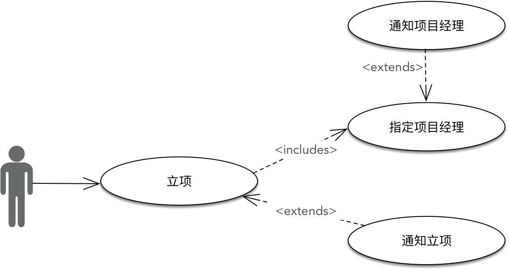

从功能相关性看，“立项”与“指定项目经理”用例是强相关的，“通知立项”与“立项”用例是弱相关的。因此，**对包含和扩展用例的识别往往会影响到后续对限界上下文的识别。**

在识别用例图时，还要注意避免错误的用例关系识别。例如，在项目管理用例图中，团队最初为项目成员参与者识别出“接收问题分配”用例。结合业务场景对此进行检验：当项目经理将问题分配给项目成员后，在业务上确乎存在接受问题的行为；但该行为其实是一个线下行为，属于项目成员之间的一个口头表达；当问题分配给项目成员之后，就已经意味着该问题已经被项目成员接受。因此，这个用例是不合理的。

#### 用例名应字斟句酌

在领域场景分析过程中，如果我们只满足于用例图的获得，无异于买椟还珠。用例图仅仅是我们获得的分析结果，但更重要的是我们获得用例图的过程，这其中的关键在于团队与领域专家的交流与合作。作为UML（Unified Modeling Language，统一建模语言）组成部分的用例图，已经得到行业的认可。无论是没有技术背景的领域专家，还是没有业务背景的技术专家，都能很好理解用例图这种可视化的建模语言。

用例名是领域知识的呈现，更是统一语言的有效输入。用例名应采用动宾短语，描述时须字斟句酌，把握每一个动词和名词的精确，动词是领域行为的体现，名词是领域概念的象征，进而这些行为与概念就能再借助领域模型传递给设计模型，最终通过可读性好的代码来体现。当然，在给出中文用例的同时，还应提倡以英文来表述，毕竟在最终的代码层面，还是用英文来“说话”。

在项目管理用例图中，我们最初给出的用例为“查看问题完成情况”，但在项目管理领域，所谓“问题完成情况”仅仅体现了问题的状态，却没有清晰地表达问题在迭代周期内的过程。准确的术语是“进度（Progress）”，命名为“跟踪问题进度（Tracking Issue Progress）”更加符合该领域的统一语言。在最初识别用例时，对于“创建问题”的包含用例而言，最初命名为“问题检查”。这个描述未遵循动宾短语的形式，而“检查”一词也容易带来歧义，会错以为是项目成员检查问题的完成情况，实则是对创建的问题进行合规性验证，更名为“验证问题有效性”更为合理。

再以员工管理用例图中的“提交工作日志”为例。企业的内部术语为“日志报工”，若以统一语言的角度讲，似以“日志报工”用例名为佳。然而在英文中，并无“报工”的恰当翻译，更为人接受的英文名为“Submit Work Log”，因而用例还是应命名为“提交工作日志”。

显然，通过对用例的不断打磨，对存有疑惑的用例，通过可视化的用例图与领域专家不断沟通，借助用例规格的设计指导，可以帮助我们发现问题，并进一步挖掘出准确的领域术语，建立系统的统一语言，并为后续识别限界上下文以及领域建模奠定基础。

### 识别用例的主题边界

在绘制用例图时，除了参与者、用例以及用例之间的关系外，还有一个非常重要的要素：主题边界（Subject Boundary）。**主题边界**包含了一组高内聚的用例，并需要设计者为这个边界确定一个主题（Subject）。显然，主题的确定恰好就是对用例的归类，至于归类的原则，正是[第 3-4 课 识别限界上下文]中提及的两个方面：

- 语义相关性
- 功能相关性

#### 语义相关性

通过语义相关性来判别用例是否存在高内聚，是一种业务分析手段。就好像我们整理房间一般，相同类别的物品会整理放在一处，例如衣服类，鞋子类，书籍类……每个类别其实就是所谓的“主题（Subject）”。在前面识别用例时，我就要求针对用例名要字斟句酌。用例名通常为动宾短语，宾语往往体现了领域概念。显然，在用例名中如果包含了相同领域概念，就可以认为是语义相关的，就可能归类到同一个主题中。

在识别用例的主题边界时，我抛开了用例图的约束，选择将用例图直接以主题边界进行划分，不再继续保留参与者与用例、以及用例之间的关系。如下图是对合同（Contract）主题的识别：

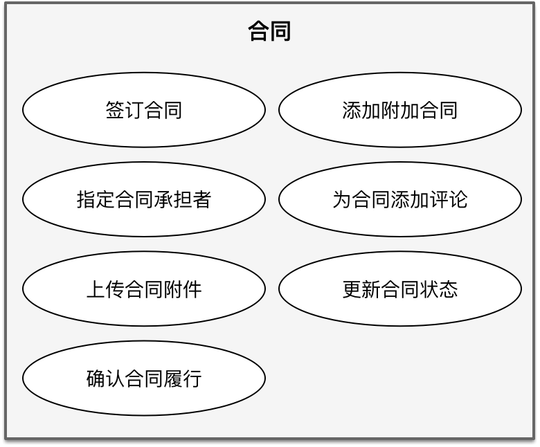

这种对用例的可视化方式可以认为是用例图的另一种视图，即“主题视图”，主要表现用例的分类和相关性，属于领域场景分析中的 Where 要素；而之前给出的用例图则为**参与者视图**，表现了参与者、用例之间的协作关系，属于领域场景分析中的 Who、Why 与 What 要素。两种不同的用例视图可以提供不同的参考价值，同时又保障了用例可视化的清晰度。

仔细分析合同的主题视图，我们发现在这个主题边界中的所有用例，用例名都包含了“合同（Contract）”这个领域概念，这就是所谓的“语义相关性”。有时候，这种语义相关性并没有这么直接，需要就领域概念的共同特征进行归纳，例如，市场（Marketing）主题：

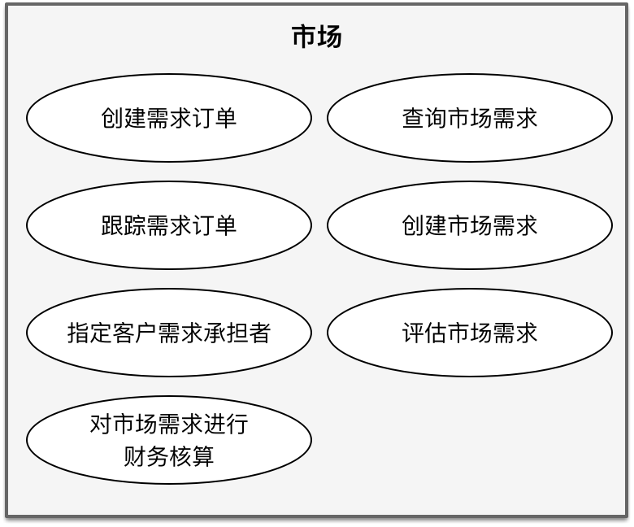

在这个主题中，包括了市场需求、需求订单、客户需求等领域概念，我们却不能分别为其建立主题，毕竟这样建立的主题太过散乱而细碎。这时，就需要针对领域概念，建立抽象，即**寻找这些领域概念的共同特征**。显然，无论是市场需求，还是经过评估后形成的订单及客户需求，都是为一种更高的抽象层次“市场”服务的。

通过语义相关性判断用例的归属时，一个用例有可能包含两个语义，这时就需要判断语义与主题相关性的强弱。例如，“从储备人才转为正式员工”用例，究竟属于储备人才主题，还是员工主题？判断语义的相关性强弱时，可以依据用例的业务价值或用户目标，应优先考虑满足用户目标的语义。显然，“从储备人才转为正式员工”用例的用户目标是生成员工记录，储备人才的信息仅仅作为该领域行为的输入，答案不言而喻。

#### 功能相关性

领域概念是名词，而用例则是动词，表达了一种领域行为。在确定用例的主题边界时，如果我们发现一些用例虽然在领域概念上没有明显的语义相关性，但**它们却服务于一个共同的用户目标或业务价值**，则说明它们是**功能相关**的。例如，考勤（Attendance）主题：

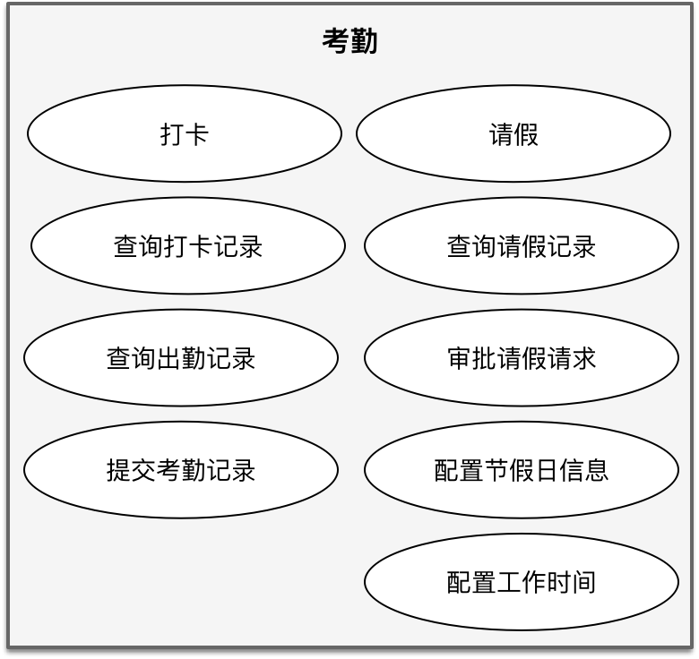

**功能相关性**还体现于用例之间的关联与依赖，在用例图中，主要以用例关系的包含、扩展与泛化来体现。例如，人事专员用例图：

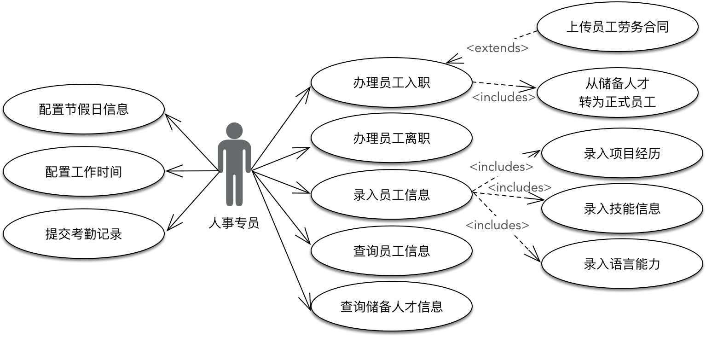

与员工管理功能相关的子用例包括：

- 上传员工劳务合同
- 从储备人才转为正式员工
- 录入项目经历
- 录入技能信息
- 录入语言能力

那么，员工主题就应该包含以上功能相关的用例：

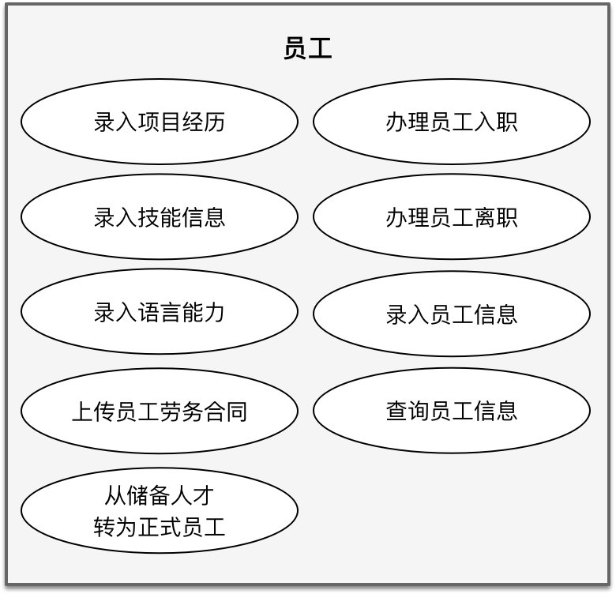

在确定用例之间关系时，我提到了包含与扩展不同的“粘度”。在确定功能相关性时，尤其要特别关注主用例的扩展用例。根据我的经验，大多数扩展用例提供了不同于主业务视角的关注点，而这些关注点往往在支撑子领域场景中提供了共同的业务价值，可以对它们做进一步抽象。在 EAS 中，这样的扩展用例主要体现在两个方面：文件上传与下载、消息通知，故而可以为其分别建立主题边界：文件共享（File Sharing）与通知（Notification）。

注意文件共享与通知主题中的用例名，描述了与具体领域场景无关的通用业务。例如，在招聘专员用例图中，定义了“上传储备人才简历”和“通知招聘计划审核人”两个用例，它们实际上分别对应了“上传 Word 文件”与“发送通知电子邮件”、“发送站内信息”用例。之所以这样描述用例名，是因为这两个主题可能会为通过其他主题提供业务支撑，一旦具体化，就无法满足通用要求。

文件共享和通知主题中的用例并没有出现在之前识别的用例图中。通过参与者识别用例图时，我们是根据先启阶段识别出来的核心业务流程、史诗级故事与主故事，并通过设想参与者参与的领域场景，进而驱动得出这些用例。文件共享和通知主题中的用例则是通过寻找所有的扩展用例，进而归纳出它们的共同特征。这是两种迥然不同的用例分析方法。

#### 设计的决策

无论是寻找领域概念的共同特征，还是识别用例行为的用户目标，都需要一种抽象能力。在进行抽象时，可能出现“向左走还是向右走”的困惑。这是因为抽象的层次可能不同，抽象的方向或依据亦有所不同，这时就需要做出**设计上的决策**。例如针对用例中识别出来的“员工”与“储备人才”领域概念，我们可以抽象出“人才”的共同特征，从而得到人才（Talent）主题：

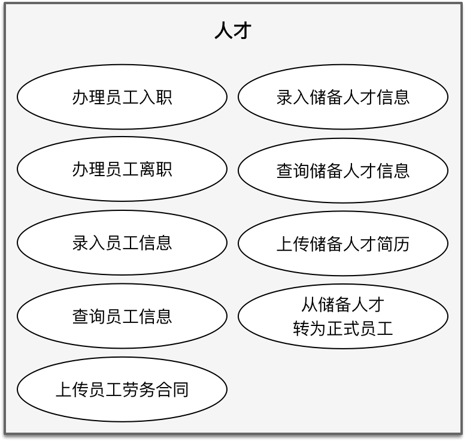

然而从共同的用户目标考虑，储备人才又是服务于招聘和面试的，似乎归入招聘（Recruiting）主题才是合理的选择：

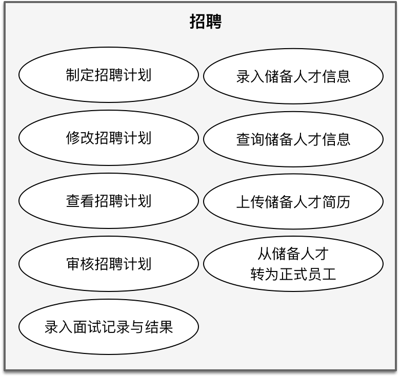

实际上还有第三种选择，就是将储备人才单独抽离出来，形成自己的“储备人才（Candidate）”主题：

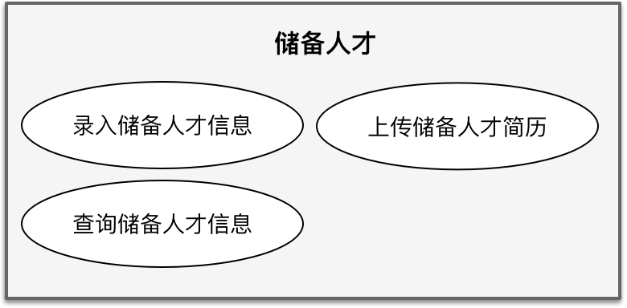

该如何抉择呢？我认为须得思考为什么要识别主题边界？显然，这里识别的主题边界仅仅是设计过程中的中间产物，并非我们最终的设计目标。主题边界是对用例的分类，在用例图中体现了用例的边界，而这种边界恰好可以对应领域模型的限界上下文，并为设计模型的包、模块提供设计指导。因此，究竟为人才主题，还是招聘主题，或者单独的储备人才主题，完全可以从限界上下文或者领域建模的角度去思考。

#### 主题边界体现用例的内聚性

**主题边界并不以边界内用例的多寡为设计准则。\**至少在进行领域场景分析时，不要因为一个主题边界包含了太多的用例，就人为地对其进行更细粒度的拆分，关键还是要\**考察用例的内聚性**。例如与项目管理有关的主题，包含的用例数量就非常不均匀。项目（Project）主题包含的用例为：

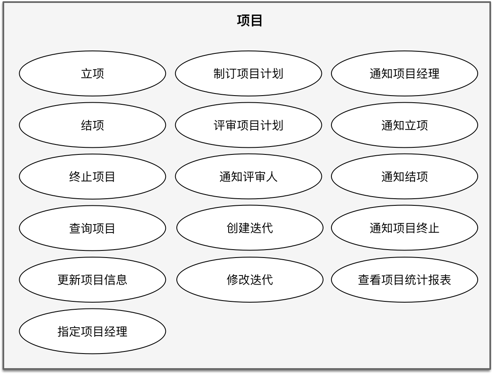

问题（Issue）主题包含的用例为：

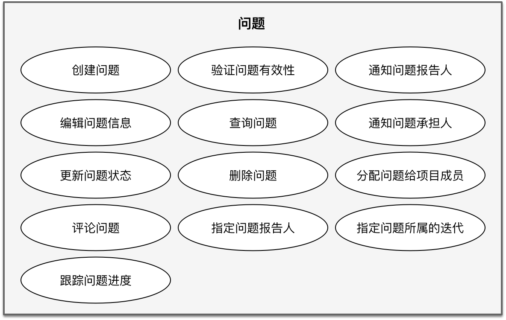

项目成员（Project Member）主题包含的用例最少：

识别主题边界不是求平衡，更不是为了让设计的模型更加好看，它的设计质量可能会直接影响到后续的限界上下文识别。或许内聚性的识别需要较强的分析能力和抽象能力，但只要我们遵循领域场景分析的设计思想，按部就班地通过业务流程识别参与者，再根据参与者驱动出清晰表达的用例图，最后再根据语义相关性和功能相关性识别主题边界，就能获得一个相对不错的场景分析结果。毕竟，这个分析过程是有章可循的，在知识的积累上也是层层递进的。整个过程不需要任何与技术实现有关的知识，非常利于领域专家与团队的共同协作和交流。