# 034 实践 确定限界上下文的协作关系

通过上下文映射来确定限界上下文之间的协作关系，是识别限界上下文之后至为关键的一步。每个限界上下文都仅仅展示了整体架构全局视图的一角，只有将它们联合起来，才能产生合力，满足业务场景的需要。若这种协作关系处理不当，这种联合的合力反倒成了一种阻力，清晰的架构不见，限界上下文带给我们的“价值”就会因此荡然无存。

如果单从确定限界上下文之间的协作关系而论，要考量的设计要素包括：

- 限界上下文的通信边界
- 采用命令、查询还是事件的协作机制
- 定义协作接口

通信边界、协作机制与上下文映射模式的选择息息相关。例如，通信边界采用进程内通信，就可能无需采用**开放主机服务**模式，甚至为了保证架构的简单性，也无需采用**防腐层**模式。如果采用命令和查询的协作机制，可能会采用**客户方/供应方**模式，如果采用事件的协作机制，则需要采用**发布者/订阅者**模式。

在识别限界上下文协作关系的阶段，是否需要定义协作的接口呢？我认为是必要的。一方面接口的定义直接影响到协作模式，也属于架构中体现“组件关系”的设计内容；另一方面通过要求对协作接口的定义，可以强迫我们思考各种协作的业务场景，避免做出错误的上下文映射。如果在这个阶段还未做好框架的技术选型，**接口的设计就不应该与具体的框架技术绑定**，而是给出体现业务价值的领域模型，换言之，就是定义好当前限界上下文的应用服务，因为应用服务恰好体现了用例的应用逻辑。

### 识别 EAS 的上下文映射

在领域驱动设计中，以“领域”为核心的设计思想应当贯穿整个过程始终，确定系统的上下文映射自然也不例外。实际上，整个领域驱动的战略设计实践是存在连贯关系的，我们不能因为进入一个新的阶段，就忘记了前面获得的成果。决定上下文映射的重要输入就包括基于领域场景分析获得的用例图，基于用例图获得的限界上下文。

#### 根据用例识别协作关系

为避免出现上下文映射的疏漏，我们应该根据业务场景来分析各种限界上下文协作的关系。这时，先启阶段领域场景分析获得的用例图就派上用场了。为了确保设计的严谨，我们**应该“遍历”所有的主用例**，理解用例的目标与流程，再结合我们已经识别出来的限界上下文判断它们之间的关系。

由于用例图中的用例传递的信息量有限，我们在识别协作关系时，可以进一步确定详细的流程，绘制更为详细的用例图甚至活动图。用例的好处在于不会让你遗漏重要的业务场景，而用例图中的包含用例与扩展用例，往往是存在上下文协作的信号。当然，在识别上下文协作关系时，还需要注意其中的陷阱。正如在[第 3-9 课：辨别限界上下文的协作关系（上）]中提到的那样，要理解**协作即依赖**的本质，正确辨别这种依赖关系到底是领域行为或领域模型的依赖，还是数据导致的依赖，又或者与限界上下文的边界彻底无关。

以“创建需求订单”用例为例，它的完整用例图如下所示：

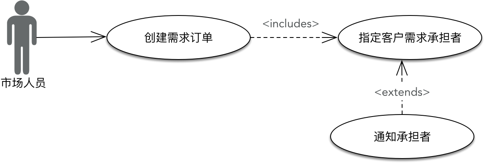

主用例“创建需求订单”属于**订单上下文**，“指定客户需求承担者”属于**客户上下文**，“通知承担者”用例是“指定客户需求承担者”的扩展用例，但它实际上会通过 **OA 集成上下文**发送消息通知。若满足于这样的表面现象，可得出上下文映射（图中使用了六边形图例来表达限界上下文，但并不说明该限界上下文一定为微服务）：

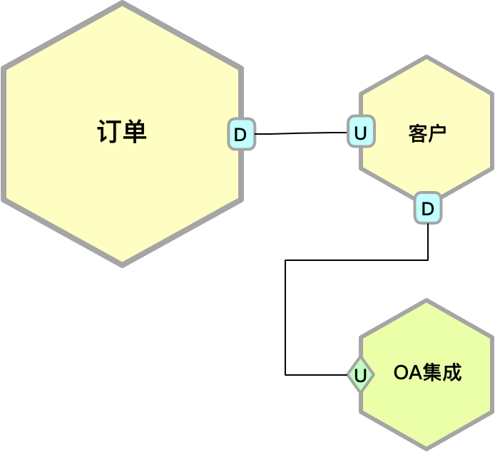

然而事实上，在指定客户需求承担者时，**订单上下文**并非该用例的真正发起者，而是市场人员通过用户界面获得客户信息，再将选择的客户 ID 传递给了订单，**订单上下文**并不知道**客户上下文**。如此一来，消息通知的发送也将转为由订单上下文发起。于是，上下文映射变为：

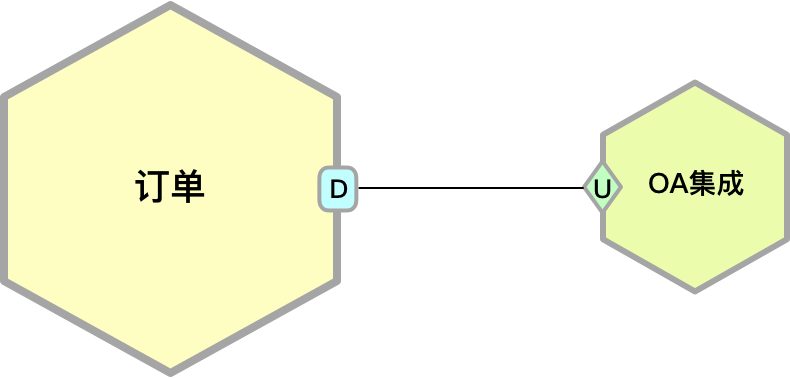

目前获得的上下文映射自然不会是最终方案。不同的用例代表不同的场景，产生的协作关系自然会有所不同。在“跟踪需求订单”用例中，需要在用户界面呈现需求订单状态，同时还将显示需求订单下所有客户需求的客户信息和承担者信息，这就需要分别求助于**客户上下文**和**员工上下文**。因此，**订单上下文**的上下文映射就修改为：

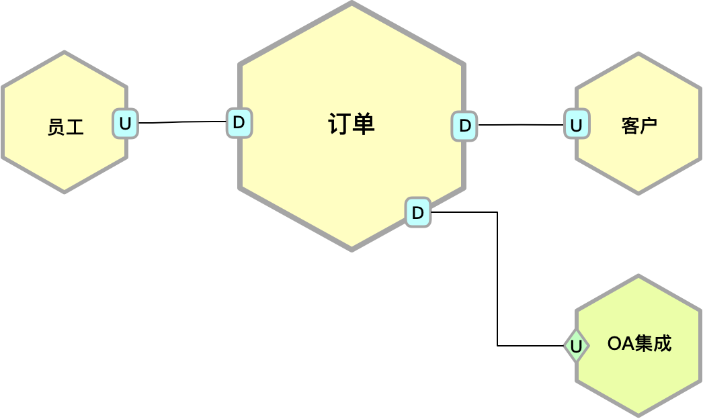

“创建市场需求”用例图如下所示：

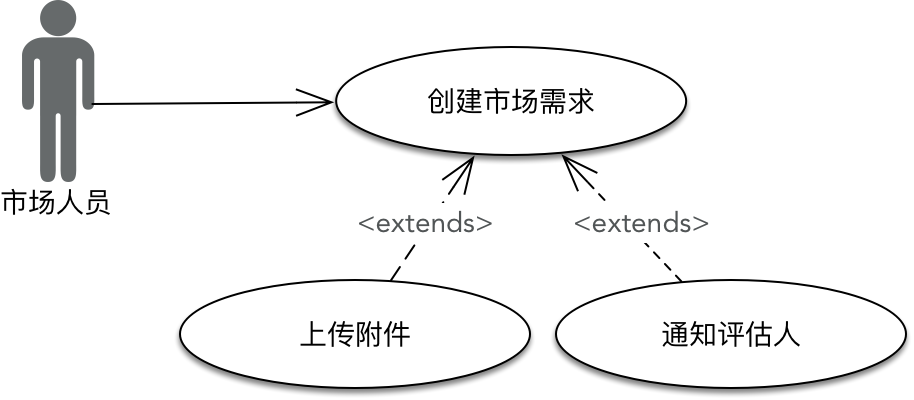

除了需要在**订单上下文**中创建市场需求之外，还要通过**文件共享上下文**完成附件的上传。此外，操作订单时需要对用户进行身份认证。最终，**订单上下文**的上下文映射就演变为：

有些限界上下文之间的关系是隐含的，需要透过用例去理解内在的业务流程才能探明这种关系。例如，“制定招聘计划”用例：

当招聘专员制定好招聘计划时，会发送消息通知招聘计划审核人，这个审核人就是人力资源总监。然而此时的**招聘上下文**并不知道谁是人力资源总监，只能通过招聘专员所属部门的组织层级去获得人力资源总监（用户角色）的信息，再通过该角色对应的 EmployeeId 到**员工上下文**获取人力资源总监的联系信息，包括手机和邮箱地址。得到的上下文映射为：

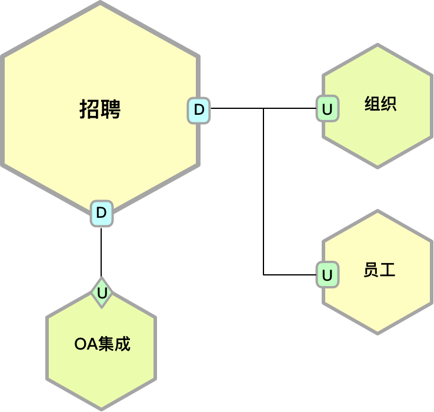

通过识别上下文映射，还会帮助我们**甄别一些错误的限界上下文职责边界划定**。例如，针对“添加项目成员”用例：

通过前面对限界上下文的识别，我们认为项目成员作为一种用户角色，项目组作为一个组织层级，从概念关联性看更适合放在**组织上下文**。当项目经理通过用户界面添加项目成员时，其流程为：

- 前置条件与项目关联的项目组已经创建好
- 选择要加入的项目组
- 列出符合条件的员工清单
- 选择员工加入到当前项目组
- 通知该员工已成为项目组的项目成员
- 将当前项目的信息追加到项目成员的项目经历中

注意，列出员工清单的功能属于**员工上下文**，但该操作是通过用户界面发起对**员工上下文**的调用，**组织上下文**并不需要获取员工清单，而是用户界面传递给它的。在员工加入到当前项目组后，**组织上下文**需要通过 **OA 集成**发送通知消息，还要通过**员工上下文**来追加项目经历功能。基于这样的流程，得到的上下文映射为：

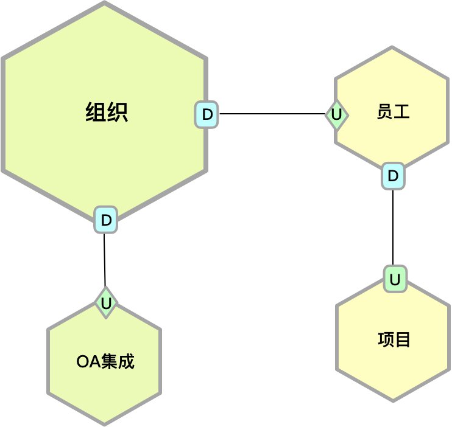

然而考虑**认证上下文**，它又需要调用**组织上下文**提供的服务来判断用户是否属于某个部门或团队，这就在二者之间产生了上下游关系。由于**认证上下文**比较特殊，如果系统没有采用 API 网关，则作为通用子领域的限界上下文，会被多个核心子领域的限界上下文调用，其中也包括**员工上下文**与**项目上下文**，于是上下文映射就变为：

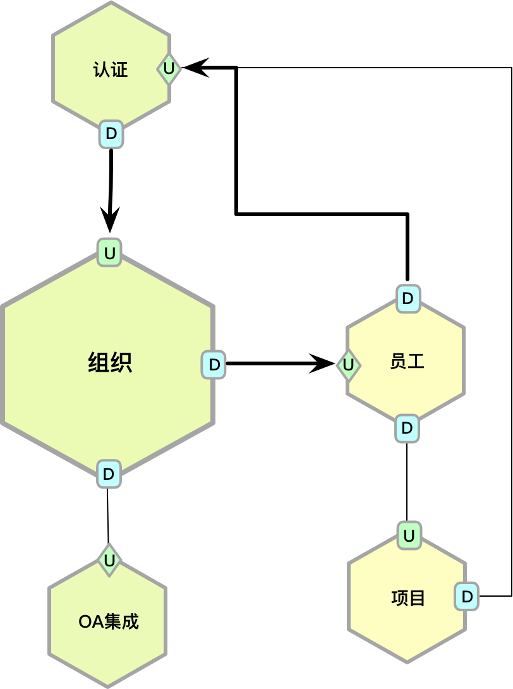

为了更好地体现协作关系，我在上图增加了箭头，加粗了相关连线。可以清晰地看到，上图粗线部分形成了认证、组织与员工三个限界上下文之间的循环依赖，这是设计上的“坏味道”。导致这种循环依赖的原因，是因为与项目成员有关的用例被放到了**组织上下文**中，从而导致了它与**员工上下文**产生协作关系，这充分说明了之前识别的限界上下文仍有不足之处。组织结构是一种领域，管理的是部门、部门层次、角色等更为普适性的特性。换言之，即使不是在 EAS 系统，只要存在组织结构的需求，仍然需要该限界上下文。如此看来，项目成员的管理应属于更加特定的业务领域。在添加项目成员时，领域逻辑仍然属于**项目上下文**，但建立成员与项目组之间的关系，则应交给更为通用的**组织上下文**，形成二者的上下游关系。经过这样的更改后，“追加项目成员的项目经历”用例就由**项目上下文**向**员工上下文**直接发起调用请求：

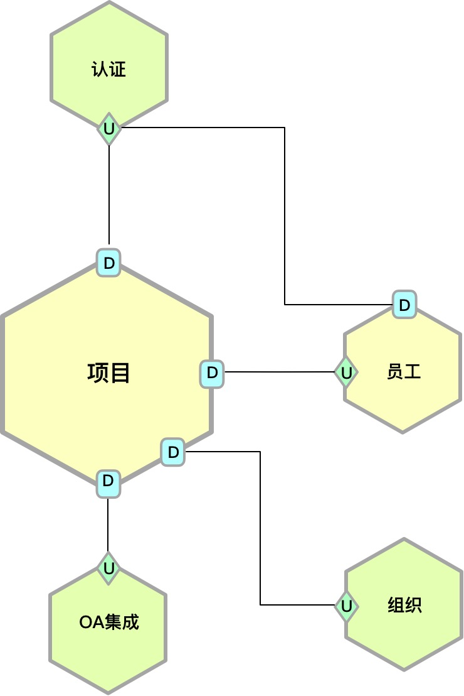

这个场景体现了**上下文映射对限界上下文设计的约束和驱动作用**。在调整了限界上下文的职责之后，避免了限界上下文之间的循环依赖，使得限界上下文的边界更加清晰，保证了它们之间的松散耦合，有利于整个系统架构的演化。

#### 确定上下文协作模式

要确定上下文协作模式，首先需要明确限界上下文的通信边界，即确定为进程内通信还是进程间通信。采用进程间通信的限界上下文就是一个微服务。在[第 4-8 课：代码模型的架构决策]中，我总结了微服务的优势与不足。EAS 系统作为一个企业的内部系统，对并发访问与低延迟的要求并不高，可用性固然是一个系统该有的特质，但毕竟它不是“生死攸关”的一线生产系统，短时间出现故障不会给企业带来致命的打击或难以估量的损失。整体来看，在质量属性方面，除了安全与可维护性之外，系统并无特别高的要求。综上所述，我看不到需要建立微服务架构的任何理由。既然无需创建微服务架构，就不必遵守一个限界上下文一个数据库的约束，满足架构的简单原则，可以为整个 EAS 系统创建一个集中的数据库。

这一设计决策直接影响到**决策分析上下文**的实现方案。就目前的需求而言，我们似乎没有必要为实现该上下文的功能专门引入数据仓库。**决策分析上下文**具有如下特征：

- 访问的数据涵盖所有的核心子领域
- 决策分析仅针对数据执行查询统计操作

虽然**决策分析上下文**属于核心子领域，但针对这两个特征，我们决定“斩断”该上下文和其他上下文之间的业务耦合关系，让它直接访问数据库，并借鉴 CQRS 架构模式，不为它定义领域模型，而是创建一个薄的数据访问层，通过执行 SQL 语句完成高效直接的数据处理。

既然决定限界上下文之间采用进程内通信，我们该选择何种上下文映射模式呢？到上下文映射的“武器库”中看一看，原来我们不知不觉已经使用了“共享内核”模式，提取了**文件共享**上下文，同时还引入了扮演“防腐层”功能的 **OA 集成上下文**。

作为提供垂直领域功能的限界上下文，需要为前端的用户界面或其他客户端提供 RESTful 服务，于是为如下限界上下文建立“开放主机服务”：

- 订单上下文
- 合同上下文
- 客户上下文
- 员工上下文
- 考勤上下文
- 招聘上下文
- 储备人才上下文
- 培训上下文（该上下文是项目开发中期针对需求变更引入）
- 项目上下文
- 决策分析上下文
- 资源上下文
- 组织上下文

既然采用了进程内通信，且针对这样的企业系统，演变为微服务架构的可能性较低，为了架构的简单性，针对以上限界上下文之间的协作，并无必要引入间接的防腐层。至于它与外部的 OA 系统之间的协作，已经由 **OA 集成上下文**提供了“防腐”功能。

我们是否需要采用“遵奉者”模式实现限界上下文之间的模型重用呢？同样是设计的取舍，简单还是灵活，重用还是清晰，这是一个问题！限界上下文的边界控制力会在架构中产生无与伦比的价值，它可以有效地保证系统架构的清晰度。如果为了简单与重用而纵容对模型的“滥用”，可能会导致系统变得越来越糟糕。对于采用进程内通信的限界上下文，运用“遵奉者”模式重用领域模型，就会失去限界上下文存在的意义，使之与战术设计中的模块（Module）没有什么区别了。说好的限界上下文保证领域概念的一致性呢？例如，**合同上下文**、**项目上下文**、**订单上下文**都需要通过**员工上下文**获得员工的联系信息，那么最好的方式不是直接重用**员工上下文**中的 Employee 模型对象，而是各自建立自己的模型对象 Employee 或 TeamMember，除了具有 EmployeeId 之外，可以只包含一个 Contact 属性：

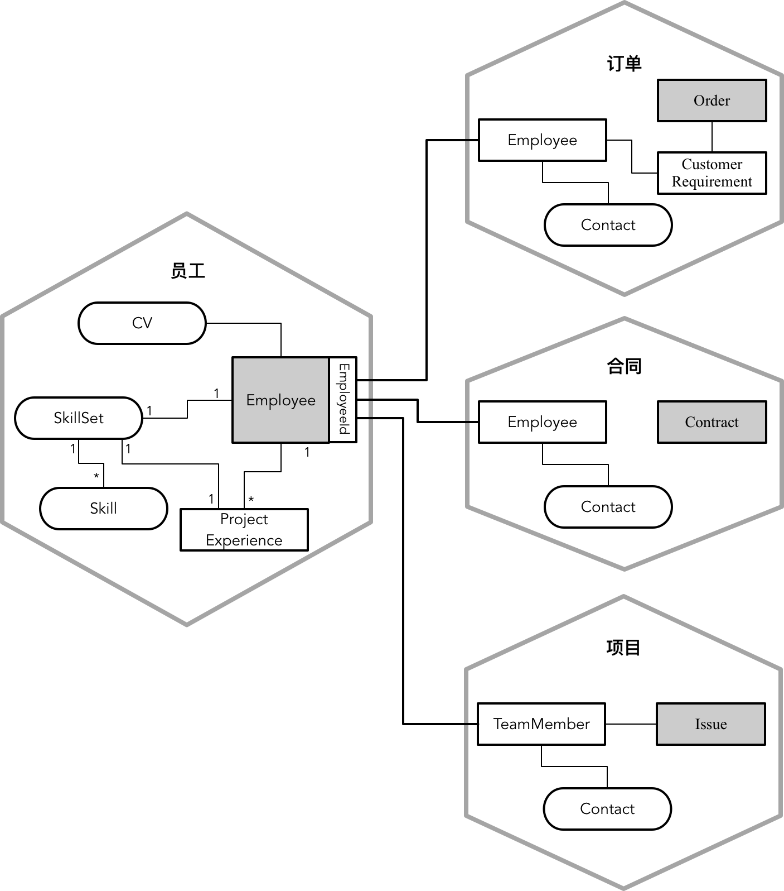

我们还需要确定限界上下文之间的调用机制，究竟是通过命令、查询还是事件？由于采用了进程内通信，限界上下文之间的协作方式应以同步的查询或命令机制为主。唯一的例外是将 **OA 集成上下文**定义为进程间通信的限界上下文，毕竟它的实现本身就是要跨进程调用 OA 系统。这个限界上下文要实现的功能都与通知有关，无论是短信通知、邮件通知还是站内通知，都没有副作用，且允许以异步形式调用，适合使用事件的调用机制。这种方式一方面解除了 **OA 系统上下文**与大多数限界上下文之间的耦合，另一方面也能够较好地保证 EAS 系统的响应速度，减轻主应用服务器的压力。唯一不足的是需要增加一台部署消息队列的服务器，并在一定程度增加了架构的复杂度。采用事件机制，意味着 **OA 集成上下文**采用了“发布者/订阅者”模式，其中 **OA 集成上下文**为订阅者：

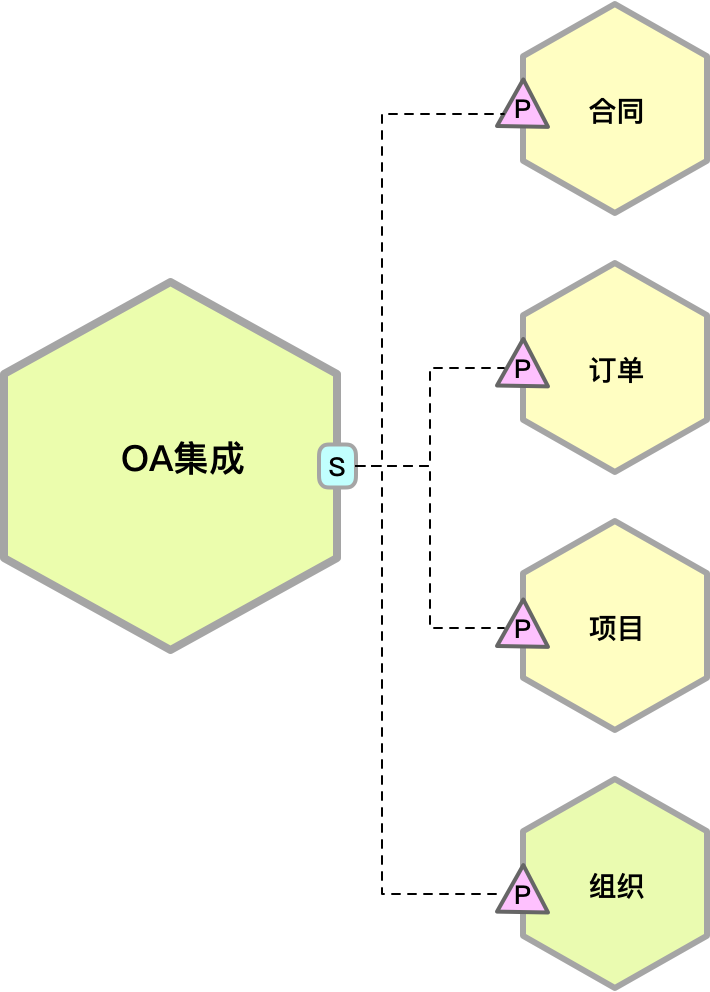

#### 定义协作接口

定义协作接口的重要性在于**保证开发不同限界上下文的特性团队能够并行开发**，这相当于为团队规定了合作的契约。集成是痛苦的，无论团队成员能力有多么强，只要没有规定好彼此之间协作的接口，就有可能导致系统模块无法正确地集成，或者隐藏的缺陷无法及时发现，最严重的是破坏了限界上下文的边界。我们需要像保卫疆土一样去守护限界上下文的边界，如果不加以控制，任何风吹草动都可能酿成“边疆”的风云突变。

注意，现在定义的是限界上下文之间协作的接口，并非限界上下文所有的服务接口，也不包括限界上下文对外部资源的访问接口。协作接口完全可以根据之前确定的上下文映射获得。在上下文映射图中，每个协作关系都意味着一个接口，不同的上下文映射模式可能会影响到对这些接口的设计。例如，如果下游限界上下文通过**开放主机服务**模式与上游协作，就需要定义 RESTful 或 RPC 接口；如果下游限界上下文直接调用上游，意味着需要定义应用服务接口；如果限界上下文之间采用**发布者/订阅者**模式，需要定义的接口其实是事件（Event）。

对于 EAS 系统而言，我们已经确定除与 **OA 集成上下文**之间采用“发布者/订阅者”模式之外，其余限界上下文之间的协作都是“客户方/供应方”模式，且无需引入防腐层和开放主机服务，因此，要定义的协作接口其实就是各个限界上下文的应用服务接口。在定义协作接口时，我们只需要规定作为供应方的上游应用服务即可。如果采用事件机制，协作接口就应该是对事件的定义。

以订单上下文为例，它的上下文映射图为（与前面上下文映射的不同之处是将订单与 OA 集成之间的协作改为了事件机制）：

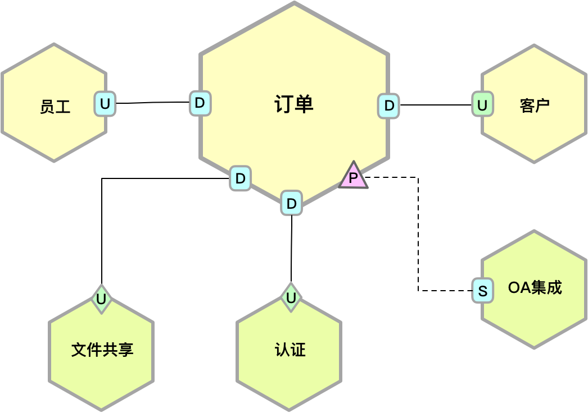

记录与**订单上下文**相关的协作接口如下表所示：

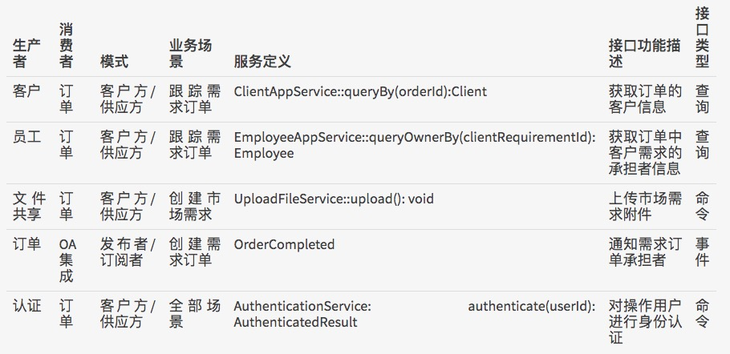

在这个接口表中，我使用生产者（Producer）与消费者（Consumer）来抽象客户方/供应方模式与发布者/订阅者模式。表中的模式自然就是上下文映射模式。如有必要，也可以是多个模式的组合，比如客户方/供应方与开放主机服务之间的组合。当然，如果为开放主机服务，且发布语言为 RESTful，则后面的服务定义就应该是遵循 RESTful 服务定义的接口。

对于**订单上下文**与 **OA 集成**上下文之间的协作，正如前所述，我们采用了发布者/订阅者模式。因此，这里的协作接口实际上是对**事件**的定义。最初为了表达订单的领域概念，我将该事件定义为 OrderCompleted。回顾 **OA 集成上下文**的上下文映射，作为订阅者的 **OA 集成上下文**在接收到事件后，要做的事情**都是**将事件持有的内容转换为要发送消息通知的内容以及送达的地址，然后发送消息通知。显然，它订阅的事件应该是相同的，因为处理事件的逻辑完全相同。故而应该将 OrderCompleted 修改为 NotificationReady 事件。除了订单发布该事件外，合同、项目、组织等限界上下文都将发布该事件。

协作接口表格式并非固定或唯一。例如，我们也可以为每个接口定义详尽的描述：

- **接口，** AuthenticationService
- **描述，** 对操作用户进行身份认证
- **命名空间，** paracticeddd.eas.authcontext.application
- **方法，** authenticate(userId): AuthenticatedResult
- **模式**，客户方/供应方模式
- **接口类型，** 命令

协作接口定义的格式不是重要的，关键还是在战略设计阶段需要重视对它们的定义。只有这样才能更好地保证限界上下文的边界，因为除了这些协作接口，限界上下文之间是不允许直接协作的。协作接口的定义也是上下文映射的一种落地实践，要避免上下文映射在战略设计中沦为一幅幅中看不中用的设计图。同时，通过它还可以更好地遵循统一语言，保证设计模型与领域模型的一致性。