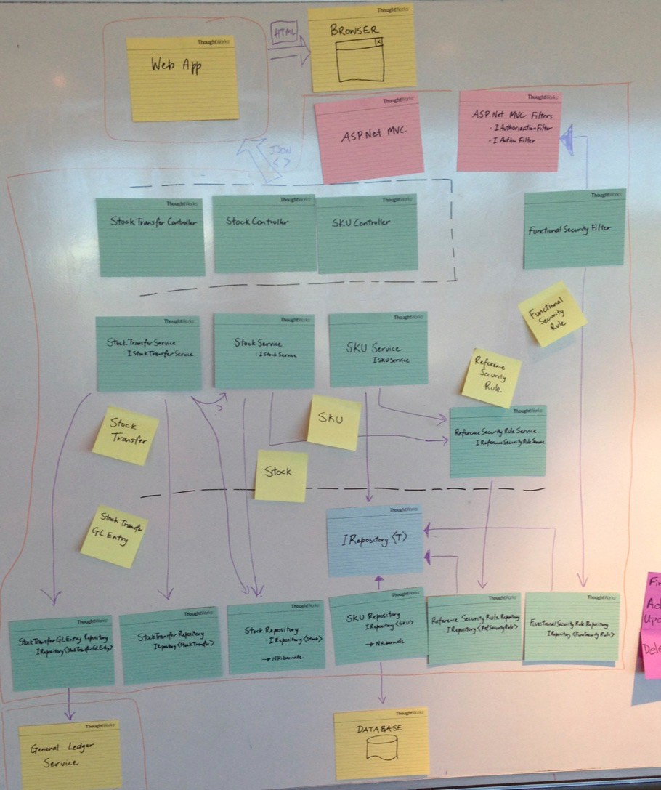
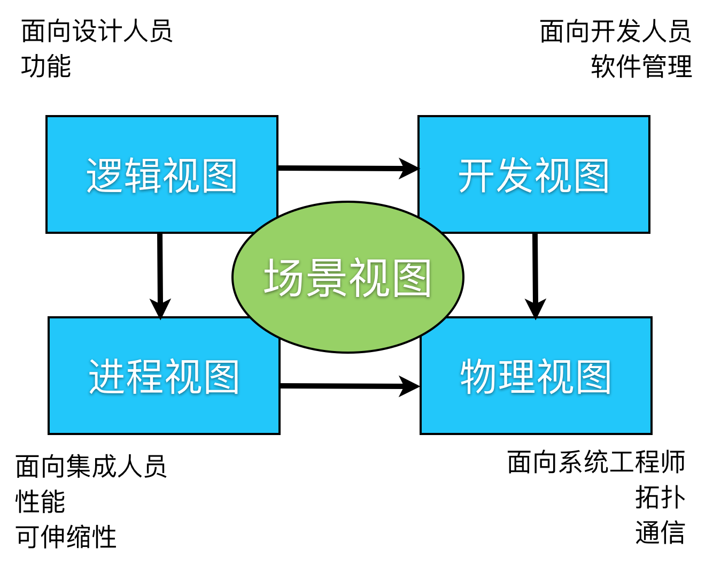
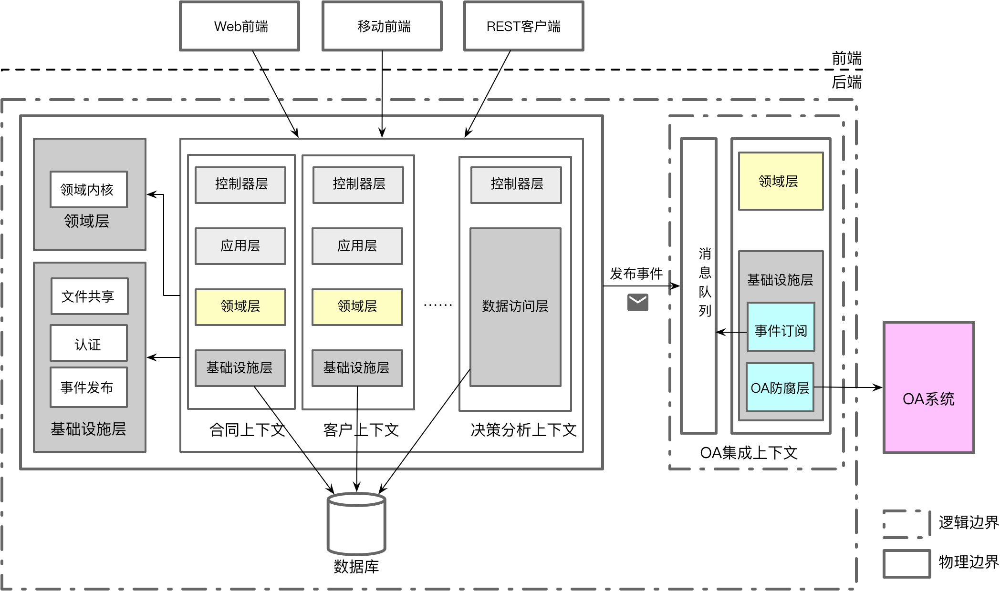
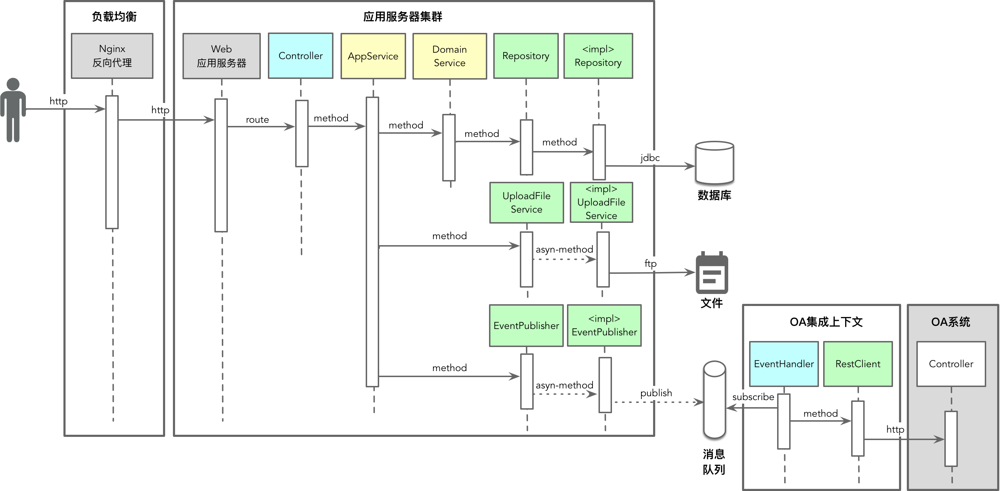
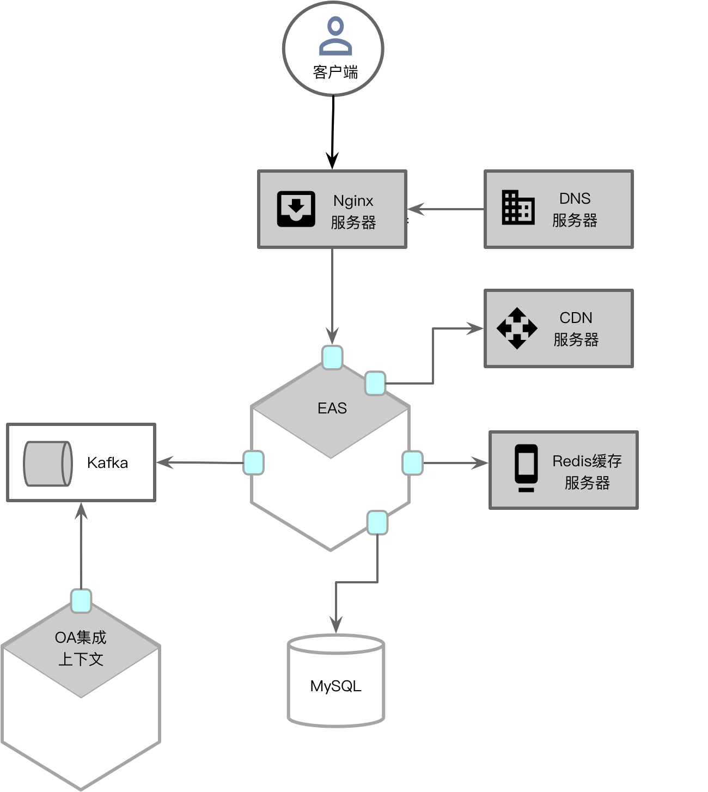
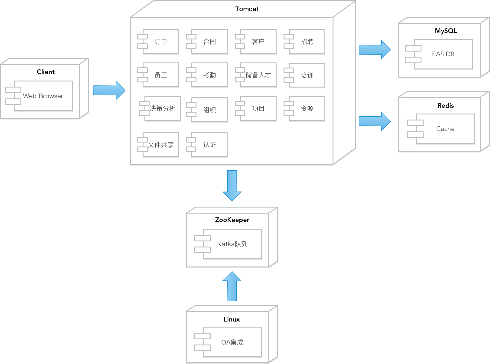
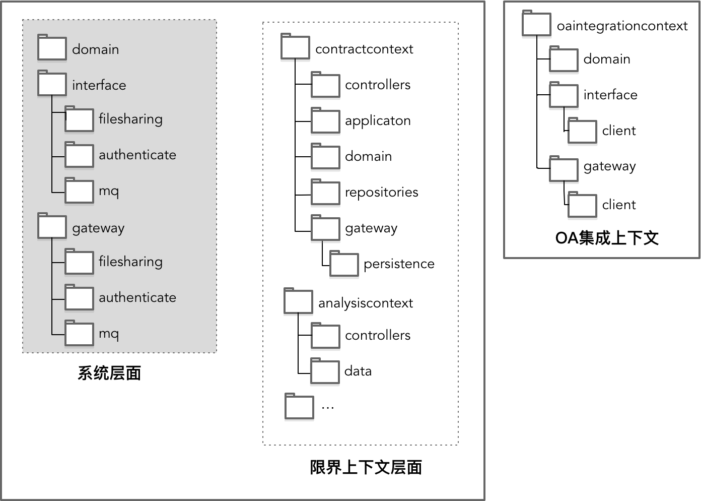

# 035 实践 EAS 的整体架构

迄今为止，EAS 的战略设计算得上是万事俱备只欠东风了。为了得到系统的整体架构，我们还欠缺什么呢？所谓“架构”，是“以组件、组件之间的关系、组件与环境之间的关系为内容的某一系统的基本组织结构，以及指导上述内容设计与演化的原则”。之所以要确定系统的组件、组件关系以及设计与演化的原则，目的是通过不同层面的结构视图来促进团队的交流，为设计与开发提供指导。架构不仅仅是指我们设计产生的输出文档，还包括整个设计分析与讨论的过程，这个过程产生的所有决策、方案都可以视为是架构的一部分。例如，下图就是团队站在白板前进行面对面沟通时，针对系统需求以可视化形式给出的架构草案：

像这样的可视化设计图同样是架构文档中的一部分。我们在先启阶段分析得到的系统上下文图、问题域、用例图以及限界上下文和上下文映射，也都是架构文档中的一部分。这些内容都可以对我们的设计与开发提供清晰直观的指导。

当然，若仅以如此方式交付架构未免有些随意，也缺乏系统性，会导致设计过程的挂一漏万，缺失必要的交流信息。领域驱动设计并没有明确给出架构的设计过程与设计交付物，限界上下文、分层架构、上下文映射仅仅作为战略设计的模式而存在。因此，我们可以参考一些架构方法，与领域驱动设计的战略设计结合。这其中，值得参考的是 Philippe Kruchten 提出的架构 4 + 1 视图模型（后被 RUP 采纳，因此通常称之为 RUP 4 + 1 视图），如下图所示：

在这个视图模型中，**场景视图**正好对应我们的**领域场景分析**，之前获得的用例图正好展现了业务场景的一面。**逻辑视图**面向设计人员，在领域驱动设计中，通常通过**限界上下文**、**上下文映射**和**分层架构**描绘功能的模块划分以及它们之间的协作关系。**进程视图**体现了进程之间的调用关系，比如采用同步还是异步，采用串行还是并行。领域驱动设计由于是以“领域”为核心，对这方面的考量相对较弱。通常，我会建议采用风险驱动设计（Risk Driven Design），通过在架构设计前期识别系统的风险，以此来确定技术方案。我们对**限界上下文**通信边界的判断，恰好是一种对风险的应对，尤其是针对系统的可伸缩性、性能、高并发与低延迟等质量属性的考虑。一旦我们确定限界上下文为进程间通信时，就相当于引入了微服务架构风格，通过**六边形架构**与**上下文映射**可以部分表达**进程视图**。**物理视图**体现了系统的硬件与网络拓扑结构，**六边形架构**可以帮助我们确定系统的物理边界，并通过端口来体现限界上下文与外部环境之间的关系。至于**开发视图**，我们之前围绕着**分层架构**演进出来的**代码模型**就是整个系统在开发视图下的静态代码结构。综上所述，我们就为 RUP 4+1 视图与领域驱动设计建立了关联关系，如下表所示：

| RUP 4+1 视图 | 领域驱动设计的模式与实践           |
| :----------- | :--------------------------------- |
| 场景视图     | 领域场景分析、用例图               |
| 逻辑视图     | 限界上下文、上下文映射、分层架构   |
| 进程视图     | 限界上下文、六边形架构、上下文映射 |
| 物理视图     | 六边形架构                         |
| 开发视图     | 分层架构、代码模型                 |

### EAS 的逻辑视图

可以说，我们对限界上下文的加强突破了原来对分层架构的认知。通常所谓的“分层架构”，相当于一个生日蛋糕，整个系统统一被划分为 N 层，如生日蛋糕中的水果层、奶油层和蛋糕层。在引入限界上下文的边界控制力后，每个限界上下文都可以有属于自己的分层架构，并通过应用层或北向网关暴露出协作的接口，满足限界上下文之间协作的需求，同时组合为一个整体为前端提供开放主机服务。

回到 EAS，我们完全可以为体现核心子领域的限界上下文建立领域驱动设计的分层架构，并突出领域模型的重要性。对于决策分析上下文，则借用 CQRS 模式，在体现北向网关的控制器之下，仅需定义一个薄薄的数据访问层即可。OA 集成上下文其实是一个由防腐层发展起来的限界上下文，且由于它与其他限界上下文的协作采用了发布者/订阅者模式，内部又需要调用 OA 系统的服务接口，因而领域层就只包含了领域事件以及对应的事件处理器（EventHandler），它的基础设施层则负责事件的订阅，并封装访问 OA 系统的客户端。

在分析文件共享上下文时，我们发现了它的特殊性。如果只考虑对各种类型文件的上传与下载，它更像是一个可以被多个限界上下文重用的公共组件。由于它会操作文件这样的外部资源，因而应作为组件放到整个系统的基础设施层。正如我在[第 3-1 课：理解限界上下文]中写到：

> 它并非某种固定的设计单元，我们不能说它就是模块、服务或组件，而是通过它来帮助我们做出高内聚、低耦合的设计。只要遵循了这个设计，则限界上下文就可能成为模块、服务或组件。

因此，在识别限界上下文时，不要被模块、组件或服务限制了你的想象，更不要抛开自己对业务的理解凭空设计限界上下文。在识别出来的 EAS 限界上下文中，文件共享与认证上下文成为了组件，OA 集成上下文成为了服务，而诸如合同、订单、项目等上下文则成为了模块，这就是所谓“看山是山、看水是水”三重境界的道理。最终，EAS 系统的逻辑视图如下图所示：

EAS 的逻辑视图分为两个层次的分层架构。

- 系统层次的分层架构：该层次仅包含了领域层和基础设施层，这是因为控制器与应用层都与对应的限界上下文有关，不存在系统层次的开放主机服务。系统层次的领域层定义了支持领域驱动设计核心要素的模型对象，可以视为一个共享内核。基础设施层包含了文件共享、认证功能与事件发布，都是多个限界上下文需要调用的公共组件。
- 限界上下文层次的分层架构：依据限界上下文领域逻辑复杂度的不同，选择不同的建模方式。如果采用领域模型的建模方式，则定义为经典的应用层、领域层和基础设施层。本身属于基础设施层的控制器被独立出来，定义为控制器层。所有层次皆与所属限界上下文的领域相关，区别在于它们的关注点不同。除决策分析上下文之外，其余限界上下文的基础设施层实际上都是 Repository 的实现，即 Gateway 模块中的 Persistance 模块。

注意，之所以将“事件发布”放在系统层次的基础设施层，而非各个限界上下文的基础设施层，在于事件封装的逻辑完全一致，都是发布 NotificationReady 事件，这是之前在识别协作接口的时候确定下来的。同时，底层发布事件的通信机制也是完全相同的。将其封装到系统层次的基础设施层，就有利于相关限界上下文对它的重用。为了让限界上下文满足整洁架构，可以考虑在系统层次提供 interfaces 模块，保证抽象接口与具体实现的隔离。这个公开定义的接口会被各个限界上下文的领域对象调用。显然，对比事件发布与持久化，前者具有系统全局范围的通用性，后者则只服务于当前限界上下文。

由于决策分析上下文特殊的业务逻辑，我没有为其定义领域模型，因而在它的上下文边界中，只定义了控制层和数据访问层。统计分析的逻辑被直接封装在数据访问层中，避免了不必要的从数据模型到领域模型再到服务模型的转换，即数据访问层返回的结果就是控制器要返回的 Response 对象。

图中的粗实线框代表了进程边界，故而 OA 集成上下文与其他限界上下文不在同一个进程中。同样的，数据库与消息队列也处于不同的进程（甚至是不同的服务器）。粗虚线框代表了系统的逻辑边界，除了图中的第三方 OA 系统与前端模块，其余内容包括数据库都在 EAS 系统的逻辑边界中。

### EAS 的进程视图

如前所述，架构的进程视图主要关注系统中处于不同进程中组件之间的调用方式。我们在前面通过限界上下文与上下文映射已经确定了各个限界上下文的通信边界以及它们之间的协作关系。除了与 OA 集成上下文之间将采用异步的事件发布机制之外，就只有前端向系统后端发起的 RESTful 请求，以及系统向数据库和文件发起的请求属于进程间通信。由于 EAS 系统在质量属性上没有特别的要求，在目前的架构设计中，暂不需要考虑并发访问。

在绘制系统的进程视图时，不需要将每个牵涉到进程间调用的用例场景都展现出来，而是将这些参与协作的组件以抽象方式表达一个典型的全场景即可。在我们这个系统中，主要包括 RESTful 请求、文件上传、消息通知与数据库访问，如下时序图所示：

调用者在向 EAS 系统发起 http 请求时，首先会通过 Nginx 反向代理寻找到负载最小的 Web 应用服务器，并通过 REST 框架将请求路由给对应的控制器。从控制器开始一直到 Repository、UploadFileService 与 EventPublisher，所有的方法调用都在一个进程中，唯一不同的是诸如上传文件与发布事件等方法是非阻塞的异步方法。控制器是面向 REST 请求的北向网关，RepositoryRepository、UploadFileService 与 EventPublisher 则作为南向网关与系统边界之外的外部资源通信。其中，Repository 通过 JDBC 访问数据库，UploadFileService 通过 FTP 上传文件，EventPublisher 发布事件给消息队列，都发生在进程之间。基于这些访问协议，你可以清晰地看到六边形架构中端口和适配器的影子。

OA 集成上下文是一个单独部署在独立进程中的限界上下文，上下文之间的通信交给了消息队列。EventHandler 是其北向网关，通过它向消息队列订阅事件。RestClient 是其南向网关，通过它向第三方的 OA 系统发起 RESTful 请求。

整个进程视图非常清晰地表达了部署在不同进程之上的组件或子系统之间的协作关系，同时通过图例体现了领域驱动设计中的北向网关和南向网关与外部资源之间的协作。调用的方式是同步还是异步，也一目了然。

### EAS 的物理视图

物理视图当然可以用专业的网络拓扑图来表示，不过在领域驱动设计中，我们还可以使用更具有美学意义的六边形，尤其是在微服务架构风格中，六边形的图例简直就是微服务的代言人。只是 EAS 并未使用微服务架构风格，但从通信边界来看，OA 集成上下文处于完全独立的进程，其他限界上下文则共享同一个进程。整个 EAS 系统的物理视图如下所示：

物理视图与进程视图虽然都以进程边界为主要的设计单元，但二者的关注点不同。进程视图是动态的，体现的是外部环境、系统各个组件在进程之间的协作方式与通信机制；物理视图是静态的，主要体现系统各个模块以及系统外部环境的部署位置与部署方式。所以，物理视图的重点不在于展现它们彼此之间的关系，而是如何安排物理环境进行部署。为了指导部署人员的工作，又或者在项目早期评估系统的硬件环境与网络环境，通常需要在物理视图的说明下，进一步给出详细的拓扑图，以及各个组成部分的技术选型。例如，我们可以用节点（Node）部署形式详细说明 EAS 各个组成部分的部署：

### EAS 的开发视图

无论架构设计得多么优良、多么美好，每一张架构视图画得多么的漂亮与直观，如果没有开发视图为团队提供开发指导，建立一个规范的代码模型，并明确每个模块的职责，就有可能在开发实现过程中，事先设计良好的架构会慢慢地变形、慢慢地腐化，最终丧失了架构的清晰与一致。

我在为团队评审代码时，一直强调两个词：职责与清晰。倘若职责分配不合理，就可能引起模块之间的耦合与纠缠不清，进而伤害了架构的清晰度；倘若不随时把握架构的清晰度，就可能无法敏锐地察觉到架构的腐化，直到后来积重难返。如果说从一开始进行架构设计时，开发视图为混沌的开发指明了方向，那么在开发过程中一直保持开发视图的指导，就是时刻把握策马前行的缰绳，不至于像脱缰的野马胡冲乱撞，找不到北。

开发视图是与逻辑视图一脉相承的。在领域驱动设计中，分层架构与限界上下文是其根本，整洁架构思想则是最高设计原则。结合[第 28 课：代码模型的架构决策]以及本课程内容给出的 EAS 逻辑视图，可以得出如下的开发视图：

由于 OA 集成上下文是一个单独的物理边界，因而它的开发视图是独立的。系统层面和限界上下文层面的开发模型属于同一个开发视图，这样的设计就可以让限界上下文的各个模块可以直接在进程内调用系统层面中各模块的类。

### 设计的道与术

领域驱动设计并非一种架构设计方法，但我们可以将多种架构设计的手段融合到该方法体系中。领域驱动设计具有开放性，正是因为这种开放与包容，才促进了它的演化与成长。但是，领域驱动设计毕竟不是一个无限放大的框，我们不能将什么技术方法都往里装，然后美其名曰这是“领域驱动设计”。领域驱动设计是以“领域”为核心驱动力的设计方法，此乃其根本要旨。同样，领域驱动设计也不是“银弹”，它无法解决软件设计领域中的所有问题，例如，在针对质量属性进行软件架构时，领域驱动设计就力有未逮了。这时我们就可以辅以其他设计手段，如通过风险驱动设计识别风险，确定解决或规避风险的技术方案。

软件需求千变万化，架构无单一的方法，需审时度势，分析问题域，结合对场景的判断做出技术的权衡与决策。在运用领域驱动设计对 EAS 进行战略设计时，我们固然沿着设计的主线识别出了系统的限界上下文，却没有“死脑筋”地硬要为 EAS 系统选择微服务架构风格。边界仍然值得重视，但究竟是进程内边界还是进程间边界，则需要量力而为。任何技术手段必有其双刃，利弊权衡其实就是一种变相的成本收益核算。对于 EAS，微服务的弊显然大于利。但是，这并不能说明通过限界上下文与微服务建立映射的思想是错误的。思想是“道”的层面，运用是“术”的层面。不理解思想本质，方法的运用就变得僵化而死板，只能是邯郸学步；仅把握思想精髓，却不能依势而为求得变通，不过是刻舟求剑。任何案例都只能展现运用“术”的一个方面，因此，我不希望通过 EAS 案例的讲解，把大家带入到僵化运用的死胡同。**明其道，求其术**，道引导你走在正确的方向，术帮助你走得更快更稳健，这是我在进行领域驱动战略设计时遵循的最高方针！