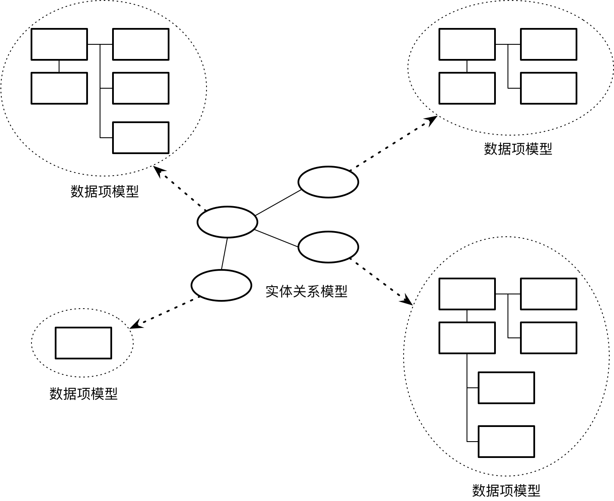
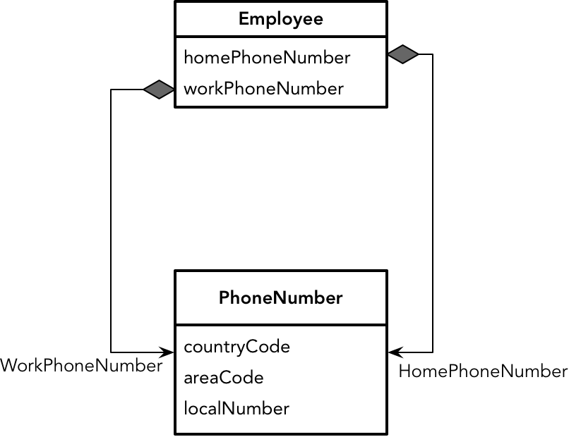
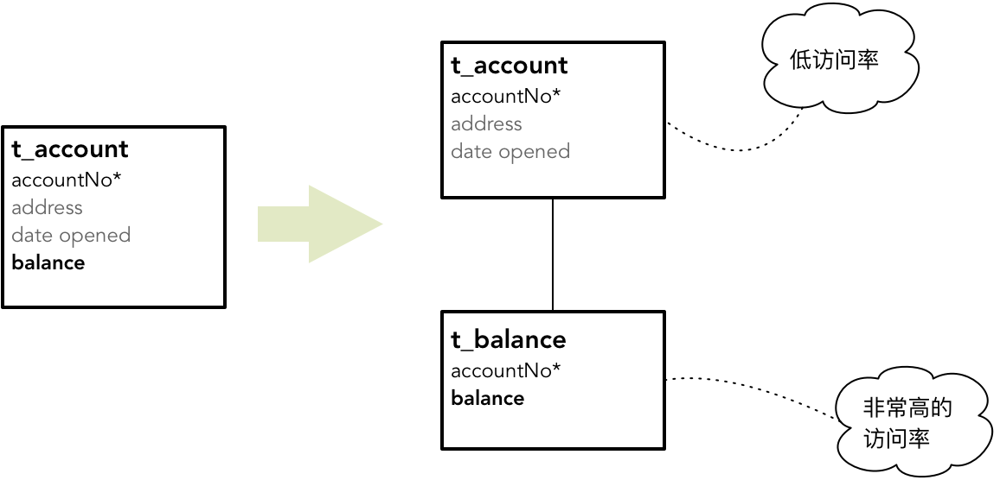

# 039 数据分析模型

在 Eric Evans 提出领域驱动设计之前，对企业系统的分析设计多数采用数据模型驱动设计。如前所述，这种数据模型驱动设计就是站在数据的建模视角，逐步开展分析、设计与实现的建模过程。通过对数据的正确建模，设计人员就可以根据模型建立数据字典。数据模型会定义数据结构与关系，有效地消除数据冗余，保证数据的高效访问。由于软件系统的业务功能归根结底是对信息的处理，由此建立的数据模型也可以通过某种编程手段来实现，满足业务需求。

### 数据分析模型

数据建模过程中的分析活动会通过理解客户需求寻找业务概念建立实体（Entity）。在数据模型中，一个实体就是客户希望建立和存储的信息。这是一个抽象的逻辑概念，位于数据模型的最高抽象层。一个实体不一定恰好对应一个数据表，它甚至可能代表一个主题域。在识别实体的同时，我们还需要初步确定实体之间的关系。由于这个过程与数据库细节完全无关，因而称之为对数据的“概念建模”，建立的模型称之为**实体关系模型**。

经过数十年对数据建模的丰富与完善，这个领域已经出现了许多值得借鉴和重用的数据模型。其中，Len Silverston 的著作《数据模型资源手册》是最重要的模型参考手册。他通过对行业业务的梳理，建立了包括人与组织、产品、产品订购、装运、工作计划、发票等各个主题的数据模型。在确定系统的实体时，这些已有的数据模型可以作为我们的重要参考。

当然，每个软件系统的业务需求必然有其特殊性，除了对已有数据模型的参考，也有一些数据建模方法帮助我们获得实体关系模型。例如通过引入不同的用户视图创建不同的实体关系模型。用户视图的差异取决于业务能力的差异，例如，财务人员的观察视图显然不同于市场人员的观察视角，看到的数据信息显然也有所不同。这就像盲人摸象一般，虽然每个视角得到的实体关系模型只是大象的一部分，然而将这些代表不同人员不同观点的实体关系模型组合起来，就能形成整体的实体关系模型。

实体关系模型是数据建模的开始，目的是让我们可以从一开始抛开对数据库实现细节的考虑，寻找那些表达业务知识的重要概念，并明确它们之间的关系。但对数据模型的分析并不会就此止步，我们必须在分析阶段对实体做进一步细化，形成具体的数据表，并定义表属性，确定数据表之间的真实关系。这时获得的分析模型称之为“数据项模型”。实体关系模型与数据项模型之间的关系如下图所示：



在数据建模过程中，越早确定数据库的细节越有利于数据模型的稳定。当今的软件开发，已经不是关系型数据库一统天下的时代。NoSQL 甚至 NewSQL 的诞生，让我们在选择持久化机制时有了更多选择。比较关系数据库和 NoSQL 数据库，前者是严格扁平的结构化数据，后者却是无样式的数据结构（Schemaless Data Structures），结构不同，建立的数据模型自然就有了天壤之别。一旦根据数据模型创建了物理的数据表，再调整数据模型，变化的成本就太高了。因此，究竟选择关系数据库还是 NoSQL 数据库，对确立数据项模型至关重要，我们需要分开讨论。

#### 关系数据库的数据项模型

关系数据库体现了关系模型，形成了一种扁平的结构化数据，这就要求进一步规范数据表的粒度，将实体或主题域拆分为多个遵循数据库范式的数据表，明确一个数据表的主要属性。

数据库范式是面向数据的分析建模活动的一个关键约束。这些范式包括一范式（1NF）、二范式（2NF）、三范式（3NF）、BC 范式（BCNF）和四范式（4NF）。遵循这些范式可以保证数据表属性的原子性、避免数据冗余和传递依赖等。

例如在确定数据项时，该如何考虑避免数据冗余？这就需要合理地设计表以及表之间的关系。

假设一个公司的员工可能同时具有多个角色：运输科的张飞是科室的负责人，他又是供应科的客户，供应科会将运输的任务委托给他；同时，他还是一家大型超市的供应商，负责将货物运输给超市。显然，我们不能在一个数据库中为张飞创建三条冗余的数据记录。运输科主任、供应科客户和超市供应商都是张飞担任的角色，无论他担任了什么角色，他都是该公司的一名员工。

在创建数据模型时，应该将角色属性从员工剥离出去，分别形成数据表 `t_employee` 与 `t_role`；又因为员工和角色之间存在多对多的关系，需要引入一个关联表 `t_employee_roles`。这个数据模型如下图所示：


当数据模型出现多对多关系时，之所以要引入一个关联表，是因为多对多关系会引入数据表之间的**交叉关联**。这个数据项模型中的 `t_employee_role` 并无映射的业务概念，引入该表，纯粹是数据库实现细节对模型产生的影响。

有时候，承载多对多关系的关联表也可以具有一些附加的属性，这样的关联表往往代表了业务逻辑中的一个业务概念，例如学生（Student）与课程（Course）之间的多对多关系，可以用课表（Curriculum）关联表来表达。Curriculum 属于学习领域的业务概念，但同时它又能有效解除 Student 与 Course 之间的交叉关联。

有的数据建模者甚至建议针对一对多关系也建立关联表，因为关联表的引入使得这种关系更容易维护。例如产品（Product）和图片（Picture）是一对多关系，直接定义 `t_product` 和 `t_picture` 数据表即可，但如果引入 `t_product_picture` 关联表，就可以在数据库层面更好地维护二者之间的关系。有时，一对多关系体现了父—子关系，例如订单（Order）与订单项（OrderItem），它们之间的一对多关系其实代表了“每个订单项必须是一个也只是一个订单的一部分”。

在确定数据项模型时，还需要考虑访问关系数据库的性能特性，从而决定数据的粒度与分割。通常，需要考虑数据表的规范化，避免设计出太多过小的包含少量数据的数据表。一个数据表的粒度较小，就会导致程序在访问数据库时频繁地在多张小表之间跳转。这个访问过程既要存取数据，又要存取索引以找到数据，导致I/O的过度消耗，影响到整体的性能。因此，数据模型很少具有一对一关系，即使现实世界的概念存在一对一关系，也应该尽量通过规范化将两张表的数据组织在一起，合到一个实体中。例如，我们说一位员工有一个家庭电话号码和工作电话号码，若站在领域概念角度，就应该建模为拥有两个不同电话号码（PhoneNumber）的员工（Employee）对象：



数据模型却不能这样建立，因为我们需要考虑分开两张表带来的 I/O 开销。虽然家庭电话号码和工作电话号码都是相同的 `PhoneNumber` 类型，但却属于两个不同的属性，将它们合并放到 `t_employee` 数据表，并不会破坏数据库范式。

当然，这种合并并非必然，有时候还需要考虑数据访问的频率。例如一个银行账户，账户地址、开户日期与余额都是规范化的，按理就应该合并到 `t_account` 物理表中。但是，余额与其他两项属性的访问频率差异极大，为了使 I/O 效率更高，数据的存储更加紧凑，就应该将规范化的表分解为两个独立的表：



#### NoSQL 的数据项模型

如果数据库选择了 NoSQL，数据项模型会有所不同。由于 NoSQL 数据库是一种无样式的数据结构（Schemaless Data Structures），这使得它对数据项模型的约束是最少的。诸如 MongoDB、Elasticsearch 这样的 NoSQL 数据库，它所存储的 JSON 文档，可以在属性中进行任意嵌套，形成一种能够自由存取的文档结构。所以 Martin Fowler 又将这样的 NoSQL 数据库称之为“文档型数据库”。

当然，即使是没有样式的 NoSQL，也无法做到随心所欲地建立数据模型，尤其针对表之间的关系，同样要受到实现机制的约束。例如在 MongoDB 中，可以选择使用 Link 或 Embedded 来维护关联关系，这时就需要结合具体业务场景来选择正确的关联关系。

假设我们要开发一个任务跟踪系统，需要能够查询分配给员工的任务。采用 Embedded 方式，Employee 数据模型如下所示：

```json
{
  name: 'Kate Monster',
  ssn: '123-456-7890',
  role: 'Manager',
  tasks : [
    { number: '1234', name: 'Prepare MongoDB environment', dueDate: '2019-01-15' },
    { number: '1235', name: 'Import Test Data', dueDate: '2019-02-15' },
  ]
}
```

如果需要查询员工的任务信息，就可以直接获得内嵌在员工内部的任务数组，无需执行多次查询。这时，选择 Embedded 就是合理的。倘若需要支持如下功能：

- 显示所有明天到期的任务
- 显示所有未完成的任务

显然，这两个功能要查询的任务与员工无关，而采用 Embedded 方式建立的数据模型却明确地表达了 Employee 与 Task 之间的父子关系，反而为任务的查询制造了障碍。倘若改用 Link 方式来建立二者之间的关联，情况就完全不同了：

```json
//Tasks
[
    {
        _id: ObjectID('AAAA'),
        number: 1234,
        name: 'Prepare MongoDB environment',
        dueDate: '2017-01-15'
    },
    {
        _id: ObjectID('BBBB'),
        number: 1235,
        name: 'Import Test Data',
        dueDate: '2017-02-15'
    },
]

//Employees
{
  _id: ObjectID('E00001'),
  name: 'Kate Monster',
  role: 'Manager',
  tasks : [
    ObjectID('AAAA'),
    ObjectID('BBBB')
  ]
}
```

通过 Link 建立的数据模型相当于关系数据库建立的主外键关系，去掉了嵌套关系，任务可以被独立查询，如前所述的功能就变得格外简单。但调整后的数据模型又不利于支持查询员工任务的场景了，它会因为关联的原因导致执行两次查询。

选择 Embedded 或 Link 不仅会影响执行效率和执行的简便性，还可能因为错误的建模方式导致数据的冗余。仍然以前面的任务跟踪系统为例，倘若一个任务可以分配给多个员工，就会从一对多关系变为多对多关系。由于 Embedded 方式是将 Task 的数据直接嵌入到 Employee 中，如果别的 Employee 包含了相同的 Task，就会导致 Task 数据的冗余。