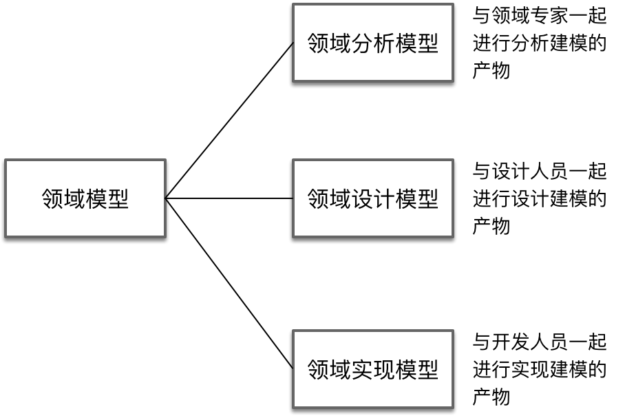
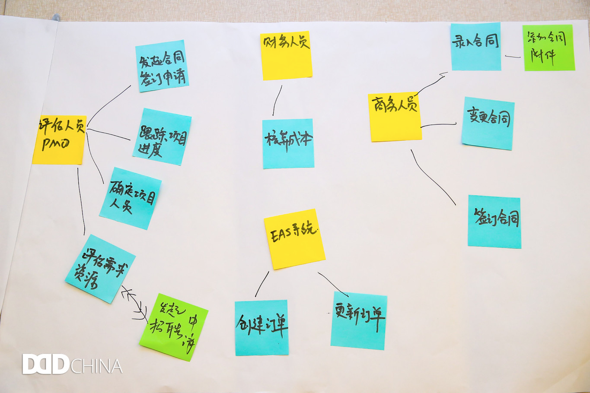
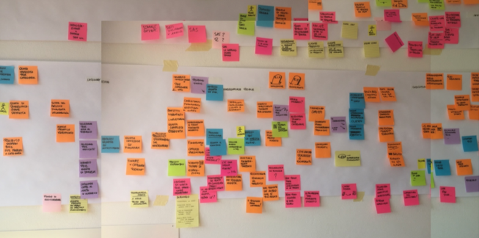
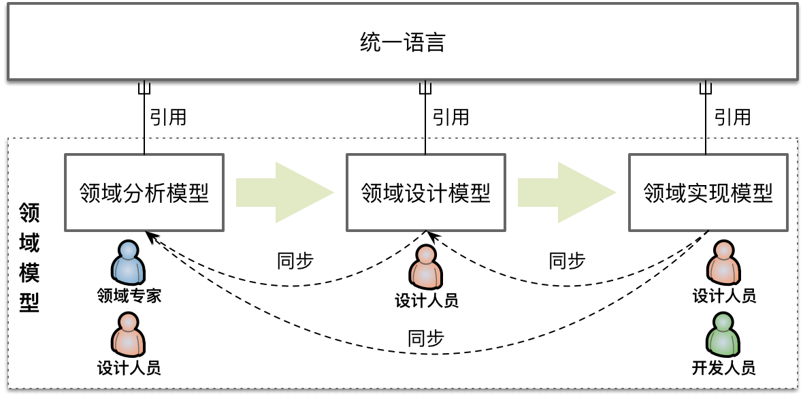
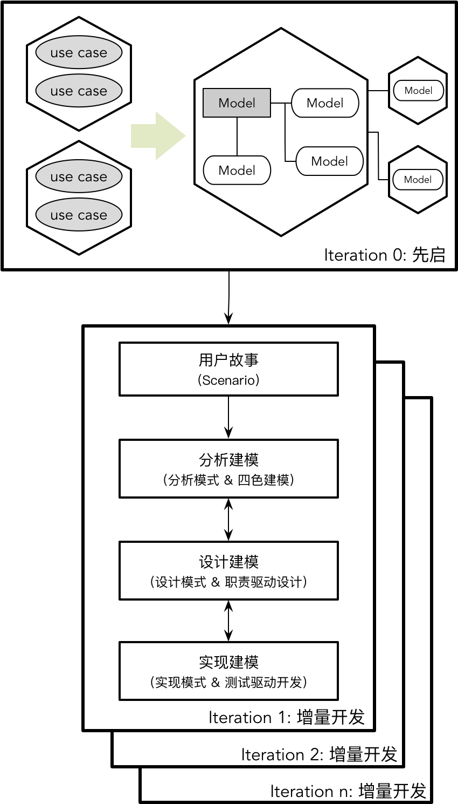

# 049 理解领域模型

我始终认为，Eric Evans 的领域驱动设计是对软件设计领域的一次重新审视，是在面向对象语言大行其道时对数据建模的“拨乱反正”。Eric 强调了模型的重要性，例如他在书中总结了模型在领域驱动设计中的作用包括：

- 模型和设计的核心互相影响
- 模型是团队所有成员使用的统一语言的中枢
- 模型是浓缩的知识

显然，模型在领域驱动设计中是设计的起点和关键。但是，该**如何才能得到**我们心目中能够准确表达业务需求的模型呢？

我们需要认识到模型和领域模型是两个不同层次的概念。如前所述，模型还可以是数据模型或服务模型，这取决于我们观察现实世界业务需求的视角。因此，**领域模型是以“领域”为关注核心的模型，是对领域知识严格的组织且有选择的抽象。**

### 领域模型的特征与分类

即便有了这个定义，却没有清晰地说明领域模型到底长什么样子。领域模型究竟是什么呢？是使用建模工具绘制出来的 UML 图？是通过编程语言实现的代码？或者干脆就是一个完整的书面设计文档？

我认为，UML 图、代码与文档仅仅是表达领域模型的一种载体而已，如果绘制出来的 UML 图或者编写的代码与文档并没有传递领域知识，那就不是领域模型。

因此，领域模型应该具备以下特征：

- 运用了统一语言来表达领域中的概念
- 蕴含了业务活动和规则等领域知识
- 对领域知识进行了适度的提炼和抽象
- 它的建立是一个迭代的演进的过程
- 能够有助于业务人员与技术人员的交流

既然如此，不管领域模型的表现形式，只要它正确地传递了领域知识，并有助于业务人员与技术人员的交流，就可以说是领域模型。这是一个更不容易犯错误的定义。它其实体现的是一种建模原则。很可惜，这样高屋建瓴的原则并不能指导开发团队运用领域驱动设计。就好似软件设计有个核心原则是“高内聚低耦合”，然而知道这个原则并不能保证你设计出高内聚低耦合的方案。故而诸如这样打太极似的原则与模糊定义，并不能让开发团队满意，他们还是会执着地追问：领域模型**到底**是什么？

Eric 并没有就此作出正面地解答，但是他在模型驱动设计中提到了模型与程序设计之间的关系：

> “模型驱动设计不再将分析模型和程序设计分离开，而是寻求一种能够满足这两方面需求的单一模型。”

这句话说明分析模型和程序设计应该一起被放入到同一个模型中。这个单一模型就是“领域模型”。他反复强调程序设计与程序实现应该忠实地反映领域模型，他写道：

> “软件系统各个部分的设计应该忠实地反映领域模型，以便体现出这二者之间的明确对应关系。”

同时，他还要求：

> “从模型中获取用于程序设计和基本职责分配的术语。让程序代码成为模型的表达。”

在我看来，设计对领域模型的反映，就是“领域设计模型”；代码对领域模型的表达，就是“领域实现模型”。领域分析模型、领域设计模型与领域实现模型在领域视角下，成为了领域模型中相互引用和参考的不可或缺的组成部分，它们分别是分析建模活动、设计建模活动与实现建模活动的产物。

模型驱动设计非常强调模型的一致性，Eric Evans 甚至认为：

> “将分析、建模、设计和编程工作过度分离会对模型驱动设计产生不良影响。”

这正是我将分析、设计和实现都统一到模型驱动设计中的原因。因此，倘若我们围绕着“领域”为核心进行设计，采用的就是领域模型驱动设计，整个领域模型就应该包含领域分析模型、领域设计模型和领域实现模型：

### 如何表现领域模型

因为交流的目标对象不同，不同的领域模型会有不同的表现形式。文档描述、UML 图与实现代码是最为常见的模型表现形式。但是，这些表现形式仅仅是对领域建模结果的一种呈现。领域模型的目的在于交流，因此更好的方式是引入直观而又具备协作能力的**可视化手段**，引导领域专家和开发团队参与到领域建模的整个活动中来，而不是由专职的分析师或设计师使用冷冰冰的建模工具绘制 UML 图。通过使用各种颜色的便利贴、马克笔与白板纸等可视化工具，让彩色的领域模型成为一种沟通交流的视觉工具。领域模型中的领域概念、协作关系皆生动形象地活跃在彩色图形上，使得团队协作成为可能，让领域模型更加直观，从而避免沟通上的误差与分歧，使得团队能够迅速就领域模型达成一致。

例如，在运用用例图分析业务逻辑时，就可以用黄色便利贴代表参与者，蓝色便利贴代表主用例，绿色便利贴代表包含用例与扩展用例。便利贴可以在白板纸上自由移动，便于团队的协作和交流：

事件风暴更是将这种可视化手段用到了极致，沿着一条时间线，通过对事件、命令、读模型（Read Model）、流程、策略（Policy）的不断识别，领域专家与开发团队一起探寻业务的真相，绘制出表现业务流程与领域模型的设计画布：

职责驱动设计使用时序图来体现对象之间的协作关系。同样，我们可以用即时贴表达参与协作的对象，在白板上绘制出协作的时序图。如下图所示，我使用不同的颜色表达远程服务、应用服务、领域服务、资源库和聚合：

图中的红色五角星表达一个业务场景只需一个对外公开的接口。多数情况下，这个对外公开的接口就是远程服务。在时序图上，对象之间以箭头表达消息的传递。红色箭头指向的对象，会履行该消息代表的职责，例如 exists() 职责就由该红色箭头指向的 TrainingRepository 对象承担。一个对象如有太多红色箭头指向它，就说明该对象可能承担了太多职责，属于设计的坏味道。同时，我们也需要注意发起消息箭头的对象，它通常代表某个方法的调用者。如果发出了太多消息，说明调用逻辑变得过于复杂，缺少必要的封装层次，同样属于设计的坏味道。图中绘制的蓝色圆圈代表了应用服务发出的调用消息。由于领域驱动设计不允许将业务逻辑封装到应用服务，因此，在一个时序图中应该只能有一个蓝色圆圈。

时序图自身的可视化特征，可以直观地体现职责分配是否平衡。例如，针对一个业务场景绘制的时序图如果过宽，则说明对象的粒度可能太细，增加了不必要的抽象与间接导致协作复杂度增加；如果时序图过窄而高，又可能说明对象的粒度可能太粗，协作仅在有限的几个对象之间完成，没有做到职责的分治。因此，这些可视化特征都能够传递信号，直观地呈现“设计坏味道”，以便于我们对其进行修改和调整。

领域建模的结果固然比过程重要，但如果缺乏高效沟通的建模手段，或许我们根本无法获得正确的领域模型。显然，可视化的表现形式与工作坊的沟通方式可以帮助我们在沟通交流时走出“盲人摸象”的窘境，在团队中传递知识，进而对整个业务系统的领域逻辑达成共识，最终形成领域分析模型与领域设计模型。

至于领域实现模型，则可以通过协作编写测试开始。测试用例体现了具体的业务场景，测试方法的命名更加接近自然语言，Given-When-Then 模式与业务场景的描述非常契合，这就使得**领域专家与开发人员结对编程**成为了可能。如上一课给出的转账业务场景的测试方法，完全可以是这种协作的产物。在针对业务场景进行测试驱动开发时，可以让开发人员将注意力完全放在业务逻辑的实现上。由于代码仅仅是业务逻辑的表达，领域专家就有能力参与进来，帮助开发人员打磨代码，使得代码的编写满足统一语言的要求。代码即模型，这是领域模型最理想的表现形式，也是领域建模最终的模型产物。

### 领域模型与统一语言的关系

领域模型之所以被划分为三个模型，源于不同活动中的交流对象与交流重心各不相同。在分析建模活动中，开发团队与领域专家一起工作，通过建立更加准确而简洁的分析模型，直观地传递着不同角色对业务知识的理解。在设计建模活动中，必须基于领域分析模型对模型中的对象做出设计改进，考虑职责的合理分配与良好的协作，建立具有指导意义的设计模型。在实现建模活动中，代码必须是领域设计模型的忠实表现，意味着它其实也忠实表现了领域分析模型蕴含的领域知识。一言以蔽之，**让领域分析模型服务于开发团队与领域专家，领域设计模型服务于软件设计人员，领域代码模型服务于程序员。**三个模型各司其职，各取所需，它们又都属于领域模型。

在建模过程中，我们需要不断地从“统一语言”中汲取建模的营养，并**通过“统一语言”来维护模型的一致性**。当开发团队根据领域分析模型建立领域设计模型时，如果发现领域分析模型中的概念未能准确表达领域知识，又或者缺少了隐式概念，就需要调整领域分析模型，使得领域设计模型与领域分析模型保持一致。领域实现模型亦当如此。显然，统一语言为领域模型驱动设计提供了一致的领域概念，使得领域模型在整个软件开发阶段保持了同步：

### 迭代建模

**分析、设计与实现不是割裂开的三个阶段**，而是一个迭代建模（Iteration Modeling）过程中的三个建模活动。在战略设计阶段，我们可以通过业务场景识别系统的限界上下文。无论是采用用例场景分析还是事件风暴对限界上下文展开识别，都可以认为是一个自底向上的建模过程。在获得限界上下文的同时，我们也获得了相对细化的用例（或主故事）与初步的领域分析模型。为了避免分析瘫痪（Analysis Paralysis），应将这个过程控制在两周到一个月左右的先启（Inception）阶段完成。

先启阶段结束后，就应该进入针对限界上下文开展领域模型驱动设计的迭代开发。在迭代开发过程中，我们可以根据用户故事结合分析模式与四色建模等手段，进一步细化领域分析模型，然后结合设计模式与设计要素，引入职责驱动设计获得领域设计模型，最后，结合业务场景与设计模型，推进测试驱动开发实践进行编码开发，以小步快速的“红—绿—重构”反馈环不断地改进代码质量和增量开发，快速交付高价值的可运行的功能：

**说明：**迭代建模与本图参考了 Scott W. Ambler 敏捷建模的思想，参见链接：

> http://agilemodeling.com/essays/iterationModeling.htm

迭代建模与迭代的增量开发一脉相承。它避免了在建模过程尤其是分析建模活动中的分析瘫痪，也避免了在设计建模活动中的过度设计，同时还能通过增量快速地开发出新功能来及时获得反馈。获得的领域模型也随着增量开发而不断演化，并始终指导着设计与开发。迭代建模使得建模活动成为迭代开发中不可缺少的一个重要环节，但整个活动却是轻量的，有效地促进了团队成员的交流，符合 Kent Beck 提出的核心价值观——沟通、简单和灵活。