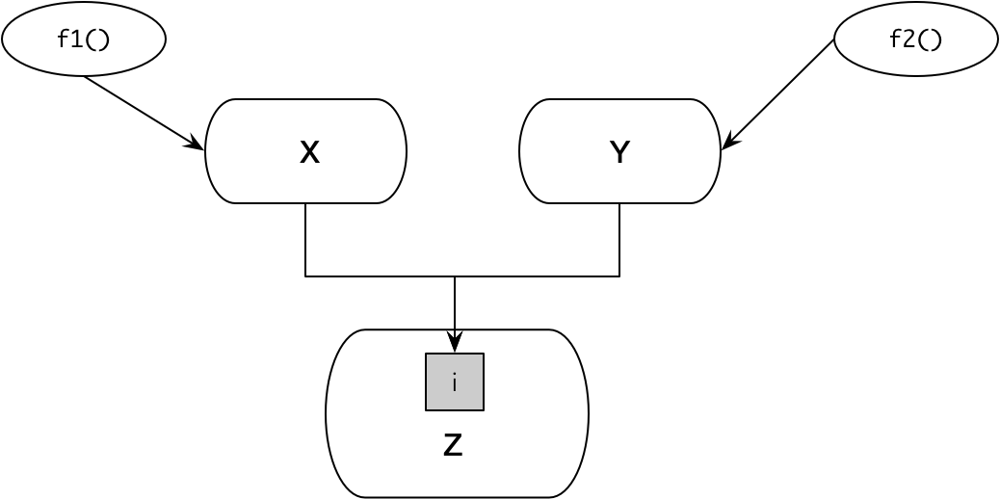
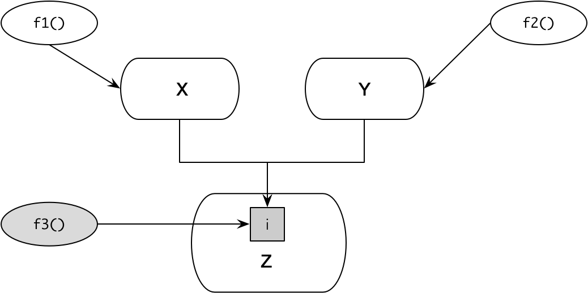
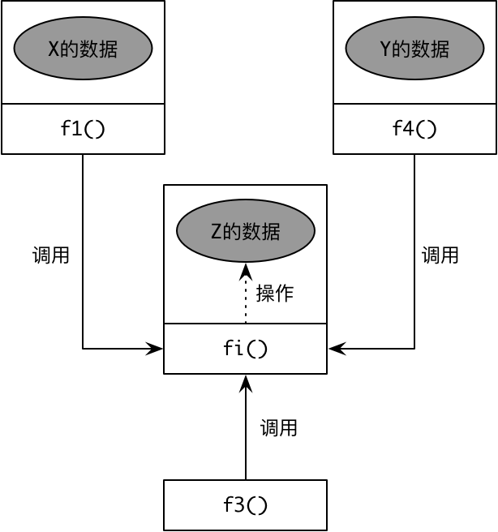
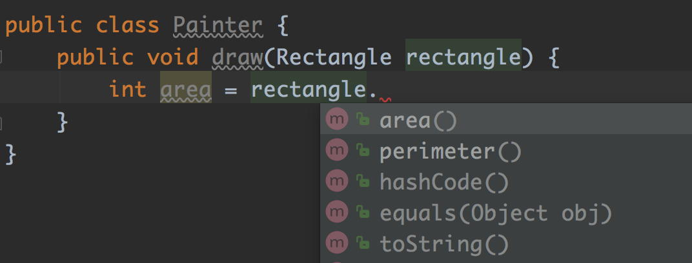

# 050 领域模型与结构范式

### 领域模型与建模范式

即使采用领域模型驱动设计，针对同一个领域获得的领域模型也会千差万别，除了因为设计能力、经验及对现实世界的理解不一致外，对模型产生根本影响的是**建模范式（Modeling Paradigm）**。

“范式（Paradigm）”一词最初由美国哲学家托马斯·库恩（Thomas Kuhn）在其经典著作《科学革命的结构（The Structure of Scientific Revolutions）》中提出，被用于对科学发展的分析。库恩认为每一个科学发展阶段都有特殊的内在结构，而体现这种结构的模型即范式。他明确无误地给出了范式的一个简洁定义：

> “按既定的用法，**范式就是一种公认的模型或模式**。”

范式可以用来界定什么应该被研究、什么问题应该被提出、如何对问题进行质疑，以及在解释我们获得的答案时该遵循什么样的规则。倘若将范式运用在软件领域的建模过程中，就可以认为建模范式就是建立模型的一种模式，是针对业务需求提出的问题进行建模时需要遵循的规则。

倘若要建立领域模型，可以遵循的建模范式包括结构范式、对象范式和函数范式，恰好对应于三种编程范式（Programming Paradigm）：

- 结构化编程（structured programming）
- 面向对象编程（object-oriented programming）
- 函数式编程（functional programming）

建模范式与编程范式的对应关系，也证明了分析、设计与实现三位一体的关系。

### 结构范式

一提及面向过程设计，浮现在我们脑海中的大多是一堆负面的贬义词：糟糕的、邪恶的、混乱的、贫瘠的……实际上，面向过程设计就是结构化编程思想的体现，如果追溯它的发展历史，我们发现该范式提倡的设计思想与面向对象编程和函数式编程在本质上并无太大区别。它，并不代表一定是“坏”的设计。

结构化编程的理念由 Edsger Wybe Dijkstra 在 1968 年最先提出。在给 CACM 编辑的一封信中，Dijkstra 论证了使用 goto 是有害的，并明确提出了顺序、选择和循环三种基本的结构。通过这三种基本的结构，可以使程序结构可以变得更加清晰、富有逻辑。

结构化编程强调模块作为功能分解的基本单位。David Parnas 在 1971 年发表的论文 *Information Distribution Aspect of Design Methodology* 中解释了何谓“结构”：

> “所谓‘结构’通常指用于表示系统的部分。结构体现为分解系统为多个模块，确定每个模块的特征，并明确模块之间的连接关系。”

针对模块间的连接关系，在同一篇论文中 Parnas 还提到：

> “模块间的信息传递可以视为接口（Interfaces）。”

这些观点体现了结构化设计的系统分解原则，通过模块对职责进行封装与分离，通过接口管理模块之间的关系。

模块对职责的封装体现为信息隐藏（Information Hiding），这一原则同样来自于结构化编程。还是 David Parnas，他在 1972 年发表论文《论将系统分解为模块的准则》中强调了信息隐藏的原则。

《代码大全》的作者 Steve McConnell 认为：

> “信息隐藏是软件的首要技术使命中格外重要的一种启发式方法，因为它强调的就是隐藏复杂度，这一点无论是从它的名称还是实施细节上都能看得很清楚。”

信息隐藏在面向对象设计中，其实就是封装和隐私法则的体现。

结构化编程的着眼点是“面向过程”，采用结构化编程范式的语言就被称之为“面向过程语言”。因此，面向过程语言同样可以体现“封装”的思想，如 C 语言允许在头文件中定义数据结构和函数声明，然后在程序文件中具体实现。这种头文件与程序代码的分离，可以有效地保证程序代码中的具体实现细节对于调用者而言是不可见的。当然，这种封装性不如面向对象语言具有更为丰富的封装层次，对数据结构不具有控制权。倘若有别的函数直接操作数据结构，就会在一定程度上破坏了这种封装性。

以过程为中心的结构化编程思想强调“自顶向下、逐步向下”的设计原则。它对待问题域的态度，就是将其分解为一个一个步骤，每个步骤再由函数来实现，并按照顺序、选择或循环的结构对这些函数进行调用，组成一个主函数。每个函数内部同样采用相同的程序结构。以过程式的思想对问题进行步骤拆分，就可以利用功能分解让程序的结构化繁为简，变混乱为清晰。显然，只要问题的拆分合理，且注意正确的职责分配与信息隐藏，面向过程的程序设计同样可以交出优秀设计的答卷。

不可否认的是，面向对象设计是面向过程设计的进化，软件设计人员也在这个发展过程中经历一次编程范式的迁移，即从面向过程迁移到面向对象。为何要从过程进化到对象呢？根本原因在于这两种方法对程序的理解截然不同。面向过程语言 Pascal 的发明人沃斯教授认为：

**数据结构 + 算法 = 程序**

这一公式概况了面向过程语言的特点：数据结构和变量相对应，算法和函数相对应，算法是用来操作数据结构的。至为关键之处在于，**面向过程设计强调将数据结构与算法分开**，这就会导致：

- 无法直观说明算法与数据结构之间的关系：当数据结构发生变化时，分散在整个程序各处的操作该数据结构的算法都需要修改。
- 无法限制数据结构可被操作的范围：任何算法都可以操作任何数据结构，就有可能因为某个错误操作导致程序出现问题而崩溃。
- 操作数据结构的算法被重复定义：算法的重复定义并非故意为之，而是缺乏封装性的必然结果。

假设算法 f1() 和 f2() 分别操作了数据结构 X 和 Y。由于粒度的原因，X 和 Y 数据结构共享了底层数据结构 Z 中标记为 i 的数据。它们之间的关系如下图所示：



如果 Z 的数据 i 发生了变化，会影响到函数 f1() 和 f2()，但由于我们知道这个变化，因此程序是可控的。然而，由于数据结构与算法完全分离，在这同时还有别的开发人员增加了一个操作底层数据结构 Z 的函数，原有开发人员并不知情。如下图所示的函数 f3() 操作了数据结构 Z 的数据 i，却有可能在 i 发生了变化时并没有做相应调整，带来隐藏的缺陷：



面向对象通过将数据结构与算法封装在一起，使得数据与函数之间的关系更加清晰。例如数据结构 X 与算法 f1() 封装在一起，数据结构 Y 和算法 f2() 封装在一起，同时为数据结构 Z 提供算法 fi()，作为访问数据 i 的公有接口。任何需要访问数据 i 的操作都通过 fi() 算法调用，包括前面提及的算法 f3()：



显然，倘若 Z 的数据发生了变化，算法 fi() 一定会知晓这个变化；由于 X 和 Y 的算法 f1()、f2() 以及后来增加的 f3() 并没有直接操作该数据，因此这种变化被有效地隔离了，不会受到影响。

正如前面所说，算法的重复定义也很难避免。例如事先定义了 Rectangle 类，它定义了矩形的宽度和长度：

```java
public class Rectangle {
    private int width;
    private int length;

    public Rectangle(int width, int length) {
        this.width = width;
        this.length = length;
    }

    public int getWidth() {
        return width;
    }

    public int getLength() {
        return length;
    }
}
```

一个几何类 Geometric 类需要计算矩形的周长和面积，因而它会调用 Rectangle：

```java
public class Geometric {
    public int area(Rectangle rectangle) {
        return rectangle.getWidth() * rectangle.getLength();
    }

    public int perimeter(Rectangle rectangle) {
        return (rectangle.getWidth() + rectangle.getLength()) * 2;
    }
}
```

现在，其他开发人员需要编写一个绘图工具，同样需要用到 Rectangle：

```java
public class Painter {
    public void draw(Rectangle rectangle) {
        // ...

        // 产生了和 Geometric::area() 方法一样的代码
        int area = rectangle.getWidth() * rectangle.getLength();

        //...
    }
}
```

由于 Rectangle 类将数据与行为分别定义到了不同的地方，调用者 Painter 在重用 Rectangle 时并不知道 Geometric 已经提供了计算面积和周长的方法，因而会首先想到亲自实现他需要的行为。这就必然造成相同的算法被多个开发者重复实现。只有极其有心的开发者才可能会尽力地降低这类重复。当然，这是以付出额外精力为代价的。

Rectangle 类就是我们在前面提及的贫血对象，如果建立的模型皆为这样只有数据没有行为的贫血对象，则该模型为贫血模型。Martin Fowler 认为：

> 贫血模型一个明显的特征是它仅仅是看上去和领域模型一样，都拥有对象、属性、对象间通过关系关联。但是当你观察模型所持有的业务逻辑时，你会发现，贫血模型中除了一些 Getter 和 Setter 方法，几乎没有其他业务逻辑。这种情况事实上是由一些设计规则中规定不要把业务逻辑放到“领域模型”中造成的，取而代之的是把所有的业务逻辑都封装到众多 Service 中。这些 Service 对象在“领域对象”（领域层）之上形成一个 Service 层，而把“领域对象”当做数据使用。

如果把操作数据结构的算法都放在一起，并把数据结构隐藏起来，开发者就失去了自由访问数据的权力。如果一个开发者需要计算 Rectangle 的面积，数据访问权的丧失会让他首先考虑的不是在类的外部亲自实现某个算法，而是首先寻求重用别人的实现，从而最大程度地避免重复：

```java
public class Rectangle {
    // 没有访问 width 的需求时，就不暴露该字段
    private int width;
    // 没有访问 length 的需求时，就不暴露该字段
    private int length;

    public Rectangle(int width, int length) {
        this.width = width;
        this.length = length;
    }

    public int area() {
        return this.width * this.length;
    }

    public int perimeter() {
        return (this.width + this.length) * 2;
    }
}
```

由于数据与行为封装在了一起，当我们调用对象时，IDE 还可以让开发人员迅速判断被调对象是否提供了自己所需的接口：



通过这个例子我们也解释了为何贫血模型是结构范式的体现：贫血模型将数据结构与算法分开，无法有效地利用对象的封装能力。

如果按照数据模型驱动设计，很容易获得贫血模型。因为在针对数据库和数据表建模时，数据模型中的持久化对象作为数据表的映射，扮演了数据提供者的角色，这正是 Martin Fowler 所说的“一些设计规则中规定不要把业务逻辑放到‘领域模型’”。

在分层架构中，持久化对象并不属于领域层，而是作为表的映射放在基础设施层（数据访问层）。此时的持久化对象其实并非真正意义上的对象，而是一种数据结构。当然，我们也可以打破这样的规则，将那些操作了持久化对象数据的行为封装到持久化对象中，这时的持久化对象由于包含了领域逻辑，就变成了领域模型的一部分。

因此，模型驱动设计的方法与建模范式并没有必然的联系。即使采用领域模型驱动设计，仍然有可能违背对象范式的设计原则，实现为诸如“事务脚本”这样的过程式代码，这是我们在进行领域模型驱动设计过程中需要时刻警惕的。