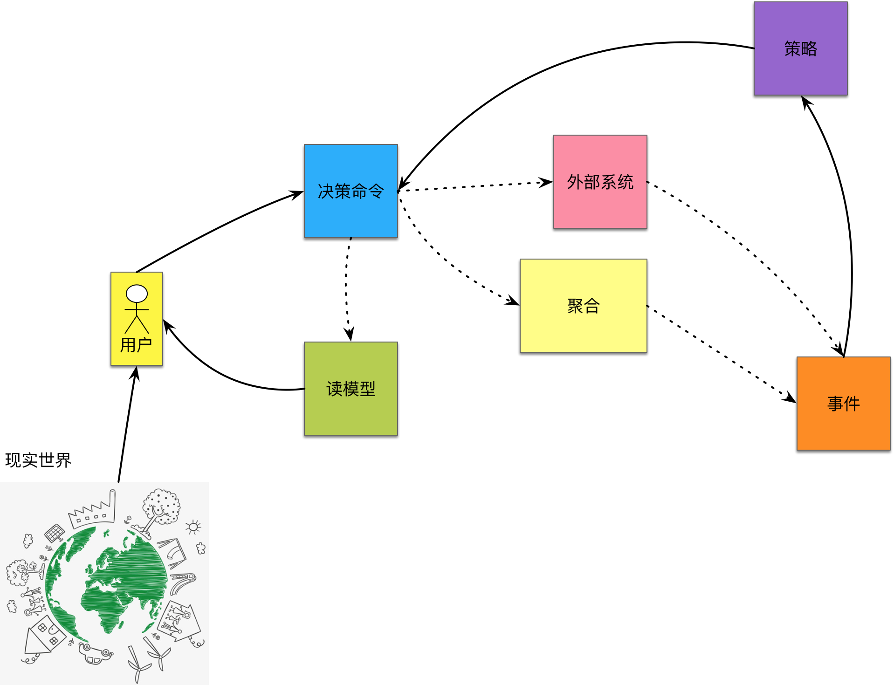
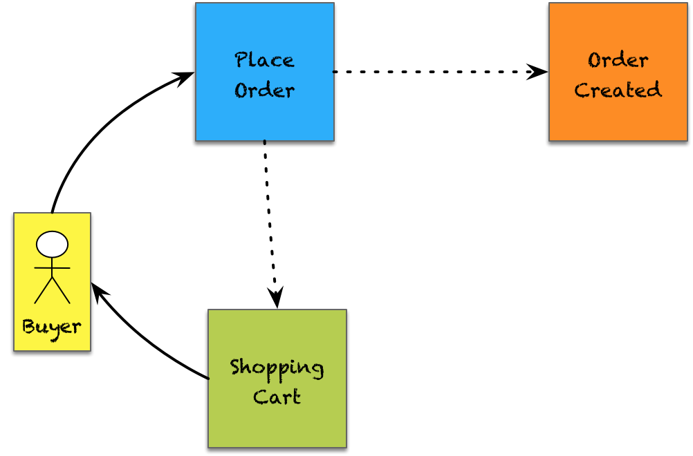
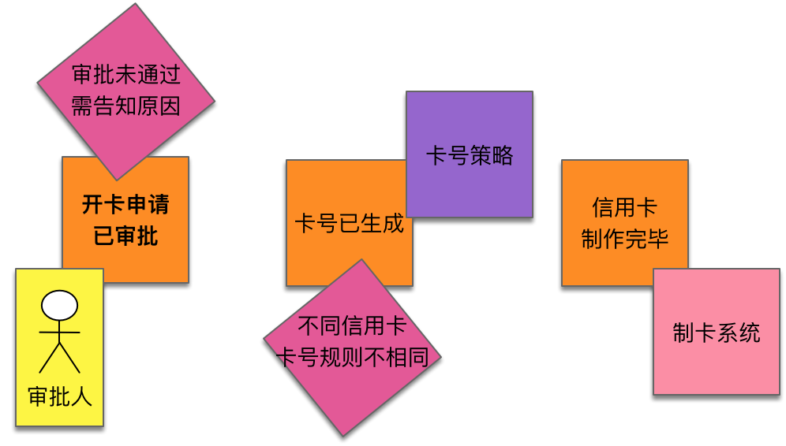
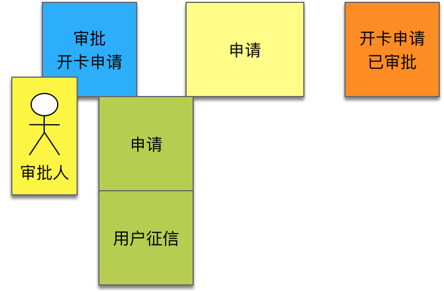

# 062 事件风暴与领域分析建模

在确定了全景事件流之后，可以在战略设计层面继续精进，鉴别出领域与限界上下文的边界。这里略过不提，且进入战术设计阶段的领域分析建模。

### 事件风暴的分析模型要素

通过事件风暴进行领域分析建模，其核心的模型要素就是“事件”。除此之外，参与事件风暴的分析模型要素还包括决策命令、读模型、策略和聚合。其中，事件和策略已经在探索业务全景的时候进行了初步识别。

#### 决策命令

通观事件之起因，除了外部系统是直接发布事件之外，无论是用户活动，还是满足某个条件，都需要一个**命令（Command）\**来响应，它才是直接导致事件发生的“因”。在事件风暴中，Alberto Brandolini 将命令称之为“决策命令（Decision Command）”，使用\**浅蓝色即时贴**表示。决策命令往往由动宾短语组成，例如 Place Order、Send Invitation 等。

由于决策命令和事件存在因果关系，因此二者往往是一一对应的。例如，Cancel Order 决策命令会触发 OrderCancelled 事件，Subscribe Course 决策命令会触发 CourseSubscribed 事件。正是这种一一对应关系，使得它们存在语义上的重叠，区别仅在于时态。故而有的事件风暴实践者认为可以在事件风暴中省略决策命令。我并不敢苟同这一观点，相反，我反而极为强调**决策命令在事件风暴中的重要性**，它是领域分析建模的一个重要驱动力，因为通过**它连接了用户、策略、聚合、读模型和事件**，如下图所示：

从图中可以看出，由**事件**可以驱动出**决策命令**，在它们之间借由**聚合**对象来发布事件。当事件发生后，如果某个**策略**满足条件，也会引发决策命令，而**用户**在引发决策命令时，需要足够的**读模型**来帮助它做出正确的决策。

那么，该如何正确地理解决策命令？显然，Alberto Brandolini 使用决策来修饰命令并非空穴来风，因为这一名词突出了命令往往需要更多的信息来帮助参与者（Actor）做出决策。参与者是用例图的设计要素，在事件风暴中，可以认为是对所有事件起因的抽象：用户、条件满足（如定时器）与外部系统。其中，外部系统对我们而言是一个黑盒子，不用考虑它是如何触发了事件，因而可以忽略。因此，参与者在基于业务场景做出决策时，需要如下两方面数据的支撑：

- 信息：必须基于足够充分的信息才能做出正确的决策，提供这些信息的对象被称之为**读模型（Read Model）**，在事件风暴中用**浅绿色即时贴**表示。
- 策略：根据业务规则，当某个条件满足时，会触发一个决策命令，这个业务规则被命名为**策略（Policy）**，在事件风暴中用**紫色标签**表示。

#### 读模型和策略

当决策命令由用户引发时，可以确认该决策命令的发生是否需要提供足够的读模型信息。读模型是用户通过查询（读）操作获得的。若不具备这一信息，可能不足以支持用户执行决策命令。例如买家希望提交订单，就需要先查看购物车获得购物车内容，然后才能执行下订单（Place Order）的决策命令，触发 OrderCreated 事件。这时，查看购物车获得的结果 ShoppingCart 就是读模型：

读模型是用户执行决策命令必需的输入信息，在代码层面，这些读模型就是执行决策命令的领域行为所需的输入参数。用户发起决策命令的方式是因为执行了某个活动，例如决策命令“提交订单”实则是因为用户点击了“提交订单”按钮。用户活动的执行与用户体验（User eXerperience，UX）直接有关。现实世界的业务场景通过用户体验将用户与读模型结合起来，把信息传输给事件风暴的决策命令。这一过程牵涉到用户、查询和命令操作，恰好符合组成用例的要素。若建模人员熟悉用例，也可借助用例图来分析。

注意，上图是将读模型 ShoppingCart 提供给 Place Order 决策命令，而非查询操作与命令操作之间的交互。有的事件风暴实践者将查询操作也纳入到事件风暴的模型中，认为是用户执行查询操作获得读模型后，触发了决策命令，如下图所示：

我认为这样的模型设计并不恰当，因为它**将活动流程图与事件的因果关系混为一谈**了。实际上，活动流程图反应了现实世界的问题域，事件风暴表现的事件因果关系却是解决方案域的内容，这是领域建模活动中两个不同的层次。买家先查询购物车，然后提交订单，这是买家的操作流程。但从事件的因果关系看，并非“查询购物车”触发了“提交订单”这个决策命令，而是用户通过查询获得了购物车读模型之后，由用户发起“提交订单”的决策命令，再通过订单聚合发布了 OrderCreated 事件。“查询购物车”和“提交订单”是两个不同的用户活动，它们并不具有时序上的连续性，可以认为是两个独立的业务场景。由于查询操作并不会触发事件的发生，从模型上看，它也不会导致命令的发生，因而在事件风暴中，**并没有查询操作的位置**，而是以读模型的形式出现。这也变相地促使建模人员在识别用户活动时，需要分辨该活动究竟是查询还是命令，有利于 CQRS 模式的落地。

当决策命令由策略引发时，就表示事件发生后某些数据满足了某条业务规则。一旦该策略被满足，就会引起目标对象的状态变更，然后根据业务规则的规定触发下一个决策命令。例如，策略“提交订单后，一旦超过规定时间未支付，则取消订单”会触发 Cancel Order 命令，从而引起 OrderCancelled 事件的发生。策略引发的决策可以是自动的，如定时器检测到支付时间超时；也可以是用户手动触发，如用户登录时输入错误密码的次数太多；还可以二者并存，如在取消订单业务场景中，Cancel Order 命令既可以由定时器自动触发，也可以由用户手动触发。

#### 聚合

虽然决策命令和事件之间存在因果关系，但事件并非直接由决策命令发布，而是借助一个“媒介”来发布事件。这个媒介就是“聚合（Aggregate）”。聚合在事件风暴中使用**黄色大即时贴**来表示。**聚合划分了现实世界和模型世界之间的界线**。在现实世界，是用户执行了决策命令触发了事件；在模型世界，是聚合履行了发布事件的职责。例如，在电商系统的业务流程中，现实世界的用户活动是用户提交了订单；在模型世界，是 Order 聚合发布了 OrderCreated 事件。

寻找聚合的过程可能是一个艰难的过程。由于聚合是构成领域分析模型的核心要素，识别聚合需要审慎，不要轻易下结论。若未寻找到它，可以先贴上一个空白的黄色大即时贴表示这里存在一个聚合，但目前还不知道它的名字。

在事件风暴中，我们也可以利用事件来反向寻找聚合。分析事件的特征，由于它是由决策命令触发的，意味着事件的产生会带来**目标对象状态的变化**。状态的变化分为三种形式：

- 从无到有：意味着创建，例如“订单已创建”事件标志着新订单的产生。
- 修改属性值：意味着值的更新，例如“订单已取消”事件使得订单从之前的状态变更为“已取消”状态；也可能意味着内容的变化，例如“商品被加入到购物车”事件，说明购物车增加了一个新的条目。
- 从有到无：意味着删除，不过在多数项目中并不存在这种状态变化；表面是删除，实际是修改属性值。例如“会员已注销”事件和“商品已下架”事件，实则都不是直接删除会员和商品记录，而是将该记录的状态置为“已注销/已下架”状态。

显然，发生状态变更的对象有很大几率就是我们要寻找的聚合对象。毕竟聚合对象承担了发布事件的职责，而事件又是由于状态变更而产生。谁能准确地侦知状态是否变更以及何时发生变更？我想，只有拥有状态的聚合对象自身才具备这一能力。

### 事件风暴的领域分析建模过程

显然，围绕着“事件”为中心，事件风暴给出了一条有章可循的领域分析建模路径。领域分析建模的基础是探索业务全景的产出物，即业已识别出来的事件流，以及参与事件流的用户、策略与外部系统。整个领域分析建模的过程如下：

- 第一步：挑选任意一个与用户有关的事件，反向驱动出决策命令，该用户就是发出决策命令的人（角色）。从事件驱动出决策命令非常容易，就是将事件的过去时态转换为动宾形式的决策命令即可。
- 第二步：根据决策命令与事件之间的因果关系，推导出要发布该事件必须的前置信息，即决策所需的读模型。读模型通常由用户通过查询操作获得，可以理解为是决策命令行为的输入参数。
- 第三步：根据事件状态变更的目标，决定决策命令与事件之间的聚合对象。若无法确定，则保留一个空的黄色即时贴，待以后确定。
- 第四步：选择当前事件的后置事件。若后置事件仍然与用户有关，则重复第一步；若后置事件与外部系统有关，可以跳过该事件的建模，继续选择下一个后置事件。若事件与策略有关，在进一步细化策略对象之后，驱动出决策命令，重复第三步。

以前面所示的信用卡开卡事件流为例，我们依次选择以下三个事件：

首先是审批人参与的“开卡申请已审批”事件，执行第一步，由该事件可以反向驱动出决策命令“审批开卡申请”。第二步是根据决策命令推导出触发事件需要的读模型。审批开卡申请的前置信息是“申请”和“用户征信”，若缺乏这两个信息，审批人无法做出“审批开卡申请”的决策。第三步是确定决策命令与事件之间的聚合对象。显然，“开卡申请已审批”事件影响到的就是申请的状态，它就是我们要寻找的聚合对象：

接着进入第四步，选择下一个后置事件“卡号已生成”。该事件与策略有关，细化策略为“卡号规则”。由事件驱动出决策命令为“生成卡号”，进入第三步，识别两者之间的聚合对象。卡号的生成影响了信用卡的属性，可以认为该事件影响状态的目标对象为“信用卡”：

继续第四步，选择下一个后置事件“信用卡制作完毕”。由于该事件由外部系统发布，可以忽略该建模过程，仅仅标记外部系统即可：

通过这个简单案例，可以清晰地看到我总结的领域分析建模过程具有一定的可操作性。事件风暴工作坊的参与人员可以按照建模步骤一步一步执行。执行每一步都需要团队与领域专家进一步讨论和确认，保证识别出来的模型对象遵循该领域的统一语言。在这个分析建模过程中，每个模型对象都有着建模的参考依据，包括模型对象的身份特征、彼此之间的关系、承担的职责，这就在一定程度上减轻了对建模人员经验的依赖。

事件风暴的两个层次恰好可以对应领域驱动设计的战略阶段与战术阶段。前者主要用于识别限界上下文，后者主要用于建立领域分析模型，这恰恰填补了 Eric Evans《领域驱动设计》书中的关键空白。当然，Alberto Brandolini 提出的事件风暴不仅于此，它还能用于企业的流程改进、业务创新和对新型服务的探索。这些实践与领域驱动设计没有直接关系，这里就不再叙述。若有兴趣了解事件风暴的更多内容，可以访问[事件风暴的官方网站](https://www.eventstorming.com/)。

### 分享交流

我们为本课程付费读者创建了微信交流群，以方便更有针对性地讨论课程相关问题。入群方式请到第 6-1 课末尾添加小编的微信号，并注明「DDD」。

阅读文章过程中有任何疑问随时可以跟其他小伙伴讨论，或者直接向作者提问（作者看到后抽空回复）。**你的分享不仅帮助他人，更会提升自己。**