# 063 案例 订单核心流程的事件风暴

现在，我们针对电商领域的订单核心流程开展事件风暴工作坊，以此来获得我们的领域分析模型。

### 工作坊准备

要开展好事件风暴工作坊，需得具备天时地利人和。

#### 天时地利人和

天时。需得安排好专门的时间来一个为期多天的事件风暴。事件风暴很难一蹴而就，尤其面对纷繁复杂的业务逻辑。时间太长，又会让参与人员过于疲累，激发不出风暴的灵感。因此，需得合理地安排好风暴的节奏，以类似迭代的方式增量地进行。若是利用事件风暴进行业务全景探索，则可以将事件风暴的活动安排在整个项目的先启阶段。至于领域分析建模，则可以融合在迭代阶段进行。

地利。需得选择一个专门的“作战室”，这间作战室最好要有一面或多面开阔轩敞的墙，提供近乎于无限的建模空间。即时贴需要备齐各种颜色，数量充足。倘若不想在次日朝晨看到风吹落一地的凌乱，就需要购买具有强粘性的好品牌即时贴，还得“糊”一次墙，用胶带将长长的一大卷白色画卷纸贴在墙上，作为即时贴任意驰聘的战场。为了记录下整个事件风暴的过程，应及时对建模的成果拍摄清晰的照片。

人和。事件风暴的参与者不能只是开发团队，必须邀约业务相关的各种角色，包括领域专家、产品经理、需求分析师和现场客户等。事件风暴专家负责主导整个工作坊的进程。贡献“事件”的主力是领域专家这样的业务人员，但开发人员也不能站在旁边只看不做，也需要积极参与进来，通过不停地提问与回答，风暴才能激起思想的旋涡。群策群力，让每个人都参与进来，是工作坊的基本原则。在确定模型要素的名称时，更需要字斟句酌，这时是确定**统一语言**的最佳时机。为避免陷入冗长的讨论，同时保证充分的交流，建议团队站在墙面前开展事件风暴。这样也能方便“搬运”即时贴，随时改变着可视化呈现的模型。若领域足够复杂，获得的模型会呈现一张大图片（Big Picture），为保证交流的顺畅，可以分组在属于自己的那部分同时开展事件风暴。

#### 工作坊工具

当然，事件风暴还需要工具。在开始工作坊之前，请准备好如下工具：

**纸品**

作为事件风暴的“画布”，一大卷连续的白色画卷纸最适宜“糊墙”，在宜家或者文印店都能买到这样长卷的白色画卷纸。画卷纸的长度可以依据“作战室”的墙面长度而定。小型一些的业务场景大概会用到 4 米左右的长度，若能保证 8 米乃至以上的长度，效果更好。如果没有购买到尺寸足够宽的画卷纸，也可以用白板纸代替，利用胶带将其拼接贴在墙上即可。由于事件之间还需要引入更多的建模元素，在贴事件即时贴时，需要为事件之间预留足够的空白。这就需要保证有足够宽的“画布”，可以张贴成百上千的即时贴。

**胶带贴条**

类似与胶带卷的贴条，可以随撕随贴。既可以作为贴画卷纸的胶带，又可以作为标记贴条，例如标记时间轴或限界上下文的边界。这种胶带贴条也可以有多种颜色。

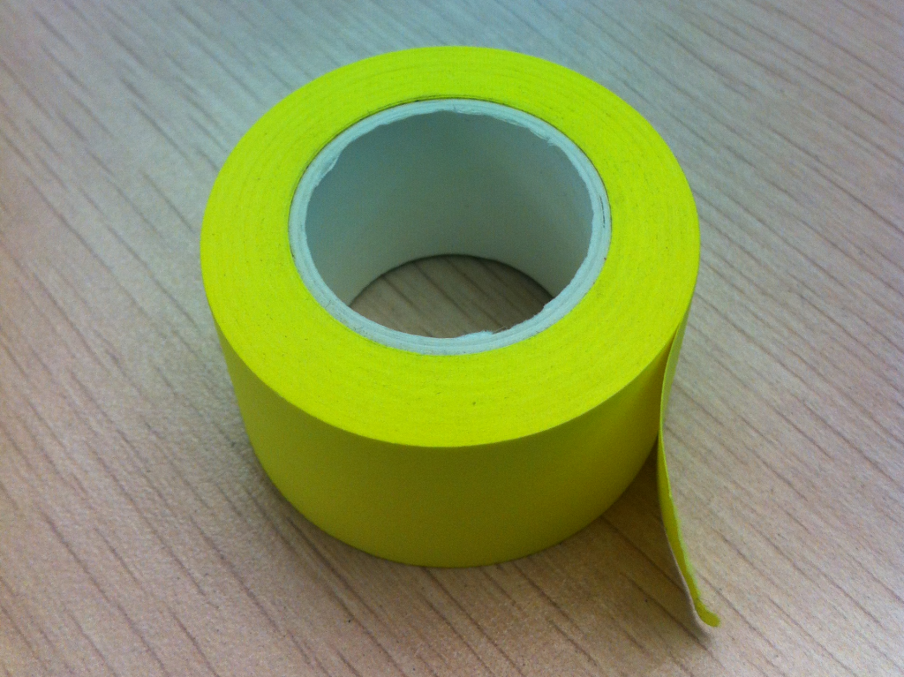

**笔**

事件风暴要将事件、读模型等领域概念书写在方寸之间的即时贴上。字不能太细，否则拍照后看不清楚即时贴上的文字，失去参考价值；也不能太粗，否则这么小的即时贴容不下太多的文字。通常可以选择 Sharpie 系列的标准马克笔，也可以适度配备一些签字笔、阴影马克笔或大号马克笔作为辅助：

**即时贴**

事件风暴是即时贴杀手，各种颜色的即时贴都需要配备一些，最常见的尺寸规格如下所示：

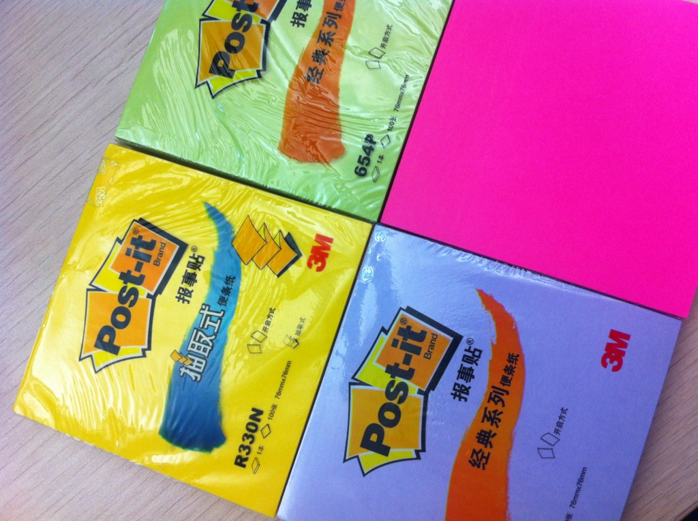

**不要买劣质的即时贴**，好的贴纸撕下来不卷，粘性好，劣质品撕下来就卷，又容易脱落，非常影响事件风暴的质量。

事件风暴对即时贴有自己的颜色编码：

- 事件（Event）: 橙色
- 读模型（Read model）: 浅绿
- 用户（User）: 黄色小即时贴
- 决策命令（Decision Command）: 浅蓝
- 聚合（Aggregate）: 黄色大即时贴
- 外部系统（External System）: 浅粉
- 策略（Policy）: 紫色

由于我将用户、外部系统与策略共同视为触发事件的起因，因此我会选择同等尺寸的小即时贴来代表它们，颜色仍然如前所示。

#### 工作坊计划

万事俱备，还欠缺一份工作坊计划。事件风暴需要整个开发团队与业务人员的参与，这会牵涉到与多个部门之间的协调。无论是领域专家还是现场客户，时间都较难协调。在开展事件风暴之前，工作坊的组织者需要事先协调时间，再根据工作坊内容和目标制定计划。工作坊计划包括内容：

- 时间：具体的开始时间和结束时间，每次事件风暴建议限制在 2 小时以内。
- 地点：选择具备开展事件风暴条件的会议室。
- 参与人员：列举需要参加该次事件风暴的相关人员，最好能明确参与角色和具体参与人。
- 目标：针对一个复杂企业系统而言，事件风暴会持续多天，在制订计划时，最好能事先拆分事件风暴，确定每个事件风暴的目标。

即使形式皆为事件风暴，但其目标可以不同。我们可以运用事件风暴探索业务全景（Big Picture），也可以运用事件风暴建立领域分析模型。这可以是两个阶段分别开展的活动，但主体骨架皆以“事件”为核心。

即使是探索业务全景，我们也需要把控事件风暴的边界和粒度。边界是以领域或业务场景划分的，粒度则是以事件的抽象层次来划分的。例如，我们在针对航空公司的地面服务保障业务开展事件风暴时，既可以从旅客、行李、飞机等子领域分别开展事件风暴，也可以将中转、值机、安检抽象为高层级的事件，形成事件风暴的“分而治之”，让每次事件风暴的目标更加清晰明确且可达。

确定了计划后，就可以按照计划规定的时间如期开展事件风暴。接下来，我将按照上两节讲解的过程，对电商领域的订单核心流程开展事件风暴。

### 探索业务全景

#### 识别事件

在确定参与事件风暴工作坊的人员都对目标业务具有足够了解之后，我们开始沿着时间轴识别事件。由领域专家贴上第一张他/她最为关心的事件，然后由大家分头围绕该事件写出在它之前和之后发生的事件，并按照时间顺序由左向右排列。

在订单核心流程中，毫无疑问，领域专家最为关心的事件当然是“订单已创建”事件了，毕竟在这个流程中，所有业务都与创建好的订单休戚相关。因此我们可以在整面墙的中间贴上橙色即时贴，上面写上“订单已创建”事件：

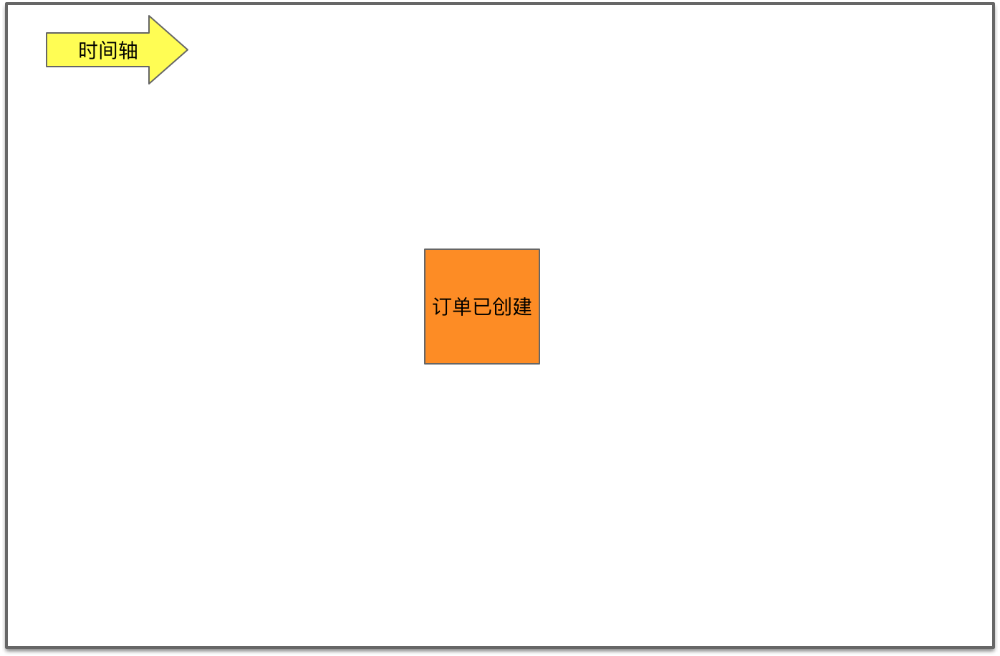

在确定这个核心事件之后，我们就要以此为中心，向前推导它的起因，向后推导它的结果，根据这种因果关系层层推进，逐渐形成一条或多条沿着时间轴且彼此之间存在因果关系的事件流：

现在，以“订单已创建”事件为起点，分别向前和向后去寻找前置事件与后置事件。如果需要探索的全景业务比较复杂，为了更加高效地开展事件风暴，有效利用参与工作坊的人力资源，可以以选定的核心事件为中线，分为两个小团队分别向前和向后驱动当前核心事件的前置事件和后置事件，由此获得该业务流程的全景事件流。要注意，必须保证分开进行的两个小团队都有业务人员参加。为了避免分头进行的两个团队对业务的理解出现歧义，在完成整个全景事件流之后，需要整个团队评审最终获得的事件流，确认识别出来的事件是否正确，是否存在遗漏的事件。

团队 A 从起点开始寻找前置事件。针对“订单已创建”事件，思考要产生该事件的前置条件是什么？显然，只有通过了验证的订单才允许被创建。于是，我们就可以获得前置事件“订单已验证”。以此类推，“订单已验证”事件的前置条件又是什么呢？要进行验证的订单显然已经准备好，但订单的内容却来自购物车。如果买家没有把要购买的商品添加到购物车，就无法创建订单。由此，可以再获得当前事件的前置事件“商品被加入到购物车”：

团队 B 从起点开始寻找后置事件。考虑订单创建之后带来的结果（或影响）是什么呢？买家创建了订单，就代表买家和卖家形成了一个初步的契约。这个契约处于待定状态，并可能会持续一段时间。为了避免在这段时间有别的买家提前买走相同的商品，系统需要锁定库存来保证买家在该状态期间的权利。这个待定状态如何才会变成有效状态呢？这就要从运营角度思考，是需要审核订单，还是买家只要支付完成就可以了？如果需要审核订单，审核者如何才知道该订单已经被创建呢？一旦理清事件会带来的影响，并确定对该事件的处理策略（处理流程），就可以根据业务流程确定当前事件的一系列后置事件。管理和运营的流程不同，带来的事件流也不相同，例如订单是否需要审核，就会影响到“订单已创建”事件的后置事件。

如果需要审核订单，后置事件流如下所示：

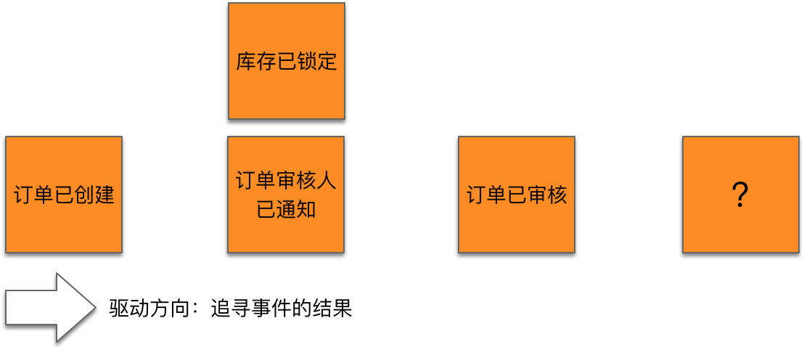

“库存已锁定”与“订单审核人已通知”事件是同时发生的，因此在事件流中处于同一条垂直线，通过并列形式来体现这种同时发生的效果。注意，“订单已审核”事件可能产生两种不同的结果：审核通过或审核拒绝。在进行事件风暴时，为了避免过多业务流程的干扰，可以在一个时段只考虑正常流程，而将异常的流程当做需要关注的热点信息，用粉红色即时贴标记在橙色事件之上：

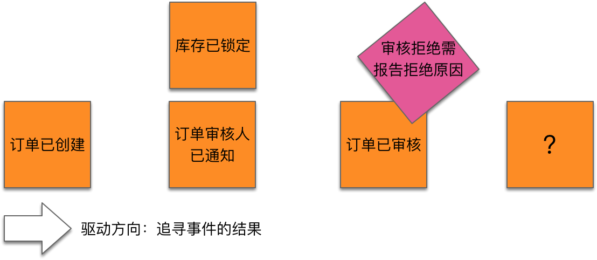

如果不需要审核订单，买家就可以在创建订单后完成支付：

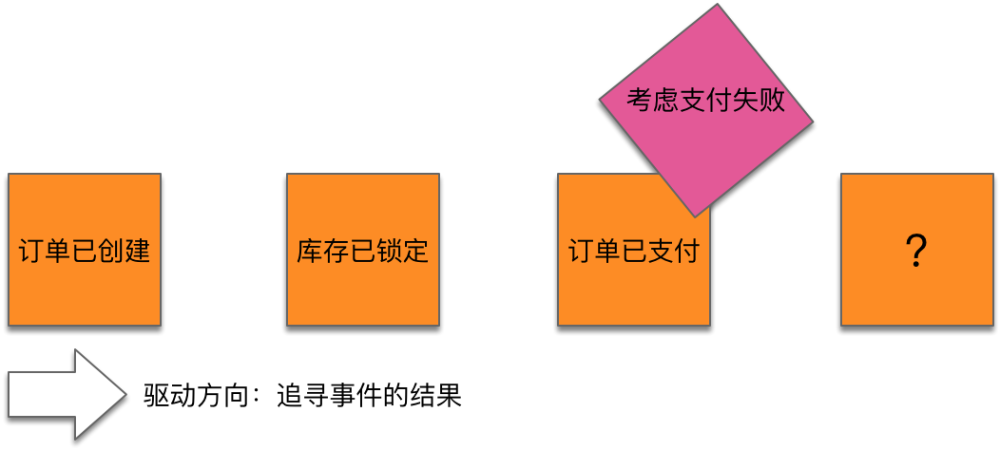

通过对事件起因和结果分别寻找前置事件和后置事件，获得的全景事件流大致如下图所示：

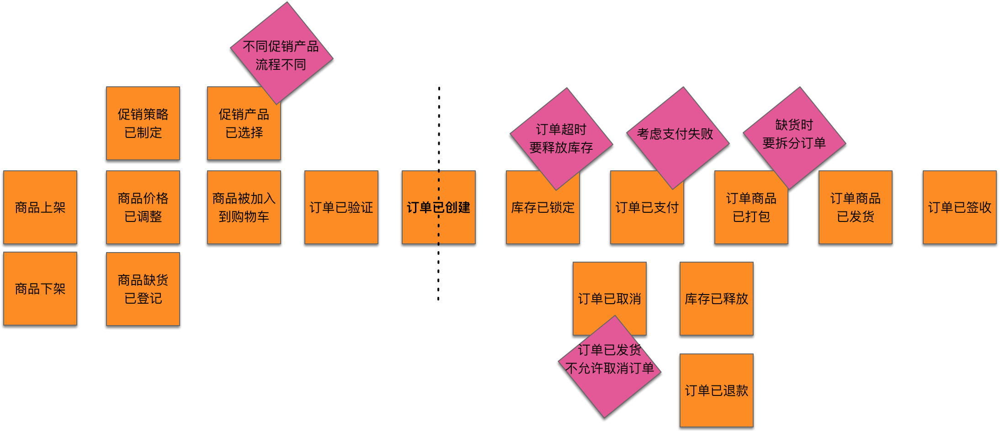

某些事件虽然具有时间概念，但它在时间轴上并非发生在一个时间点，而是在一个时间段内发生，例如“订单已取消”事件，在“订单已创建”到“订单商品已发货”事件之间都可能发生。那么在事件风暴全景图上，可以以并行的水平事件流体现，并将即时贴贴在这两个参考事件中任意一点皆可。为了清晰说明这一约束关系，可以利用粉红色的热点即时贴加以说明。

有的事件可能会牵涉到更加复杂繁琐的深化流程，为了避免事件风暴陷入“分析瘫痪”，可以考虑以粗粒度的事件来概括这些细节流程，又或者通过热点即时贴来说明，如上图中“订单商品已打包”事件并没有考虑缺货时订单拆分的情况，而是以热点形式在事件之上加以说明。然后，可以针对缺货流程，单独发起一次事件风暴，识别相对独立的事件流。

事件风暴的回顾非常重要。长期陷入到事件的“心流”中，容易让参与工作坊的成员感到身心疲惫，当局者迷。稍事休息，甚至可以暂时放下事件风暴的工作，等到第二天再来对事件风暴进行回顾，参与人员可能会出现“灵感迸现”的效应。在回顾过程中审视整个事件流，极有可能发现之前的谬误与缺失。还可以通过邀请未参加工作坊的其他成员帮助团队评审事件流。旁观者清，通过介绍与询问的方式再一次对事件流进行回顾，亦有助于完善事件风暴的产出物。

#### 标记参与者

现在，相对完整的领域事件已经呈现在我们面前，我们可以通过识别事件的参与者：用户、策略与外部系统，进一步确认和精化事件风暴获得的模型。这个过程并不复杂，只要事件是由用户活动触发的，就应该寻找到正确的用户角色；只要事件来自于系统之外，就应该敲定负责发布事件的外部系统；除此之外的事件，则可能与策略有关。由此可以获得如下模型：

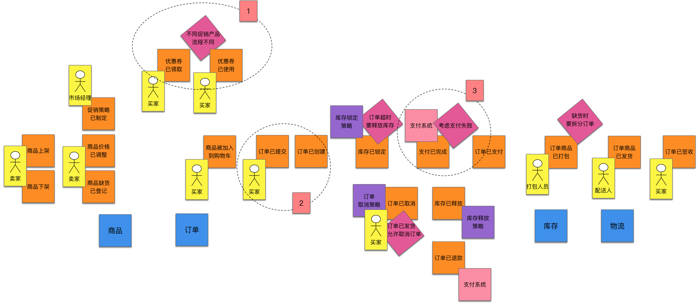

我在上图使用了虚线圆框标记了三个做过调整的地方。这是在识别参与事件的用户、策略与外部系统时，认识到之前识别的事件存在的谬误或遗漏：

- 第 1 处：最初识别的事件为“促销产品已选择”。通过与业务人员的沟通，发现只有“优惠券”这种促销产品才需要领取并使用。因此在这里明确了“优惠券”这一领域概念，同时分拆事件为“优惠券已领取”和“优惠券已使用”。
- 第 2 处：在尝试识别“订单已验证”事件和“订单已创建”事件的参与者时，通过与业务人员的沟通，一致认为需要有买家参与，但是，订单的验证与创建实际是由系统自动完成的，因此这里缺少一个“订单已提交”事件。从管理和运营的角度讲，只要订单被提交了，就意味着订单通过了验证，即“订单已验证”只是提交订单过程中的一个中间状态，管理者并不关心该事件。
- 第 3 处：从“订单已支付”事件的概念描述来看，属于订单核心流程的组成部分，但只有外部的支付系统才具备支付能力。支付系统只关心支付，而不关心支付的到底是订单，还是其他交易。因此，在“订单已支付”事件发生之前，通过外部的支付系统发布了“支付已完成”事件。

#### 分割边界

在获得全景事件流之后，可以确定时间轴的一些关键时间点，用黄色胶带来分割边界。例如在“商品被加入到购物车”事件之前，是客户购买商品前的必要准备；在“订单已支付”事件之后，客户就完成了对商品的购买，但还未收到要购买的商品。显然，上图所示的时间轴可以清晰地分割为购买前、购买中、购买后三个时间段。在完成购买之后，发货与运货之间亦存在明显的时间间隔，可以继续拆分。于是，关键时间点将整个事件流分割为四个子领域边界：商品、订单、库存、物流。分割了边界后的模型如下图所示：

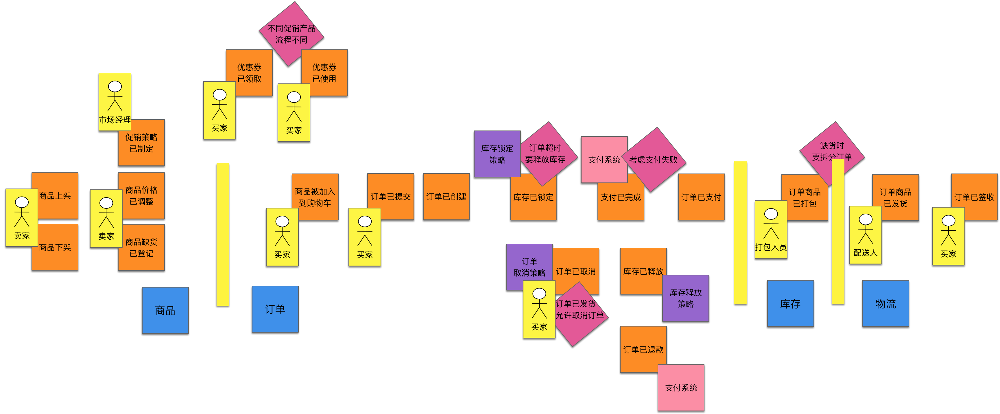

### 领域分析建模

探索完业务全景之后，就可以根据**事件风暴的领域分析建模过程**围绕着业已识别出的事件进行分析建模。因为篇幅原因，我仅选择订单子领域中的几个关键事件进行领域分析建模。

首先是“商品被加入到购物车”事件。由买家执行决策命令“添加商品到购物车”，毫无疑问，需要获得读模型“商品”。由于事件修改了购物车的内容，意味着决策命令将通过聚合“购物车”发布事件：

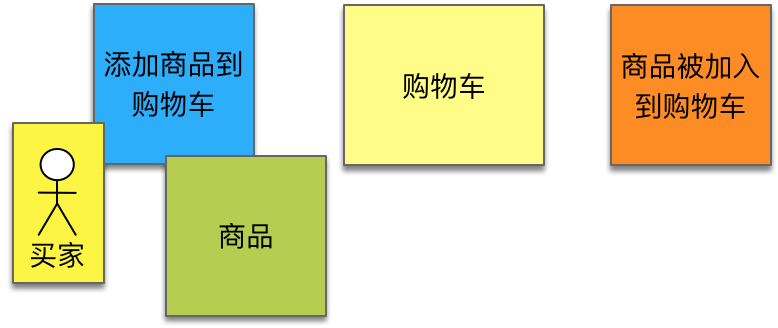

然后考虑后置事件“订单已提交”。同样由买家执行决策命令“提交订单”，需要获得包括购物车和客户的前置信息。购物车中被选中的购物项会进入订单，要提交订单并验证订单，需要提供客户的联系信息、配送地址等内容。当前事件改变了订单的状态，因此，“订单”就是我们要寻找的聚合对象。在提交订单时，需要验证订单是否有效，因此考虑引入“订单验证规则”策略对象。该策略对象本身会引发“订单已验证”事件，但该事件属于管理者并不关心的中间内部事件，故而没有呈现在事件风暴的模型中：

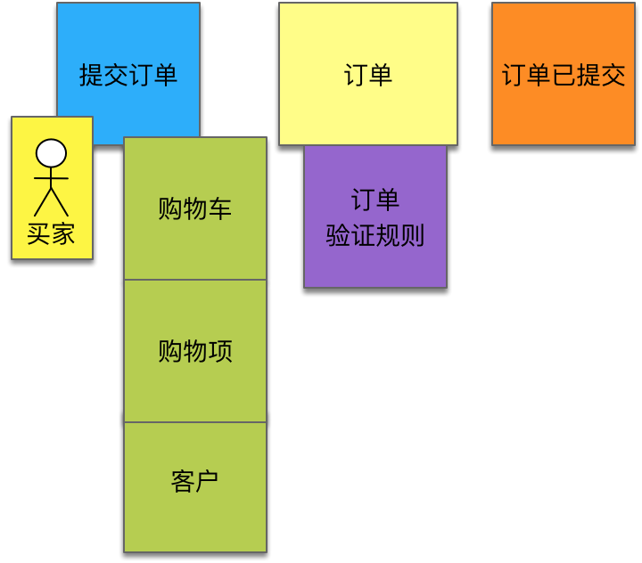

“订单已创建”事件由“订单已提交”事件直接触发，操作的决策命令为“创建订单”。由于“订单”聚合对象已经包含了创建订单的全部信息，因此没有读模型参与到该事件中来。

如此类推，整个分析过程不再一一详细叙述。借助事件风暴获得的领域分析模型如下图所示：

在获得事件风暴的领域分析模型之后，我们尝试确定这些模型对象之间的关系，为领域设计建模阶段奠定良好的基础。读模型、策略与聚合实际上都是领域设计模型中设计要素的重要候选。其中，事件风暴的聚合虽不必然对应于设计模型中的“聚合（Aggregate）”，但可作为识别聚合对象的重要参考，而决策命令就可以作为聚合根或聚合内其他实体的行为。读模型通常为查询操作的结果，一般可以映射为实体或值对象。策略往往作为一种业务规则。为了体现规则所呈现的领域概念，可以引入规格模式将策略对象建立为一个独立的领域服务对象：

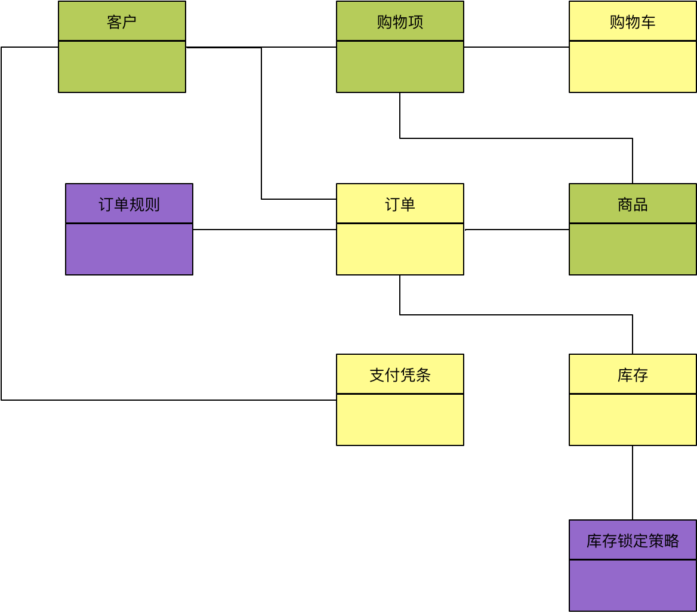

事件风暴的领域模型还可以**作为领域驱动设计过程的重要参考**。在建立领域分析模型时，我们通过事件反向驱动出决策命令，同时也识别了事件的参与者，确定了发布事件的聚合对象。这些信息将有助于我们划分业务场景，分解子任务。在后面的章节中，我以业务场景与任务拆分为基础，将场景驱动设计与领域驱动设计要素、DCI 模式结合起来，建立了一套领域驱动设计的**固化流程**。遵循这套流程，可以让开发团队按照流程步骤绘制时序图，寻找良好协作的对象，在不需要太高面向对象设计能力的情况下，以类似“按图索骥”的方式开发出满足领域驱动设计高质量要求的软件产品。