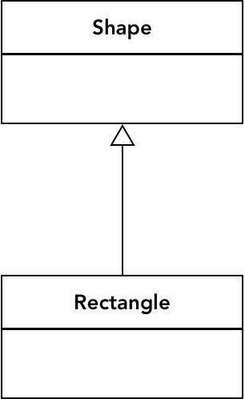
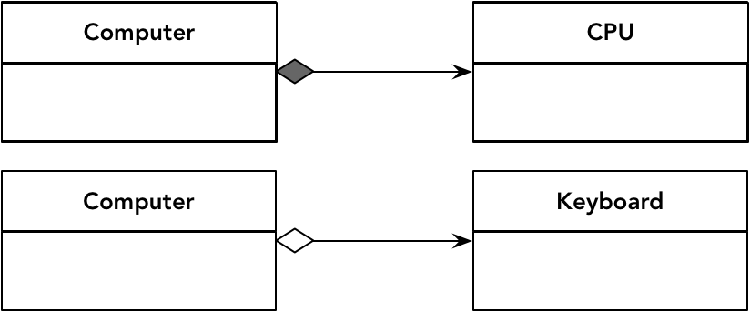
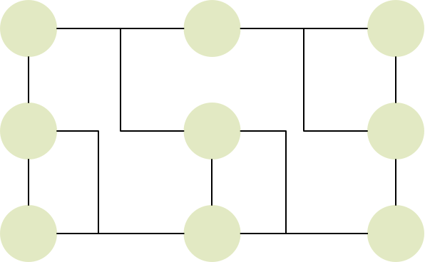
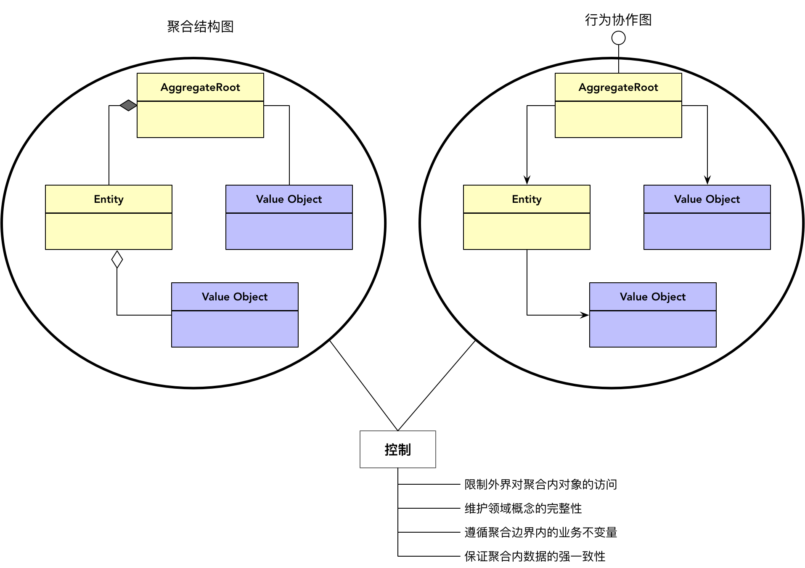

# 067 对象图与聚合

### 类之间的关系

在理解领域驱动设计的聚合（Aggregate）之前，我们需要先理清面向对象设计中对象之间的关系。正如生活中我们不可能做到“鸡犬之声相闻，老死不相往来”一般，对象之间必然存在关系，如此才可以通力合作，形成合力。没有对象之间职责协作的设计，就不是正确的面向对象设计。如果我们将对象建模为类，则对象之间的关系就体现为类之间的关系。类之间存在不同的关系，依赖的强弱也各有不同，从强至弱依次为：

> 继承关系 → 组合关系 → 协作关系

#### 继承关系

继承关系体现了“泛化-特化”的关系，父类提供更加通用的特征，子类在继承了父类的特征之外，提供了符合自身特性的特殊实现。继承关系在 UML 中使用空心三角形加实线的方式来代表子类继承父类，例如矩形类继承自形状类：



继承会导致子类与父类之间形成一种强耦合关系，父类发生任何变更，都会体现到子类中，形成所谓的“脆弱的基（父）类”。在代码实现时，修改父类须得慎之又慎，父类的一处变更可能会影响到它的所有子类，并改变子类的行为。由于继承代表了一种“is”的关系，在领域建模时，父类和子类代表的其实是同一个领域概念的不同层次。

#### 组合关系

组合关系体现了类实例之间整体与部分之间的关系，体现了“has”的概念，即一个类实例“包含了”另一个或多个类实例。组合关系体现了类概念之间的一对一、一对多和多对多关系。依据关系的强弱，组合关系又分别分为“合成（Composition）”关系与“聚合（Aggregation）”关系。前者的关系更强，例如计算机和 CPU 之间就是合成关系，因为离开了 CPU，计算机就不能正常运行；后者的关系较弱，例如计算机和键盘之间就是聚合关系，即使没有键盘，计算机仍然能够正常运行，还可以使用其他输入设备来取代键盘。

从生命周期的角度看，如果是合成关系，表示这个整体/部分关系属于同一个生命周期，即在创建时，除了要创建代表整体概念的主对象，同时还需要创建代表部分概念的从对象，销毁也当遵循这一依存关系。如果是聚合关系，则可以独立地创建和销毁各自类的对象。

组合关系在 UML 中都用菱形来表示。合成为实心菱形，聚合为空心菱形，以此来形象说明其耦合的强弱。注意，菱形应放在主类一边，例如：



我们还可以在组合关系的连线上通过数字来标记它们之间到底是一对一、一对多还是多对多。例如一个 Computer 可能包含多个 CPU：


如果类之间存在一对多关系，可以用集合来表示多的一方，例如 Order 与 OrderItem，就可以定义 List 作为 Order 的属性：

```java
public class Order {
    private List<OrderItem> orderItems;
}
```

对于类的多对多关系，面向对象设计与数据库设计不同，无需引入额外的关联表，而是可以通过对集合的引用直接支持多对多关系。例如，学生（Student）与课程（Course）存在多对多关系，分别为各自类引入集合属性就能表达：

```java
public class Student {
    private Set<Course> courses = new HashSet<>();

    public Set<Course> getCourses() {
        return this.courses;
    }
}

public class Course {
    private Set<Student> students = new HashSet<>();

    public Set<Student> getStudents() {
        return this.students;
    }
}
```

若类之间的这种多对多关系自身代表了一个领域概念，则又不然，应该将此关系建模为领域对象，多对多关系也就随之分解为两个一对多关系。例如，教师（Teacher）与课程（Course）之间存在多对多关系，但这种关系实际上体现为课程表（Curriculum）领域概念。在引入了 Curriculum 类之后，实际就将 Teacher 与 Course 类之间的多对多关系转换为了两个独立的一对多关系。

#### 协作关系

协作关系造成的耦合最弱，可以理解为是类实例之间的“use”关系。这种协作关系往往通过参数传递给类的实例方法。在 UML 中，往往用一个带箭头的线条来表达究竟是谁依赖谁。若被使用的对象为抽象类型，则线条为虚线，表示协作关系为弱依赖。例如，Driver 类与 Car 类之间的关系：


Car 对象作为 drive() 方法的参数传递给 Driver，由于 Car 是一个抽象类型，因此用虚线箭头来表示。实现代码为：

```java
public abstract class Car {
    public abstract void run();
}

public class Driver {
    public void drive(Car car) {
        car.run();
    }
}
```

### 对象图的管理

倘若采用对象范式进行领域建模，反映领域模型的自然是**对象图**模型。在第 3-1 课《表达领域设计模型》中，我谈到了现实世界、对象图模型与领域设计模型之间的关系。在理想状态下，没有设计约束的对象图可以自由表达类之间的关系。类之间的关系会产生对象之间的依赖。当我们需要考虑数据的持久化、一致性、对象之间的通信机制以及加载数据的性能等设计约束时，依赖关系会成为致命毒药，不当的依赖关系会直接影响领域设计模型的质量。

控制依赖关系无非三点：

- 去除不必要的依赖
- 降低依赖的强度
- 避免双向依赖

由于对象图是现实世界模型的体现，如果两个领域概念之间确实存在关系，领域设计模型就必然要体现这种关系。倘若依赖关系不可避免，我们要做的首先确定表达关系的正确形式。例如针对一对多关系，可以结合领域逻辑，探索是否可以通过为关系添加约束将一对多关系转为一对一关系。例如一个 User 拥有多个 Role，但是在同一个场景中，一个用户只能担任一个角色，这取决于角色的名称。因此，通过为关系添加角色名称约束，一对多关系就转变成了一对一关系：


要降低依赖的强度，一种策略是引入抽象。前面讲解对象范式时已经提及，这里不再赘述。对于组合关系而言，正确识别关系是合成还是聚合，也有利于降低依赖强度，因为聚合关系要弱于合成关系。Grady Booch 将合成表达的整体/部分关系定义为“物理包容”，即整体在物理上包容了部分，也意味着部分不能脱离于整体单独存在。Grady Booch 说：“区分物理包容是很重要的，因为在构建和销毁组合体的部分时，它的语义会起作用。”例如 Order 与 OrderItem 就体现了物理包容的特征，一方面 Order 对象的创建与销毁意味着 OrderItem 对象的创建与销毁；另一方面 OrderItem 也不能脱离 Order 单独存在，因为没有 Order 对象，OrderItem 对象是没有意义的。

与“物理包容”关系相对的是聚合代表的“逻辑包容”关系，即它们在逻辑上（概念上）存在组合关系，但整体并不在物理上包容部分。例如 Customer 与 Order，虽然客户拥有订单，但客户并没有在物理上包容拥有的订单。这时，这两个对象的生命周期是完全独立的。

避免双向依赖是我们的设计共识，除非一些特殊的模式需要引入“双重委派”，例如设计模式中的访问者（Visitor）模式，但这种双重委派主要针对的是类之间的协作关系。倘若类存在组合关系，避免双向依赖的关键就是保持类的**单一导航方向**。

在用代码体现 Student 与 Course 之间的关系时，前面的案例采用了彼此引用对方的方式，它们互为依赖，形成了双向的导航。从调用者的角度看，类之间倘若存在双向的导航反倒是一种“福音”，因为无论从哪个方向获取信息都很便利。例如，我想要获得学生郭靖选修的课程，通过 Student 到 Course 的导航方向：

```java
Student guojing = studentRepository.studentByName("郭靖");
Set<Course> courses = guojing.getCourses();
```

反过来，我想知道“领域驱动设计”这门课程究竟有哪些学生选修，则通过 Course 到 Student 的导航方向：

```java
Course dddCourse = courseRepository.courseByName("领域驱动设计");
Set<Student> students = dddCourse.getStudents();
```

调用固然方便了，对象的加载却变得有些笨重，彼此的关系也会更加复杂。在进入领域设计阶段，我们除了需要通过领域设计模型正确地表达现实世界的领域逻辑之外，还需要考虑质量因素对设计模型产生的影响。例如，具有复杂关系的对象图对于运行性能和内存资源消耗是否带来了负面影响？想想看，当我们通过资源库（Repository）分别获得 Student 类和 Course 类的实例时，是否需要各自加载所有选修课程与所有选课学生？更不幸的是，当你为学生加载了所有选修课程之后，业务场景却不需要这些信息，这不白费力气吗？或许有人说延迟加载（Lazy Loading）可以解决此等问题，但延迟加载不仅会使模型变得更加复杂，还会受到 ORM 框架提供的延迟加载实现机制的约束，引入了对外部框架的依赖。

即便解决了这些性能问题，让我们看看存在双向导航的对象图，会成为什么样的形状？——大约会形成如下所示的一张彼此互联互通的对象网：



在带来引用便利的同时，双向导航让对象图成为了彼此相连、四通八达如蜘蛛网一般的网状结构。随着领域模型规模的增长，这种网状结构会变得越来越复杂，对象的层次会变得越来越深，最后陷入牵一发而动全身的悲惨境地。

我们需要**从单一导航方向的视角对关系建模**，这样可以让模型中类的依赖变得更简单。同时，还需要**引入边界来降低和限制领域类之间的关系**。Eric Evans 就说：“减少设计中的关联有助于简化对象之间的遍历，并在某种程度上限制关系的急剧增多。但大多数业务领域中的对象都具有十分复杂的联系，以至于最终会形成很长、很深的对象引用路径，我们不得不在这个路径上追踪对象。在某种程度上，这种混乱状态反映了现实世界，因为现实世界中就很少有清晰的边界。”

领域设计模型并非现实世界的直接映射，如果现实世界缺乏清晰的边界，在设计时，我们就应该给它清晰地划定边界。划定边界时，同样需要依据“高内聚低耦合”原则，让一些高内聚的类居住在一个边界内，彼此友好地相处，不相干或者弱耦合的类分开居住，各自守住自己的边界，在开放合理“外交”通道的同时，随时注意抵御不正当的访问要求，就能形成睦邻友好的协作条约。这种边界不是限界上下文形成的控制边界，因为它限制的粒度更小，可以认为是类层次的边界。当我们引入这种类层次的边界后，原本复杂的对象图就能拆分为各个组合简单且关系清晰的小型对象图。Eric Evans 将这个边界称之为**聚合（Aggregate）**。

### 领域驱动设计的聚合

#### 聚合的定义与特征

在 *Domain-Driven Design Reference* 中，Eric Evans 阐释了何谓聚合模式：“将实体和值对象划分为聚合并围绕着聚合定义边界。选择一个实体作为每个聚合的根，并允许外部对象仅能持有聚合根的引用。作为一个整体来定义聚合的属性和不变量（Invariants），并将执行职责（Enforcement Responsibility）赋予聚合根或指定的框架机制。”

解读这一定义，可以得到如下聚合的基本特征：

- 聚合是包含了实体和值对象的一个边界
- 聚合内包含的实体和值对象形成了一棵树，只有实体才能作为这棵树的根，这个根称为聚合根（Aggregate Root），这个实体称为根实体
- 外部对象只允许持有聚合根的引用，如此才能起到边界的控制作用
- 聚合作为一个完整的领域概念整体，在其内部会维护这个领域概念的完整性，体现业务上的不变量约束
- 由聚合根统一对外提供履行该领域概念职责的行为方法，实现内部各个对象之间的行为协作

下图从聚合结构、行为协作与聚合边界三个角度展现了聚合的基本特征：



在聚合的内部，包含了耦合度高的实体和值对象。每个聚合只能选择一个实体作为根，并通过根来控制外界对边界内其他对象的所有访问。由聚合根公开外部接口，满足聚合之间的协作需求；同时，保证聚合内各个对象之间的良好协作。聚合内部的各个对象都应是自治的，在职责上形成分治，但对外的权利却是由聚合根来支配。聚合的边界就是封装的边界，隔离出不同的访问层次。对外，整个聚合是一个完整的概念单元；对内，则需要由聚合来维持业务不变量和数据一致性。

#### OO 聚合与 DDD 聚合

对比类之间的关系，我们必须厘清面向对象的聚合（Aggregation，以下简称 OO 聚合）与领域驱动设计的聚合（Aggregate，以下简称 DDD 聚合）之间的区别。以问题（Question）与答案（Answer）为例，前者代表了两个类之间的关系，可以描述为“一个 Question 聚合了零到 N 个 Answer”；后者代表的是包围在这两个类之外的边界，可以描述为“聚合边界内包含了 Question 与 Answer”：


审视类的组合关系，我必须再次强调合成与聚合之间的差异。我原本打算以 Order 与 OrderItem 之间的关系来对比 OO 聚合与 DDD 聚合。但实际上，从类之间的关系来看，Order 与 OrderItem 之间的关系其实是比聚合更强的合成关系，它们实例的生命周期是绑定在一起的。

是否只要类之间存在整体/部分的组合关系，就一定可以将这些类放在一个边界内定义为 DDD 聚合呢？不一定！例如在“获取客户订单”这一业务场景下，Customer 与 Order 之间也存在整体/部分的组合关系，但它们却不应该放在同一个 DDD 聚合内。因为这两个类并没有共同体现一个完整的领域概念；同时，这两个类也不存在不变量的约束关系。

故而，**我们不要将 OO 聚合与 DDD 聚合混为一谈**。DDD 聚合边界内的各个类可以具有继承关系、组合关系与协作关系，即 DDD 聚合并不必然代表边界内的对象一定存在 OO 聚合关系。反过来，如果类之间存在所谓“物理包容”的合成关系，通常会考虑将其放入到同一个 DDD 聚合边界内；毕竟，一个类的实例在物理上包容了另一个类的实例，还有什么理由将它们活生生地拆开呢？

既然我们已经厘清了 OO 聚合与 DDD 聚合之间的区别，那么从现在开始，就让我们暂时先忘记 OO 聚合的概念。以下内容，若非特殊声明，提到的聚合指的都是 DDD 聚合。