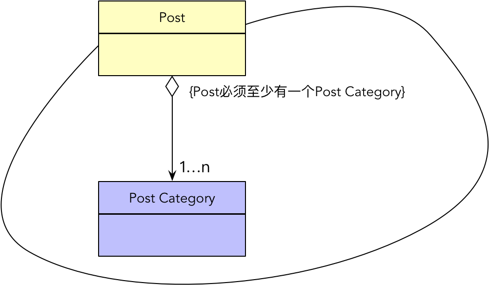

# 068 聚合设计原则

### 聚合设计原则

对比对象图和聚合，我们认为引入聚合的目的是控制对象之间的关系，这实则是引入聚合的技术原因。正如我在第 3-1 课《表达领域设计模型》中所说：“领域驱动设计引入聚合（Aggregate）来划分对象之间的边界，在边界内保证所有对象的一致性，并在对象协作与独立之间取得平衡。”显然，聚合保持了对象图的简单性，降低了实现的难度，解决了可能的性能问题。

聚合的设计原则要结合聚合的本质特征，每一条本质特征都可以提炼出设计聚合的原则：

- 聚合需要维护领域概念的完整性：这意味着聚合边界内所有对象的生命周期是保持一致的，它们一起创建、一起销毁、一起删除。聚合的生命周期统一由工厂和资源库进行管理。
- 聚合必须保证领域规则的不变量：不变量是指在数据变化时必须保持的一致性规则，可以视为它是业务规则的约束，无论数据怎么变化，都要维持一个恒定不变的等式。
- 聚合需要遵循事务的 ACID 原则：聚合在对象图中是不可分割的工作单元，聚合内的数据保持一致，聚合之间相互隔离互不影响，聚合内数据发生的变化需要持久化。

#### 领域概念的完整性

聚合作为一个受到边界控制的领域共同体，对外由聚合根体现为一个统一的概念，对内则管理和维护着强耦合的对象关系，它们具有一致的生命周期。例如，订单聚合由 Order 聚合根体现订单的领域概念，调用者甚至不需要知道订单项，也不会认为配送地址是一个可以脱离订单而单独存在的领域概念。如果要创建订单，则订单项、配送地址等聚合边界内的对象也需要一并创建，否则这个订单对象就是不完整的。同理，销毁订单对象乃至删除订单对象（倘若设计为可删除），属于订单属性的其他聚合边界对象也需要被销毁乃至删除。如果不能做到这一点，就可能产生垃圾数据。

领域概念的完整性可以与组合关系中的”物理包容“对照理解，即类之间若存在合成关系，则有很大可能放入到同一个聚合边界内。当然，也会有例外场景，这正是软件设计为难之处，因为没有标准答案。进行领域设计建模时，类之间的关系与现实世界中各种对象之间的关系并不一致。我们务必牢记：**设计的决策必须基于当前的业务场景来决定**。

因此，在考虑领域概念的完整性时，必须结合具体的业务场景。例如，在现实世界中，汽车作为一个领域概念整体，只有组装了发动机、轮胎、方向盘等必备零配件，汽车才是完整的，才能够发动和驾驶。但是，在汽车销售的零售商管理领域中，若为整车销售，则轮胎、方向盘等零配件可以作为 Car 聚合的内部对象，但发动机 Engine 具有自己的唯一身份标识，可能需要独立于汽车被单独跟踪，则 Engine 就可以作为单独的聚合；若为零配件销售，则方向盘、轮胎也具有自己的身份标识而被单独管理和单独跟踪，也需要为其建立单独的聚合。

追求概念的完整性固然重要，但保证概念的独立性同样重要：

- 既然一个概念是独立的，为何还要依附于别的概念呢？——发动机需要独立跟踪，还需要纳入到汽车这个整体概念中吗？
- 一旦这个独立的领域概念被分离出去，原有的聚合是否还具备领域概念的完整性呢？——例如，离开了发动机的汽车，概念是否完整？

在理解概念的完整性时，我们不能以偏概全，将完整性视为“关系的集合”，只要彼此关联，就是完整概念的一部分。毕竟，聚合并非完全独立的存在，聚合之间同样存在协作依赖关系。

Vaughn Vernon 建议“设计小聚合”，这主要是从系统的性能和可伸缩性角度考虑的，因为维护一个庞大的聚合需要考虑事务的同步成本、数据加载的内存成本等。且不说这个所谓的“小”到底该多小，但至少过分的小带来的危害要远远小于不当的大。所谓“两害相权取其轻”，在根据领域概念完整性与独立性划分聚合边界时，可以先保证聚合尽量的小，小到只容下一个实体类。当对象图中每个实体都成为一个独立的聚合时，聚合就失去了存在的价值。这显然不合理。于是，我们需要再一次遍历所有实体，判断它们可否合并到已有聚合中。根据类关系与语义相关性的强弱，我们谋求着把别的实体放进当前选定的最小聚合，就需要寻找合并的理由。我们需要针对聚合内的聚合根实体询问完整性，针对聚合内的非聚合根实体询问独立性：

- 目标聚合是否已经足够完整？
- 待合并实体是否会被调用者单独使用？

考虑在线试题领域中问题与答案的关系。Question 若缺少 Answer 就无法保证领域概念的完整性，调用者也不会绕开 Question 单独查看 Answer，因为 Answer 离开 Question 是没有任何意义的。因此，Question 与 Answer 属于同一个聚合，且以 Question 实体为聚合根。

同样是问题与答案之间的关系，如果为知乎问答平台设计领域模型，情况就发生了变化。虽然从领域概念的完整性看，Question 与 Answer 依然属于强相关的关系，Answer 依附于 Question，没有 Question 的 Answer 也没有任何意义，但由于业务场景允许阅读 Answer 的读者可以单独针对它进行赞赏、赞同、评论、分享、收藏等操作，如下图所示：


这些操作就等同于为 Answer 赋予了“完全民事行为能力”，具备了独立性，就可以脱离 Question 聚合成为单独的 Answer 聚合。

与实体相反，领域设计模型中值对象不存在这种独立性。根据聚合的定义，最小的聚合必须至少要有一个实体，这就意味着值对象不能单独成为一个聚合。值对象必须寻找一个聚合，作为它要依存的主体。个别值对象如 Money 等与单位、度量有关的类甚至会在多个聚合中重复出现。

#### 不变量

不变量这个词很不好理解。它的英文为 Invariant，除了翻译为“不变量”之外，还有人将其翻译为“不变条件”或“固定规则”。后两个翻译应属于“意译”，想要表达它指代的是领域逻辑中的规则或验证条件。这个含义反转过来就未必成立了。业务规则不一定是不变量，例如“招聘计划必须由人力资源总监审批”是一条业务规则，但该规则实际上是对角色与权限的规定，并非不变量。验证条件也未必是不变量，例如“报表类别的名称不可短于 8 个字符，且不允许重复”是验证条件，该验证条件规定了报表类别的 Name 属性值的合法性，也不能算是不变量。

Eric Evans 在《领域驱动设计》一书中将不变量定义为是“在数据变化时必须保持的一致性规则，涉及聚合成员之间的内部关系”。这句话传递了三个重要概念（特征）：数据变化、一致、内部关系。如果我们将聚合中的对象视为变化因子，则不变量就是要保持它们之间的关系在数据发生变化时仍然保持一致。实际上，这更像是数学中“不变式（同样为英文的 Invariant）”的概念，例如等式 3x+y=1003x+y=100，无论 x 和 y 怎么变化，都必须恒定地满足这个相等关系。等式中的 x 和 y 可类比为聚合中的对象，该等式则是施加在聚合边界之上的业务约束。这就解释了前述业务规则与验证条件为何不是不变量——因为它们并未牵涉到聚合内部数据的变化，也没有对聚合内对象之间的关系进行约束。参考 Eric Evans 在书中给出的不变量案例：“采购项的总量不能超过 PO 总额的限制”，就完全符合不变量的特征。该不变量约束了采购项（Line Item）与订单（Purchase Order）之间的关系，即无论采购项怎么变化，都不允许它的总量超过 PO 总额。该不变量可以描述为如下数学公式：

```
SUM(Purchase Order Line Item) <= PO Approved Limit
```

该不变量决定了 LineItem 与 PurchaseOrder 必须放在一个聚合中，因为只有将它们控制在聚合边界内，才能够有效满足该不变量。

要完全理解何为“不变量”，虽有这三大特征作为辨别的依据，仍非易事。为了让不变量帮助我们确定聚合的边界，可以放宽定义，将其视为“施加在聚合边界内部各个对象之上的业务约束”。例如，业务约束规定一篇博文（Post）必须至少有一个博文类别（Post Category），就可以当做是一个不变量。要满足这个不变量，就需要将 Post 与 PostCategory 放到同一个聚合中：



在设计聚合时，可以结合领域逻辑去寻找具有不变量特征的业务约束。通常，此类约束表现为用例的前置条件与后置条件，或者用户故事的验收标准。即使不是为了设计聚合，业务分析人员也应当给出业务约束的描述。例如，在航班计划业务场景中，编写“修改航班计划起飞时间与计划到达时间”这一用户故事时，就需要给出验收标准，如：

- 若该航班有共享航班，在修改航班计划起飞时间与计划到达时间时，关联的所有共享航班的计划起飞时间与计划到达时间也要随之修改，以保持与主航班的一致。

这一验收标准实则可以视为航班与共享航班之间的不变量，这就要求我们针对这一业务场景，将 Flight 与 SharedFlight 两个实体放在同一个聚合中，且以 Flight 实体为聚合根。

#### 事务的 ACID

事务（Transaction）本身是技术实现层次的解决方案，如何实现事务当然是底层框架的事儿，但如果领域模型没有设计好，对象之间的边界没有得到控制，要满足事务的 ACID 特性就会变得困难。这事实上也是在领域设计模型中引入聚合的部分原因。

分析事务的 ACID 特性，我们发现这些特性可以很好地与聚合的特性匹配：

| 特性                  | 事务                                                         | 聚合                                                         |
| :-------------------- | :----------------------------------------------------------- | :----------------------------------------------------------- |
| 原子性（Atomicity）   | 事务是一个不可再分割的工作单元                               | 聚合需要保证领域概念的完整性，若有独立的领域类，应分解为专门的聚合，这意味着聚合是不可再分的领域概念 |
| 一致性（Consistency） | 在事务开始之前和事务结束以后，数据库的完整性约束没有被破坏   | 聚合需要保证聚合边界内的所有对象满足不变量约束，其中最重要的不变量就是一致性约束 |
| 隔离性（Isolation）   | 多个事务并发访问时，事务之间是隔离的，一个事务不应该影响其它事务运行效果 | 聚合与聚合之间应该是隔离的，聚合的设计原则要求通过唯一的身份标识进行聚合关联 |
| 持久性（Durability）  | 事务对数据库所作的更改持久地保存在数据库之中，不会被回滚     | 一个聚合只有一个资源库，由资源库保证聚合整体的持久化         |

先抛开聚合如何满足事务的 ACID 不提，单从这些特性之间的一一匹配，足以说明辨别事务边界有助于我们设计聚合。Vernon 就认为：“在一个事务中只修改一个聚合实例”。在提交事务时，事务边界之内的所有内容都必须保持一致。换言之，倘若无法满足聚合内的事务需求，则说明我们的聚合边界设计存在疑问。当然，这里提及的事务并不包含所谓的“柔性事务”，满足的事务一致性指的是“强一致性”，而非“最终一致性”。

考虑电商领域订单与订单项的关系。在创建、修改或删除订单时，都必须要求订单与订单项的数据强一致性。以创建订单为例，如果插入 Order 记录成功，插入 OrderItem 出现了失败，就要求对已经创建成功的 Order 记录进行回滚，否则此时的订单就受到了破坏。这也正是将 Order 与 OrderItem 放到同一个聚合中的主要原因。反观博客平台博客（Blog）与博文（Post）之间的关系，则有所不同。Blog 记录的创建与 Post 记录的创建并非原子操作，它们归属于两个不同的工作单元。虽然业务的前置条件要求在创建 Post 之前，对应的 Blog 必须已经存在，但并没有要求 Post 与 Blog 必须同时创建。修改和删除操作同样如此。因此， Blog 和 Post 应该属于两个完全独立的聚合。

正如维护领域概念的完整性与业务约束的不变量并非设计聚合的绝对标准，事务与聚合之间的对应也存在例外，特别是当完整性与独立性、不变量、事务这三大原则之间存在冲突时，该如何设计聚合，确实是一件让人头疼的事情。

以银行的“取款”用例来说明。当储户账户发起取款操作时，需要扣除账户（Account）的余额（Balance），同时系统会创建一条新的交易记录（Transaction），以便于银行对账，并支持储户的交易查询功能。显然，如果账户余额扣除成功，而取款的交易记录却创建失败，就会导致二者出现数据不一致的情况。要保持这种一致性，事务范围就必须包含 Account、Balance 与 Transaction 这三个类，其中 Account 与 Transaction 都是实体。

按照事务与聚合之间的匹配关系，聚合的边界就应该包括 Account、Balance 与 Transaction 这三个类。Account 和 Balance 存在领域概念完整性要求，且 Balance 并非实体，将它们放在一个聚合中，没有任何争议。但是对于 Transaction 呢？由于储户可以执行交易查询功能，这意味着调用者可以绕开 Account，单独查询 Transaction。显然，Transaction 具有独立性，应该单独为它建立一个聚合，但这样的设计又无法保证 Account 与 Transaction 之间的事务一致性。

虽说聚合与事务的边界重合，但并不足以说明在聚合之上就不可引入事务的强一致性。从职责上看，聚合对事务 ACID 的满足，实则是委派给资源库完成的，它才是事务的工作单元（Unit of Work）。事务是有范围（Scope）的，当一个业务用例需要多个聚合共同参与时，每个聚合对应的事务同样可以共同协作。在领域驱动设计推荐的分层架构与设计要素中，可以定义应用服务作为内外协作的门面，并由其引入外部框架来支持满足用例需求的整体事务，再由领域服务封装聚合、资源库之间的协作，实现真正的业务需求。取款业务的实现如下所示：

```java
public class AccountAppService {
    @Autowired
    private WithdrawingService service;

    @Transactional
    public void withdraw(AccountId id, Amount amount) {
        service.execute(id, amount);
    }
}

public class WithdrawingService {
    @Repository
    private AccountRepository accountRepo;
    @Repository
    private TransactionRepository transRepo;

    public void execute(AccountId id, Amount amount) {
        Account accout = accountRepo.findBy(id);
        account.substract(amount);
        accountRepo.save(account); 

        Transaction trans = Transaction.createFrom(id, amount, TransactionType.Withdraw);
        transRepo.save(trans); 
    }
}
```

在满足跨聚合之间的强一致性时，要判断参与协作的多个聚合是否在同一个进程边界。引入分布式事务来满足这种强一致性往往得不偿失，非万不得已，应尽量避免。即使不考虑分布式事务的成本，纵然多个聚合都在一个进程边界内，仍然需要慎重思考所谓的“强一致性”是否就是必然？例如，是否可以考虑引入最终一致性。在确定一致性的强弱时，需要与领域专家沟通，尝试从用户角度思考聚合实例的变更是否允许一定时间的延迟。仍以“取款”场景为例，只要保证交易数据最终一定能记录下来，同时让账户余额的变更保持实时性，无论是储户还是银行的管理层，都是可以接受最终一致性的。

最终一致性很好地协调了聚合与事务的一致性边界。Vaughn Vernon 就建议“在一致性边界之外使用最终一致性方式”。在微服务架构下，实现事务的最终一致性更是常态。微服务的边界可能与限界上下文的边界重合，而在一个限界上下文中，可能包含一到多个聚合。因此，在实现跨聚合的事务一致性时，还需要判断参与业务场景的多个聚合到底是在一个进程边界内，还是需要跨进程通信。前者可以考虑在应用服务中引入事务来保障数据的强一致性，后者可以考虑引入 Saga 模式实现数据的最终一致性。至于如何实现事务的一致性，我会在后面的章节进一步探讨。

综上，我们可以从领域概念的完整性与独立性、不变量和事务等多个角度审视聚合的边界，帮助我们高质量地设计聚合。在这些设计原则中，我们需格外重视概念的独立性，它直接影响了聚合的边界粒度。领域驱动设计规定**只有聚合根才是访问聚合边界的唯一入口**，这可以视为设计聚合的**最高原则**。因此，Eric Evans 规定：

> 聚合外部的对象不能引用根实体之外的任何内部对象。根实体可以把对内部实体的引用传递给它们，但这些对象只能临时使用这些引用，而不能保持引用。根可以把一个值对象的副本传递给另一个对象，而不必关心它发生什么变化，因为它只是一个值，不再与聚合有任何关联。作为这一规则的推论，只有聚合的根才能直接通过数据库查询获取。所有其他内部对象必须通过遍历关联来发现。

如果认可这一最高原则及基于该原则的推论，即可证明独立性之至高重要性：作为聚合内部的非聚合根实体，它只能通过聚合根被外界访问，即非聚合根实体无法被独立访问；若需要独立访问该实体，则只能作为聚合根，意味着它需要独立出来，定义为一个单独的聚合。倘若既要满足概念的完整性，又必须支持独立访问实体的需求，同时还需要约束不变量，保证数据一致性，就必然需要综合判断。而聚合的**最高原则**又规定了访问聚合的方式，使得概念独立性在这些权衡因素中稍占上风，成为聚合设计原则的首选。