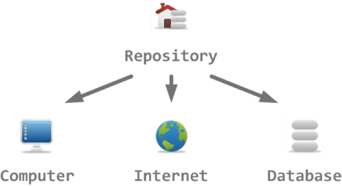
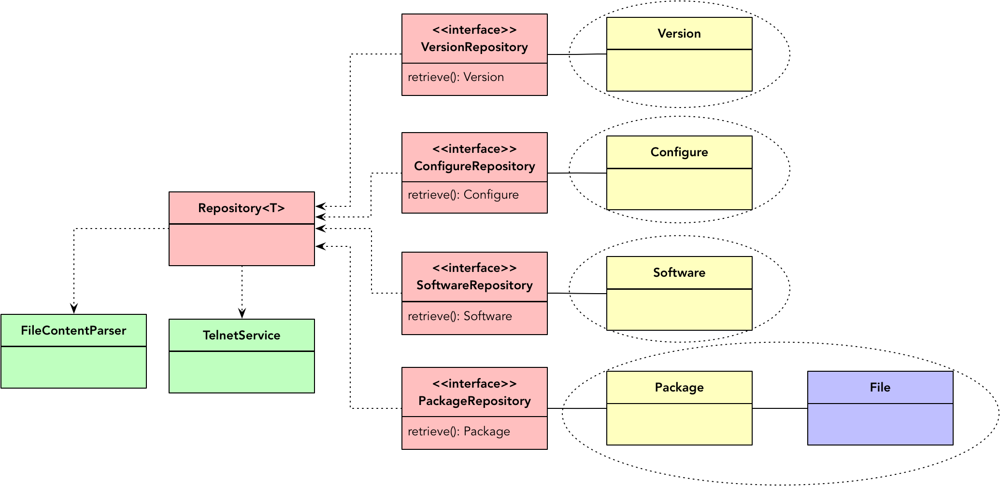
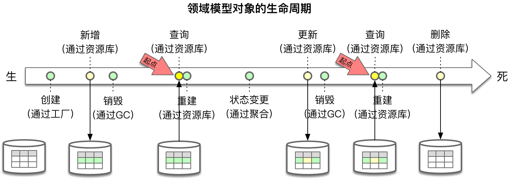
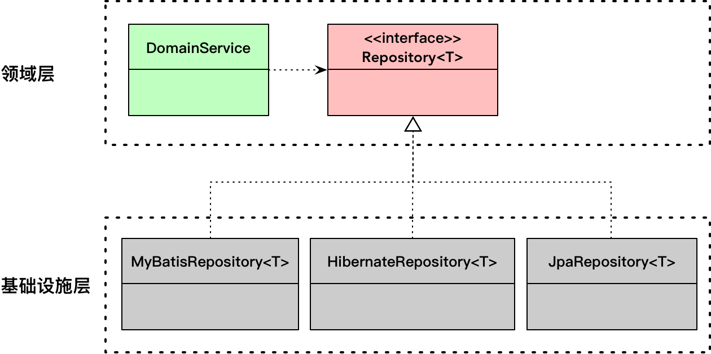
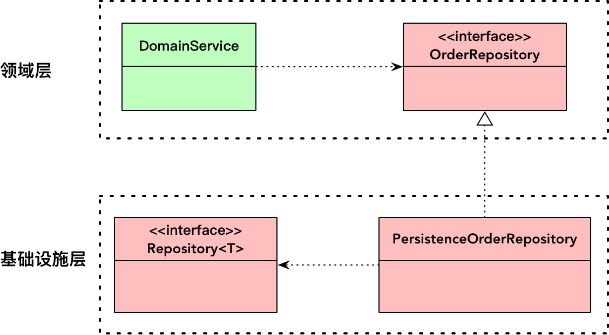
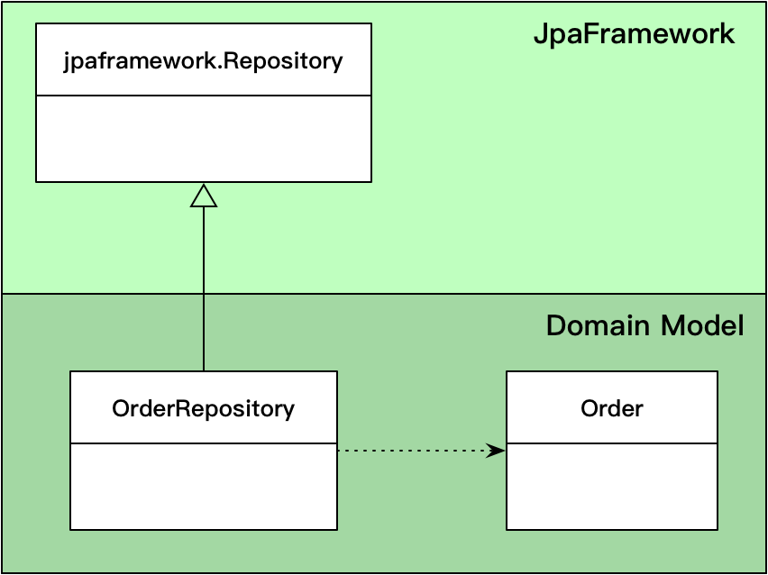
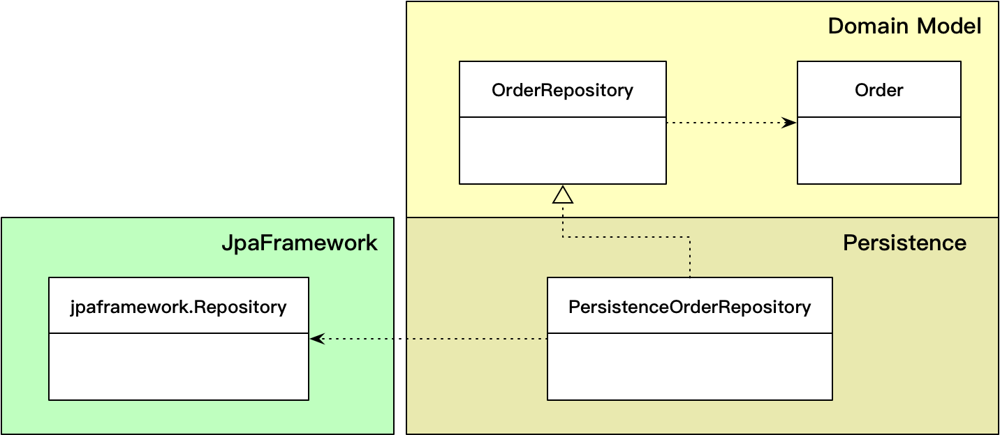

# 073 领域模型对象的生命周期-资源库

资源库（Repository）是对数据访问的一种业务抽象，使其具有业务意义。利用资源库抽象，就可以解耦领域层与外部资源，使领域层变得更为纯粹，能够脱离外部资源而单独存在。在设计资源库时，我们想到的不应该是数据库，而是作为“资源”的聚合对象在一个抽象的仓库中是如何管理的。于是，资源库可以代表任何可以获取资源的地方，而不仅限于数据库：



在《领域驱动设计实践-战略篇》课程中，我介绍了版本升级系统的先启过程。在这个系统中，后台需要与前台的基站（NodeB）以及基站的 BBU 板和 RRU 板进行通信，以获得这些终端设备的软件信息，如 Version、Configure、Software、Package、File 等。我在设计过程中引入了领域驱动设计，将获取的这些软件信息建模为领域模型对象，并根据其概念完整性等设计原则定义了聚合。要获得聚合，并非通过访问数据库，而是借由 TELNET 通信协议与前台设备通信，获得的信息以文件形式传输到后端，再由 FileReader 读取其内容后实例化对应的实体或值对象。当我们将这些软件信息建立的领域模型视为资源时，通信采用的 TELNET 协议，以及读取文件后的对象实例化都可以通过抽象的资源库隐藏起来，领域层就无需操心底层的繁琐细节了：



### 资源库的设计原则

之所以引入资源库，主要目的还是为了管理聚合的生命周期。工厂负责聚合实例的生，垃圾回收负责聚合实例的死，资源库就负责聚合记录的查询与状态变更，即记录的“增删改查”操作。不同于活动记录（Active Record）模式，资源库分离了聚合的领域行为和持久化行为。为了更好地管理聚合，领域驱动设计对资源库的设计做了一定程度的限制与规范。

#### 一个聚合对应一个资源库

假定存储资源的仓库为数据库。在此前提下，粗略一看，资源库模式与传统的数据访问对象（DAO）模式并无太大差别。

DAO 实现了使用数据源所需的访问机制，封装了管理数据库连接以及存取数据的逻辑。不论使用哪种数据源，DAO 为调用者提供了统一的 API，调用者只需使用 DAO 暴露的接口，无需考虑内部的实现细节，这就隔离了业务逻辑与数据访问逻辑，满足“关注点分离”的架构原则。尤其当我们为 DAO 定义了专门的抽象接口时，就可以利用依赖注入来改变依赖方向，满足“整洁架构”的设计思想。

既然如此，为何 Eric Evans 还要引入**资源库**的概念呢？Eric Evans 说：“我们可以通过对象之间的关联来找到对象。但当它处于生命周期的中间时，必须要有一个起点，以便从这个起点遍历到一个实体或者对象。”

怎么来理解生命周期的“中间”和“起点”？这就需要注意对象与数据记录之间的区别与联系。单从对象的角度看，生命周期代表了一个实例从创建到最后被回收，体现了生命的诞生到死亡；而数据记录呢？生命周期的起点是指插入一条新纪录，直到该记录被删除为生命的终点。

Eric Evans 提及的生命周期其实是**领域模型对象的生命周期**，需要将对象与数据记录二者结合起来，换言之就是要将内存（堆与栈）管理的对象与数据库（持久化）管理的数据记录结合起来，共同表达了聚合领域模型的整体生命周期：



通过上图，可以清晰地看出 Eric 所谓的“起点”，就是通过资源库查询或重建后得到聚合对象的那个点，因为只有在这个时候，我们才能获得聚合对象，然后以此为起点去遍历聚合的根实体及内部的实体和值对象。这个“起点”实际处于领域模型对象生命周期的“中间”。这也正好解释了资源库的职能，就是执行对聚合的“增删改查”。

虽然增删改查同样是 DAO 的职责，但资源库的不同之处在于：

- 资源库操作的是属于领域层中的具有边界的聚合；DAO 操作的是数据传输对象，即持久化对象，该对象与 DAO 一起都位于数据访问层；倘若使用 DAO 操作领域对象，最大的区别在于聚合的引入。
- 资源库强调了聚合生命周期的管理，其目的在于获取聚合对象的引用，在形成聚合的对象图后，便于调用者对其进行操作。

显然，是聚合的引入改变了资源库的格局。DAO 模式没有聚合配套，就意味着针对领域层的任何模型对象，调用者都可以通过对应的 DAO 随意发起对数据库的操作，实体和值对象就会被散乱放置到领域层的各个地方，无拘无束。缺乏边界控制力的设计就等于自由没有了规范，长此以往，会导致大多数处理数据库访问的技术复杂性“侵入”到领域层，复杂度呈指数级增加，之前通过领域分析建模与领域设计建模获得的模型，也会变得无关紧要。

因此，**保证一个聚合对应一个资源库非常重要**。聚合只有一个入口，那就是聚合根；对聚合生命周期的管理，也只有一个入口，那就是聚合对应的资源库。要访问聚合内的其他实体和值对象，也只能通过聚合对应的资源库进行，这就保护了聚合的封装性。一言以蔽之：通过资源库获取聚合的引用，通过对象图的单一遍历方向获得聚合内部对象。例如，要为订单添加订单项，这样的做法就是错误的：

```java
OrderItemRepository oderItemRepo;

orderItemRepo.add(orderId, orderItem);
```

OrderItem 不是聚合，不能为其定义资源库。OrderItem 是 Order 聚合的内部实体，因此添加订单项的操作本质上是更新订单的操作：

```java
OrderRepository orderRepo;

Order order = orderRepo.orderOfId(orderId);
order.addItem(orderItem);

orderRepo.update(order);
```

添加订单项功能由 Order 聚合根实体实现，addItem() 方法的实现可以保证订单领域概念的完整性，实现不变量。例如，该方法可以根据 OrderItem 中的 ProductId 来判断究竟是添加订单项，还是合并订单项，然后修改订单项中所购商品的数量。

#### 资源库的领域特征

资源库的命名说明它作为资源的仓库，是用以存取聚合资源的容器。容器自身没有领域含义，但对容器内对象的访问操作，实则可以视为是领域逻辑的一部分，这也是为何在分层架构中将抽象的资源库放在领域层的原因所在。

《领域驱动设计》中明确说明：“它（指资源库）的行为类似于集合（Collection），只是具有更复杂的查询功能。在添加和删除相应类型的对象时，资源库的后台机制负责将对象添加到数据库中，或从数据库中删除对象。这个定义将一组紧密相关的职责集中在一起，这些职责提供了对聚合根的整个生命周期的全程访问。”

既然资源库可认为是“聚合集合”的隐喻，在设计资源库的接口 API 时，就可参考此特征定义接口方法的名称。例如，定义通用的 Repository：

```java
public interface Repository<T extends AggregateRoot> {
    // 查询
    Optional<T> findById(Identity id);
    List<T> findAll();
    List<T> findAllMatching(Criteria criteria);
    boolean contains(T t);

    // 新增
    void add(T t);
    void addAll(Collection<? extends T> entities);

    // 更新
    void replace(T t);
    void replaceAll(Collection<? extends T> entities);

    // 删除
    void remove(T t);
    void removeAll();
    void removeAll(Collection<? extends T> entities);
    void removeAllMatching(Criteria criteria); 
}
```

如何使用这样的 Repository 通用接口呢？既然该接口使用了泛型的类型参数，且接口定义的方法涵盖了与聚合生命周期有关的所有增删改查操作，我们就可以享受重用的福利，无需再为各个聚合定义单独的资源库了。例如，Order 聚合的资源就可以用 Repository 来管理其生命周期。至于 Repository 接口的实现，则根据 ORM 框架的不同，可以提供不同的实现：



这样的设计看似很美好，实际并不可行。首先，Repository 通用接口定义了全生命周期的资源库方法，但并非所有聚合都需要这些方法，实现机制又无法控制这些方法。例如，Order 聚合不需要真正的删除方法，又或者对外虽然公开为 delete()，内部却按照需求仅仅是修改订单的状态为 DELETED，该如何让 Repository 满足这一需求呢？

其次，聚合资源库对外暴露了根据条件进行查询或删除的方法，其目的是为了满足各种不同的查询/删除需求。但对条件的组装又会加重调用者的负担，例如查询指定顾客所有正在处理中的订单：

```java
Criteria customerIdCriteria = new EquationCriteria("customerId", customerId);
Criteria inProgressCriteria = new EquationCriteria("orderStatus", OrderStatus.InProgress);
orderRepository.findAllMatching(customerIdCriteria.and(inProgressCriteria));
```

正确的做法是在重用、封装与代码可读性求得一个平衡。Repository 作为一个通用接口，仍有存在必要。但该接口并非直接面向领域服务，故而在设计时，无需考虑所谓“集合”的隐喻。这样就可以将新增操作与更新操作合二为一，用 save() 方法来代表，名称上也尽可以遵循数据库操作的通用叫法，如删除仍然命名为 delete：

```java
public interface Repository<E extends AggregateRoot, ID extends Identity> {
    Optional<E> findById(ID id);
    List<E> findAll();
    List<E> findAllMatching(Criteria criteria);

    boolean existsById(ID id);

    void save(E entity);
    void saveAll(Collection<? extends E> entities);

    void delete(E entity);
    void deleteAll();
    void deleteAll(Collection<? extends E> entities);
    void deleteAllMatching(Criteria criteria); 
}
```

我将这样的通用接口看作是连接领域与基础设施的网关，真正体现领域特征的还是为每个聚合显式定义的资源库，并将它视为聚合类的集合，并根据具体的业务场景定义只属于该聚合的生命周期方法。至于重用，则可**采用委派而非继承的方式**，在聚合资源库的实现类内部维持对通用接口 Repository 的引用。以订单的资源库为例：

```java
// 领域层
public interface OrderRepository {
    // 查询方法的命名更加倾向于自然语言，而未必体现 find 的技术含义
    Optional<Order> orderOfId(OrderId orderId);
    // 以下两个方法在内部实现时，需要组装为通用接口的 criteria
    Collection<Order> allOrdersOfCustomer(CustomerId customerId);
    Collection<Order> allInProgressOrdersOfCustomer(CustomerId customerId);

    void add(Order order);
    void addAll(Iterable<Order> orders);

    // 在底层实现中，新增和更新都可以视为是保存，因此也可以考虑将 add 与 update 合二为一
    void update(Order order);
    void updateAll(Iterable<Order> orders);
}

// 基础设施层
public class PersistenceOrderRepository implements OrderRepository {
    // 采用委派
    private Repository<Order, OrderId> repository;

    // 注入真正的资源库实现
    public PersistenceOrderRepository(Repository<Order, OrderId> repository) {
        this.repository = repository;
    }

    public Optional<Order> orderOfId(OrderId orderId) {
        return repository.findById(orderId);
    }
    public Collection<Order> allOrdersOfCustomer(CustomerId customerId) {
        Criteria customerIdCriteria = new EquationCriteria("customerId", customerId);
        return repository.findAllMatching(customerIdCriteria);
    }
    public Collection<Order> allInProgressOrdersOfCustomer(CustomerId customerId) {
        Criteria customerIdCriteria = new EquationCriteria("customerId", customerId);
        Criteria inProgressCriteria = new EquationCriteria("orderStatus",OrderStatus.InProgress);
        return repository.findAllMatching(customerIdCriteria.and(inProgressCriteria));
    }

    public void add(Order order) {
        repository.save(order);
    }
    public void addAll(Collection<Order> orders) {
        repository.saveAll(orders);
    }

    public void update(Order order) {
        repository.save(order);
    }
    public void updateAll(Collection<Order> orders) {
        repository.saveAll(orders);
    }
}
```

设计类图如下所示：



领域服务调用 OrderRepository 管理 Order 聚合，但在执行时，调用的其实是通过依赖注入的实现类 PersistenceOrderRepository。为了避免重复实现，在 PersistenceOrderRepository 类的内部，操作数据库的工作又委派给了通用接口 Repository，进而委派给具体实现了 Repository 接口的类，如前所述的 MybatisRepository 等。

**委派方式显然要优于继承**。如此一来，聚合的资源库接口可不受通用接口的限制，明确定义满足真实业务场景的调用需求。例如，业务需求不允许删除订单，OrderRepository 接口就无需提供 remove() 等移除方法，定义的诸如 allOrdersOfCustomer() 与 allInProgressOrdersOfCustomer() 等特定的查询方法，更能表达领域逻辑。

不过针对资源库的条件查询方法的接口设计，社区存在争议，大致分为如下两派：

- 一派支持设计简单通用的资源库查询接口，让资源库回归本质，老老实实做好查询的工作。条件查询接口应保持其通用性，将查询条件的组装工作交由调用者，否则就需要穷举所有可能的查询条件。一旦业务增加了新的查询条件，就需要修改资源库接口。如订单聚合的接口定义，在定义了 allInProgressOrdersOfCustomer(customerId) 方法之后，是否意味着还需要定义 allCancelledOrdersOfCustomer(customerId) 之类的各种方法呢？
- 另一派坚持将查询接口**明确化**，根据资源库的个体需求定义查询方法，方法命名也应体现领域逻辑。封装了查询条件的查询接口不会将 Criteria 泄露出去，归根结底，Criteria 的定义本身并不属于领域层。这样的查询方法既有其业务含义，又能通过封装减轻调用者的负担。

两派观点各有其道理。一派以通用性换取接口的可扩展，却牺牲了接口方法的可读性；另一派以封装性获得接口的简单可读，却因为过于具体导致接口膨胀与不稳定。从资源库的领域特征来看，我倾向于后者，但为了兼顾可扩展性与可读性，倒不如为资源库定义常见查询方法的同时，保留对查询条件的支持。此外，查询接口的具体化与抽象化也可折中，例如查询“处理中”与“已取消”的订单，差异在于订单的状态，因而可以将订单状态提取为查询方法的参数：

```java
Collection<Order> allOrdersOf(CustomerId customerId, OrderStatus orderStatus);
```

我们还应从资源库的调用角度分析。资源库的调用者包括领域服务和应用服务（后面讲解应用服务时，我提出应用服务应只与领域服务协作）。倘若资源库提供了通用的查询接口，而调用者又是应用服务（若应用服务不能与资源库协作，就不存在此种情况），就会将组装查询条件的代码混入到应用层。这违背了保持应用层“轻薄”的原则。要么限制资源库的通用查询接口，要么限制应用层直接依赖资源库，如何取舍，还得结合具体业务场景做出最适合当前情况的判断。设计时，需要坚守一些基本原则，如保证各层的职责单一、遵循 DRY 原则、高内聚低耦合等，除此之外，可以灵活处理。

实际上，资源库的条件查询接口设计还有第三条路可走，那就是 Eric Evans 提出的引入规格模式（Specification Pattern）封装查询条件。我在讲解分析模式的时候介绍过规格模式，它与查询条件是两种不同的设计模式。查询条件是一种表达式，采用了解释器模式（Interpreter Pattern）的设计思想，为逻辑表达式建立统一的抽象，如前所示的 Criteria 接口，然后将各种原子条件表达式定义为表达式子类，如前所示的 AndCriteria 类。这些子类实现解释方法，将值解释为条件表达式。规格模式是策略模式（Strategy Pattern）的体现，为所有规格定义一个共同的接口，如 Specification 接口的 isSatisfied() 方法。规格的子类会实现该方法，结合规则返回 Boolean 值。

相较于查询条件表达式，规格模式的封装性更好，可以实现按照业务规则定义不同的规格子类，通过规格接口，也能做到对领域规则的扩展。与之相反，查询条件的设计方式着重寻找原子表达式，然后将组装的职责交由调用者，因此它能够更加灵活地应对各种业务规则，唯一欠缺的是封装性。收之东隅失之桑榆，在做设计决策时，概莫如此。

### 持久化框架对资源库实现的影响

遵循整洁架构思想与领域驱动设计分层架构的设计要求，我们应保证领域层的纯粹性，即不依赖任何外部资源和框架。我建议将聚合的资源库定义为接口，目的正在与此。即使是接口，若不做好合适的设计，也可能会悄无声息地引入依赖。

从软件工程学的角度看，我们不可能不使用框架，重用是必须的。许多持久化框架都会提供通用的类或接口，你只需要继承它就可以享受框架带来的强大威力，但同时也意味着你将受制于它。Neal Ford 将这种模式称之为**耦合的毒贩模式**：“如果你服从这些诱导，你就只能永远受制于框架。”假设有一个 JpaFramework 提供了持久化的通用接口 Repository，为了重用框架，自定义的订单聚合资源库继承了该接口：



虽然 OrderRepository 通过继承框架的 Repository 得到了持久化便利，但领域模型也无法轻易甩开 JpaFramework。继承关系就好像胶水，把二者紧紧粘在了一起，这就使得领域模型失去了纯粹性。正确的做法是转移对框架的依赖，交给资源库的实现类。实现类属于基础设施层，本就负责与外部资源和框架的适配工作，将它与框架耦合，并不会干扰到领域层：



上图中的 PersistenceOrderRepository 是一个类，它通过组合方式重用了 JpaFramework 的 Repository 接口。其实不仅限于组合方式，即使让资源库的实现类去继承框架的类型或实现框架的接口都无关紧要，因为通过依赖注入，领域层的领域模型根本就不知晓 PersistenceOrderRepository 类的存在，更不用提框架了。

似乎看中了资源库接口的抽象性与隔离性，许多持久化框架也在向这个方向迈进，力图在保证抽象性的同时，做到最大程度的封装以减轻开发人员的工作量。针对具有元数据的语言如 Java，多数框架采用动态代理的方式完成具体实现代码的混入。以 Spring Data JPA 为例，它定义了如下的标记接口 Repository：

```java
package org.springframework.data.repository;

import org.springframework.stereotype.Indexed;

@Indexed
public interface Repository<T, ID> {
}
```

虽然该接口并未定义任何方法，但却是 Spring Data JPA 底层动态代理确定某个类是否为资源库的根本特征。除此之外，Spring Data API 还定义了诸如 CrudRepositoy 与 PagingAndSortingRepository 等接口，以便于用户可以根据具体情况选择作为资源库的父接口。虽然这些接口皆未提供任何实现，但归根结底它们都定义在 Spring Data JPA 这个框架中。若聚合的资源库接口直接继承它们，就会变成前面提及的“耦合的毒贩模式”，违背了整洁架构的思想；若让处于基础设施的资源库子类去实现这些接口，又可能违背框架的意图，因为框架为了简便起见，已经自动把 ORM 的工作封装到底层中，并不需要用户再来提供实现。

这就是现实的进退两难。

若要彻底保持领域模型的纯净，可定义两个层次的接口：其一为面向聚合定义的抽象接口，它在领域层中扮演抽象资源库的角色；其二为满足框架要求定义的接口，它一则继承了领域模型的资源库接口，一则又继承自框架的抽象接口。例如：

```java
package com.practiceddd.ecommerce.domain.order;

public interface OrderRepository {
    Optional<Order> findById(OrderId orderId);
    Collection<Order> findByCustomerId(CustomerId customerId);
    Collection<Order> findByCustomerIdAndOrderStatus(CustomerId customerId, OrderStatus orderStatus);
    Stream<Order> streamAllOrders();
}

package com.praticeddd.ecommerce.client.persistence;

import org.springframework.data.repository.Repository;
import com.practiceddd.ecommerce.domain.order.OrderRepository;

public interface JpaOrderRepository extends OrderRepository, Repostory<Order, OrderId> {}
```

此方式虽可隔离领域层对框架的依赖，但在 OrderRepository 接口方法的定义上，仍然可见框架约束的痕迹。因为 Spring Data JPA 提供了两种定义查询的方法：

- 通过 @Query 在方法上定义查询
- 根据命名惯例指定资源库方法。

由于资源库的方法定义在领域层中，不能使用框架提供的 @Query 标记，因此命名惯例的方式就成了不二之选。框架规定，查询接口方法必须是 `find...By...`、`read...By...`、`query...By...` 等形式。这种命名惯例的约束虽然无形，却容易让不明框架者不知所谓。若开发者因为其名过于宽泛而尝试重命名，就会导致功能不可用。

若要突破框架带来的限制，更好的方式还是在资源库的实现类中使用组合的形式。Spring Data JPA 框架支持 Java 的 JPA（Java Persistence API）规范，故而可以利用 JPA 规范提供的 EntityManager 类执行查询，如：

```java
package com.practiceddd.ecommerce.domain.order;

public interface OrderRepository {
    Optional<Order> orderOfId(OrderId orderId);
    Collection<Order> allOrdersOfCustomer(CustomerId customerId);
    Collection<Order> allInProgressOrdersOfCustomer(CustomerId customerId);
}

package com.praticeddd.ecommerce.client.persistence;

import com.practiceddd.ecommerce.domain.order.OrderRepository;
import javax.persistence.EntityManager;
import javax.persistence.PersistenceContext;

public class JpaOrderRepository implements OrderRepository {
    @PersistenceContext
    private EntityManager entityManager;

    public Optional<Order> orderOfId(OrderId orderId) {
        Order order = entityManager.get(Order.class, orderId);
        if (order == null) {
            return Optional.empty();
        }
        return Optional.of(order);
     } 

    ...
}
```

组合的设计方式完全保证了领域层的纯粹性，也遵循了资源库的设计原则。然而有得也有失，在带来灵活性的同时，也失去了框架与生俱来的能力，实现者要编写更多代码方可满足要求。当然，能做到领域逻辑与技术实现的完全隔离，这一努力仍然值得。它使得我们在设计领域层的资源库对象时，可以暂时抛开对技术实现的顾虑，仅从领域逻辑角度定义满足统一语言的资源库接口。这才是所谓**领域驱动设计**的真谛。

若你并没有领域驱动设计那种纯然的洁癖感，也不妨降低要求，毕竟未来更换持久化框架的可能性很小（我确曾经历过更换持久化框架的项目）。既然许多持久化框架已经提供了不错的抽象，也能做到与数据库之间的完全隔离，在项目中就可以抛开不切实际的抽象，直接在领域层使用框架提供的资源库。例如，定义的 OrderRepository 接口直接继承框架提供的 Repository 或 CrudRepository 等接口。如果是 MyBatis，也可直接将抽象的 Mapper 接口当做聚合的资源库。设计由心，还是得结合具体场景做出准确判断。多数时候，简单才是最合适的方案，过于强调维持领域的纯净性，可能陷入过度设计的泥沼而不自知。

说来矛盾，虽然我赞成为了简单性可以损失领域的一部分纯净，但充分理解资源库的领域特征仍有重要意义，并需要在设计中尽力维持这一特征。毕竟，在实现层面，选择的框架不同，实现方式亦有所不同。若能从根本的设计原则出发，必能就现实情况选择最为适宜的方案。