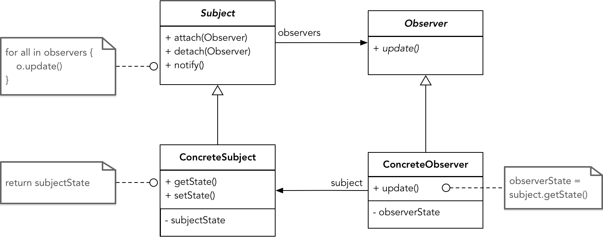

# 080 领域事件

在介绍事件风暴时，我们已经分析了事件的本质，并总结了领域事件的四个特征：

- 领域事件是过去发生的与业务有关的事实
- 领域事件是管理者和运营者重点关心的内容，若缺少该事件，会对管理与运营产生影响
- 领域事件具有时间点的特征，所有事件连接起来会形成明显的时间轴
- 领域事件会导致目标对象状态的变化

作为一种领域分析建模方法，事件风暴将事件视为一种建模的手段，将不同的团队角色统一到一个共同的业务场景下，同时又利用了事件的因果关系驱动我们把握业务的整体流程。在这个过程中，领域事件在事件风暴中起到了核心的驱动作用，但**它本身并不一定属于最终获得的领域分析模型的一部分**。这就与我们选择的建模范式有关。

### 事件建模范式

即使采用领域模型驱动设计，选择建模范式的不同，也会直接影响到最后获得的领域模型。我在前面介绍过结构范式、对象范式和函数范式与领域模型之间的关系。特别针对对象范式和函数范式，要明确二者之间的本质区别。对象范式重视领域逻辑中的名词概念，并将领域行为封装到对象中；函数范式重视领域逻辑中的领域行为，将其视为类型的转换操作，因而主张将领域行为定义为无副作用（side-effect free）的纯函数（pure function）。

倘若领域模型驱动设计的整个过程皆以“领域事件”为核心，建模范式就发生了变化，因为**事件改变了我们观察现实世界的方式**。它的关注点不是领域概念，也并非领域行为，而是因为领域行为引起的领域概念状态的变化。领域事件是在针对**状态**建模，在这样的观察视角下，大多数业务流程都可以视为由命令触发的引起状态迁移的状态机。状态的迁移本质上可以认为是形如 `State1 => State2` 这样的纯函数，故而这种建模方式更贴近于函数范式，或者说是函数范式的一个分支。

不过，相比函数范式，它也有自己的独到之处。设计的驱动力是事件，建模的核心是事件，以及事件引起的状态迁移。故而我将这一范式称之为“**事件建模范式**”。该范式通过领域事件去观察现实世界，并围绕着“事件”为中心去表达领域对象的状态迁移，进而以事件来驱动领域场景。事件建模范式影响的是建模者观察现实世界的态度，而这种以领域事件为模型核心元素的范式又会影响到整个软件的体系架构、模型设计与代码实现。

### 领域事件扮演的角色

当我们将领域事件引入到领域模型中时，我们必须明确它在模型中到底扮演了什么样的角色，同时，还要认识到它的引入会受到建模范式的影响。如果不明确这两点，就贸然在领域驱动设计中引入领域事件，不免会有过分夸大之嫌，好像变得“无事件就无领域驱动设计”似的。

领域事件在对象范式和事件范式中起到的作用完全不同。我们需要区分不同范式，看一看领域事件在领域模型驱动设计的分析、设计与实现这三个阶段中到底扮演了什么样的角色。

#### 事件在对象范式

遵循对象范式的领域建模方法强调对领域知识的提炼，主要体现为以名词为特征的领域概念与以动词为特征的领域行为。采用这种方式进行分析建模，组成领域分析模型的全部都是一个一个表达领域概念的类型，而领域行为则被定义为领域概念对象的方法。虽然建模结果如此，但不同的领域分析方法却有着不同的世界观，产生了不同的分析驱动力。一些领域分析专家们另辟蹊径，发现了领域事件与众不同的驱动力。领域事件同样是对现实世界的映射，它体现的不是领域概念，而是领域专家对发生了什么事情的一种关心。领域事件由命令触发，是对命令产生的结果事实建立的模型，代表了一系列状态的迁移和变化。

与名词动词法和 ICONIX 方法不同，四色建模法与事件风暴认识到了领域事件的重要性。四色建模法强调记录领域事件，从而通过对这些数据的追溯支撑企业的运营与管理。根据领域事件可以帮助我们获得时标型对象，进而获得 PPT 对象、角色对象和描述对象，从而构成反映整个业务流程的领域分析模型。事件风暴更是将领域事件放到了最为关键的位置，通过领域事件可以驱动出决策命令、读模型和聚合，从而获得参与每个领域场景的领域分析模型。显然，领域事件在分析建模方法中扮演了越来越重要的驱动作用。

即使我们可以围绕着领域事件进行分析建模，但在对象范式下，我们驱动出来的领域分析模型，作为对现实世界的一种映射，仍然是一个名词做主的世界。动词作为名词的依附者，缺乏作为主体的独立资格。领域事件所关注的状态则被领域模型对象隐藏起来，使得我们在最终获得的领域分析模型中无法看到领域事件的身影。因此，在对象范式的领域分析建模阶段，领域事件仅仅是一种建模的驱动力。

那么在对象范式下，是否需要在领域设计模型中引入领域事件呢？由于对象范式将状态以及状态的变更封装到了实体对象中，领域事件的价值被抵消和约束，只剩下如下价值需要我们取舍：

- 追溯状态变更
- 通知状态变更
- 依赖解耦

基于对象范式定义的实体无法满足追溯状态变更的需求。实体拥有状态，也提供了修改状态的领域行为，但却无法跟踪整个状态变更的过程。唯一能弥补这一缺陷的方法就是在修改状态的领域行为中添加日志，通过日志记录来追溯状态变更。若要领域设计模型直接支持对状态变更的追溯，就需要引入“事件溯源（Event Sourcing）”模式。

事件溯源通过事件来持久化聚合，存储的每一个事件都代表了一次状态的变更。事件存储在专门的事件存储（Event Store），以便于事件的查询、投影和快照。这个时候，领域事件才是整个领域设计模型的核心，聚合根的实例化、聚合状态的变更以及对状态的追溯都是通过领域事件来完成的。显然，事件溯源改变了建模范式，不属于对象范式的范畴。

要通知状态变更，其目的就是希望了解状态变更的原因。在收到状态变更的事件时，参与协作的对象需要依据当前实体的状态变更决定作出怎样的响应。这实际上是对象协作的需求。对象范式的领域设计模型可以通过在应用服务或领域服务中进行业务编排（Orchestration），以“中心控制”的方式管理多个聚合之间的协作。例如，订单聚合需要了解支付聚合的状态变更，一旦支付完成，就需要即刻更新订单自身的状态。这个过程可以由订单领域服务作为协调者调用支付服务，例如：

```java
public class PayingOrderService {
    private PaymentService paymentServiceClient;
    private OrderRepository orderRepository;

    public void execute(Order order) {
        try {
            paymentServiceClient.pay(order.getBilling());
            order.complete();
            orderRepository.save(order);
        } catch (PaymentException | Exception ex) {
            logger.error(ex.getMessage());
            throw new ApplicationException("Failed to pay order", ex);
        }
    }
}
```

这种业务编排的方式使得领域服务成为了领域场景的业务枢纽和逻辑起点，虽然利用分治原则避免了“上帝服务”的存在，但编排逻辑的方式仍然不可避免地导致领域模型对象之间的协作过于紧耦合，控制协作的成本也较高。作为控制中心的领域服务不是自治的，一旦领域逻辑和规则发生变化，就需要修改领域服务中的协作代码，无法独立演化。例如，在支付完成订单状态变更为“已支付”后，还需要发送短信通知买家时，就需要修改 PayingOrderService 领域服务，通过与 NotificationService 服务的协作实现通知逻辑。

事件的解耦能力毋庸讳言。如果事件属于同一进程内领域设计模型的一部分，则为观察者模式（Observer）的体现。该模式定义了主体（Subject）对象与观察者（Observer）对象。一个主体对象可以注册多个观察者对象，而观察者对象则定义了一个回调函数，一旦主体对象的状态发生变化，就会通过调用回调函数，将变化的状态通知给所有的观察者。主体和观察者都进行了抽象，如此即可降低二者之间的耦合。C# 语言中的 Event 与 Delegate 相当于是观察者模式的语法糖。观察者模式的设计类图如下所示：



观察者模式的意图为“定义对象间的一种一对多的依赖关系，当一个对象的状态发生改变时, 所有依赖于它的对象都得到通知并被自动更新。”在基于对象范式的领域设计模型中，只要领域逻辑满足该意图，就可以运用观察者模式，与领域事件的建模思想无关。在 Java 语言的编程实现中，往往是由聚合作为主体，即使运用了观察者模式，也可能看不到领域事件的定义。例如，当订单的状态被更新为 Completed 时，若运用了观察者模式，就会在发生状态变更时通知事先注册的观察者对象 OrderCompletedHandler：

```java
public interface OrderCompletedHandler {
    void handle(Order order);
}

public class Order extends AggregateRoot<Order> {
    private OrderStatus status = OrderStatus.New;
    private List<OrderCompletedHandler> handlers;

    public void complete() {
        this.status = OrderStatus.Completed;
        for (OrderCompletedHandler handler : handlers) {
            handler.handle(this);
        }
    }
}
```

**说明：**C# 语言提供的 Event 语法更清晰地表达出领域事件的概念，例如可以通过 `event OrderCompletedHandler OrderCompleted` 定义一个事件。但本质上，它还是观察者模式的体现。

虽然在运用观察者模式时，可以对主体与观察者建立抽象来降低二者之间的耦合，但却无法做到彻底的解耦。如果系统采取单体架构，如此的弱依赖是可容忍的，例如，邮件通知服务就可以实现 OrderCompletedHandler 接口，Order 聚合并不需要知道这个具体的邮件通知服务。若为分布式的微服务架构，并采取前后端分离，观察者模式做得还不够彻底，因为依赖的抽象类型无法满足跨进程通信的要求。

引入消息中间件来传递事件消息，可以解决这一问题。通常，事件作为主题（Topic）消息被发布到消息中间件，对该事件感兴趣的消费者会订阅该事件，一旦事件被发布，即可获取该事件消息并做出相应处理。这一设计方式在意图上仍然属于观察者模式，不过我们更习惯于将其命名为发布者-订阅者模式。发布者只需要定义和发布事件，却无需理会事件消息会被谁订阅和消费，反过来，订阅者只知道它需要关心的事件，却不用理会该事件到底由谁发布。除了需要事先约定事件的协议之外，发布者与订阅者之间可以老死不相往来。

领域实现模型直接受制于领域设计模型。在对象范式下，对领域实现模型产生影响的是对观察者模式与发布者-订阅者模式的运用。尤其是后者，牵涉到消息中间件的技术选型，事件消息的格式定义，跨进程通信协议以及分布式通信的一致性问题。这与采用远程服务调用是截然不同的实现模式。在微服务架构中，远程服务之间的协作模式称之为**编排（Orchestration）**，利用事件进行协作的模式称之为**协同（Choreography）**。编排模式更加简单，能够清晰直观地表达业务流程；协同模式更为复杂，但能降低服务之间的耦合度，提高服务的自治能力，便于对现有服务进行修改。

整体看来，对象范式下的领域事件在领域模型驱动设计的各个阶段各有其价值，但它并非缺一不可的核心要素。在一个单体架构中，倘若无需追溯实体的状态变更，则领域事件带来的优势几乎可以忽略不计。领域分析模型、领域设计模型以及领域实现模型可以完全保持一致，状态的管理与变更都交给聚合内的实体来完成，这样获得的领域模型才是最简单的，也最符合对象范式的传统建模思想。

领域事件给对象范式领域模型带来的主要价值体现为对依赖的解耦。分布式架构尤其是微服务架构对领域模型的设计带来了直接的影响，**我们无法用一张对象图反映整个现实世界**。对象图可能会被进程边界隔离为多个独立的小型对象图，它们之间的协作与通信为模型的设计带来了挑战。领域事件的解耦作用在引入消息中间件之后，可以彻底解除发布者与订阅者之间的耦合，事件消息的异步非阻塞通信方式，还能改进系统的响应能力。

### 事件在事件范式

事件范式改变了我们对现实世界的观察角度，也改变了我们的设计与实现，它将“领域事件”抬高到了无与伦比的至高地位。

当我们选择事件范式进行领域模型驱动设计时，事件风暴就成了领域分析建模自然而然的选择，它简直就是为了事件范式而生的。通过事件风暴获得的以领域事件为核心的模型，是对状态建模的真实体现。事件的因果关系可以帮助我们驱动出管理者关心的关键领域事件，进而通过领域事件驱动出决策命令、读模型、策略与聚合。每一个领域场景，都体现为一系列“命令-事件”的响应模式，读模型是命令或事件携带的消息数据，聚合为状态的持有者。

事件范式针对状态迁移进行建模，领域事件作为聚合状态迁移历史的“留存”，改变了聚合的生命周期管理方式。聚合由状态的持有者与控制者变成了响应命令和发布事件的中转站，聚合的状态也不再发生变更，而是基于“事实”的特征，为每次状态变更记录一条领域事件。聚合不再被持久化，持久化的是一系列沿着时间轴不停记录下来的历史事件。这就是与事件范式设计模型相匹配的**事件溯源模式**。该模式通过对事件的溯源，满足管理和运营的审计需求，通过回溯整个状态变更的过程可以完美地重现聚合的生命旅程。

事件溯源彻底改变了领域设计模型。要注意事件在对象范式和事件范式设计模型中的角色差异。如前所述，对象范式中的事件实则是观察者模式的体现，而事件范式中的事件则是状态的实例。当聚合发生状态变更时，领域事件被创建，但它并非观察者模式中的主体（Subject）类，事件溯源模式只是将事件视为一条需要持久化以便于追溯的状态数据。

当然，事件一经发生，总会有对象关心，天然就会引入观察者模式。观察者模式与事件溯源模式都是一种设计模式，但前者体现了设计理念，后者体现为建模理念。观察者模式中的事件扮演了“触发器”的角色，而事件溯源模式中的事件则是一种“事实”。如果事件溯源需要事件同时成为一个触发器，就可以将事件溯源模式与观察者模式结合。例如，事件溯源采用的事件存储无法响应复杂的聚合查询需求。要弥补这一缺陷，可以将事件存储与聚合存储分开。存储的事件是聚合状态发生变更的事实，但同时它又作为触发器通知聚合，由其接收事件消息来更新自身的聚合值，并完成持久化。这种机制其实是 CQRS（Command Query Responsibility Segregation，命令查询职责分离）架构模式的一种实现。

CQRS 架构模式将领域模型分为了查询模型和命令模型，事件在其中起到了协调的作用。由于命令模型与查询模型往往位于不同的进程，引入的事件其实是通过消息中间件传递的事件消息，此时运用的观察者模式应为发布者-订阅者模式。

无论是对象范式，还是事件范式，引入发布者-订阅者模式的目的都是为了解耦。命令、查询与事件是服务交互的三种机制。与命令和查询不同，事件无需返回值，它的传递是异步的。事件的发布者只需考虑将事件发布出去，至于事件能否被正确传递，则由消息中间件来负责。一旦事件发布，发布者就无需等待，这种异步非阻塞的通信模式可以大幅度提升系统整体的响应能力。

在领域实现阶段，领域实现模型直接受到领域设计模型的影响。对象之间的协作方式、领域模型的持久化以及对一致性与不变量的保证都会发生天翻地覆的改变，实现代码的测试战略也将随之发生变化。Scott Millett 认为：“既然概念化的模型都是以事件为中心的，那么代码也需要以事件为中心，以便它能够表述概念化模型。”当然，无论怎么改变，实现模型始终需要遵循一些基本的架构原则，尤其需要分离业务复杂度和技术复杂度。限界上下文的边界对实现模型也将产生直接影响。若边界为跨进程通信，就需要考虑分布式事务的问题。

分布式事务满足 ACID 的成本太高，因为它需要将参与事务的所有资源锁定，若事务执行周期较长，就会严重影响系统的并发性能。因此，在多个分布式远程服务参与协作的场景下，采用满足最终一致性的柔性事务才是最佳选择。一旦我们选择分布式通信的事件消息来实现领域事件，就产生了正反两方面的结果：

- 正面：引入事件可以支持事务的最终一致性
- 反面：事件消息带来了分布式事务的挑战

若要消融这正反两方面的矛盾，就需要将领域事件用到正确的领域场景中，即因为技术实现的约束，需要引入事件来保证服务之间的松散耦合与事务的最终一致性。这一设计决策其实违背了领域驱动设计的精神，因为它是技术实现干预领域模型的一种体现。

选择事件范式，意味着你改变了整个领域模型驱动设计的过程与实践。决定是否采用事件范式，还将直接影响整个系统的架构与技术选型，对于团队成员的开发技能也提出了不同的要求。Martin Fowler 认为：“架构就是完成之后很难更改的东西。”显然，一旦选择了事件范式，就很难在将来再更换为其他建模范式。因此，**决定是否采用事件范式的决策属于架构决策**，在做出该决定时，需要慎之又慎。

如果觉得建模范式的选择承载了架构的重量，就需要把握好限界上下文的控制边界。我在《领域驱动设战略设计》中将架构决策分为了系统和限界上下文两个层次。我们可以根据限界上下文的特点选择不同的建模范式，只要把握好限界上下文边界的控制力，就能将建模范式对全局的影响降到最小。

建模范式与架构模式、设计模式之间存在着一丝若隐若现的关系，它们并非相互对应，却又互相影响和约束。若选择对象范式，通常只可运用观察者模式或发布者—订阅者模式，即将领域事件用在状态通知和依赖解耦上；若选择事件范式，则主要运用事件溯源模式来实现聚合状态变更的记录和追溯的本源，但同时也可运用观察者模式或发布者—订阅者模式来实现状态通知。