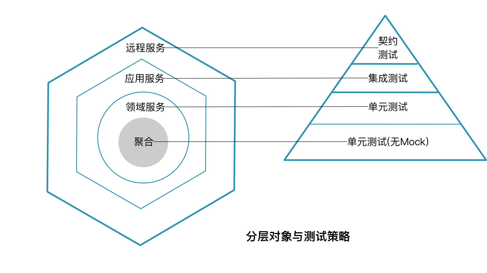
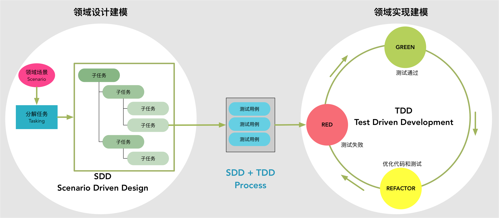

# 083 测试优先的领域实现建模

软件设计与开发的过程是不可分割的，那种企图打造软件工程流水线的代码工厂运作模式，已被证明难以奏效。探索设计与实现的细节，在领域模型驱动设计的过程中，设计在前、实现在后却也是合理的选择，毕竟二者关注的视角与目标迥然不同；但它并非瀑布式的一往向前，而是要形成分析、设计与实现的小步快走与反馈闭环，在多数时候甚至要将细节设计与代码实现融合在一起。

### 建立稳定的领域模型

不管设计如何指导开发，开发如何融合设计，都需要把握领域驱动设计的根本原则：**以“领域”为设计的原点和驱动力**。在领域设计建模时，务必不要考虑过多的技术实现细节，以免影响与干扰领域逻辑的设计。在设计时，让我们忘记数据库，忘记网络通信，忘记第三方服务调用。通过面向接口设计的形式，我们抽象出领域层需要调用的外部资源接口，统一命名为“南向网关”，即可在一定程度隔离业务与技术的实现，避免两个不同方向的复杂度产生叠加效应。

遵循整洁架构思想，我们希望最终获得的领域层对象并不依赖于任何外部设备、资源和框架。简言之，领域层的设计目标就是要达到**逻辑层的自给自足**，唯有不依赖于外物的领域模型才是最纯粹的、最独立的、最稳定的模型。

**这样的模型也是最容易执行单元测试的模型。**Michael C. Feathers 在《修改代码的艺术》一书中这样定义单元测试：“单元测试运行得快。运行得不快的测试不是单元测试。”他还进一步阐释：

> 有些测试容易跟单元测试混淆起来。譬如下面这些测试就不是单元测试：
>
> - 跟数据库有交互
> - 进行了网络间通信
> - 调用了文件系统
> - 需要你对环境作特定的准备（如编辑配置文件）才能运行的

显然，上述列举的测试都依赖了外部资源，它们实则属于测试策略中的集成测试。若测试不依赖外部资源，就可以运行得快，运行快才能快速反馈，并从通过的测试中获取信心。不依赖于外部资源的测试也更容易运行，遵守约束，就能够驱使我们开发出仅仅包含领域逻辑的领域模型，满足分层架构原则，实现业务关注点和技术关注点的分离。

### 分层对象与测试策略

领域驱动设计架构的每个逻辑层都定义了自己的控制边界，领域驱动设计的角色构造型位于不同层次。不同的设计元素，决定了它们不同的职责和设计的粒度。层次、职责和粒度的差异，恰好可以与测试策略形成一一对应的关系，如下图所示：



左侧通过六边形架构来清晰表达不同的层次。位于基础设施层中的远程服务担负的主要作用是与跨进程客户端之间的交互，强调服务提供者与服务消费者之间的履约行为。在这个层面上，我们更关心服务的契约是否正确，保护契约以避免它的变更引入缺陷，故而需要为远程服务编写契约测试。

业务核心在应用层与领域层。应用层的应用服务对应于一个领域场景，它遵循了整洁架构思想，通过网关角色构造型隔离了对外部资源的访问。遵循领域驱动设计对应用层的期望，需要设计为粗粒度的应用服务。它承担了外观服务的职责，并不真正包含具体的领域逻辑，为其编写集成测试是非常合理的选择。

场景驱动设计在分配职责时，要求将不依赖于外部资源的原子任务分配给聚合内的领域模型对象，这些原子任务都是自给自足的领域行为，为其编写单元测试非常容易。凡是需要访问外部资源的行为都被推向了处理组合任务的领域服务，构成了更加完整的领域行为，同样需要编写单元测试来保护它。由于领域服务可能会与访问外部资源的网关角色构造型协作，因此需要引入模拟（Mock）框架编写单元测试。聚合内的领域模型对象优先承担了领域行为，既避免了过程式的贫血模型，又能保证单元测试减少不必要的模拟。**单元测试保护下的领域核心逻辑，是企业系统的核心资产**，它确保了领域逻辑的正确性，允许开发人员安全地对其进行重构，使得领域模型能够在稳定内核的基础上具有了持续演化的能力。

测试不仅为系统创建了一张保护网，编写良好的测试更是一份演进的、鲜活的文档（Living Document）。由于领域层的领域模型对象真实完整地体现了领域概念，为了避免团队成员对这些领域概念产生不同理解，除了需要在统一语言的指导下定义领域模型对象之外，最好还需要一种简洁的方式来表达和解释领域，尤其是核心领域（Core Domain）。Eric Evans 提出用“精炼文档”来描述和解释核心领域，他说道：

> 这个文档可能很简单，只是最核心的概念对象的清单。它可能是一组描述这些对象的图，显示了它们最重要的关系。它可能在抽象层次上或通过示例来描述基本的交互过程。它可能会使用 UML 类图或时序图、专用于领域的非标准的图、措辞严谨的文字解释或上述这些元素的组合。

尝试使用测试作为这样的“精炼文档”，或许会有更大的惊喜。一方面，你无需格外为核心领域编写单独的精炼文档，引入单元测试或者采用测试驱动开发就能自然而然收获完整的测试用例；另一方面，这些测试更加真实地体现了领域模型对象之间的关系，包括它们之间的组合与交互过程。将测试作为“精炼文档”还能保证领域模型的正确性，甚至可以更早帮助设计者发现设计错误。软件设计本身就是一个不断试错的过程，借助事件风暴与场景驱动设计可以让设计过程变得清晰简单，具备可视化的能力，但它终归不是代码实现，时序图以及时序图脚本体现的也仅仅是留存在脑海中的一种交互模式罢了。

那么，将设计通过代码来实现，就能确保设计没有问题吗？未必如此，实现代码仅仅是对设计方案的一种体现和落地，缺乏对运行结果的检测。**检验设计正确性的关键标准是编写测试**，其中，单元测试由于反馈更加及时快速，是最为重要的**验证**手段。

### 测试驱动开发的实现建模

从设计到实现是一个不断**沟通**的过程，这个沟通不仅仅指团队中不同角色成员之间的沟通，还包括代码的实现者与阅读者之间的沟通。这种沟通并非面对面（除非采用结对编程），而是藉由代码这种“媒介”产生一种穿越时空的沟通形式。之所以强调代码的沟通作用，在于对维护成本的考量。Kent Beck 说：“在编程时注重沟通还有一个很明显的经济学基础。软件的绝大部分成本都是在第一次部署以后才产生的。从我自己修改代码的经验出发，我花在阅读既有代码的时间要比编写全新的代码长得多。如果我想减少代码所带来的开销，我就应该让它容易读懂。”

要做到让代码易懂，需要保持代码的简单。少即是多，有时候删掉一段代码比增加一段代码更难，相应的，它带来的价值很可能比后者更高。许多程序员常常感叹开发任务繁重，每天要做的工作加班也做不完，与此同时，他（她）们又在不断地臆想功能的可能变化，由此堆砌更为复杂的代码。明明可以直道行驶，偏偏要以迂为直，增加不必要的间接层，然后美其名曰保证系统的可扩展性，只可惜这样的可扩展性设计往往在最后会沦为过度设计。Neal Ford 在《卓有成效的程序员》一书中将这种情形称之为“预想开发（Speculative Development）”。预想开发会事先设想许多可能需要实现的功能，这就好比是“给软件贴金”，程序员一不小心就会跳进这个迷人的陷阱。

Kent Beck提倡极限编程（eXtreming Programming，XP），他认为程序员应追求**简单**的价值观。他强调：“在各个层次上都应当要求简单。对代码进行调整，删除所有不提供信息的代码。设计中不出现无关元素。对需求提出质疑，找出最本质的概念。去掉多余的复杂性后，就好像有一束光照亮了余下的代码，你就有机会用全新的视角来处理它们。”编写代码易巧难工，卖弄太多的技巧往往会导致业务真相被掩埋在复杂的代码背后。

场景驱动设计从领域场景出发来驱动设计，目的就是希望能给出恰如其分的设计模型。若要在领域实现建模阶段，能够及时验证设计的正确性，确保代码的沟通作用，体现从设计到实现一脉相承的简单性，就可以考虑**测试驱动开发**。

测试驱动开发是一种测试优先的编程实现方法。作为极限编程的一种开发实践，从十余年前 Kent Beck 提出这一方法至今，该方法仍然饱受争议，许多开发人员仍然无法理解：在没有任何实现的情况下，如何开始编写测试？这实际上带来一个问题的思考：**为什么需要测试优先？**

在进行软件设计与开发的过程中，每个开发者其实都会扮演两个角色：

- 接口的调用者
- 接口的实现者

所谓“设计良好的接口”，就是让调用者用起来很舒服的接口，使用简单，不需要了解太多的知识，接口清晰表达意图。要设计出如此良好的接口，就需要站在调用者角度而非实现者角度去思考接口。编写测试，其实就是在编程实现之前，假设对象已经有了一个理想的方法接口，符合调用者的期望，能够完成调用者希望它完成的工作而又无需调用者了解太多的信息。实际上，这也是意图导向编程（Programming by Intention）思想的体现。

测试驱动开发的一个常见误区是，测试驱动开发没有设计，一开始就要编写测试代码。事实上，测试驱动开发强调的“测试优先”，其实质是要求**需求分析优先**，对需求对应的领域场景进行拆分，就是**任务分解优先**。因此，开发人员不应该从一开始就编写测试，而是分析需求（常常是用户故事），识别出可控粒度的领域场景，对其进行**任务分解**。对任务的分解其实就是对职责的识别，且识别出来的职责在被分解为单独的任务时，必须是可验证的。如此过程，不正是场景驱动设计过程要求的吗？

我们可以将场景驱动设计与测试驱动开发结合起来。分解任务是场景驱动设计的核心步骤，通过它进一步理清了领域场景，以便于将职责分配给合适的角色构造型，这是一个由外至内方向的设计过程；分解的任务又可以进一步划分为多个可以验证的测试用例，然后按照测试—实现—重构的节奏开始编码实现，从最容易编写单元测试的聚合内领域模型对象开始，再到领域服务，这是一个由内至外方向的开发过程。

由于场景驱动设计已经进行了任务分解，获得了时序图脚本，在进入领域实现建模时，就可以非常自然地采用测试驱动开发。首先挑选分解好的任务，从履行原子任务的聚合对象开始。如前所述，聚合承担了自给自足的领域行为，因此不需要考虑任何外部资源和技术实现，仅需要针对领域逻辑编写测试方法即可。只要将该任务的领域逻辑分解为细粒度的测试用例，就可以开始编写测试。显然，场景驱动设计与测试驱动开发皆以“分解任务”作为重要的设计和开发驱动力，从任务到测试用例，再到测试编写，非常顺畅地实现了领域设计建模到领域实现建模的无缝衔接：



测试驱动开发非常强调节奏感。所谓“测试—实现—重构”，就是“红—绿—黄”的节奏。通过长期练习培养的开发节奏可以让编码行为变得更加高效、条理、清晰。如果将用户故事的验收标准、场景驱动设计、持续集成与测试驱动开发结合起来，就是一个迭代周期内增量开发的全过程：

- 领取用户故事，与需求分析人员、测试人员沟通需求和验收标准
- 识别领域场景，进行任务分解
- 根据分解的任务确定测试用例
- 从业务角度编写测试方法
- 思考由哪个类承担接口方法，由此驱动出类
- 按照 Given-When-Then 模式编写测试，由此驱动出方法接口
- 编译无法通过，由此定义被测类和方法
- 运行测试，红色，表示测试未通过
- 编写恰好让测试通过的实现代码，让测试变成绿色
- 分辨产品代码和测试代码是否存在坏味道，若有，重构之
- 记得重构之后还要运行测试，确定测试通过
- 本地运行构建，满足提交条件后，提交代码
- 待持续集成通过后，开始编写新的测试

在创建测试类时，是驱动出类的时机；按照 Given-When-Then 模式编写测试时，是驱动方法接口的时机。若已采用场景驱动设计，结合领域设计模型和角色构造型确定了履行职责的领域模型对象，并通过时序图脚本确定了协作方式和方法接口，会在一定程度上降低测试驱动开发的设计驱动价值，但也让整个测试驱动开发过程更加顺畅。

### 测试驱动开发三定律

要培养测试驱动开发的节奏感，需要理清测试—实现—重构三者之间的关系。Robert Martin 分析了三者之间的关系，将其总结为测试驱动开发三定律：

- 定律一：一次只写一个刚好失败的测试，作为新加功能的描述
- 定律二：不写任何产品代码，除非它刚好能让失败的测试通过
- 定律三：只在测试全部通过的前提下，做代码重构，或开始新加功能

#### 定律一

新功能是由新测试驱动出来的，没有编写测试，就不应该增加新功能，而现有代码已经由测试保证，增强了迈向新里程的信心。测试方法是对功能的描述，每个测试方法只做一件事情。测试方法应命名为表达该功能的自然语言，例如针对待测试功能“为合同分配一个自定义的唯一编号”，就可以定义测试方法：

```java
@Test
public void should_assign_unique_customized_number_for_contract() {}
```

在编写测试驱动新功能时，开发者扮演的角色是接口的调用者，因此，一个**刚好失败**的测试，表达了调用者不满于现状的诉求，而且这个诉求非常简单，就好似调用者为实现者设定的一个具有明确针对性的小目标，轻易可以达成。如果采用结对编程，就可以分别扮演调用者和实现者的角色，专注于自己的视角，让测试驱动开发的过程进展更加顺利。定律一要求**一次只写一个**测试，则是为了保证整个开发过程的小步快行，做到步步为营。

#### 定律二

一个失败的测试，意味着需要增加新功能；让测试刚好通过，是实现者唯一需要达成的目标。这就好似玩游戏一样，测试的编写者确定了完成游戏的目标，然后由此去设定每一关的关卡。游戏的玩家不要好高骛远，应以通过当前游戏关卡为己任，而不要像打斯诺克那样，每击打一个球，还要去考虑击打的球应该落到哪个位置，才有利于击打下一个球。一次只通一关，让测试**刚好**通过，就能让实现者的目标很明确，达到简单、快速、频繁验证的目的。

只要测试通过了，就不要编写任何产品代码，保证所有编写好的产品代码都在测试的保护下。编写任何超越让测试刚好通过的产品代码，都可以视为是过度设计。这就要求测试驱动开发的开发者克制追求大而全的野心，谨守住“只要求测试恰好通过足矣”的底线，不写任何额外的或无关的产品代码，保证实现方案的简单。

#### 定律三

**测试全部通过**意味着目前开始了的功能都已被实现，但未必完美。这个时候开始**重构**，在保证既有功能外部行为不变的前提下，安全地对代码设计做出优化，去除坏味道。每执行一步重构，都要运行一遍测试，保证重构操作没有破坏已有功能。这样就能做到及时而安全的重构，重构的代价也会变得更小。

添加新功能与重构在同一时刻不共存，要么添加新功能，要么重构，不可同时进行。在全部测试已经通过的情况下，若发现产品代码和测试代码存在坏味道，应该先进行重构，再考虑添加新功能。

测试驱动开发三定律对红绿黄的开发节奏提出了规范要求，就好似我们驾驶汽车需要遵守红绿黄灯的交通规则一般。只要严格遵循三定律进行测试驱动开发，就能做到已有产品代码的行为全被测试保证；功能的实现做到了尽可能简单，满足客户的需求；产品代码和测试代码都容易理解，没有坏味道。