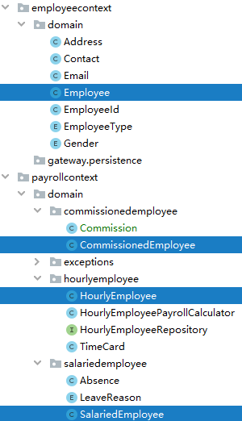
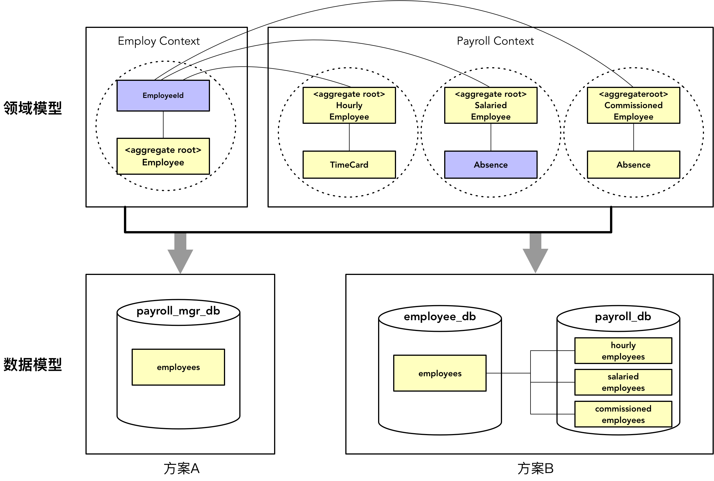
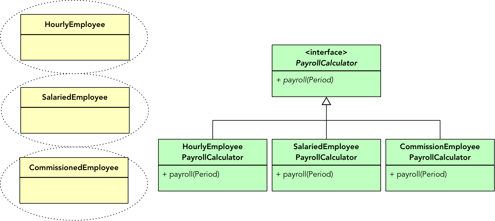
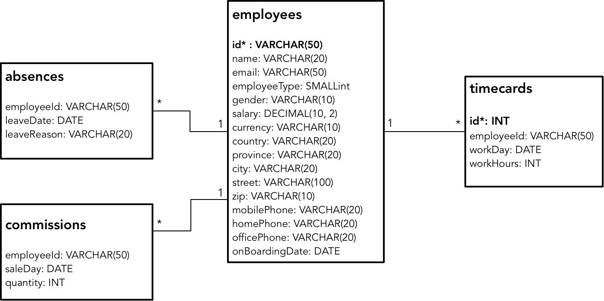
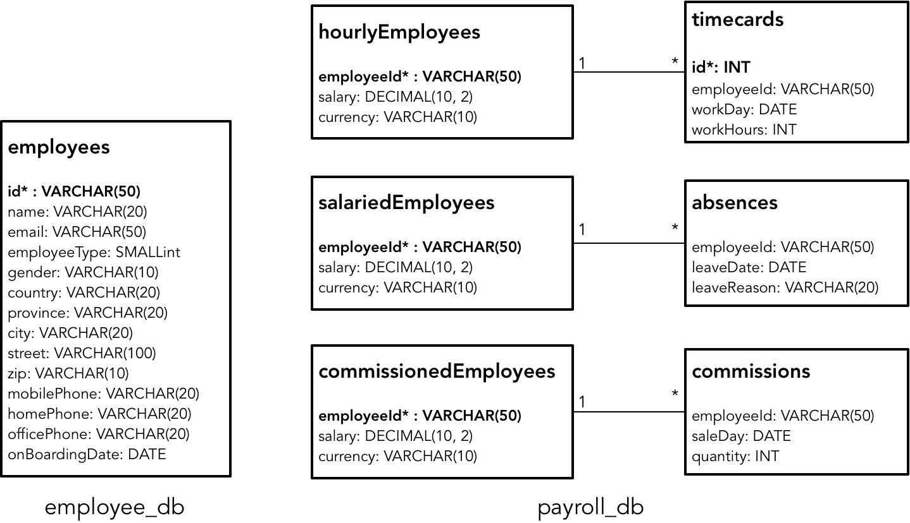

# 089 领域模型与数据模型

## 领域模型与数据模型

领域驱动的设计模型最重要的概念就是聚合，同时，聚合还要受到限界上下文边界的控制。Eric Evans 之所以要引入限界上下文，其中一个重要原因就是因为我们“无法维护一个涵盖整个企业的统一模型”，于是需要限界上下文来“标记出不同模型之间的边界和关系”。当领域模型引入限界上下文与聚合之后，领域模型类与数据表之间就有可能突破类与表之间一一对应的关系。因此，在遵循领域驱动设计原则实现持久化时，需要考虑领域模型与数据模型之间的关系。

### 领域模型与数据模型的分离

资源库是持久化在领域层的抽象。一个资源库对应一个聚合，因此可以认为**聚合是领域模型中最小的持久化单元**。这是了解领域驱动设计对持久化影响的关键，也是在实现阶段，领域模型驱动设计有别于数据模型驱动设计的核心特征。先有领域模型，后有数据模型，采用领域模型驱动设计的过程，就应以限界上下文为基础，面向聚合进行领域模型设计。在确定了聚合内的各个实体与值对象之后，形成对限界上下文领域模型的细化，然后在实现阶段，再考虑该如何针对每个聚合内的对象进行持久化。

仍以薪资管理系统为例，对员工的管理和薪资结算分属两个不同的限界上下文：员工上下文（Employee Context）和薪资上下文（Payroll Context）。员工上下文关注员工基本信息的管理，薪资上下文需要对各种类型的员工进行薪资结算，这就会导致这两个限界上下文的领域模型都会包含 Employee 这个领域概念类。在考虑建立它们的持久化数据模型时，存在两种不同的设计方案：

- 单库单表：在数据模型中统一建立一张员工表，然后在映射元数据中做好对应的配置。这一方案满足单体架构风格。
- 多库多表：为不同的限界上下文建立不同的数据库，员工模型也映射不同的员工表，之间以共同的员工 ID 关联。这一方案符合微服务架构风格。

无论数据模型采用哪一种设计方案，它们的领域模型包括对聚合内实体与值对象的定义，界定的聚合边界都不应有任何区别，即做到领域模型的设计与持久化机制无关。在领域模型中，受到数据模型影响的应只限于ORM元数据定义。如下图所示的代码结构，应不受数据模型设计方案的影响：



在领域模型中，员工上下文的 Employee 聚合根实体与薪资上下文的员工聚合根实体通过 EmployeeId 建立关联，薪资上下文中的 HourlyEmployee、SalariedEmployee 与 CommissionedEmployee 三个聚合根实体之间没有任何关系。在设计领域模型时，不应该受到数据模型设计的干扰，但在实现领域模型时，就需要确定数据模型的设计方案，并在选定 ORM 框架的基础上，确定该如何映射领域模型到数据模型的实现方案，并编写代码实现。领域模型与数据模型彼此之间的关系如下图所示：



从概念上讲，HourlyEmployee、SalariedEmployee 与 CommissionedEmployee 都是员工，似乎应为其建立以 Employee 为父类的继承体系。然而，若采用领域驱动设计，根据业务能力与领域关注点划分了限界上下文，它们又应该分属不同的限界上下文。如果仍然设计为继承体系，就会导致薪资上下文成为员工上下文的遵奉者。这正是对象范式的领域驱动设计与常规的面向对象设计不同之处，**领域驱动设计在战略和战术层面尤为关注和强调限界上下文与聚合的边界控制力**。这是在运用领域驱动设计进行落地实现时，尤其需要注意的一点。

### 领域模型

不同的限界上下文有着不同的领域模型，也有着不同的统一语言，因此在定义领域模型的类型时，需要注意区分限界上下文的边界。

由于员工上下文专注于对员工信息的管理，因此 Employee 类的定义包含了员工所有的基本属性，部分属性则因为体现了更小的内聚的领域概念，被定义为值对象：

```java
package top.dddclub.payroll.employeecontext.domain;

public class Employee extends AbstractEntity<EmployeeId> implements AggregateRoot<Employee> {
    private EmployeeId employeeId;
    private String name;
    private Email email;
    private EmployeeType employeeType;
    private Gender gender;
    private Address address;
    private Contact contact;
    private LocalDate onBoardingDate;
}
```

薪资上下文关心的领域逻辑是计算每种员工的薪资。倘若不同类型员工仅存在薪资计算行为的差异，自然可以引入策略模式，将这一行为分离出来，并抽象为薪资计算的接口。然而，不同类型员工还存在完全不同的属性和对等的行为，钟点工需要提交工作时间卡，月薪雇员需要记录缺勤记录，销售人员需要提交销售凭条，它们之间唯一存在的共性就是 EmployeeId，除此之外，我们还需要维护它们各自的一致性。因此，针对薪资上下文的领域模型，可以为不同类型雇员建立不同的聚合，然后在薪资计算行为层面引入抽象，保持适度的扩展能力：



薪资上下文领域模型的聚合定义如下：

```java
package top.dddclub.payroll.payrollcontext.domain.hourlyemployee;

public class HourlyEmployee extends AbstractEntity<EmployeeId> implements AggregateRoot<HourlyEmployee> {
    private EmployeeId employeeId;
    private Salary salaryOfHour;
    private List<TimeCard> timeCards = new ArrayList<>();

    public Payroll payroll(Period settlementPeriod) { }
}

package top.dddclub.payroll.payrollcontext.domain.salariedemployee;

public class SalariedEmployee extends AbstractEntity<EmployeeId> implements AggregateRoot<SalariedEmployee> {
    private EmployeeId employeeId;
    private Salary salaryOfMonth;
    private List<Absence> absences = new ArrayList<>();

    public Payroll payroll(Period settlementPeriod) { }
}

package top.dddclub.payroll.payrollcontext.domain.commissionedemployee;

public class  CommissionedEmployee extends AbstractEntity<EmployeeId> implements AggregateRoot<CommissionedEmployee> {
    private EmployeeId employeeId;
    private Salary salaryOfTwoWeeks;
    private List<Commission> commissions = new ArrayList<>();

    public Payroll payroll(Period settlementPeriod) { }
}
```

引入聚合的目的在于保证领域概念的完整性，并确保外部的调用者不会因为直接访问聚合边界内除聚合根实体之外的其余对象而破坏这种完整性。例如在 HourlyEmployee 类的 payroll() 方法中，对 timecards 进行了验证，并通过 filterByPeriod() 方法过滤了不符合结算周期的工作时间卡：

```java
public class HourlyEmployee extends... {
    public Payroll payroll(Period settlementPeriod) {
        // 对工作时间卡进行验证
        if (Objects.isNull(timeCards) || timeCards.isEmpty()) {
            return new Payroll(this.employeeId, settlementPeriod.beginDate(), settlementPeriod.endDate(), Salary.zero());
        }

        Salary regularSalary = calculateRegularSalary(settlementPeriod);
        Salary overtimeSalary = calculateOvertimeSalary(settlementPeriod);
        Salary totalSalary = regularSalary.add(overtimeSalary);

        return new Payroll(this.employeeId, settlementPeriod.beginDate(), settlementPeriod.endDate(), totalSalary);
    }

    private Salary calculateRegularSalary(Period period) {
        int regularHours = filterByPeriod(period)
                .map(TimeCard::getRegularWorkHours)
                .reduce(0, Integer::sum);
        return salaryOfHour.multiply(regularHours);
    }

    private Salary calculateOvertimeSalary(Period period) {
        int overtimeHours = filterByPeriod(period)
                .filter(TimeCard::isOvertime)
                .map(TimeCard::getOvertimeWorkHours)
                .reduce(0, Integer::sum);

        return salaryOfHour.multiply(OVERTIME_FACTOR).multiply(overtimeHours);
    }

    // 过滤不符合结算周期条件的工作时间卡
    private Stream<TimeCard> filterByPeriod(Period period) {
        return timeCards.stream()
                .filter(t -> t.isIn(period));
    }
}
```

通过测试驱动开发实现聚合的业务逻辑时，编写的单元测试也应体现这种聚合内的规则约束。例如，当钟点工缺少工作时间卡时，计算的薪资为 0，测试需要体现这一规则约束：

```java
public class HourlyEmployeeTest {
    @Test
    public void should_be_0_given_null_timecard() {
        //given
        HourlyEmployee hourlyEmployee = EmployeeFixture.hourlyEmployeeOf(employeeId, null);

        //when
        Payroll payroll = hourlyEmployee.payroll(settlementPeriod);

        //then
        assertThat(payroll).isNotNull();
        assertThat(payroll.employeId().value()).isEqualTo(employeeId);
        assertThat(payroll.amount()).isEqualTo(Salary.zero());
    }
}
```

三个聚合根实体定义的 payroll(Period) 方法在抽象上保持了一致性，不过，由于员工在计算薪资之前还需要调用聚合资源库获取对应的员工对象列表，因此还需要引入领域服务做进一步封装，如 HourlyEmployeePayrollCalculator 服务：

```java
public class HourlyEmployeePayrollCalculator {
    private HourlyEmployeeRepository employeeRepository;

    public void setRepository(HourlyEmployeeRepository employeeRepository) {
        this.employeeRepository = employeeRepository;
    }

    public List<Payroll> execute(Period settlementPeriod) {
        List<HourlyEmployee> hourlyEmployees = employeeRepository.allEmployeesOf();
        return hourlyEmployees.stream()
                .map(e -> e.payroll(settlementPeriod))
                .collect(Collectors.toList());
    }
}
```

领域服务的 execute() 方法封装了对资源库的调用实现，它的抽象层次方才彻底抹掉了员工类型的差异，可由此引入策略模式：

```java
public interface PayrollCalculator {
    List<Payroll> execute(Period settlementPeriod);
}

public class HourlyEmployeePayrollCalculator implements PayrollCalculator {}
public class SalariedEmployeePayrollCalculator implements PayrollCalculator {}
public class CommissionedEmployeePayrollCalculator implements PayrollCalculator {}
```

显然，聚合概念对于以对象范式建立的领域模型存在一定的约束和限制，当然，这种约束与限制也不妨看做是对设计的指导。实际上，倘若我们为钟点工、月薪雇员和销售人员建立了员工继承体系，一旦引入策略模式，就会导致员工类与薪资计算策略类之间存在“平行的继承体系”坏味道。如果没有聚合的要求，又可能会仅定义一个员工类，然后通过员工类型来区分各自的差异，导致产生一个承担了太多职责的过大的类，不利于维护员工与工作时间卡、缺勤记录与销售凭条之间的关系。当然，将它们都设计为一个个仅提供数据属性的贫血对象，自然就不可取了。

### 数据模型

如前所述，取决于限界上下文的边界以及系统选择的架构风格，存在两种迥然不同的数据模型：单库单表和多库多表。它们的数据模型自然不同，由此也会影响到领域模型到数据模型之间的映射关系。

#### 单库单表的ORM映射

若采用单体架构，员工对应的数据模型最简单的设计就是单库单表，即创建 employees 表。由于员工与工作时间卡、缺勤记录和销售凭条之间都存在一对多关系，因此采用单库设计的数据模型如下所示：



领域驱动设计虽然隔离了领域模型与数据模型，但在实现持久化时，必须为持久化框架提供对象与关系的映射信息。倘若采用 JPA，就是通过 Java 标注来声明，这可以认为是持久化机制对领域模型的一点侵入。由于员工上下文和薪资上下文中的员工领域模型都映射自 employees 表，且薪资上下文的 HourlyEmployee、SalariedEmployee 与 CommissionedEmployee 聚合对应了各自类型的员工数据，故而在领域模型中设置映射信息时，需要作出一点点调整。映射元数据的声明如下所示：

```java
package top.dddclub.payroll.employeecontext.domain;
@Entity
@Table(name="employees")
public class Employee extends AbstractEntity<EmployeeId> implements AggregateRoot<Employee> {
    @EmbeddedId
    private EmployeeId employeeId;

    // 略去其余字段定义
}

package top.dddclub.payroll.payrollcontext.domain.hourlyemployee;
@Entity
@Table(name = "employees")
@DiscriminatorColumn(name = "employeeType", discriminatorType = DiscriminatorType.INTEGER)
@DiscriminatorOptions(force=true)
@DiscriminatorValue(value = "0")
public class HourlyEmployee extends AbstractEntity<EmployeeId> implements AggregateRoot<HourlyEmployee> {
    @EmbeddedId
    private EmployeeId employeeId;

    @Embedded
    private Salary salaryOfHour;

    @OneToMany(cascade = CascadeType.ALL, orphanRemoval = true)
    @JoinColumn(name = "employeeId", nullable = false)
    private List<TimeCard> timeCards = new ArrayList<>();
}

package top.dddclub.payroll.payrollcontext.domain.salariedemployee;
@Entity
@Table(name = "employees")
@DiscriminatorColumn(name = "employeeType", discriminatorType = DiscriminatorType.INTEGER)
@DiscriminatorOptions(force=true)
@DiscriminatorValue(value = "1")
public class SalariedEmployee extends AbstractEntity<EmployeeId> implements AggregateRoot<HourlyEmployee> {
    @EmbeddedId
    private EmployeeId employeeId;

    @Embedded
    private Salary salaryOfMonth;

    @ElementCollection
    @CollectionTable(name = "absences", joinColumns = @JoinColumn(name = "employeeId"))
    private List<Absence> absences = new ArrayList<>();
}

package top.dddclub.payroll.payrollcontext.domain.commissionedemployee;
@Entity
@Table(name = "employees")
@DiscriminatorColumn(name = "employeeType", discriminatorType = DiscriminatorType.INTEGER)
@DiscriminatorOptions(force=true)
@DiscriminatorValue(value = "2")
public class CommissionedEmployee extends AbstractEntity<EmployeeId> implements AggregateRoot<HourlyEmployee> {
    @EmbeddedId
    private EmployeeId employeeId;

    @Embedded
    private Salary salaryOfTwoWeeks;

    @OneToMany(cascade = CascadeType.ALL, orphanRemoval = true)
    @JoinColumn(name = "employeeId", nullable = false)
    private List<Commission> commissions = new ArrayList<>();
}
```

以上四个聚合类都通过 `@Table(name = "employees")` 将实体映射到 employees 表。由于这些聚合处于两个不同的限界上下文，各个聚合根实体面对的业务关注点也不相同，故而各自定义的字段存在差别。如 HourlyEmployee 类除了 employeeId 字段外，就仅定义了 salaryOfHour 与 timecards 字段，这两个字段却是 Employee 类所不具备的。站在数据模型的角度看，同一个表对应的领域类存在这样的差异是非常奇怪的，但如果你抛开数据表设计的影响，仅从业务去思考领域类的定义，你又会觉得合情合理。认识到这一差异的根源，有助于理解为何 Eric Evans 要将这一方法体系命名为**领域驱动**设计。

无论是 employees 表，还是 Employee 类，都定义了 employeeType 以区分员工的类型。这似乎是 JPA 采用 Single-Table 策略实现继承的标识列。然而如前所述，领域模型中的 HourlyEmployee、SalariedEmployee、CommissionedEmployee 与 Employee 之间并不存在继承关系；但在数据模型中，三种不同类型的员工数据却放在同一张表中，必然需要某种方式告知各自的 Repository：在管理聚合对象的生命周期时，需要对数据加以区分。

例如，在调用 HourlyEmployeeRepository 的查询方法时，就只能查询 employeeType 值为 0 的员工数据。要实现这一区分，就可以为 HourlyEmployee 聚合根实体添加 @DiscriminatorColumn 标注来区分它的员工类型。一旦为 HourlyEmployee 等聚合根实体设置了标识列声明，聚合根对应的资源库在查询数据库时，只会返回满足标识列值的数据记录，无需再额外添加对 employeeType 值进行判断的查询条件。反观 Employee 聚合根，由于员工上下文并不需要区分员工类型，它的实体定义反而无需添加标识列声明。

钟点工、月薪雇员和销售人员存在薪资结算的业务差异，这是将它们定义为不同聚合的主因。HourlyEmployee 维持了与 TimeCard 的一致性，SalariedEmployee 维持了与 Absence 的一致性，CommissionedEmployee 维持了与 Commission 的一致性，且它们都属于一对多的组合关系，在数据模型中也各自采用了表关联，并以员工 ID 作为从表的外键。

TimeCard 和 Commision 被定义为**实体**，因而在各自聚合根实体的定义中，使用了 @OneToMany 标注来映射这种一对多的组合关系；Absence 被定义为**值对象**，因此在 SalariedEmployee 类中使用了 @ElementCollection 标注来表达这种一对多的包含关系。

对比薪资上下文中这三个聚合之间的差异，会发现它们虽然都定义了 Salary 类型的字段，但字段名称却并不相同，分别代表日薪、月薪和双周薪。但是，该字段对应的数据列却是完全相同的，在领域模型中通过声明了列名的 Salary 值对象来匹配这种映射关系：

```java
@Embeddable
public class Salary {
    private static final int SCALE = 2;

    @Column(name = "salary")
    private BigDecimal value;
}
```

#### 多库多表的 ORM 映射

多库多表的数据模型发生了本质的变化，因为要创建的表分布在不同的数据库。由于薪资上下文的数据库不再包含 employees 表，因此需要为钟点工、月薪雇员和销售人员分别创建三张表，以及与之关联的 timecards、absences 和 commissions 表：



如果采用 JPA 规范实现资源库的持久化，就需要在各自的限界上下文中定义 persistence.xml 文件，定义不同的 Persistence Unit，并设置属性指向对应的数据库。

既然数据模型中员工相关的表名与结构都发生了变化，领域模型的映射元数据也要做相应的调整：

```java
package top.dddclub.payroll.employeecontext.domain;
@Entity
@Table(name="employees")
public class Employee extends AbstractEntity<EmployeeId> implements AggregateRoot<Employee> {
    @EmbeddedId
    private EmployeeId employeeId;

    // 略去其余字段定义
}

package top.dddclub.payroll.payrollcontext.domain.hourlyemployee;
@Entity
@Table(name = "hourlyEmployees")
public class HourlyEmployee extends AbstractEntity<EmployeeId> implements AggregateRoot<HourlyEmployee> {
    @EmbeddedId
    private EmployeeId employeeId;

    @Embedded
    private Salary salaryOfHour;

    @OneToMany(cascade = CascadeType.ALL, orphanRemoval = true)
    @JoinColumn(name = "employeeId", nullable = false)
    private List<TimeCard> timeCards = new ArrayList<>();
}

package top.dddclub.payroll.payrollcontext.domain.salariedemployee;
@Entity
@Table(name = "salariedEmployees")
public class SalariedEmployee extends AbstractEntity<EmployeeId> implements AggregateRoot<HourlyEmployee> {
    @EmbeddedId
    private EmployeeId employeeId;

    @Embedded
    private Salary salaryOfMonth;

    @ElementCollection
    @CollectionTable(name = "absences", joinColumns = @JoinColumn(name = "employeeId"))
    private List<Absence> absences = new ArrayList<>();
}

package top.dddclub.payroll.payrollcontext.domain.commissionedemployee;
@Entity
@Table(name = "commissionedEmployees")
public class CommissionedEmployee extends AbstractEntity<EmployeeId> implements AggregateRoot<HourlyEmployee> {
    @EmbeddedId
    private EmployeeId employeeId;

    @Embedded
    private Salary salaryOfTwoWeeks;

    @OneToMany(cascade = CascadeType.ALL, orphanRemoval = true)
    @JoinColumn(name = "employeeId", nullable = false)
    private List<Commission> commissions = new ArrayList<>();
}
```

这些聚合根实体都通过 @Table 指向了对应的数据表。注意，薪资上下文的三个员工聚合根实体不再声明 @DiscriminatorColumn 标注，这是因为每种类型的员工记录在物理上是分离的，每张表仅存储相同类型的员工数据，自然无需定义标识列来区分员工类型。当然，员工上下文的 employees 表仍然定义了 employeeType 列，但它对应的领域模型却不需要列标识。

如果去掉所有的 JPA 标注，如上的领域模型与单库单表的领域模型是完全一致的。这也充分说明了领域模型的设计应与数据模型无关。既然领域模型没有差异，聚合对应的资源库，以及领域服务自然也不会有任何差异。换言之，当我们将系统从单体架构迁移到微服务架构时，除了数据库需要进行调整，并考虑可能的数据迁移外，领域层的代码几乎不需要做任何调整。如果在编码时，还注意守护了聚合与限界上下文的边界，保证聚合之间的关联通过聚合 ID 进行（推而广之，限界上下文之间也不应共享领域模型），就可以保证领域层不受架构风格变化的影响，这既符合将业务复杂度与技术复杂度分离的原则，也满足整洁架构的设计思想。